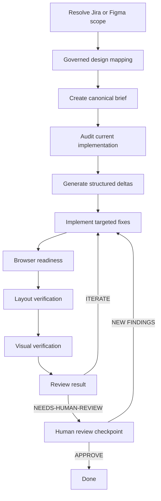

# UI Implementation Workflow

This document defines the repository-local workflow for implementing and refining UI from Jira tickets and Figma designs.

It is the canonical path for Figma-backed UI implementation work in this repository.

This workflow defines how UI implementation must handle token mapping, icon reuse, shared-vs-local component placement, `design_tokens/` extraction decisions, surface classification, responsive ambiguity, and file targeting.

## Purpose

Use this workflow when a ticket or feature includes a Figma design or another external UI source of truth and the implementation needs to be faithful to that design.

This workflow exists to:

- resolve UI scope from Jira and/or Figma
- interpret the design with Torus-specific guardrails
- inspect the current implementation
- compare design intent against the current state
- implement targeted changes
- verify layout and visual fidelity iteratively
- preserve operational memory outside the repository

## Core Rule

If a work item requires implementing or reconciling UI from Figma, do not implement directly from the ticket or from `harness-work` / `harness-develop` alone.

Route the work through this UI workflow first.

## Current Validation Model

The current workflow uses:

- Figma MCP for design-source inspection
- Browser MCP for live UI inspection and validation

The workflow should treat the Browser MCP window prepared by the human for the active scope as the canonical QA browser.

Verification is split into two complementary lanes:

- `layout-qa`
  - deterministic or near-deterministic checks using design metadata, DOM measurements, and computed styles
  - should answer whether sizes, spacing, alignment, and overflow risks are materially correct
- `visual-qa`
  - normalized browser and Figma captures used to compare rendered appearance
  - should answer whether the implemented surface feels visually faithful once layout is already grounded

The workflow should not attempt full browser bootstrap before layout or visual QA begins.

That means:

- pause and ask the human to prepare the Browser MCP window with the correct route, role, and app state
- once the human confirms that setup is complete, inspect the browser as it currently exists
- record the real validated route and readiness result in runtime state
- reuse that readiness only while it is still fresh and context-equivalent

## Governed Design Mapping

This workflow includes a governed design-mapping phase before implementation and QA iteration begin.

That means:

- existing governed-design findings are preserved, not discarded
- the workflow must continue to honor those guardrails
- implementation and QA happen after the brief is created
- pixel fidelity must not bypass token, icon, or component governance

The practical sequence is:

1. resolve Jira and Figma scope
2. run the governed design-mapping phase
3. produce the canonical UI brief
4. audit the current implementation
5. compare design vs current state
6. implement targeted fixes
7. run layout verification
8. run visual verification
9. iterate until the automatic loop believes the scope is ready
10. hand off to a human-review checkpoint before final closure

## Adding Figma Nodes Mid-Workflow

The source of truth for a scope may become more specific after the workflow has already started.

Typical cases:

- the original Jira ticket linked only a Figma file, not a specific node
- the original node was ambiguous
- the human wants to add a state-specific node for a targeted fix
- the human wants to add multiple nodes for hover, empty, or error states

The workflow should support adding nodes to the active scope in two ways:

1. natural language
2. explicit subcommand

Natural-language examples:

- `Add this Figma node to MER-5254 as "close button modal"`
- `Use this node as the hover state reference for MER-5254`
- `Add these two nodes to the current ui_workflow scope`

Explicit subcommand example:

```text
$ui_workflow add-node MER-5254 <figma-url> alias="close button modal"
```

The explicit subcommand is an optional power-user affordance, not a required interface.

If the workflow detects that a node-specific Figma reference is missing or too ambiguous, it should tell the human that they can either:

- provide the node in natural language
- or use the explicit `add-node` form

The workflow should not assume that the human already knows the subcommand name.

When a node is added, the workflow should update runtime source references rather than treating the node as a temporary chat-only hint.

## Automatic Iteration Loop

The workflow should iterate automatically without human intervention until the agent believes no material fixes remain.

The automatic loop is:

1. `ui-current-state-auditor`
2. `ui-implementer`
3. `ui-browser-readiness-checker`
4. `ui-layout-verifier`
5. if `layout-qa` finds material structural issues, return to `ui-implementer`
6. `ui-visual-verifier`
7. `ui-reviewer`

`layout-qa` is the structural gate inside the automatic loop.

That means:

- `layout-qa` runs before `visual-qa`
- material layout findings should be corrected before the workflow trusts visual findings as closure evidence
- if `layout-qa` still finds meaningful structural errors, `visual-qa` should be treated as supporting or preliminary evidence rather than final proof of readiness

`visual-qa` should refine and validate the rendered result once the structural lane is reasonably sound.

## Human Review Checkpoint

The human should not be asked to intervene during the normal automatic iteration loop.

Human review belongs only after the automatic loop believes the scope is ready to close.

At that point:

1. the workflow must move to `needs-human-review`
2. the agent should present:
   - the findings it still considers open
   - the differences it proposes to ignore as non-actionable
   - the reason it believes the scope is otherwise ready
3. the human may then:
   - approve closure
   - dismiss specific findings
   - add new findings the agent missed

If the human adds new findings, the workflow returns to the automatic `fix -> layout-qa -> visual-qa -> review` loop.

The workflow should only move from `needs-human-review` to `done` after that final human checkpoint.

## Verification Lanes

The workflow should not treat UI QA as one undifferentiated compare step.

Instead, it should run two distinct verification lanes when the relevant data is available:

1. `layout-qa`
2. `visual-qa`

`layout-qa` should happen first whenever deterministic checks are possible.

Use `layout-qa` to verify:

- Figma metadata or design-context values against live DOM measurements
- spacing and alignment via `getBoundingClientRect()`
- typography and critical presentation values via `getComputedStyle()`
- repeated-card or repeated-row consistency using sibling measurements instead of screenshots
- visible overflow or clipping risk, including fixed-height text regions when measurable

Use `visual-qa` to verify:

- component-level or section-level rendered fidelity against Figma
- visual hierarchy, rhythm, density, and state treatment
- differences that remain after the structural and numeric checks are understood

`visual-qa` should not be treated as a final closure signal while material `layout-qa` findings remain open.

## Repository Layout

The workflow definition lives in the repository:

```text
.agents/
  commands/
    ui-plan.md
    ui-implement.md
    ui-qa.md
    ui-fix.md
    ui-reflect.md
  agents/
    ui-browser-readiness-checker.md
    ui-jira-figma-resolver.md
    ui-current-state-auditor.md
    ui-implementer.md
    ui-layout-verifier.md
    ui-visual-verifier.md
    ui-reviewer.md
    ui-retrospective-updater.md
  ui-workflow/
    README.md
    templates/
    diagrams/
```

Only durable workflow behavior belongs here.

## Runtime State Outside The Repo

All operational memory for workflow execution lives outside the repository under:

```text
~/.codex/memories/oli-torus-ng/ui-work/
```

Each work item gets its own scope directory:

```text
~/.codex/memories/oli-torus-ng/ui-work/<scope>/
```

Examples:

```text
~/.codex/memories/oli-torus-ng/ui-work/MER-5258/
~/.codex/memories/oli-torus-ng/ui-work/MER-5258--student-dashboard-overview/
~/.codex/memories/oli-torus-ng/ui-work/student-dashboard-overview/
```

If a Jira key exists, prefer using it as the scope root.

The canonical runtime file shapes and minimum required fields are defined in `.agents/ui-workflow/runtime-contract.md`.

## Why Iterations Live In Memories

Per-iteration history is useful during execution but usually not useful repository content.

Iterations are stored in `memories` so the workflow can:

- resume after interruption
- compare the current iteration against previous attempts
- avoid repeating failed fixes
- retain QA evidence
- preserve scope-local learnings

They are intentionally kept out of git to avoid:

- noisy markdown churn
- large screenshot and diff artifacts
- transient machine-generated reports in code review

## Runtime Work Item Structure

Each scope directory may contain:

```text
~/.codex/memories/oli-torus-ng/ui-work/<scope>/
  session.json
  source_refs.json
  brief.md
  audit.md
  deltas.json
  implementation_notes.md
  iterations/
    01.md
    02.md
  qa/
    layout-01.json
    visual-01.json
  learnings.md
```

File purposes:

- `session.json`
  - normalized workflow state
  - scope id
  - current phase
  - surface
  - iteration count
  - current status
  - last browser-readiness result for the validated route/role context
- `source_refs.json`
  - Jira refs
  - Figma file keys
  - Figma node ids
  - optional human-friendly node aliases when the scope tracks multiple named nodes
  - routes or pages inspected

## Browser Readiness

Browser-based QA should not begin implicitly.

Before `layout-qa` or `visual-qa`, run an explicit browser-readiness step that:

1. determines whether the human has prepared the Browser MCP window for the correct page and role
2. inspects the current browser URL and visible state
3. determines whether the required role is authenticated
4. records the result in runtime state, including the real validated route

The readiness result should be reused when it is still fresh and context-equivalent.

Minimum reuse policy:

- if `browser_ready != true`, re-check
- if no previous browser check exists, re-check
- if the previous browser check is older than one hour, re-check
- if the validated route, section slug, required role, or equivalent context fingerprint changed, re-check

If the check fails because the browser has not been prepared correctly:

- stop downstream QA
- tell the human which role is required
- tell the human to log in, navigate to the correct surface, and leave that browser window on the intended UI state
- tell the human to resume the workflow once that setup is complete
- `brief.md`
  - the canonical governed brief
- `audit.md`
  - current-state audit
- `deltas.json`
  - structured design-vs-implementation differences
- `iterations/*.md`
  - per-iteration summaries
- `qa/*.json`
  - layout and visual verification outputs
- `learnings.md`
  - scope-local learnings discovered during execution

## Browser Readiness Contract

Before a real `ui-qa` pass can produce trustworthy results, the workflow must confirm that the Browser MCP window for the active scope has been prepared by the human and is ready.

Minimum readiness expectations:

- the app is reachable in the Browser MCP window
- the intended route is already visible in the browser
- the required role is authenticated
- the page state is appropriate for the intended verification pass
- the browser session is authenticated for the correct role
- the target UI route is reachable
- blocking global overlays are dismissed
- the UI is in the intended state for inspection
- theme parity is respected when visual comparison depends on it

If those conditions are not true, the workflow should stop and report the missing prerequisite instead of producing a misleading QA result.

## Visual Capture Normalization

Browser-based visual QA is only trustworthy when the browser and Figma evidence represent the same component frame.

Before reporting visual findings:

- identify the exact Figma node being validated
- drive the browser to the matching UI state
- isolate the live component before comparison
- prefer component-level captures over page-level screenshots
- if direct element capture is not available, compute bounds and crop the browser image to the component
- remove unrelated visual noise when possible, including sticky headers, neighboring tiles, transient banners, and excess viewport area
- repeat the capture at each viewport that matters for the validated surface instead of relying on one screenshot
- capture stateful variants explicitly when they matter, for example default and hover
- if local image tooling is available, resize or otherwise normalize the browser capture to the Figma reference dimensions before any image-diff metric is used

If the browser capture is not equivalent to the Figma frame, treat the result as preliminary and do not close visual QA from that evidence.

After normalization, visual QA should run two passes:

- structural pass
  - container/card
  - header
  - metadata
  - pills and CTAs
  - chart or main content body
  - metrics
  - footer/closure
- fine-composition pass
  - spacing rhythm
  - visual weight
  - density
  - edge breathing
  - panel/card closure

Each visual mismatch should be classified as one of:

- `layout`
- `spacing`
- `visual_weight`
- `state_or_data_driven`
- `content_mismatch`

## Temporary Evidence

Heavy QA evidence may be written to `/tmp` during a pass, for example:

- normalized browser screenshots
- cropped component captures
- Figma screenshots
- image-diff outputs
- measurement dumps used during layout verification

These artifacts are operational evidence, not durable workflow memory, and should not be promoted into the repository unless they become reusable documentation.

## Commands

- `ui-plan`
  - establish the canonical brief and initialize runtime state
- `ui-implement`
  - audit, implement, and iterate on the active scope
- `ui-qa`
  - re-run verification and review without re-planning
- `ui-fix`
  - target one or more existing deltas for focused correction
- `ui-reflect`
  - capture local and generalized workflow learnings

## Agents

- `ui-jira-figma-resolver`
  - normalize Jira and Figma references into workflow inputs
- `ui-current-state-auditor`
  - map the canonical brief to the current implementation and generate deltas
- `ui-implementer`
  - apply the minimum correct code changes needed to close the active delta set
- `ui-layout-verifier`
  - check layout fidelity using deterministic or near-deterministic findings
- `ui-visual-verifier`
  - check visual fidelity using rendered output and design references
- `ui-reviewer`
  - combine the brief, deltas, and verification outputs into a workflow decision
- `ui-retrospective-updater`
  - promote reusable learnings into repo-local workflow updates when warranted

## Optional Temporary Artifacts

Heavy temporary artifacts may be stored in `/tmp`, for example:

- screenshots
- image diffs
- cropped references
- intermediate visual comparison outputs

Recommended pattern:

```text
/tmp/oli-ui-work/<scope>/
```

Use `~/.codex/memories/...` for lightweight persistent execution state.

Use `/tmp/...` for disposable heavy artifacts.

## Persistence Rules

### Keep Outside The Repo

These artifacts should remain outside git:

- per-iteration reports
- QA reports
- runtime state files
- machine-generated deltas
- screenshots and visual diff artifacts
- narrow scope-local notes

### Promote Back Into The Repo

These changes belong in the repository when they become reusable:

- updates to workflow commands
- updates to workflow agents
- updates to workflow templates
- updates to this README and its diagrams
- generalized learnings that should affect future UI work
- improvements to the existing governed-design references or guardrails

## Required Governed-Design Findings To Preserve

Any implementation that routes through this workflow must preserve the current governed-design findings and constraints, including:

- prefer existing design tokens before proposing new ones
- call out token gaps explicitly instead of hardcoding silently
- prefer existing icon systems before introducing new icons
- consult the Torus design-system icon catalog before extending icons
- prefer existing reusable components and patterns before extracting new ones
- evaluate whether a candidate should stay feature-local or move into `design_tokens/`
- do not invent missing interaction, state, or responsive behavior
- record ambiguity under an explicit approval or open-questions mechanism
- state likely file targets rather than leaving implementation placement implicit
- distinguish clearly between `liveview/heex`, `react`, and `mixed` surfaces

## Workflow Overview



## Storage Model

```mermaid
flowchart LR
  A[Repo .agents] --> B[commands]
  A --> C[agents]
  A --> D[workflow docs]
  A --> E[templates]

  F[~/.codex/memories/oli-torus-ng/ui-work] --> G[session.json]
  F --> H[source_refs.json]
  F --> I[brief.md]
  F --> J[audit.md]
  F --> K[deltas.json]
  F --> L[iterations]
  F --> M[qa reports]
  F --> N[learnings.md]

  O[/tmp/oli-ui-work] --> P[screenshots]
  O --> Q[image diffs]
  O --> R[heavy temporary artifacts]
```

## Interaction With Harness

When `harness-work` or `harness-develop` is executing a work item that includes Figma-backed UI implementation:

- the work should route through this UI workflow
- the workflow should provide the canonical brief and implementation guidance
- Harness remains responsible for the broader implementation lane, tests, validation, and closure
- this workflow becomes the specialized UI implementation and QA subsystem

In practice:

- Harness owns ticket execution
- this workflow owns Figma-aware UI interpretation, implementation fidelity, and iterative verification

## Transitional Note

Some of the governed-design rules currently used by this workflow originate in the existing `implement_ui` skill and its references.

That does not make `implement_ui` the canonical entrypoint.

The canonical entrypoint is this UI workflow.

## Update Policy

This README is part of the workflow contract.

Update it whenever any of the following change:

- command responsibilities
- agent responsibilities
- runtime directory structure
- iteration policy
- verification strategy
- storage locations
- persistence rules
- the relationship between this workflow and `implement_ui`

A workflow behavior change without a corresponding documentation update is incomplete.
