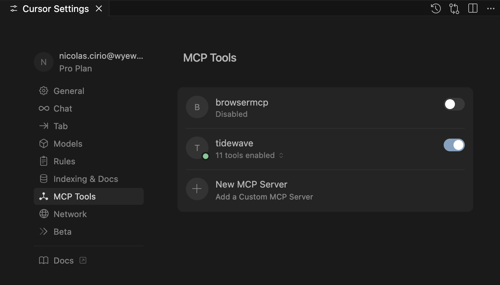

# Cursor IDE Setup with Tidewave

This guide will help you set up [Cursor IDE](https://cursor.sh) with [Tidewave](https://tidewave.ai/) integration.

## Prerequisites

### 1. Install Cursor IDE

Download and install Cursor IDE from the official website:
👉 **[Download Cursor IDE](https://cursor.sh)**

Cursor is a powerful AI-powered code editor built on Visual Studio Code that provides intelligent code completion, refactoring, and debugging capabilities.

### 2. Install mcp-proxy

Tidewave requires an MCP (Model Context Protocol) proxy to communicate with Cursor IDE. You'll need to install and configure the mcp-proxy tool.

📖 **[Tidewave Documentation](https://hexdocs.pm/tidewave/mcp_proxy.html)**

The mcp-proxy acts as a bridge between Cursor IDE and Tidewave, enabling seamless AI-powered development assistance.

We recommend the Rust-based proxy. You can find installation details [here](https://github.com/tidewave-ai/mcp_proxy_rust#installation)

## Configuration

### 1. Cursor Rules Setup

This project includes pre-configured Cursor rules to enhance your development experience:

- **`oli.mdc` (recommended)** - Elixir and Phoenix best practices based on Dave Thomas' (PragDave) coding philosophy
- **`user-custom-rules.mdc`(optional)** - Project-specific custom rules and conventions.

You can copy these files with:

```bash
cp .cursor/oli.example.mdc .cursor/rules/oli.mdc
```

```bash
cp .cursor/user-custom-rules.example.mdc .cursor/rules/user-custom-rules.mdc
```

As a team we should try to share a common `oli.mdc` file and any user custom tweaks can be added in `user-custom-rules.mdc`

### 2. MCP Configuration

Copy the example MCP configuration and customize it for your system:

```bash
cp .cursor/mcp.example.json .cursor/mcp.json
```

Edit `.cursor/mcp.json` and update the `command` path to point to your mcp-proxy installation:

```json
{
  "mcpServers": {
    "tidewave": {
      "command": "/absolute/path/to/mcp-proxy",
      "args": ["http://localhost:80/tidewave/mcp"]
    }
  }
}
```

**Important:** Replace `/absolute/path/to/mcp-proxy` with the actual path where you installed mcp-proxy (on `Install mcp-proxy` step).

### 3. Start the OLI Torus Server

Before using Tidewave, make sure the OLI Torus development server is running:

```bash
set -a && source oli.env && iex -S mix phx.server
```

The server will be available at http://localhost (port 80).

If all the configuration steps went well, you should see the following Cursor Settings



## Troubleshooting

### MCP Connection Issues

If Tidewave isn't connecting properly:

1. Ensure mcp-proxy is installed and accessible at the configured path
2. Verify the OLI Torus server is running on port 80
3. With the server running check that the MCP endpoint http://localhost:80/tidewave/mcp is responding. The response should be similar to:

```
event: endpoint
data: http://localhost:80/tidewave/mcp/message?sessionId=ca0dfbe0-a31e90bb-74c02407
```

4. Restart Cursor IDE after making configuration changes

See more info on https://hexdocs.pm/tidewave/troubleshooting.html

### Rules Not Working

If Cursor isn't following the project rules:

1. Verify the `.cursor/rules/` directory contains the rule files
2. Restart Cursor IDE to reload the rules
3. Check that the rule files are properly formatted

See more info on https://docs.cursor.com/context/rules#faq
