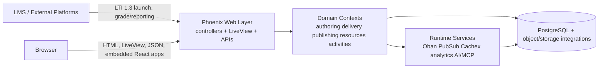

# Architecture

## System Map

OLI Torus is a Phoenix application with a TypeScript/React frontend for targeted rich-client surfaces. The backend owns the core domain model, persistence, authorization, delivery runtime, publication workflow, analytics, and LMS integration. The frontend is mostly embedded into Phoenix-rendered pages or LiveView-driven screens as focused applications rather than a single SPA.

The core product split is:

- Authoring: authors and administrators create, revise, review, and publish course content.
- Delivery: instructors and learners access published content in sections launched directly or through LTI 1.3.

## Architectural Shape

- The platform centers on versioned `resources` and `revisions`, collected into projects during authoring and frozen into publications for delivery.
- Delivery sections reference publications rather than mutable authoring state, which preserves learner-facing stability while authoring continues.
- Phoenix provides the web shell through controllers, templates, plugs, APIs, and LiveViews; React is used where richer client-side editing or interaction is needed.
- The runtime includes clustered Phoenix nodes, PubSub, Oban background work, Cachex caches, xAPI analytics pipelines, and newer GenAI/MCP services.

## Major Boundaries

- `lib/oli/`: domain contexts and business logic
- `lib/oli_web/`: routing, plugs, controllers, templates, LiveViews, channels, and API endpoints
- `assets/src/`: React applications, shared UI components, activity implementations, persistence clients, and client state
- `test/`: ExUnit coverage, scenarios, and support helpers

## Canonical References

- High-level system concepts: `docs/design-docs/high-level.md`
- Publication and delivery versioning model: `docs/design-docs/publication-model.md`
- Page, attempt, locking, and other system design guides: `docs/design-docs/`
- Activity model and terminology: `guides/activities/overview.md`
- LTI launch model: `guides/lti/implementing.md`
- Local workflow and commands: `AGENTS.md`, `docs/TOOLING.md`, `docs/TESTING.md`

## How To Use This Document

Use this file as the entry point for orientation and boundary-setting. Do not expand it into a duplicate of the design guides; add detail in the existing design-doc set under `docs/design-docs/` and keep this file focused on the system map and where to look next.
