# LTI 1.3

Torus supports LTI 1.3 integration and leverages the Learning Management System (LMS) for course delivery. The philosophy of Torus is to focus and excel at what it is specifically designed for, which is rich course content authoring and data-driven continuous improvement. Many of the necessary features of course delivery such as roster management, gradebook management and scheduling are deferred to the LMS, which is what it is specifically designed for. These aspects of the student and instructor experience are crucial and require tight integration which is enabled by the LTI 1.3 standard.

Many LMSs currently support the LTI 1.3 standard including Canvas, Blackboard, Moodle, Brightspace D2L, and more. Each LMS may have a slightly different method of configuring an external tool such as Torus, but the general process is similar and is driven from the [LTI 1.3 Specification](http://www.imsglobal.org/spec/lti/v1p3/).

## Concepts

### Institutions
Torus has the concept of an **Institution** which represents an organization whom wishes to use Torus, typically from their own LMS or a cloud hosted one. For example, Carnegie Mellon University would be considered an intitution, and so is The Open Learning Initiative (OLI) itself. OLI operates Open and Free courses from Torus using a self hosted version of canvas at canvas.oli.cmu.edu.

### Registrations
A **Registration** is a regestered integration point for an instition into Torus for content delivery. For example, an institution may have multiple LMSs. Each one of these LMSs may share an **Institution** but will have separate registrations. In the LTI standard, institutions are represented using the `issuer` field (typically a URL e.g. https://canvas.oli.cmu.edu), and `client_id` represents a unique registration within the institution.

### Deployments
A **Deployment** is a specific instance of _, and can simply be thought of as the next tier below registrations. A registration may have many deployments, for example one deployment for every course.

There is some flexibility to how these concepts could be represetented for an organization, but typically an orgainization will have a single **Institution**, with a single **Registration** for their LMS, and they may have one or many **Deployments** within their LMS depending on if the tool is configure globally or for an individual department/course.

Currently, Institutions, registrations and deployments are created and managed by a Torus administrator. In the future, we plan to add more flexibility on how these entities can be registered and approved. For now, please contact OLI if you wish to deliver a Torus course from your orgainization's LMS. If you are running your own instance of Torus, the steps below outline the process for creating these entities for LTI 1.3 integration with an LMS.

## Configuring LTI 1.3 in Torus

To configure an LTI 1.3 integration in Torus, we need to gather some important LMS details first. These details can usually be supplied by an LMS administrator. For certain values such as Client ID and Deployment ID, you will need to configure Torus in your LMS first before you can get this value. It is recommended you or your LMS administrator follow the steps in the section 'Configuring LTI 1.3 in LMS' below to obtain this

  - **Issuer** (e.g. https://canvas.oli.cmu.edu)
  - **Client ID:** This is obtained by creating an LTI 1.3 Developer Key in the LMS. See specific instructions below depending on your LMS.
  - **Key Set Url** (e.g. https://canvas.oli.cmu.edu/api/lti/security/jwks)
  - **Auth Token Url** (e.g. https://canvas.oli.cmu.edu/login/oauth2/token)
  - **Auth Login Url** (e.g. https://canvas.oli.cmu.edu/api/lti/authorize_redirect)
  - **Auth Server Url** (e.g. https://canvas.oli.cmu.edu)
  - **KID** (e.g. 2018-05-18T22:33:20Z). This can also be obtained by entering the **Key Set URL** in your browser and extracting the first value for `"kid":"2018-05-18T22:33:20Z"`
  - **Deployment ID** This is obtained by creating an LTI 1.3 Deployment in the LMS. See specific instructions below depending on your LMS.

1. In Torus as an Administrator, select "Institutions" from the sidebar on the left of the workspace, then click "Register New Institution"

    

1. Enter your Institution's details and click "Save"

    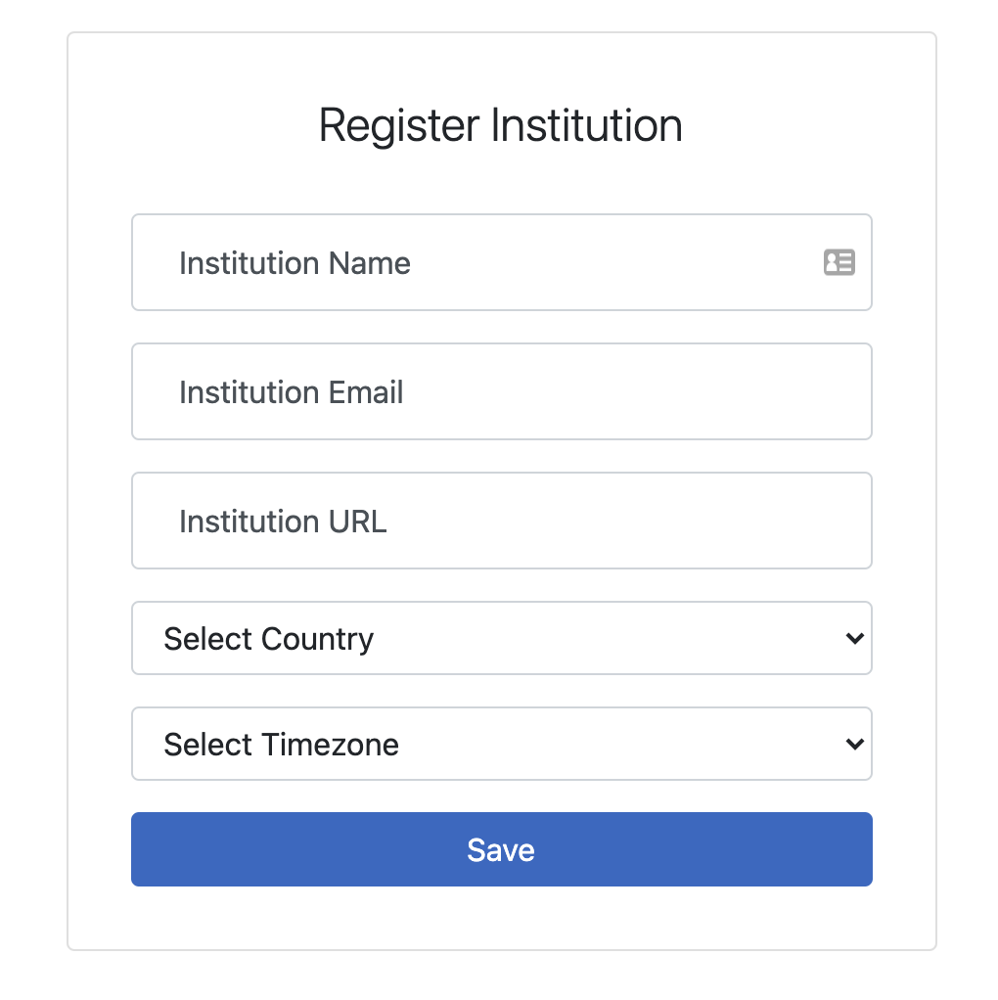

1. Click the "Details" button for the institution you just created

    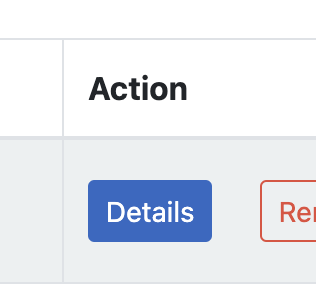

1. Click "Add Registration" and enter registration details, which are outlined above and should be provided by your LMS administrator. You may use a placeholder value for Client ID if you haven't configured an LTI Key in your LMS yet, but make sure once you do you return and update this value. When finished, click on the registration link labeled by it's **Issuer - Client ID** to expand it.

    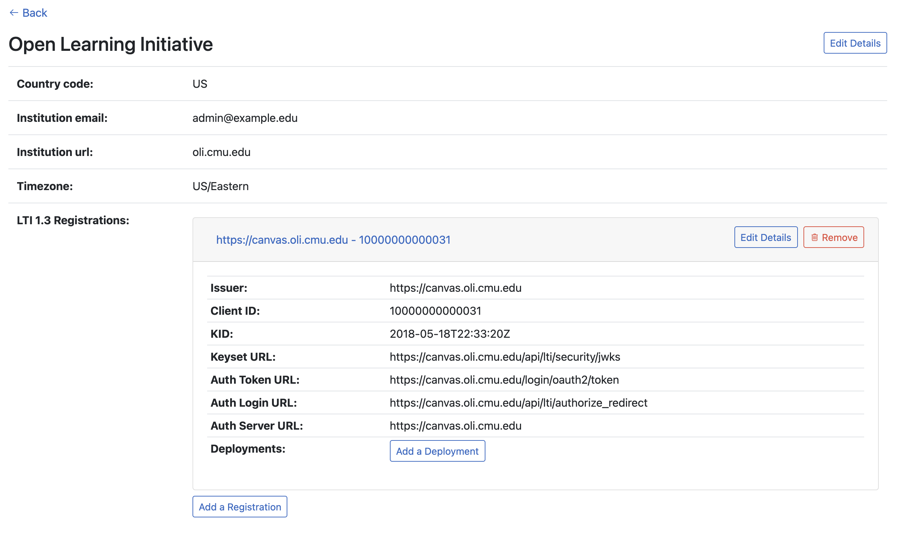

1. Click "Add Deployment" and enter the Deployment ID saved from the instructions below when you created a deployment in your LMS.

1. Once you have a **Registration** and a **Deployment** configured for your **Institution**, you can now return to your LMS and launch into Torus and you will be guided through course setup, which is outside the scope of this document.

## Configuring LTI 1.3 in LMS

### Canvas

#### Create LTI 1.3 Developer Key

Canvas requires ceratin elevated privledges to configure LTI 1.3 Developer Keys and Apps. Canvas administrators should have the necessary privledges. If you don't see the options mentioned below, you may not have the proper privledges or your canvas instance may be an older version which does not support LTI 1.3. In either case, you should speak to your LMS administrator.

1. In Canvas using the left main menu, select Admin > [Account Name].

    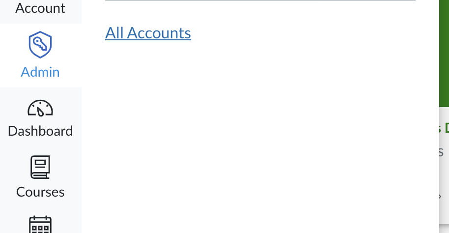

    Then click "Developer Keys" link

    

1. Under Developer Keys, click "+ Developer Key" > "+ LTI Key"

    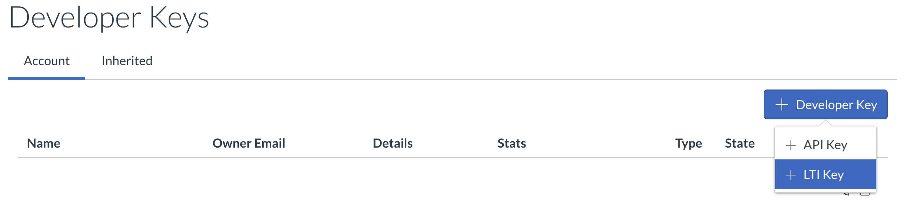

1. Configure the following fields with values that are applicable to your torus deployment. For example, if you are running torus and tunneling locally using a service such as ngrok, you will want to replace all instances of `torus.oli.cmu.edu` with your ngrok address e.g. `ba7c432acd17.ngrok.io`. (\* Required Fields)

    - **Key Name:** Torus
    - **Owner Email:** admin@torus.oli.cmu.edu
    - **\* Redirect URIs:** https://torus.oli.cmu.edu/lti/launch
    - **\* Title:** Torus
    - **\* Description:** Torus - Open Learning Initiative
    - **\* Target Link URI:** https://torus.oli.cmu.edu/lti/launch
    - **\* OpenID Connect Initiation Url:** https://torus.oli.cmu.edu/lti/login
    - **\* JWK Method:** Public JWK URL
    - **Public JWK URL:** https://torus.oli.cmu.edu/.well-known/jwks.json
    - **Placements:** Configure depending on your needs, or leave defaults

    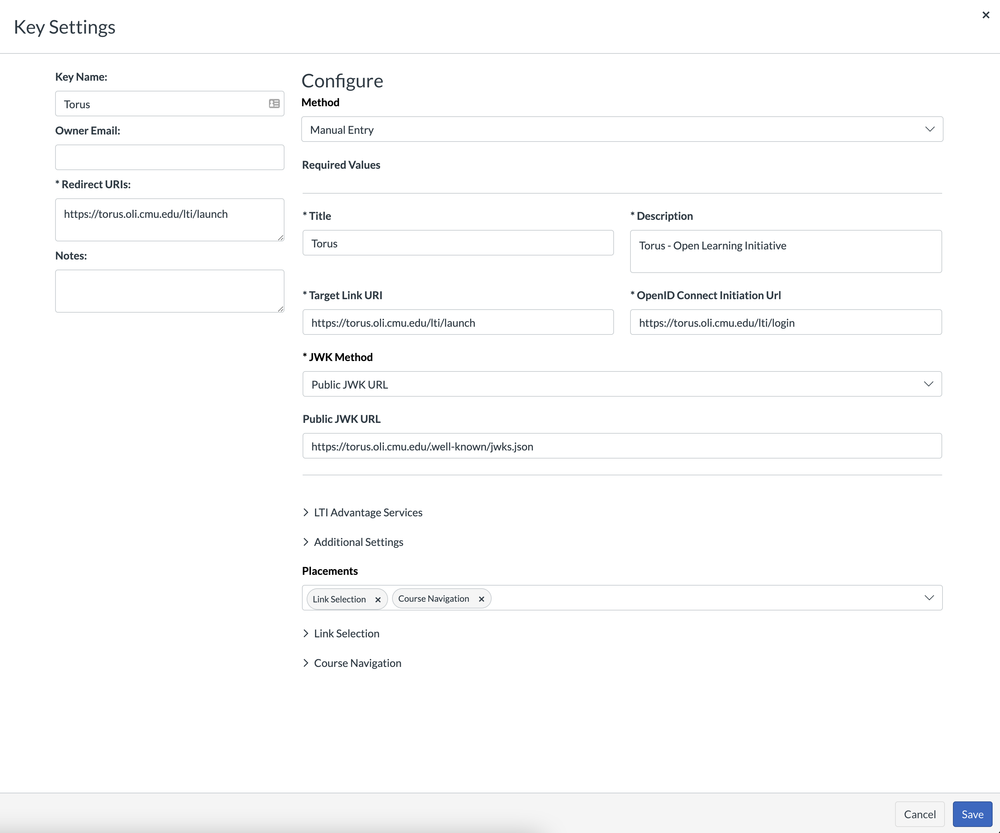

    Click "Save".

1. Enable the newly created LTI Key by setting it to "On". Your LTI 1.3 key is now configured and ready to use!
  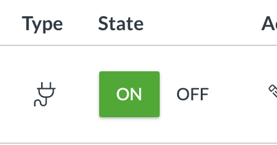

1. Save the corresponding number under details for future use, (e.g. 10000000000034). This will be our **Client ID**.
  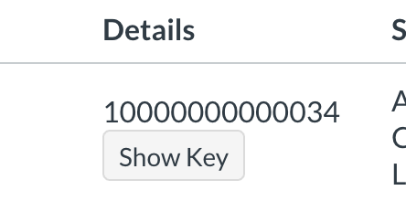

#### Add Torus as an External Tool link in your Canvas course

1.  Navigate to your course and click "Settings" > "Apps"

    

    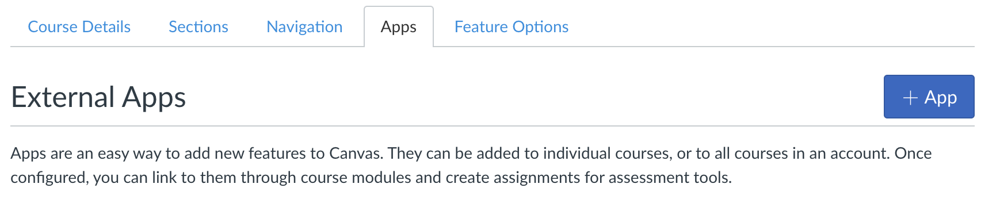

1. Select Configuration Type "By Client ID" and insert the **Client ID** we kept from the previous steps. Click "Submit". When prompted to install the tool, select "Install".
    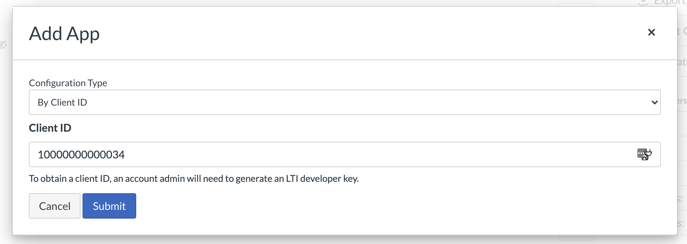

1. We must configure this specific deployment with torus, as mentioned in the previous section 'Configuring LTI 1.3 in Torus'. To do this, we must get the **Deployment ID** created by Canvas by Selecting the "gear" menu > Deployment ID.

    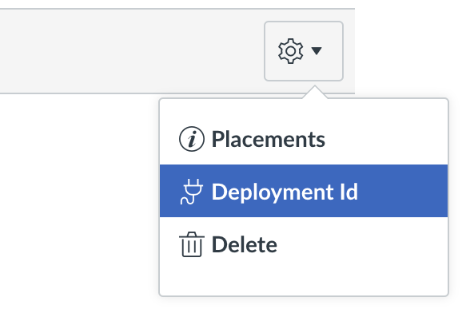

    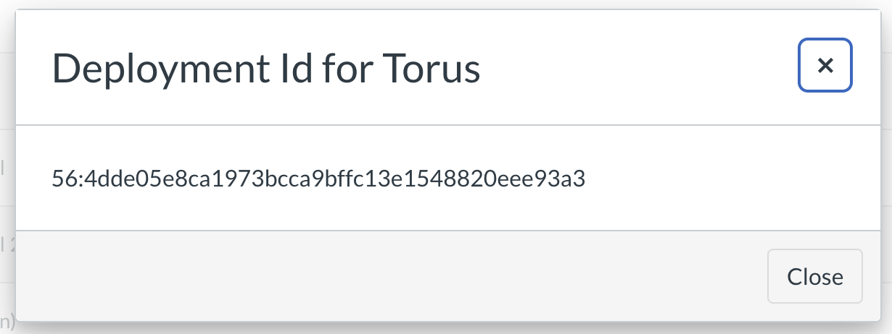

    Save this entire ID and use it to configure a deployment in Torus as outlined in the previous section 'Configuring LTI 1.3 in Torus'.

1. If you configured your LTI 1.3 Developer Key with placements other than Link, you will see Torus appear in those places. Otherwise, the default placement is a link placement which allows you to add Torus to any module in your course as you normally would by clicking the plus "+" then selecting "External Tool" and finally selecting the Torus tool we just added. Click "Add Item".
    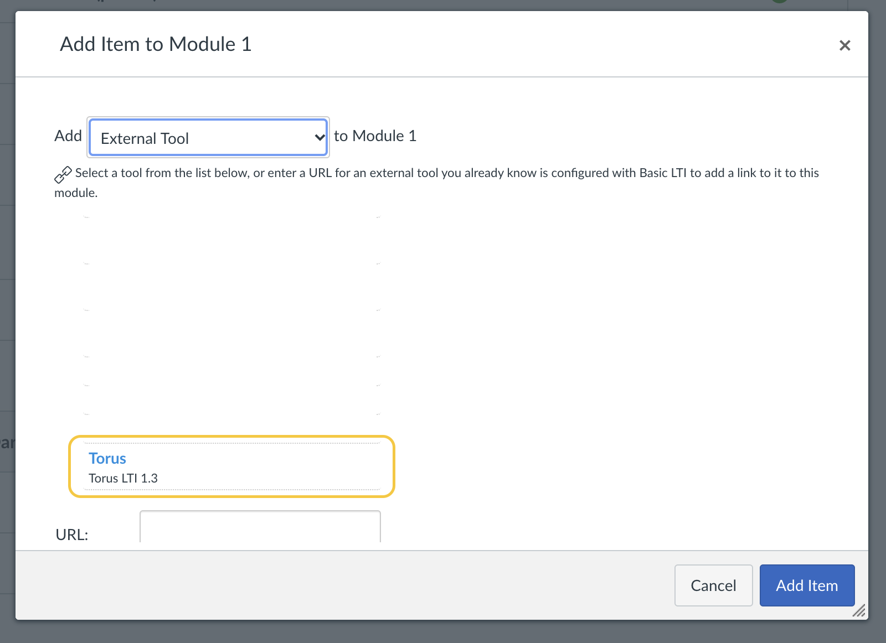

1. Navigate to Torus through the placement you configured, and you should be guided through course setup, which is outside the scope of this document. If you see any errors related to your LTI configuration, you may need to revisit the previous section 'Configuring LTI 1.3 in Torus' or your canvas instance may be improperly configured. The error message should give you an indication of the specific issue and provide a link to OLI support for further help if needed.

### Blackboard
Coming soon...

### Moodle
Coming soon...
