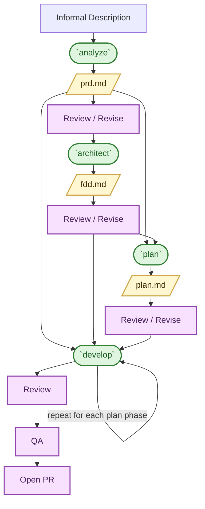
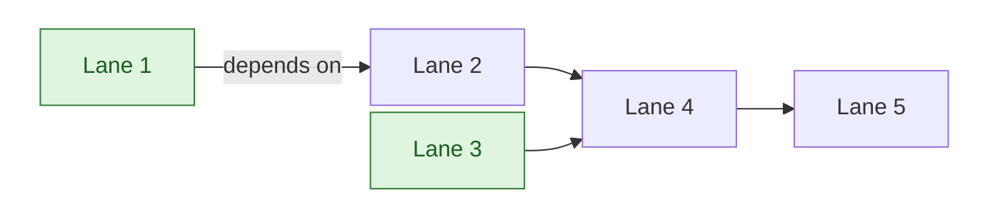

# Harness Engineering Approach

## Required Setup

Before using this workflow in Torus, install the shared Harness and its reusable skills at the user level. Do not treat this repository as the source of truth for the general-purpose skills.

- Install the Harness from <https://github.com/Simon-Initiative/harness>.
- Install the Harness skills into your user-level agent skills directory, not into this repository.
- After installing the Harness, use the Torus repository as the target repo where the Harness contract and work artifacts live.

Only three Torus-specific skills remain installed in this repository under `.agents/skills`:

- `build_scenario`
- `extend_scenario`
- `implement_ui`

Everything else in the workflow should come from the shared Harness installation.

## Purpose

We now build software in an AI-agentic environment.

In this environment:
- Output quality is determined by input clarity.
- Ad hoc prompting produces inconsistent results.
- Ephemeral prompts create no durable knowledge.
- Planning and implementation can drift without structure.

Harness Engineering formalizes intent into structured, version-controlled artifacts that guide LLM-powered implementation.

Harness Engineering is our standard workflow for feature development.

## Core Workflow

Harness Engineering converts informal intent into durable artifacts and structured implementation.

Legend: Yellow nodes are artifacts, green nodes are Harness skills, and light magenta nodes are manual steps.

### Workflow Summary

- `analyze` -> Informal description -> PRD
- `architect` -> PRD -> FDD
- `plan` -> PRD + FDD -> Phased Plan
- `develop` -> Plan (with PRD + FDD context) -> Code

Each step:
- Produces a durable artifact.
- Increases structure.
- Reduces ambiguity.
- Improves LLM output quality.

Artifacts are checked into the repository. Informal description is Jira description and comments, Figma links, and additional engineering commentary.

## Artifact Structure

All artifacts live under `docs/`.

### Features

    docs/
      features/
        feature-slug/
          prd.md
          fdd.md
          plan.md

- Directory names use a descriptive feature slug, not a Jira ticket number.
- Artifacts remain permanently discoverable.
- Code and documentation evolve together.

### Epics

    docs/
      epics/
        epic-slug/
          feature_slug1/
          feature_slug2/
          overview.md
          plan.md
          edd.md

Epic plans organize stories into lanes and define execution structure.

## Lanes Model

A lane is a cohesive set of related stories owned end-to-end by a single engineer. Lanes are documented at the epic level in `overview.md` and `plan.md`.

Purpose:
- Preserve context.
- Reduce cross-ticket cognitive reload.
- Improve execution velocity.
- Clarify dependencies.

**Note:** Engineers take ownership of lanes, not isolated tickets.

Legend: Light green lane nodes indicate lanes with no inbound dependencies and can be started immediately.

## Skills Overview

Core Harness workflow skills:

- `analyze` -- Converts informal feature description into a structured PRD.
- `architect` -- Converts a PRD into a Feature Design Document (FDD).
- `plan` -- Converts PRD + FDD into a phased implementation plan.
- `develop` -- Implements a specific phase using all prior artifacts.

Supporting Harness skills:

- `validate` -- Validates artifact structure and completeness.
- `work` -- Lightweight plan-and-implement workflow for small tickets.
- `fixbug` -- TDD-first targeted bugfix workflow from Jira.
- `update_docs` -- Ensures documentation reflects implemented code.
- `review` -- Performs a code review using repository review guidelines.
- `prototype` -- Builds a quick prototype when speed matters more than durable docs.
- `bootstrap` -- Seeds a target repository with the Harness contract.
- `design` -- Produces slice-level design docs when a work item needs deeper implementation design.
- `requirements` -- Maintains deterministic requirements traceability across the work item.

Torus-specific repo-local skills:

- `build_scenario` -- Creates `Oli.Scenarios` integration coverage for Torus workflows.
- `extend_scenario` -- Extends the Torus scenario infrastructure when new directives or infrastructure support are needed.
- `implement_ui` -- Converts Figma-driven UI requirements into a Torus-specific implementation brief covering tokens, icons, reusable components, and file targets before coding.

Skills are reusable, version-controlled capabilities. The Harness provides the shared workflow skills from the external Harness repository, while Torus keeps only the repo-local skills that are tightly coupled to this codebase, including scenario infrastructure and Figma-to-implementation UI alignment.

When a ticket already includes Figma links or another concrete UI design source, consider `implement_ui` during spec creation as well as before implementation.

## Ticket Classification

During pre-planning, tickets are marked as:

- Feature -> Requires the full Harness Engineering workflow.
- Non-Feature -> Use `work`.

Not every Jira story requires full PRD, FDD, and plan artifacts. Only sufficiently complex or high-impact work is treated as a Feature.

This classification occurs before implementation begins.

## Required Expectations

For Features:
- PRD must exist.
- FDD must exist.
- Phased plan must exist.
- Implementation must follow defined phases.
- Documentation must remain aligned with code.

For Non-Feature Tickets:
- Use `work`.
- Follow structured but lightweight execution.

Starting with Version 33, Harness Engineering is our required development model.

## External Dependencies

- Install the Harness from <https://github.com/Simon-Initiative/harness>.
- The Harness repository is also available locally at [../harness](/Users/darren/dev/harness).
- Install the Harness skills in your user home skills directory, not in the Torus codebase.
- Install the Jira CLI using the official project instructions: <https://github.com/ankitpokhrel/jira-cli>.
- Install the `jira` skill from: <https://github.com/softaworks/agent-toolkit/blob/main/skills/jira>.
- Install the `jira` skill in your user home Codex skills directory, not in the Torus codebase.

## Why This Matters

Harness Engineering provides:

- Durable institutional memory.
- Structured thinking before implementation.
- Higher quality LLM output.
- Clear execution ownership.
- Reduced planning drift.
- Better scaling across distributed teams.

We are not replacing engineering judgment. We are amplifying it through structure.
