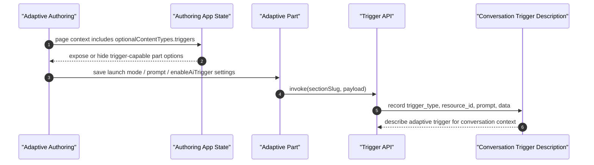

# Adaptive Triggers - Functional Design Document

## 1. Executive Summary
This design adds adaptive-page AI activation points without introducing a new backend API or persistence model. The implementation centers on a shared frontend helper that builds and invokes trigger payloads using existing `sectionSlug`, `resourceId`, and DOT instance availability. A new `janus-ai-trigger` adaptive part supports `click` and `auto` launch modes, while `janus-image` and `janus-navigation-button` gain optional AI activation fields that emit the same trigger contract on click. Authoring visibility is gated through the existing project trigger capability exposed as `optionalContentTypes.triggers`. Adaptive delivery is extended to pass section/resource context into part components so they can invoke the reused trigger API. Backend conversation trigger descriptions are updated to recognize `adaptive_page` and `adaptive_component`, which keeps downstream conversation context coherent without schema changes. No new database work, process topology, or endpoint contracts are introduced.

## 2. Requirements & Assumptions
- Functional requirements summary:
  - FR-001: adaptive authoring exposes the new trigger entry point only when trigger capability is enabled.
  - FR-002: the standalone adaptive trigger part supports both launch modes and prompt configuration.
  - FR-003: adaptive image and navigation button parts can optionally emit AI activation on click.
  - FR-004: adaptive trigger delivery reuses the existing client trigger plumbing and fails closed when context is missing.
  - FR-005: backend conversation trigger descriptions accept the new adaptive trigger types.
- FR/AC traceability map:

| Requirement | Acceptance criteria | Primary design sections | Verification anchors |
|---|---|---|---|
| FR-001 | AC-001, AC-002 | 4.1, 5.2 | 13 |
| FR-002 | AC-003, AC-004, AC-005 | 4.1, 4.2, 5.1 | 13 |
| FR-003 | AC-006, AC-007 | 4.1, 5.1 | 13 |
| FR-004 | AC-008 | 4.1, 10 | 13 |
| FR-005 | AC-009 | 4.1, 11 | 13 |
- Non-functional targets:
  - No new persistent data model or trigger endpoint.
  - Preserve existing behavior when AI activation is not enabled.
  - Reuse existing section-level availability gates instead of introducing a second delivery flag.
- Explicit assumptions:
  - The existing trigger instance returned by the client API is only present when the current section/page context is allowed to use DOT.
  - Adaptive authoring already receives project trigger capability via page context, so no separate backend capability endpoint is required.

## 3. Torus Context Summary
- What we know:
  - Existing trigger invocation lives in `assets/src/data/persistence/trigger.ts` and already accepts `{ trigger_type, resource_id, data, prompt }`.
  - Adaptive delivery already knows `sectionSlug` and `resourceId`, but parts did not previously receive both values.
  - Adaptive authoring already receives `optionalContentTypes.triggers` from page context.
  - Adaptive parts are registered through manifest-driven authoring/delivery entries in `assets/src/components/parts`.
  - Backend conversation trigger descriptions are centralized in `lib/oli/conversation/triggers.ex`.
- Unknowns to confirm:
  - Whether future adaptive parts beyond images and navigation buttons need the same optional AI activation fields.
  - Whether the fixed auto-trigger delay should remain an implementation detail or become product-configurable later.

## 4. Proposed Design
### 4.1 Component Roles & Interactions
- Shared helper:
  - `assets/src/components/parts/aiTrigger.ts` centralizes prompt validation, trigger payload construction, and invoke behavior.
  - The helper returns early when `sectionSlug`, `resourceId`, prompt text, or trigger instance availability are missing.
- New adaptive part:
  - `janus-ai-trigger` is a manifest-backed adaptive part with authoring and delivery entries.
  - Schema supports `launchMode`, `prompt`, `ariaLabel`, and `customCssClass`.
  - Click mode renders a button-like control that emits `adaptive_component`.
  - Auto mode schedules a one-time `adaptive_page` invocation after part readiness and does not render a click control.
- Existing adaptive part extensions:
  - `janus-image` gains `enableAiTrigger` and `aiTriggerPrompt`; when enabled it becomes keyboard-clickable and emits `adaptive_component`.
  - `janus-navigation-button` gains the same fields and emits `adaptive_component` only on actual learner click; programmatic selected-state flows do not emit the AI trigger.
- Authoring gating:
  - Authoring config stores `allowTriggers` from `optionalContentTypes.triggers`.
  - `selectPartComponentTypes` and adaptive toolbar filtering hide `janus_ai_trigger` when triggers are disabled.
  - Image and navigation button schemas only expose AI activation fields when `allowTriggers` is true.
- Backend trigger support:
  - `lib/oli/conversation/triggers.ex` adds `:adaptive_page` and `:adaptive_component` to the supported trigger types and description logic.

### 4.2 State & Message Flow

### 4.3 Supervision & Lifecycle
- No new OTP processes or supervisors.
- Auto-mode uses client-side lifecycle only:
  - wait for `onInit`
  - mark ready
  - emit a one-time delayed trigger
- Click-mode, image, and navigation-button activation all remain event-driven in the browser.

### 4.4 Alternatives Considered
- Reuse basic-page trigger components directly inside adaptive screens:
  - Rejected because adaptive parts already use a distinct manifest/component library and need part-level layout behavior.
- Add a new adaptive-specific backend trigger endpoint:
  - Rejected because the existing trigger invoke contract already accepts the required payload.
- Extend every interactive adaptive part in this ticket:
  - Rejected to keep scope aligned with Jira guidance to image and navigation button parity only.

## 5. Interfaces
### 5.1 HTTP/JSON APIs
- Existing trigger invoke contract is reused.
- Adaptive payload additions:
  - `trigger_type: "adaptive_page"` for auto screen-level activation.
  - `trigger_type: "adaptive_component"` for click-driven activation.
  - `data.component_id` is always sent.
  - `data.component_type` is sent for click-mode component triggers.
- No new routes or controller actions are added.

### 5.2 LiveView
- No new LiveView event contract is introduced.
- Authoring receives capability state through existing page-context bootstrap:
  - `optionalContentTypes.triggers` -> `allowTriggers` -> selector/toolbar/schema gating.

### 5.3 Processes
- No GenServer or background-job change.
- Trigger invocation remains request/API scoped through the existing client-side trigger persistence module.

## 6. Data Model & Storage
### 6.1 Ecto Schemas
- No schema or migration changes.
- Adaptive part JSON shape changes only:
  - `janus-ai-trigger`: `launchMode`, `prompt`, `ariaLabel`, `customCssClass`
  - `janus-image`: `enableAiTrigger`, `aiTriggerPrompt`
  - `janus-navigation-button`: `enableAiTrigger`, `aiTriggerPrompt`

### 6.2 Query Performance
- No new database queries are introduced by this feature.
- Adaptive delivery already has the required `sectionSlug` and `resourceId`; the implementation only forwards them into part props.

## 7. Consistency & Transactions
- Part configuration persists through existing adaptive activity save paths.
- Trigger invocation is side-effect only and does not mutate adaptive content state.
- Navigation-button AI activation is intentionally separated from programmatic selection/reset flows so behavioral resets after check events do not accidentally fire DOT.

## 8. Caching Strategy
- No new cache.
- DOT instance availability continues to come from the existing trigger client helper.

## 9. Performance and Scalability Posture (Telemetry/AppSignal Only)
### 9.1 Budgets
- Click-mode trigger emission should add only the existing invoke call overhead.
- Auto-mode adds one delayed timer per rendered adaptive trigger part.

### 9.2 Hotspots & Mitigations
- Hotspot: accidental duplicate auto invocations after rerender.
  - Mitigation: keep a ref that guards one-time auto fire per mounted part instance.
- Hotspot: unnecessary trigger requests from incomplete config.
  - Mitigation: helper-level prompt/context/instance guards.

## 10. Failure Modes & Resilience
- Invalid serialized part model:
  - Behavior: part fails closed and does not render or invoke a trigger.
- Missing prompt, `sectionSlug`, `resourceId`, or trigger instance:
  - Behavior: helper returns without invocation; click-only controls are not rendered when they cannot act.
- Project trigger capability disabled:
  - Behavior: standalone adaptive trigger part is hidden from authoring and image/button AI fields are not exposed.
- Navigation-button state reset after check:
  - Behavior: reset continues to clear selection state without generating AI activation.

## 11. Observability
- No new dedicated telemetry stream was introduced in this ticket.
- Existing operational visibility is improved by recognizing:
  - AC-009 -> `adaptive_page`
  - AC-009 -> `adaptive_component`
  in backend conversation trigger descriptions.
- Existing frontend/backend logs around trigger invoke failures continue to apply.

## 12. Security & Privacy
- Section-level DOT availability is still enforced by the existing trigger instance provisioning and invoke path.
- No new learner content or conversation data is persisted by this feature beyond the existing trigger payload contract.
- No new cross-project or cross-section lookup path is introduced.

## 13. Testing Strategy
- Frontend:
  - AC-002: authoring selector test for `janus_ai_trigger` availability gating.
  - AC-004: click-mode adaptive trigger part emits `adaptive_component`.
  - AC-005: auto-mode adaptive trigger part emits `adaptive_page` and renders no button.
  - AC-006: AI-enabled adaptive image emits `adaptive_component`.
  - AC-007: AI-enabled adaptive navigation button preserves submit behavior and emits `adaptive_component`.
- Backend:
  - AC-009: ExUnit tests cover adaptive trigger descriptions for conversation context.
- Known gaps:
  - AC-008 currently relies on helper-level guards and existing trigger-instance behavior rather than a dedicated end-to-end adaptive section-disabled test.

## 14. Backwards Compatibility
- Adaptive screens without the new part or new fields are unchanged.
- Images and navigation buttons behave exactly as before unless AI activation is explicitly enabled.
- Basic page trigger behavior is unaffected.
- TypeScript part props were widened to admit stringified `model` and `state`, matching existing runtime usage rather than changing runtime behavior.

## 15. Risks & Mitigations
- Risk: authoring gating could drift between selector and toolbar filtering.
  - Mitigation: use the same `allowTriggers` source for both.
- Risk: image accessibility regression when turning images into clickable triggers.
  - Mitigation: add button role, tab index, and keyboard handlers only when AI activation is enabled.
- Risk: overfiring navigation-button AI activation from internal state changes.
  - Mitigation: emit only from the learner click path.

## 16. Open Questions & Follow-ups
- Should adaptive section-disabled behavior receive a dedicated integration test rather than relying on current trigger-instance availability?
- Should the standalone adaptive trigger icon support richer styling or text variants in later work?
- Should other adaptive interactive parts adopt the same optional AI activation pattern?

## 17. References
- [Adaptive Triggers PRD](prd.md)
- [Adaptive Triggers Requirements](requirements.yml)
- [Adaptive Triggers Informal Notes](informal.md)
- [Adaptive Page Improvements Overview](../overview.md)

## Decision Log

### 2026-03-10 - Document implemented adaptive trigger architecture
- Change: Added the missing FDD describing the shared trigger helper, new adaptive trigger part, image/button extensions, authoring gating, and backend trigger type support.
- Reason: Implementation landed without the feature-level design artifact, so the architecture and interface decisions needed to be recorded from the actual code paths.
- Evidence: `assets/src/components/parts/aiTrigger.ts`, `assets/src/components/parts/janus-ai-trigger/*`, `assets/src/components/activities/adaptive/components/delivery/PartsLayoutRenderer.tsx`, `assets/src/apps/authoring/store/app/slice.ts`, `lib/oli/conversation/triggers.ex`
- Impact: Provides FR/AC design traceability for requirements verification and future follow-on trigger work.
