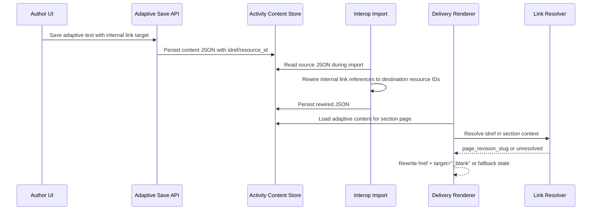

# Dynamic Links — Functional Design Document

## 1. Executive Summary
This design adds dynamic internal linking support for adaptive page text so authors can link to project resources without hardcoding delivery URLs. The core contract stores internal targets as `resource_id` references in adaptive content JSON and keeps external links as normal `href` anchors. On delivery, adaptive link rendering resolves each internal reference in section context and rewrites it to `/sections/:section_slug/lesson/:page_revision_slug`. The work touches adaptive authoring serialization, interop rewiring, and delivery render/rewrite paths, while reusing existing basic-page link resolution behavior where possible. Students get stable navigation across section creation and import/export lifecycle operations, including new-tab link behavior consistent with current lesson navigation expectations. Unresolvable links fail safely with a clear recovery action instead of crashing page rendering. Deletion workflows surface inbound-link warnings before removing a target resource that has adaptive inbound links. Main technical risk is divergence between basic/adaptive link structures; mitigation is a single canonical internal-link shape and shared traversal/rewire utilities. Performance posture is telemetry/AppSignal-driven, focused on resolution latency and failure-rate thresholds rather than dedicated benchmark suites. Security posture keeps project/section/tenant boundaries enforced for authoring pickers and delivery resolution.

## 2. Requirements & Assumptions
- Functional requirements summary:
  - FR-001: Authoring supports in-text adaptive internal link creation via in-project target selection.
  - FR-002: Internal adaptive links persist a `resource_id`-based reference as source of truth.
  - FR-003: External adaptive links remain standard `href` links and are not rewritten.
  - FR-004: Import rewiring remaps adaptive internal link references to destination resource IDs.
  - FR-005: Delivery resolves internal links to section lesson URLs.
  - FR-006: Student link navigation opens in a new tab.
  - FR-007: Unresolvable links show a clear delivery recovery state.
  - FR-008: Delete flows warn when target resources have inbound adaptive links.
  - FR-009: Link operations enforce project/section/tenant authorization boundaries.
  - FR-010: Telemetry is emitted for authoring and delivery outcomes.
- FR/AC traceability map:

| Requirement | Primary design sections | Primary verification anchors |
|---|---|---|
| FR-001 / AC-001 | 4.1 Authoring UI, 5.2 LiveView | 13 Authoring link picker tests |
| FR-002 / AC-002 | 4.1 Serialization, 6.1 Data model | 13 Unit serialization/validation tests |
| FR-003 / AC-003 | 4.1 Serialization, 5.1 API validation | 13 Delivery rewrite integration tests |
| FR-004 / AC-004 | 4.1 Interop rewiring, 7 Consistency | 13 Import rewiring integration tests |
| FR-005 / AC-005 | 4.1 Delivery rendering, 4.2 Sequence flow | 13 Delivery URL rewrite integration tests |
| FR-006 / AC-006 | 4.1 Delivery rendering | 13 New-tab behavior tests |
| FR-007 / AC-007 | 4.1 Delivery fallback, 10 Failure modes | 13 Unresolved fallback tests |
| FR-008 / AC-008 | 4.1 Deletion guard | 13 Delete-warning UI tests |
| FR-009 / AC-009 | 12 Security & Privacy | 13 Security boundary tests |
| FR-010 / AC-010 | 11 Observability | 13 Telemetry coverage checks |
- Non-functional targets:
  - Latency: Track adaptive internal-link rewrite latency in delivery path and keep it within existing page render budget; alert on sustained regressions.
  - Reliability: Link-resolution failures are isolated per-link and do not fail whole-page rendering.
  - Security: No cross-project/tenant target exposure in authoring picker or delivery resolver.
  - Operability: AppSignal + telemetry events cover create/update/remove/resolve/fail/delete-block paths.
- Explicit assumptions:
  - Adaptive links in this slice target lesson-addressable page resources (not screen-deep fragments).
  - Existing activity/adaptive content shape can carry internal-link metadata without database migrations.
  - Existing section lesson route contract remains `/sections/:section_slug/lesson/:page_revision_slug`.

## 3. Torus Context Summary
- What we know:
  - Basic-page link rendering already supports idref-backed internal links and route rewriting in [`lib/oli/rendering/content/html.ex`](/Users/raph/staff/all_sources/oli/lib/oli/rendering/content/html.ex).
  - Adaptive rendering context currently passes `pageLinkParams` through activity rendering in [`lib/oli/rendering/activity/html.ex`](/Users/raph/staff/all_sources/oli/lib/oli/rendering/activity/html.ex).
  - Import/export rewiring already traverses JSON and rewrites link references in [`lib/oli/interop/rewire_links.ex`](/Users/raph/staff/all_sources/oli/lib/oli/interop/rewire_links.ex), [`lib/oli/interop/export.ex`](/Users/raph/staff/all_sources/oli/lib/oli/interop/export.ex), and ingest rewiring helpers in [`lib/oli/interop/ingest/processor/rewiring.ex`](/Users/raph/staff/all_sources/oli/lib/oli/interop/ingest/processor/rewiring.ex).
  - Delivery routing supports lesson route generation in section context via [`lib/oli_web/router.ex`](/Users/raph/staff/all_sources/oli/lib/oli_web/router.ex).
  - Adaptive page initialization and render parameter setup occurs in [`lib/oli_web/live_session_plugs/init_page.ex`](/Users/raph/staff/all_sources/oli/lib/oli_web/live_session_plugs/init_page.ex).
- Unknowns to confirm:
  - Whether current adaptive text node schema already carries enough metadata for in-place link picker edit/remove flows or needs a shape extension.
  - Where delete-warning UX is best anchored (resource deletion UI surface vs shared warning component pipeline).
  - Whether unresolved-link “report issue” should reuse an existing issue-report flow.

## 4. Proposed Design
### 4.1 Component Roles & Interactions
- Authoring UI (adaptive text editor):
  - Adds/edits/removes link metadata on text nodes.
  - Reuses the basic-page modal interaction pattern: a single link modal for both new links and existing-link edits, including page dropdown selection for in-course links.
  - Page-target selector must always render in “Link to page in course” mode with explicit loading/error/empty states; when data loads it is populated from in-project pages.
  - Project scoping for page lookup is sourced from adaptive authoring runtime context (`projectSlug`) passed from activity renderer -> adaptive layout editor -> part editors as explicit part props/state, not inferred solely from window URL.
  - In preview contexts, adaptive internal links (`/course/link/:slug`) are rewritten client-side to the matching preview route (`/authoring/project/:project_slug/preview/:slug` or `/sections/:section_slug/preview/page/:slug`) to match basic-page preview navigation behavior.
  - Distinguishes internal vs external links.
  - Internal links persist `idref`/`resource_id`; external links persist literal `href`.
- Adaptive serialization layer:
  - Enforces canonical link node contract when saving activity content.
  - Internal adaptive anchors persist `idref`, `resource_id`, and `linkType: "page"` when targeting in-course pages.
  - Rejects slug-as-source internal persistence.
- Interop export/import rewiring:
  - Export converts internal lesson URL forms to portable idref structure when needed.
  - For adaptive tag-based anchors, export normalization writes both `idref` and `resource_id` (string form) and marks `linkType: "page"` for internal course links to align with basic-page rewiring expectations.
  - Export page-target resolution is constrained to page resources using the export payload's page slug map to avoid slug-collision ambiguity with non-page resources.
  - Export applies a defensive recursive pass over activity JSON so adaptive anchors in legacy/non-standard payload locations (for example part-level `model` arrays) are still located and rewritten.
  - Import rewires idref/resource references to destination project resource IDs and now performs recursive map/list traversal so adaptive anchors are rewritten regardless of nesting shape (including `partsLayout.custom.nodes`, part-level `model` arrays, and other legacy payload layouts).
  - Post-import hyperlink rewrite must resolve targets across mixed key spaces (legacy id keys and destination `resource_id` keys) to prevent all unresolved links collapsing to a single project-level fallback URL.
- Delivery rendering/rewrite:
  - Detects internal adaptive link metadata.
  - Resolves resource -> section-visible revision slug.
  - Rewrites rendered href to section lesson route and adds new-tab attributes.
  - Applies a defensive client-side rewrite in adaptive text-flow markup for legacy `/course/link/:slug` anchors rendered in section delivery, converting them to `/sections/:section_slug/lesson/:slug` when section context is present.
- Deletion guard:
  - Detects inbound adaptive dynamic links targeting a resource.
  - Warns author and shows source references before confirmation.
- Observability:
  - Emits authoring and delivery outcome events with no PII payloads.

### 4.2 State & Message Flow
- State ownership:
  - Source-of-truth internal link target: adaptive content JSON (`resource_id`/`idref`).
  - Runtime resolved URL: ephemeral render-time value in delivery.
- Message path:
  - Author edits text -> link picker selection -> serialized JSON save.
  - Import pipeline reads content JSON -> remaps ids -> stores rewired content.
  - Delivery fetches content -> renderer resolves idref in section context -> emits rewritten anchor.
- Backpressure points:
  - Large adaptive documents with many links can create repeated lookup pressure; resolver batching/cache-by-resource per request is preferred.

### 4.3 Supervision & Lifecycle
- No new long-lived OTP process is required.
- Work is request-scoped in existing controller/LiveView/render pipelines.
- Failure isolation:
  - Individual link resolution failure produces fallback link/error state.
  - Request continues rendering other content.
- Startup/teardown:
  - No new startup hooks.
  - Existing app boot/runtime behavior unchanged.

### 4.4 Alternatives Considered
- Persist revision slugs directly in adaptive JSON:
  - Rejected because slugs are not stable across import/export and section remaps.
- Resolve links client-side only with API lookups:
  - Rejected due to authorization leak risk and extra network latency.
- Add dedicated link-resolution service process:
  - Rejected as unnecessary complexity for current request-scoped resolver volume.

## 5. Interfaces
### 5.1 HTTP/JSON APIs
- Authoring save/retrieve endpoints (existing activity endpoints) continue carrying adaptive JSON payloads; contract change is within link node shape, not route changes.
- Validation rules:
  - Internal links require valid in-project `resource_id` reference.
  - External links require valid `href` and skip internal rewrite logic.
- Responses:
  - Existing success/error envelope conventions retained.
  - Invalid internal-link payload returns validation error.
- Rate limits:
  - No new rate-limit class; inherit existing authoring/delivery endpoint controls.

### 5.2 LiveView
- Authoring callbacks/events:
  - Add/update/remove link actions update client state and persisted payload.
- Assigns and state:
  - Existing adaptive editing state extended with internal-link metadata fields.
- PubSub:
  - No new PubSub topic required for this slice.

### 5.3 Processes
- Existing request process performs link rewrite using helper modules.
- Optional per-request map cache may memoize resource->slug resolution to avoid duplicate lookups.
- No new GenServer/Registry contracts required.

## 6. Data Model & Storage
### 6.1 Ecto Schemas
- No new tables or migrations.
- Adaptive link representation is JSON content-level schema evolution:
  - Internal: link node includes `idref`/`resource_id` target marker.
  - External: unchanged `href` semantics.
- Constraints:
  - Content validation ensures internal/external representation is mutually consistent.

### 6.2 Query Performance
- Representative shape:
  - Resolve `resource_id` to revision slug in section-aware context.
- Expected plan characteristics:
  - Indexed lookups via existing resource/revision relationships.
  - Bounded query count with per-request memoization to avoid N+1 for repeated targets.

## 7. Consistency & Transactions
- Authoring save:
  - Single content save transaction under existing activity persistence path.
- Import rewiring:
  - Rewire + persist as one import unit; failures rollback that unit.
- Idempotency:
  - Rewiring should be deterministic for same source/destination mapping.
- Compensation:
  - On unresolved links at delivery, show fallback instead of mutating stored content.

## 8. Caching Strategy
- Request-scoped cache:
  - Key: `resource_id`.
  - Value: resolved `page_revision_slug` or unresolved sentinel.
- No cross-node persistent cache introduced.
- Invalidation:
  - Request cache expires at request end.
  - Existing publication/versioning boundaries continue to govern durable content validity.

## 9. Performance and Scalability Posture (Telemetry/AppSignal Only)
### 9.1 Budgets
- Delivery link rewrite latency:
  - p50 <= 5ms for up to 10 internal links per adaptive page.
  - p95 <= 20ms for typical adaptive pages.
  - p99 <= 50ms under normal section traffic.
- Capacity posture:
  - No additional process pool required; monitor DB/query overhead from resolution lookups.
- Memory posture:
  - Request-scoped memoization map should remain proportional to unique link targets on page.
- Monitoring:
  - Telemetry/AppSignal dashboards track rewrite latency distribution and failure rates.

### 9.2 Hotspots & Mitigations
- Hotspot: N+1 lookups for many internal links.
  - Mitigation: per-request memoization and batched resolver path where feasible.
- Hotspot: Oversized adaptive JSON payload traversal.
  - Mitigation: single traversal passes for rewrite/inspection and avoid repeated deep scans.
- Hotspot: Failure spikes from stale/deleted targets.
  - Mitigation: deletion warnings and clear unresolved-link fallback telemetry.

## 10. Failure Modes & Resilience
- Invalid internal-link payload at save:
  - Behavior: reject save with validation error.
- Import mapping missing for referenced resource:
  - Behavior: leave link unresolved marker and emit import warning telemetry.
- Delivery resolution failure:
  - Behavior: render safe fallback UX with return/report action.
- Author preview internal-link click:
  - Behavior: block navigation to unresolved `/course/link/:slug` route and show explanatory notice to author.
- Partial content corruption:
  - Behavior: isolate bad link node and continue rendering remaining page content.

## 11. Observability
- Telemetry events:
  - `adaptive_dynamic_link_created`
  - `adaptive_dynamic_link_updated`
  - `adaptive_dynamic_link_removed`
  - `adaptive_dynamic_link_resolved`
  - `adaptive_dynamic_link_resolution_failed`
  - `adaptive_dynamic_link_broken_clicked`
  - `adaptive_dynamic_link_delete_blocked`
- Measurements:
  - Resolution latency (ms), resolution success/failure count, unresolved ratio.
- Metadata:
  - `project_id`, `section_id`, `resource_id` (internal IDs only), result status.
  - Exclude learner PII and external URL content from telemetry payloads.
- Alerting:
  - Alert when resolution failure rate exceeds agreed threshold for a sustained window.
- AppSignal metrics:
  - `oli.adaptive.dynamic_link.resolve.duration_ms` (distribution)
  - `oli.adaptive.dynamic_link.resolved` (counter)
  - `oli.adaptive.dynamic_link.created` (counter)
  - `oli.adaptive.dynamic_link.updated` (counter)
  - `oli.adaptive.dynamic_link.removed` (counter)
  - `oli.adaptive.dynamic_link.resolution_failed` (counter)
  - `oli.adaptive.dynamic_link.broken_clicked` (counter)
  - `oli.adaptive.dynamic_link.delete_blocked` (counter)
  - Current implementation emits `adaptive_dynamic_link_broken_clicked` when unresolved fallback navigation is rendered for a broken link.

## 12. Security & Privacy
- AuthZ:
  - Authoring picker limited to authorized project resources.
  - Delivery resolver enforces section enrollment and project scope.
- Tenant isolation:
  - No cross-tenant resource lookup or exposure through link metadata.
- Data handling:
  - Internal references use stable IDs; no sensitive payload expansion in client responses.
- Auditability:
  - Author link mutations and delete-block events are logged via telemetry.

## 13. Testing Strategy
- Unit tests:
  - Adaptive link serialization/validation for internal vs external contracts.
  - Resolver rewrite function behavior for valid/unresolved targets.
- Integration tests:
  - Import rewiring remaps internal references in adaptive content.
  - Delivery rendering rewrites to section lesson URLs and preserves external links.
- UI/behavior tests:
  - Authoring link picker create/edit/remove flows.
  - Author preview internal-link click interception and explanatory notice rendering.
  - Delete-warning behavior for inbound adaptive links.
  - New-tab behavior and unresolved fallback interaction.
- Security tests:
  - Ensure out-of-scope project/section resources cannot be picked or resolved.
- Performance posture validation:
  - Verify telemetry/AppSignal instrumentation and alert thresholds; no dedicated load/benchmark test suite.

## 14. Backwards Compatibility
- Existing adaptive content without internal-link metadata remains valid and unchanged.
- Existing external links remain unchanged.
- Basic page link behavior is unaffected.
- Import/export pipelines remain compatible; this feature extends adaptive traversal coverage.

## 15. Risks & Mitigations
- Risk: Basic/adaptive link-contract drift.
  - Mitigation: canonical internal-link contract and shared helper utilities.
- Risk: Hidden unresolved links after import.
  - Mitigation: import telemetry and regression tests for rewiring paths.
- Risk: Delivery latency regressions on link-heavy pages.
  - Mitigation: request memoization and AppSignal alerting on latency/failure budgets.
- Risk: Author confusion on delete blocks.
  - Mitigation: explicit source-context warning UI before deletion confirmation.

## 16. Open Questions & Follow-ups
- Should unresolved-link report action integrate with existing student issue-report flow by default?
- Should link picker initially scope to page resources only, then expand to other lesson-addressable resource types later?
- Should import failures on internal-link remaps be hard-fail or warning-only when non-critical content can still render?

## 17. References
- [Dynamic Links PRD](/Users/raph/staff/all_sources/oli/docs/epics/adaptive_page_improvements/dynamic_links/prd.md)
- [Dynamic Links Requirements](/Users/raph/staff/all_sources/oli/docs/epics/adaptive_page_improvements/dynamic_links/requirements.yml)
- [Adaptive Page Improvements Overview](/Users/raph/staff/all_sources/oli/docs/epics/adaptive_page_improvements/overview.md)
- [High-Level Design Guide](/Users/raph/staff/all_sources/oli/guides/design/high-level.md)
- [Publication Model Guide](/Users/raph/staff/all_sources/oli/guides/design/publication-model.md)
