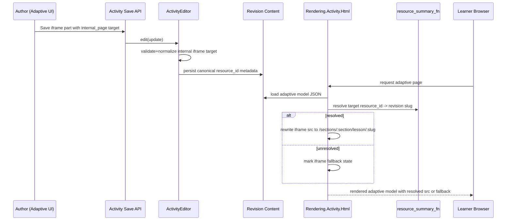

# Iframe Links — Functional Design Document

## 1. Executive Summary
This design extends adaptive internal-link support from text anchors to iframe part sources in `janus-capi-iframe`. Authors will use checkbox-based source-type controls in the iframe Custom panel to switch between `External URL` and `Page Link` modes. `Page Link` mode uses picker-only selection of in-project pages, while `External URL` mode keeps direct URL entry. Internal iframe targets persist as `resource_id`-based references, following the same stability model established in dynamic links. The save pipeline in `ActivityEditor` validates and normalizes internal iframe targets and rejects invalid or out-of-scope references. Runtime rendering rewrites internal iframe sources for authoring preview (`/authoring/project/:project_slug/preview/:slug`), instructor preview (`/sections/:section_slug/preview/page/:slug`), and section delivery (`/sections/:section_slug/lesson/:revision_slug`). Import/export rewiring remaps internal iframe references to destination resource ids so migrated content remains valid. For unresolved internal targets, delivery renders a clear fallback for the iframe region and keeps the rest of the adaptive page functional. The design keeps runtime scope request-local with no new OTP process and no database migration. Telemetry/AppSignal instrumentation extends existing adaptive dynamic-link observability with iframe-source outcomes and fallback signals. The design prioritizes backward compatibility by preserving legacy external `src` behavior and limiting normalization to explicit internal-source metadata.

## 2. Requirements & Assumptions
- Functional Requirements:
  - FR-001 / AC-001: Authoring supports checkbox-based source-type selection and picker-only internal page target selection for iframe source.
  - FR-002 / AC-002: Internal iframe source persistence is `resource_id`-based, not slug-based.
  - FR-003 / AC-003: Save-time validation rejects invalid/deleted/out-of-scope internal iframe targets.
  - FR-004 / AC-004: Delivery resolves internal iframe references to section lesson URLs.
  - FR-005 / AC-005: Unresolved internal iframe targets render clear fallback while page remains functional.
  - FR-006 / AC-006: External iframe source behavior remains unchanged.
  - FR-007 / AC-007: Import/export rewiring remaps internal iframe target references.
  - FR-008 / AC-008: Picker and resolution enforce project/section/tenant boundaries.
  - FR-009 / AC-009: Telemetry emits internal iframe source create/update/resolve/failure/fallback without PII.
- Non-Functional Requirements:
  - Performance: monitor internal iframe resolution p95 <= 100ms and failure rate <= 1% over 15 minutes via telemetry/AppSignal.
  - Reliability: resolution failure is isolated to iframe surface; adaptive page render continues.
  - Security: no cross-project or cross-tenant resource exposure through picker or resolver.
  - Operability: AppSignal counters/distributions and alerts exist for internal iframe resolution outcomes.
  - Accessibility: picker/fallback interactions remain keyboard and screen-reader usable.
- Explicit Assumptions:
  - Internal iframe targets are page resources only (no screen-level deep links).
  - Existing `MER-5211` dynamic-link helpers and traversal patterns are available for extension.
  - Route contract for internal destinations remains `/sections/:section_slug/lesson/:revision_slug`.
  - Picker-only entry is final product direction (no free-text slug entry).

## 3. Torus Context Summary
- What we know:
  - Adaptive iframe part model currently has `src: string` and no internal-link metadata in `assets/src/components/parts/janus-capi-iframe/schema.ts`.
  - Authoring preview/config for iframe part now resolves internal `/course/link/:slug` values with context-aware rewrite in `assets/src/components/parts/janus-capi-iframe/sourceResolver.ts` and `assets/src/components/parts/janus-capi-iframe/CapiIframeAuthor.tsx`.
  - Delivery iframe rendering now resolves internal `/course/link/:slug` values through the same resolver before render in `assets/src/components/parts/janus-capi-iframe/ExternalActivity.tsx`.
  - Adaptive save validation/normalization for dynamic links currently inspects only `janus-text-flow` anchor nodes in `lib/oli/authoring/editing/activity_editor.ex`.
  - Adaptive delivery dynamic-link rewrite currently rewrites only anchor nodes (`tag: "a"`) in `lib/oli/rendering/activity/html.ex`.
  - Import/export adaptive link rewiring is already recursive and handles adaptive anchor `idref` in `lib/oli/interop/rewire_links.ex` and `lib/oli/interop/ingest/processor/rewiring.ex`.
  - Author-side page picker data source already exists as `GET /api/v1/project/:project/link` in `lib/oli_web/controllers/api/resource_controller.ex`.
  - Dynamic-link telemetry supervisor and AppSignal integration already exists in `lib/oli/adaptive/dynamic_links/telemetry.ex` and is started from `lib/oli/application.ex`.
  - Curriculum delete warning logic already checks adaptive dynamic-link dependencies for text anchors in `lib/oli/publishing/authoring_resolver.ex` and is exercised by `test/oli_web/live/curriculum/container_test.exs`.
- Unknowns to confirm:
  - Final JSON shape for internal iframe metadata (for example `linkType`, `idref`, and compatibility with existing `src`).
  - Exact learner-facing fallback visual component for unresolved iframe sources.
  - Whether inbound-link dependency scans should include iframe source references in the same warning modal listing.

## 4. Proposed Design
### 4.1 Component Roles & Interactions
- Frontend authoring (`janus-capi-iframe`):
  - Add checkbox-style source-type controls in the Custom panel (matching popup editor UX pattern) to toggle between `External URL` and `Page Link`.
  - Render source editors conditionally by selected type: URL text field for `External URL`, page dropdown for `Page Link`.
  - Extend part config schema with explicit source mode (`internal_page` vs `url`) and internal target reference fields.
  - Reuse existing project page listing API for picker population.
  - Enforce picker-only internal selection; disallow manual slug entry path in UI.
  - Preserve legacy `src` editing for external URL mode.
- Backend save/validation (`ActivityEditor`):
  - Extend adaptive link validation/normalization to include `janus-capi-iframe` parts in `authoring.parts` and `partsLayout` where applicable.
  - Validate internal iframe target resource belongs to project page target set.
  - Normalize internal iframe source to canonical `resource_id` representation.
- Delivery rewrite (`Rendering.Activity.Html`):
  - Extend dynamic-link marker detection to include iframe internal-source markers.
  - Rewrite internal iframe source references to section lesson URLs at render time.
  - Keep external `src` unchanged.
  - Apply a shared route resolver for internal iframe links so preview contexts do not issue raw `/course/link/*` requests:
    - authoring preview route rewrite
    - instructor preview route rewrite
    - section lesson route rewrite
  - On unresolved target, replace iframe source with defined fallback state marker (rendered by adaptive delivery component).
- Import/export rewiring:
  - Extend existing recursive rewiring to include new iframe internal-source fields in adaptive payloads.
  - Preserve idempotency and no-op behavior for external URL mode.
- Dependency detection and delete warnings:
  - Extend adaptive dependency extraction to include iframe internal-source references so deletion protection covers both text links and iframe links.
- Observability:
  - Reuse `Oli.Adaptive.DynamicLinks.Telemetry` with `source` metadata indicating `iframe_authoring`, `iframe_delivery_render`, and `curriculum_delete_modal` flows.

### 4.2 State & Message Flow
- State ownership:
  - Persisted source-of-truth: adaptive activity JSON with internal iframe target `resource_id` metadata.
  - Runtime computed state: resolved lesson URL per section for internal iframe source.
- Message flow:

- Backpressure/control points:
  - Per-request resource-id to slug memoization avoids duplicate lookups for repeated iframe references.
  - Recursive traversal remains bounded by activity JSON size and runs once per render.

### 4.3 Supervision & Lifecycle
- No new long-running process is required.
- Existing supervision remains unchanged; telemetry module already supervised in `Oli.Application`.
- All added work is request-scoped:
  - Save-time validation in existing authoring request lifecycle.
  - Delivery rewrite in existing render request lifecycle.
  - Import/export rewiring in existing ingest/export workflows.
- Failure isolation:
  - Invalid save input returns validation error without partial persistence.
  - Delivery resolution failure affects only the iframe surface.

### 4.4 Alternatives Considered
- Store internal iframe source as `/course/link/:slug` only:
  - Rejected because slug is not stable across import/export and violates FR-002.
- Add new dedicated telemetry subsystem for iframe links:
  - Rejected as unnecessary complexity; existing adaptive dynamic-link telemetry is sufficient with richer `source`/`reason` tags.
- Resolve internal iframe URLs in frontend only:
  - Rejected due to authorization leakage risk and inconsistent section-context routing.

## 5. Interfaces
### 5.1 HTTP/JSON APIs
- Reused existing API:
  - `GET /api/v1/project/:project/link` for page picker options.
- No new HTTP routes required for MVP.
- Activity save payload contract updates:
  - `janus-capi-iframe` supports source mode metadata and internal target resource reference.
  - Source mode is driven by checkbox-type UI controls, with conditional source value fields per mode.
  - Validation rejects internal mode when target does not map to an allowed page resource.
- Runtime source-rewrite contract updates:
  - Internal `/course/link/:slug` source values are rewritten client-side for preview contexts and to section lesson URLs in delivery context before iframe load.
- Error response behavior:
  - Existing activity save error envelope with `{:invalid_update_field}`-style validation failure semantics.

### 5.2 LiveView
- No new LiveView event contracts introduced.
- Existing curriculum delete modal flow remains, with dependency source list expanded to include iframe links.
- Any UI work for this feature is in adaptive React authoring/delivery components, not new LiveView surface.

### 5.3 Processes
- `ActivityEditor.edit/5` remains primary authoring mutation boundary.
- `Rendering.Activity.Html.render/3` remains delivery rewrite boundary.
- `Oli.Ingest.RewireLinks` and `Oli.Interop.Ingest.Processing.Rewiring` remain ingest/export rewrite boundaries.
- No new GenServer/Registry/Task contracts required.

## 6. Data Model & Storage
### 6.1 Ecto Schemas
- No Ecto schema or migration changes.
- Content JSON evolution only:
  - Add canonical internal iframe source metadata fields under `janus-capi-iframe` custom payload.
  - Keep backward-compatible `src` for external URLs and legacy records.

### 6.2 Query Performance
- Resolution query shape:
  - Existing `resource_summary_fn` lookup path (resource id -> revision slug).
- Performance posture:
  - Use per-request memoization to avoid repeated lookups for duplicate targets.
  - Maintain O(unique_internal_targets) lookup complexity per render.

## 7. Consistency & Transactions
- Authoring consistency:
  - Validation and normalization complete before revision update; failed validation causes full rejection.
- Import consistency:
  - Rewiring occurs as part of ingest processing before persisted content is finalized.
- Delivery consistency:
  - Runtime rewrite does not mutate stored content; failures are non-persistent and isolated.
- Idempotency:
  - Re-running rewiring on already normalized internal iframe references is no-op.

## 8. Caching Strategy
- Request-scoped cache only in delivery rewrite traversal:
  - Key: `resource_id`
  - Value: resolved slug or unresolved sentinel
- No new cross-request or cross-node cache introduced.
- Existing publication/version boundaries remain cache invalidation boundary for persisted content.

## 9. Performance and Scalability Posture (Telemetry/AppSignal Only)
### 9.1 Budgets
- Internal iframe resolution latency:
  - p50 <= 20ms, p95 <= 100ms, p99 <= 200ms during normal section delivery.
- Resolution reliability:
  - sustained resolution failure rate <= 1% over 15 minutes.
- Observed through telemetry + AppSignal counters/distributions and alert policies.
- No dedicated performance/load/benchmark tests are introduced.

### 9.2 Hotspots & Mitigations
- Hotspot: repeated resolver calls for duplicate internal targets.
  - Mitigation: per-request memoization map in traversal.
- Hotspot: large adaptive models with deep nested structures.
  - Mitigation: single recursive traversal pass and marker-based early filtering.
- Hotspot: malformed legacy internal data.
  - Mitigation: defensive normalization rules and fallback rendering path.

## 10. Failure Modes & Resilience
- Invalid internal target on save:
  - Behavior: reject save and surface validation message.
- Missing mapping during import:
  - Behavior: keep unresolved marker, emit warning telemetry, continue import where safe.
- Unresolved target on delivery:
  - Behavior: render fallback for iframe area; page stays interactive.
- External URL mode with malformed URL:
  - Behavior: preserve existing iframe behavior and rely on browser/frame load failure semantics.

## 11. Observability
- Telemetry events (logical outcomes):
  - create, update, remove, resolve, resolve-failure, fallback-rendered for internal iframe sources.
- Implementation approach:
  - Extend existing `[:oli, :adaptive, :dynamic_link, ...]` events with `source` tags identifying iframe pathway.
- AppSignal metrics:
  - counter: internal iframe resolution success/failure
  - distribution: internal iframe resolution duration
  - counter: fallback rendered count
- Alert posture:
  - alert on sustained failure-rate and duration-threshold breaches.
- Metadata hygiene:
  - include project/section/resource identifiers only; exclude PII and raw external URLs.

## 12. Security & Privacy
- Authorization boundaries:
  - Picker uses project-scoped page list API.
  - Save validation ensures referenced resource is in project page target set.
  - Delivery resolver uses section context and authorization-bound resource summaries.
- Tenant isolation:
  - no cross-tenant resource lookup exposure through internal source metadata.
- Privacy:
  - telemetry metadata redacted to non-PII identifiers.

## 13. Testing Strategy
- Unit and integration coverage:
  - extend `test/oli/editing/activity_editor_test.exs` for iframe-source validation/normalization.
  - extend `test/oli/rendering/activity/html_test.exs` for iframe internal source rewrite and fallback.
  - extend `test/oli/interop/rewire_links_test.exs` and `test/oli/interop/ingest/processor/rewiring_test.exs` for iframe reference rewiring.
  - extend `test/oli/publishing/authoring_resolver_test.exs` and `test/oli_web/live/curriculum/container_test.exs` for dependency detection/delete warning.
  - add frontend tests for checkbox source-type toggling, conditional source field rendering, and picker-only page-link behavior in adaptive part config component tests.
  - add frontend route-resolver tests for authoring preview, workspace authoring, instructor preview, and delivery lesson rewrite paths.
- Telemetry verification:
  - assert emitted events and metadata shape for resolve/failure/fallback paths.
- Manual focus (risk-heavy/non-automated):
  - mixed legacy `src` data migration behavior.
  - malformed internal reference fallback rendering clarity.
  - cross-context parity (author preview vs section delivery).

### 13.1 Scenario Coverage Plan
- PRD Scenario Status: Required
- AC/Workflow Mapping:
  - AC-004, AC-005, AC-007, AC-008 mapped to end-to-end author->publish->section delivery workflow with internal iframe target resolution and unresolved fallback.
- Planned Scenario Artifacts:
  - `test/scenarios/delivery/adaptive_iframe_internal_link_resolution.scenario.yaml`
  - `test/scenarios/delivery/iframe_links_hooks.ex`
  - runner coverage via `test/scenarios/scenario_runner_test.exs`
  - supporting infrastructure expansion: `create_activity` accepts `content_format: json` for adaptive payload setup.
- Validation Loop:
  - `mix test test/scenarios/validation/schema_validation_test.exs`
  - `mix test test/scenarios/scenario_runner_test.exs`
  - Planning Handoff: `spec_plan must schedule $spec_scenario_expand before $spec_scenario`.

### 13.2 LiveView Coverage Plan
- PRD LiveView Status: Not applicable
- UI Mapping:
  - N/A (feature work is adaptive React authoring/delivery plus backend rewrite/validation).
- Planned LiveView Test Artifacts:
  - N/A
- Validation Commands:
  - N/A

## 14. Backwards Compatibility
- Existing external iframe `src` usage remains valid with no migration required.
- Existing adaptive text dynamic-link behavior remains unchanged.
- Existing content without internal iframe metadata continues rendering as before.
- Import/export remains backward-compatible; additional rewiring only applies when new iframe internal metadata is present.

## 15. Risks & Mitigations
- Risk: Internal iframe metadata shape diverges from text dynamic-link model.
  - Mitigation: reuse `resource_id` canonical model and shared traversal/validation helpers.
- Risk: Delete-warning misses inbound iframe references.
  - Mitigation: extend authoring resolver dependency scan and add regression tests.
- Risk: Increased delivery rewrite latency on link-heavy models.
  - Mitigation: memoization + AppSignal threshold alerts.
- Risk: Ambiguous learner fallback UX for unresolved iframe sources.
  - Mitigation: define a single fallback component contract and test copy/accessibility.

## 16. Open Questions & Follow-ups
- What final fallback component copy and visual treatment should be standardized for unresolved internal iframe sources?
- Should unresolved iframe fallback include direct navigation action to current page context (`request_path`) or only informational copy?
- Should telemetry counters be split into dedicated iframe metric names now, or remain unified under adaptive dynamic-link metrics with source tagging?

## 17. References
- No external research sources were required.
- Local context: `guides/design/high-level.md`, `guides/design/publication-model.md`, `guides/design/page-model.md`, `docs/epics/adaptive_page_improvements/dynamic_links/fdd.md`.

## Decision Log
### 2026-03-09 - Capture Preview-Aware Iframe Route Rewrite
- Change: Updated architecture and interface sections to include the implemented shared resolver that rewrites internal iframe `/course/link/:slug` values for authoring preview, instructor preview, and section delivery contexts.
- Reason: Implementation fixed preview failures where iframe attempted direct `/course/link/*` requests and hit `NoRouteError`.
- Evidence: `assets/src/components/parts/janus-capi-iframe/sourceResolver.ts`; `assets/src/components/parts/janus-capi-iframe/ExternalActivity.tsx`; `assets/src/components/parts/janus-capi-iframe/CapiIframeAuthor.tsx`; `assets/test/advanced_authoring/right_menu/component/iframe_source_resolver_test.ts`.
- Impact: Expands runtime contract and test strategy to include authoring/instructor preview parity, reducing route-resolution regressions.
