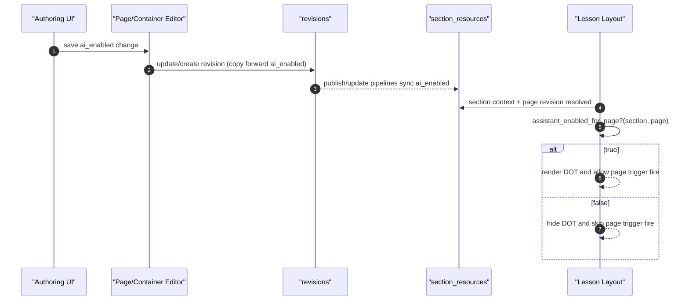

# Override DOT Per Page — Functional Design Document

## 1. Executive Summary
This design introduces a durable page-level flag, `ai_enabled`, to control whether DOT can appear on a specific page. The flag is added to both `revisions` and `section_resources` so it travels through authoring lineage and section publication/update pipelines. Authoring receives two edit surfaces: the existing page options modal and the adaptive lesson property panel. Delivery logic moves from graded/adaptive heuristics to a single explicit gate: section assistant must be enabled and page `ai_enabled` must resolve to true. For legacy rows where `ai_enabled` is missing, behavior falls back to the existing semantics by deriving default from `graded` (`false` for scored, `true` for practice). Page trigger auto-fire is also gated by this same effective page setting so server-side trigger broadcasts are suppressed when DOT is disabled for that page. Import/export contracts include `aiEnabled` to keep portability and round-trip integrity. The design avoids adding new runtime services or cross-context dependencies. It keeps `Oli` context boundaries intact by implementing page-gating helpers in `Oli.Delivery.Sections` and reusing existing lesson/layout decision points. Primary risk is incomplete propagation across section-resource creation/update pathways, mitigated by touching every known mapping path and adding targeted regression tests.

## 2. Requirements & Assumptions
- Functional Requirements:
  - FR-001 (`AC-001`, `AC-002`): Add and propagate `ai_enabled` in revision and section-resource data.
  - FR-002 (`AC-003`, `AC-004`): Page options modal toggle with graded-aware defaults.
  - FR-003 (`AC-005`): Adaptive lesson panel toggle persisted to revision.
  - FR-004 (`AC-006`, `AC-007`, `AC-008`): Delivery visibility requires both section and page enablement.
  - FR-005 (`AC-009`): Page trigger auto-fire obeys page-level enablement.
  - FR-006 (`AC-010`): Import/export includes `aiEnabled`.
- Non-Functional Requirements:
  - No dedicated performance/load/benchmark tests.
  - No tenant-scope relaxation; section and page context resolution remain scoped.
  - Backward compatibility for legacy rows with nil `ai_enabled` via deterministic fallback.
- Explicit Assumptions:
  - Technical guidance in `override_dot/informal.md` is authoritative and broader than the earlier narrow AC wording.
  - Page-level override should apply to both basic and adaptive pages in delivery contexts where DOT UI is available.

## 3. Torus Context Summary
- What we know:
  - `Oli.Resources.Revision` and `Oli.Resources.create_revision_from_previous/2` are the revision source-of-truth and lineage copy path.
  - `Oli.Delivery.Sections` and `Oli.Delivery.Sections.Updates` populate and refresh `section_resources` from published revisions.
  - `Oli.Delivery.Sections.SectionResourceMigration` is already used to sync pinned revision fields in minor-update/migration paths.
  - DOT page rendering in lesson layout currently uses view/graded heuristics, and page trigger auto-fire originates in `LessonLive.possibly_fire_page_trigger/2`.
  - Adaptive authoring save uses `PageEditor.edit/4` via `/api/resource` updates; non-adaptive options modal uses `ContainerEditor.edit_page/3`.
- Unknowns to confirm:
  - None blocking implementation; all required touchpoints are present in current code.

## 4. Proposed Design
### 4.1 Component Roles & Interactions
- Data model:
  - Add `ai_enabled` on `revisions` and `section_resources`.
  - Revision lineage copies `ai_enabled` forward.
- Authoring:
  - Page Options modal writes `revision[ai_enabled]` for page revisions.
  - Adaptive lesson property schema exposes `aiEnabled`; authoring save emits top-level `ai_enabled` in resource update payload.
- Delivery:
  - Introduce section helper to compute effective page AI enablement (`ai_enabled` fallback to `!graded` when nil).
  - Lesson layout DOT render condition calls helper instead of graded/adaptive heuristic.
  - Page trigger fire path in `LessonLive` calls same helper before scheduling trigger.
- Section-resource propagation:
  - Add `ai_enabled` to all section-resource creation/update/migration maps.

### 4.2 State & Message Flow

### 4.3 Supervision & Lifecycle
- No new processes or supervisors.
- Existing LiveView lifecycle remains unchanged; only conditional checks for visibility and trigger scheduling are updated.

### 4.4 Alternatives Considered
- Store only in `revisions` and skip `section_resources`:
  - Rejected due to explicit technical guidance and existing section-resource migration/update architecture.
- Store only in adaptive content JSON (`content.custom`) and skip revision field:
  - Rejected because basic/adaptive parity and section-resource propagation require a top-level revision attribute.

## 5. Interfaces
### 5.1 HTTP/JSON APIs
- Existing `/api/resource` page update payload gains optional top-level `ai_enabled`.
- No new endpoints.

### 5.2 LiveView
- `student_delivery_lesson.html.heex` condition changes to helper-based page/section gate.
- `LessonLive.possibly_fire_page_trigger/2` condition changes to helper-based page/section gate.

### 5.3 Processes
- No GenServer contract changes.

## 6. Data Model & Storage
### 6.1 Ecto Schemas
- `Oli.Resources.Revision`: add `field :ai_enabled, :boolean` and cast/encoder inclusion.
- `Oli.Delivery.Sections.SectionResource`: add `field :ai_enabled, :boolean`, cast inclusion, `to_map/1` inclusion.
- Migration:
  - Add both columns.
  - Backfill graded-aware defaults where graded is known.

### 6.2 Query Performance
- No new heavy queries.
- Reuse existing section/page assigns and helper-level checks.

## 7. Consistency & Transactions
- Revision updates remain transactional through existing editor transactions.
- Section-resource sync remains transactional in existing section update/create workflows.
- Fallback logic ensures legacy null values resolve deterministically.

## 8. Caching Strategy
- No new cache.
- Existing depot/section-resource caches continue to serve page context; helper computation is local and constant-time.

## 9. Performance and Scalability Posture (Telemetry/AppSignal Only)
### 9.1 Budgets
- Lesson mount and render paths should not introduce additional query count beyond current baseline.
- Trigger scheduling path remains constant-time checks plus existing delayed send.

### 9.2 Observation Approach
- Verify AppSignal traces for lesson mount and API update paths do not regress materially.

### 9.3 Hotspots & Mitigations
- Hotspot: missing propagation path causing stale page flag.
  - Mitigation: update all known section-resource builders + migration module and cover in tests.

## 10. Failure Modes & Resilience
- Missing `ai_enabled` value (legacy rows): fallback to `!graded`.
- Partial propagation in updates: section-resource migration path explicitly includes `ai_enabled`.
- Authoring payload omits `ai_enabled`: server defaults from existing value, with grading-aware defaults during creation paths.

## 11. Observability
- Existing logs and instrumentation are reused.
- No new telemetry event required for MVP correctness; existing trigger and lesson flow diagnostics remain available.

## 12. Security & Privacy
- Section-level assistant authorization remains mandatory.
- Page-level flag cannot enable DOT when section-level assistant is disabled.
- No additional sensitive data stored.

## 13. Testing Strategy
- Backend tests:
  - SectionResourceMigration includes `ai_enabled` migration proof (`AC-002`).
  - Page creation defaults for scored/practice in authoring flows (`AC-001`).
  - Import/export round-trip field presence (`AC-010`).
- LiveView tests:
  - Scored page DOT hidden when `ai_enabled` false (`AC-006`).
  - Scored page DOT visible when `ai_enabled` true (`AC-007`).
  - Section disabled hides DOT even when page true (`AC-008`).
- Authoring tests:
  - Options modal save payload and persisted revision include `ai_enabled` (`AC-003`, `AC-004`).
  - Adaptive lesson panel save persists revision `ai_enabled` (`AC-005`).
- Trigger behavior:
  - Page trigger auto-fire skipped when page disabled (`AC-009`).

## 14. Backwards Compatibility
- Legacy revisions/section resources without `ai_enabled` continue to behave like old logic via fallback to `!graded`.
- No contract-breaking route or endpoint changes.

## 15. Risks & Mitigations
- Risk: adaptive pages with previous graded heuristic may change behavior unexpectedly.
  - Mitigation: fallback defaults preserve scored=false/practice=true unless explicitly overridden.
- Risk: test gaps across multiple authoring entry points.
  - Mitigation: cover curriculum, all-pages, and adaptive authoring save paths.

## 16. Open Questions & Follow-ups
- Open question:
  - Should page-level assistant toggle changes emit explicit analytics events in a follow-up story?
- Follow-up:
  - Consider extending page-level gating into trigger API access checks using trigger resource id validation.

## 17. References
- `docs/epics/adaptive_page_improvements/override_dot/informal.md`
- `MER-4943.txt`
- `docs/epics/adaptive_page_improvements/plan.md`
