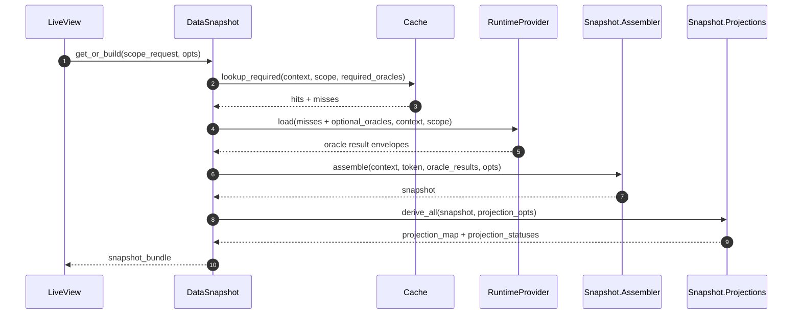
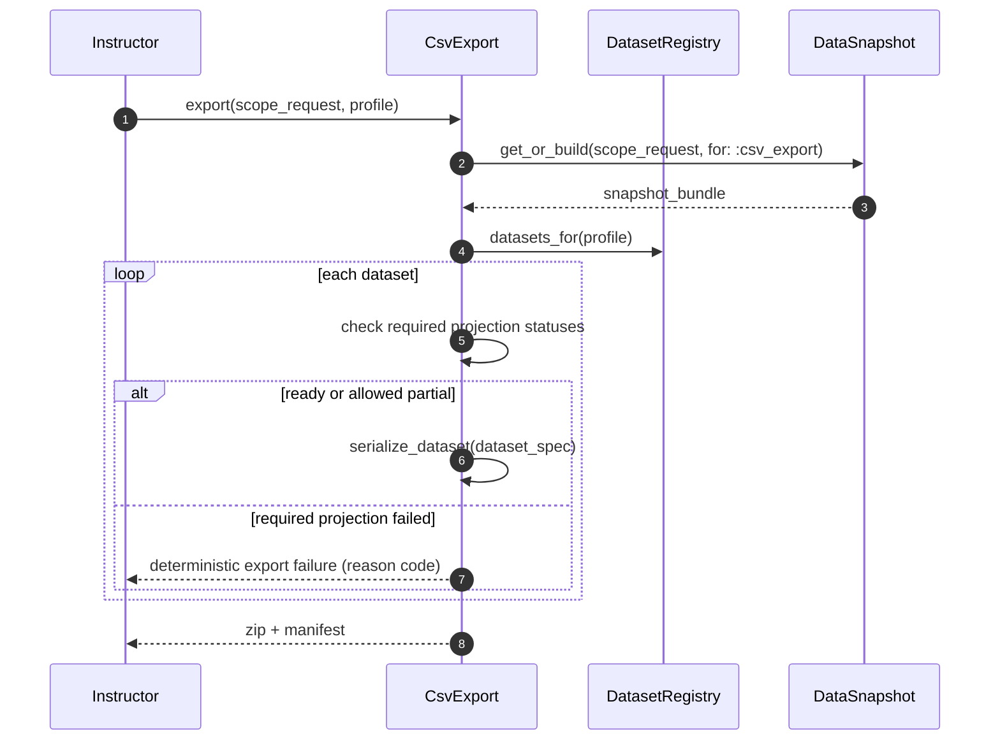

# Data Snapshot FDD

Last updated: 2026-02-25
Feature: `data_snapshot`
Epic: `MER-5198`
Primary Jira: `MER-5304`

## 1. Executive Summary

This feature implements the canonical snapshot and projection layer for Intelligent Dashboard and establishes it as the single semantic source for both UI and CSV consumers. The design separates orchestration concerns from transformation concerns through clear module boundaries: `DataSnapshot` orchestrates retrieval, `Snapshot.Assembler` composes canonical contracts, projection modules derive capability views, and `CsvExport` performs transform-only serialization. Snapshot construction is deterministic and token/scoped so it can safely consume results from cache-hit and runtime-loaded oracle flows. For `get_or_build/2`, orchestration is synchronous read-through (cache lookup for required keys, runtime resolution for misses/optional keys) and intentionally does not replay coordinator action streams. Projection readiness and failure states are explicit and machine-readable, enabling incremental tile hydration and deterministic export handling. Incremental rendering is a hard contract: projection readiness is capability-scoped and there is no global all-projection readiness barrier for tile rendering. CSV generation uses dataset registry mappings that reference projection contracts instead of ad-hoc query logic, so UI and export consumers stay aligned through shared inputs and deterministic transforms. This layer intentionally does not own queue/token stale suppression or cache policy behavior; those remain in coordinator/cache features. Exact concrete instructor oracle implementations remain tile-driven; this layer is intentionally agnostic and consumes active oracle contracts/bindings. Risks center on projection contract churn and partial-export policy ambiguity, mitigated by capability-scoped projection modules, versioning, and explicit dataset inclusion rules.

## 2. Requirements & Assumptions

Functional requirements (PRD mapping):
- FR-001, FR-002: deterministic snapshot contract with metadata, oracle map, and projection map.
- FR-003, FR-004: capability projection interfaces and readiness statuses with no global readiness gate.
- FR-005, FR-011: `DataSnapshot` orchestration API with strict boundaries to coordinator/cache/oracle layers.
- FR-006, FR-007, FR-009: CSV transform-only generation via dataset registry and serializers.
- FR-008: deterministic inclusion/failure policy for partial projections.
- FR-010, FR-012: contract versioning and semantic-equivalence verification through shared contracts and tests.
- FR-013: extensive unit testing with mocked/stubbed concrete dependencies for snapshot boundary interaction coverage.

Acceptance criteria traceability:
- AC-001: deterministic assembly outputs support immediate consumption of ready capability projections without global readiness blocking.
- AC-002: UI projections and CSV datasets remain semantically equivalent for shared metrics through shared contracts and deterministic transform tests.
- AC-003: CSV export path remains transform-only over snapshot/projection inputs with no independent analytics query path.
- AC-004: partial readiness behavior follows deterministic dataset inclusion/exclusion policy.
- AC-005: required-projection export failures return deterministic reason-coded errors.
- AC-006: assembler/projection/export boundaries prohibit queue/token/cache-policy logic and direct oracle/query calls.
- AC-007: contract versioning supports prior projection schema compatibility during migration windows.
- AC-008: snapshot tests include mocked/stubbed concrete dependencies where needed for boundary interaction coverage.

Non-functional targets:
- No performance testing will be done in `MER-5304`.
- Performance benchmark and latency-threshold validation are deferred to separate tickets.
- Semantic-equivalence verification for gated metrics remains deterministic and test-covered.

Explicit assumptions:
- Oracle result envelopes from prior lane stories are stable and include version/context identity metadata.
- Coordinator/cache provide deterministic cache-hit/miss and stale-suppression behavior before snapshot assembly.
- Export transport mechanism can consume zip binary + manifest outputs from internal adapters.
- Exact concrete instructor oracle keys/modules are finalized in tile implementation stories and exposed through stable oracle contracts.

Assumption risks:
- If oracle envelopes vary unexpectedly, projection adapters may require normalization shim layers.
- If product policy on partial export is unresolved, rollout may require temporary fail-closed fallback.

## 3. Torus Context Summary

What we know:
- `docs/epics/intelligent_dashboard/data_snapshot/prd.md` defines canonical snapshot intent and CSV reuse path.
- Upgraded lane docs now define explicit boundaries:
  - `data_oracles`: query/contract and dependency planning layer.
  - `data_coordinator`: queue/token orchestration and cache integration layer.
  - `data_cache`: storage policy layer with read-through APIs.
- Existing Torus code contains many CSV download patterns and utility ZIP helpers (for example `Oli.Utils.zip/2`), which can be reused by export adapters.
- No current `Oli.Dashboard.Snapshot.*` implementation exists, so this is greenfield design in lane scope.
- Prototype snapshot and projection path already exercises core contract expectations:
  - Snapshot stores `scope`, `oracle_payloads`, `oracle_statuses`, `projections`, `projection_statuses` (`lib/oli/instructor_dashboard/prototype/snapshot.ex`).
  - `project/4` supports projection assembly from externally provided oracle payloads/statuses, separate from loading.
  - Tile data modules own joins/categorization and axis logic, not UI components (`lib/oli/instructor_dashboard/prototype/tiles/*/data.ex`).

Unknowns to confirm:
- Final endpoint/LiveView integration point for `MER-5266` export initiation with this contract.
- Final product decision for partial export behavior (partial zip + manifest vs fail-closed in all failure cases).

## 4. Proposed Design

### 4.1 Component Roles & Interactions

Shared modules (`Oli.Dashboard.*`):

| Module | Responsibility | Public functions |
|---|---|---|
| `Oli.Dashboard.Snapshot.Contract` | Typed snapshot and projection structs, status enums, version fields. | `new_snapshot/1`, `new_projection_status/1` |
| `Oli.Dashboard.Snapshot.Assembler` | Build canonical snapshot from oracle result envelopes; no queries. Must support projection from externally supplied oracle payload/status maps (prototype `project/4` pattern). | `assemble/4`, `merge_oracle_results/2` |
| `Oli.Dashboard.Snapshot.Projections` | Derive capability projections from canonical snapshot. | `derive_all/2`, `derive/3` |

Instructor-specialized modules (`Oli.InstructorDashboard.*`):

| Module | Responsibility | Public functions |
|---|---|---|
| `Oli.InstructorDashboard.DataSnapshot` | Orchestration API; performs synchronous cache read-through + runtime resolution and returns snapshot bundle. | `get_or_build/2`, `get_projection/3` |
| `Oli.InstructorDashboard.DataSnapshot.Projections.*` | Capability projection implementations for instructor semantics. | `derive/2` per capability |
| `Oli.InstructorDashboard.DataSnapshot.DatasetRegistry` | Maps export profile -> datasets -> required projections/serializers. | `datasets_for/1`, `dataset_spec/1` |
| `Oli.InstructorDashboard.DataSnapshot.CsvExport` | Builds CSV rows and ZIP output from snapshot/projection bundle. | `build_zip/2`, `serialize_dataset/3` |

Boundary rules:
- `DataSnapshot` may use coordinator/cache APIs; assembler/projection/export modules remain queryless.
- `CsvExport` cannot call oracles, runtime, coordinator, or analytics query modules directly.
- Projection modules consume snapshot contracts only.
- Global `scope.filters` must be available to projection modules to support parameterized thresholds and rule-based categorization.
- Ready capability projections must be emitted/consumable immediately; architecture must not wait for unrelated capabilities to become ready.

### 4.2 State & Message Flow

Snapshot assembly with mixed cache/runtime oracle results:



Incremental projection hydration behavior:

```mermaid
sequenceDiagram
    autonumber
    participant IDS as DataSnapshot
    participant ASM as Snapshot.Assembler
    participant PROG as ProgressProjection
    participant SUP as StudentSupportProjection
    participant LV as LiveView

    IDS->>ASM: assemble(partial_oracle_results)
    ASM-->>IDS: snapshot(partial)
    IDS->>PROG: derive(snapshot)
    PROG-->>IDS: status=ready
    IDS->>SUP: derive(snapshot)
    SUP-->>IDS: status=partial (missing proficiency_oracle)
    IDS-->>LV: emit projection_statuses
    LV-->>LV: render tiles whose required projections are ready; keep others in loading/partial state
```

Export reuse path and deterministic policy:



### 4.3 Supervision & Lifecycle

- No dedicated long-lived snapshot process required in baseline.
- Assembly/projection/export run in request/task contexts driven by coordinator/integration layers.
- Snapshot bundles are ephemeral and scoped to current request token/scope.
- On session teardown, any unconsumed snapshot artifacts are discarded.

### 4.4 Alternatives Considered

- Separate export query pipeline.
  - Rejected due to semantic drift and duplicate maintenance.
- Tile-owned projection logic.
  - Rejected due to inconsistent contracts and no centralized deterministic transform policy.
- Snapshot as persistence-first datastore table.
  - Rejected for baseline due to complexity and freshness ambiguity; in-memory contract is sufficient now.

Prototype alignment:
- Keep snapshot tile-agnostic and dependency-aware; projection modules evaluate tile semantics.
- Preserve projection status map as first-class output for incremental readiness and export policy decisions.

## 5. Interfaces

### 5.1 HTTP/JSON APIs

No new external HTTP APIs required in this slice.

Potential integration contract for export caller (internal):
- input: scope request + export profile
- output: `{:ok, zip_binary, manifest}` or deterministic error envelope

### 5.2 LiveView

LiveView interaction pattern:
- Calls `DataSnapshot.get_or_build/2` for current scope/capability set.
- Consumes `projection_statuses` for incremental rendering decisions.
- Renders each tile immediately when that tile's required projection is `ready`, even if unrelated projections are still loading.
- Renders projection-level failure/partial states without bypass queries.
- Consumer handoff contract: LiveView and CSV callers consume the same `snapshot_bundle` (`snapshot`, `projections`, `projection_statuses`) from `DataSnapshot.get_or_build/2`.
- Feature-flag posture: none for baseline internal rollout.
- Rollback posture: code-only rollback to prior dashboard callers; no schema/data rollback path required.

Assigns surfaced (notional):
- `snapshot_meta`
- `projection_map`
- `projection_statuses`

### 5.3 Processes

Notional signatures:

```elixir
assemble(context, request_token, oracle_results, opts) ::
  {:ok, snapshot()} | {:error, {:snapshot_assembly_failed, term()}}

derive_all(snapshot, opts) ::
  {:ok, %{projections: map(), statuses: map()}} | {:error, {:projection_failed, term()}}

get_or_build(scope_request, opts) ::
  {:ok, snapshot_bundle()} | {:error, term()}

build_zip(snapshot_bundle, export_request) ::
  {:ok, binary(), manifest()} | {:error, {:export_failed, reason_code(), term()}}
```

Dataset spec shape (notional):
- `dataset_id`
- `filename`
- `required_projections`
- `optional_projections`
- `serializer_module`
- `failure_policy` (`:fail_closed` | `:allow_partial_with_manifest`)

## 6. Data Model & Storage

### 6.1 Ecto Schemas

None.

### 6.2 Query Guardrails

Snapshot layer performs no direct analytics queries.

Hot operations:
- merging oracle envelopes,
- projection derivation,
- CSV row serialization,
- zip creation.

## 7. Consistency & Transactions

- Consistency is contract-level and scope-token-bound.
- Snapshot bundle includes request token and scope identity to avoid cross-scope misuse.
- No DB transaction boundaries are introduced.
- Projection status and export policy ensure deterministic behavior under partial oracle readiness.
- Capability-level projection readiness is independent; no global synchronization point is required for UI rendering.

## 8. Caching Strategy

Snapshot layer caching posture:
- Uses cache read-through directly via `DataSnapshot` orchestration.
- Does not implement cache keying/TTL/eviction policy itself.
- May expose optional memoization within request scope only (ephemeral) for repeated projection derivation.

## 9. Scalability Considerations

### 9.1 Deferred Performance Testing

- No performance testing is included in this feature.
- Any benchmark, load, or latency-threshold validation is deferred to separate tickets.

### 9.2 Hotspots & Mitigations

- Hotspot: large projection maps for large sections.
  - Mitigation: capability-scoped derivation and lazy serializer loading.
- Hotspot: repeated export with unchanged scope.
  - Mitigation: rely on upstream cache-hit path; avoid re-querying.
- Hotspot: zip memory pressure with large datasets.
  - Mitigation: bounded dataset set and streaming/chunked serializer approach if needed.

## 10. Failure Modes & Resilience

| Failure mode | Detection | Handling |
|---|---|---|
| Missing required oracle payload for projection | projection dependency check | set projection status `failed` with reason code |
| Projection derivation error | projection module exception/error tuple | isolate failed capability, keep others available when policy allows |
| Export required dataset projection unavailable | dataset policy check | deterministic fail-closed export error with reason code |
| CSV serializer error for one dataset | serializer failure | apply dataset policy (`fail_closed` or `allow_partial_with_manifest`) |
| ZIP generation error | zip utility error | return `export_failed` and preserve service health |

## 11. Observability

Telemetry events (implemented):
- `[:oli, :dashboard, :snapshot, :assembly, :stop]`
- `[:oli, :dashboard, :snapshot, :projection, :stop]`
- `[:oli, :dashboard, :snapshot, :projection, :status]`
- `[:oli, :dashboard, :snapshot, :export, :stop]`

Metadata:
- `dashboard_product`
- `scope_container_type`
- `capability_key`
- `status` (`ready`, `partial`, `failed`, `unavailable`)
- `export_profile`
- `reason_code` for failures

AppSignal metric mapping (documented for `MER-5304`):
- Snapshot readiness distribution:
  - Source events: `[:oli, :dashboard, :snapshot, :projection, :status]`
  - Dimensions: `capability_key`, `status`, `reason_code`
  - Suggested metrics: `dashboard.snapshot.projection.status.count` (counter), `dashboard.snapshot.projection.readiness_ratio` (derived)
- Export outcomes and failures:
  - Source event: `[:oli, :dashboard, :snapshot, :export, :stop]`
  - Dimensions: `export_profile`, `outcome`, `reason_code`, `scope_container_type`
  - Suggested metrics: `dashboard.snapshot.export.stop.count` (counter), `dashboard.snapshot.export.duration_ms` (histogram), `dashboard.snapshot.export.failure.count` (counter)

## 12. Security & Privacy

- Snapshot/projection contracts include only authorized scope data.
- Export adapters must not include hidden/internal-only fields not represented in approved projection contracts.
- Telemetry excludes raw student PII payload values.
- Manifest metadata includes identifiers/status only.

## 13. Testing Strategy

Unit tests:
- deterministic snapshot assembly shape and metadata
- projection module derivations and status mapping
- dataset registry and serializer behavior
- mocked/stubbed concrete dependencies (oracle-result producers, coordinator/cache facades, serializer adapters) where needed to exercise end-to-end snapshot component interactions at boundaries

Integration tests:
- `DataSnapshot.get_or_build/2` with mixed cache/runtime oracle results
- cache lookup failure fallback with runtime-backed completion and cache write-back for ready envelopes
- UI/CSV semantic-equivalence coverage on representative scopes and capability sets
- deterministic export behavior for partial/failure policies

Regression tests:
- no direct query/oracle calls inside `CsvExport` adapters
- versioned contract compatibility checks for projection consumers

Performance test scope:
- no load, benchmark, or latency-threshold tests are included in this feature

## 14. Backwards Compatibility

- Additive internal architecture.
- Existing consumers can migrate projection-by-projection to snapshot contracts.
- Export path can be switched after snapshot/export regression gates pass.
- No end-user API/schema break introduced.
- No schema migrations or backfill jobs were introduced by this feature.

Operational rollback checklist:
1. Repoint dashboard/export callers to the prior pre-snapshot path.
2. Disable new snapshot export telemetry dashboards and alerts.
3. Roll back application code only; no data/schema rollback is required.
4. Verify post-rollback that no snapshot export requests are routed to `CsvExport.build_zip/2`.

## 15. Risks & Mitigations

- Risk: capability projection definitions diverge from product semantics.
  - Mitigation: product-reviewed projection contracts and semantic-equivalence regression suite.
- Risk: unresolved partial-export policy causes inconsistent behavior.
  - Mitigation: enforce explicit dataset-level failure policy config and one default.
- Risk: snapshot layer starts owning runtime/cache policy logic.
  - Mitigation: boundary checks in PRD/FDD and code review gates.

## 16. Open Questions & Follow-ups

- Which default export policy should v1 use when a non-critical dataset fails: fail-closed or partial-with-manifest?
- Should additional sampled semantic-equivalence diagnostics be introduced later, or keep baseline verification test-only?

## 17. Decision Log

### 2026-02-17 - Align Snapshot FDD With Prototype Projection Boundary
- Change: Added explicit `project/4`-style externally supplied projection path and scope-filter propagation requirement for projection modules.
- Reason: Prototype demonstrated that separating load orchestration from projection assembly improves incremental updates and reuse across controller paths.
- Evidence: `lib/oli/instructor_dashboard/prototype/snapshot.ex`, `lib/oli/instructor_dashboard/prototype/tiles/progress/data.ex`, `lib/oli/instructor_dashboard/prototype/tiles/student_support/data.ex`
- Impact: Clarifies `FR-001`/`FR-004`/`FR-011` boundaries and strengthens deterministic projection-status behavior.

### 2026-02-24 - Explicit No-Barrier Incremental Rendering
- Change: Added explicit design guarantees that ready capabilities are consumable immediately and that no all-projections-ready barrier is permitted for tile rendering.
- Reason: Product requirement requires tiles to render independently as soon as their projection dependencies are satisfied (for example 4/5 projections ready while 1 remains loading).
- Evidence: Updated boundary rules, incremental sequence flow, LiveView interaction notes, and consistency constraints in this FDD.
- Impact: Prevents orchestration or projection implementations from introducing global readiness coupling that would block incremental UX.

### 2026-02-25 - Removed Runtime Equivalence Comparison Path
- Change: Removed runtime equivalence-comparison logic from snapshot/export flow and telemetry, retaining semantic-equivalence guarantees via shared contracts and automated tests.
- Reason: Runtime equivalence signals added complexity without a direct product requirement, while transform-only reuse already enforces alignment in baseline.
- Evidence: `lib/oli/instructor_dashboard/data_snapshot/csv_export.ex`, `lib/oli/dashboard/snapshot/telemetry.ex`, `test/oli/instructor_dashboard/data_snapshot/csv_export_test.exs`
- Impact: Reduces operational and code complexity while preserving required UI/CSV consistency guarantees.

### 2026-02-25 - Simplify `DataSnapshot.get_or_build/2` Orchestration Path
- Change: Replaced coordinator action-replay parsing in `get_or_build/2` with synchronous cache read-through and runtime resolution of misses/optional oracles.
- Reason: Single-call snapshot assembly does not need queue/preemption semantics, so coordinator action replay introduced unnecessary orchestration complexity.
- Evidence: `lib/oli/instructor_dashboard/data_snapshot.ex`, `test/oli/instructor_dashboard/data_snapshot/data_snapshot_test.exs`
- Impact: Keeps the same snapshot/projection/export contracts while reducing control-plane complexity and tightening module readability.

## 18. References

- `docs/epics/intelligent_dashboard/data_snapshot/prd.md`
- `docs/epics/intelligent_dashboard/edd.md`
- `docs/epics/intelligent_dashboard/data_oracles/prd.md`
- `docs/epics/intelligent_dashboard/data_coordinator/prd.md`
- `docs/epics/intelligent_dashboard/data_cache/prd.md`
- `lib/oli/utils.ex`
- `lib/oli/instructor_dashboard/prototype/snapshot.ex`
- `lib/oli/instructor_dashboard/prototype/tiles/progress/data.ex`
- `lib/oli/instructor_dashboard/prototype/tiles/student_support/data.ex`
