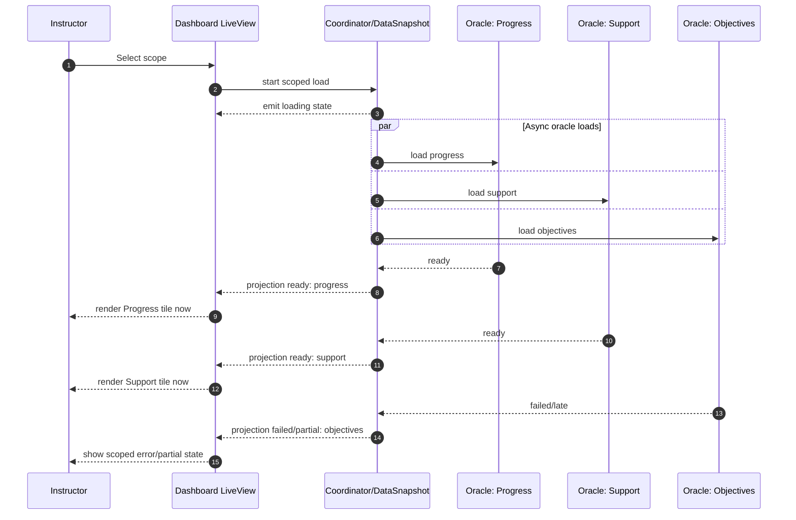
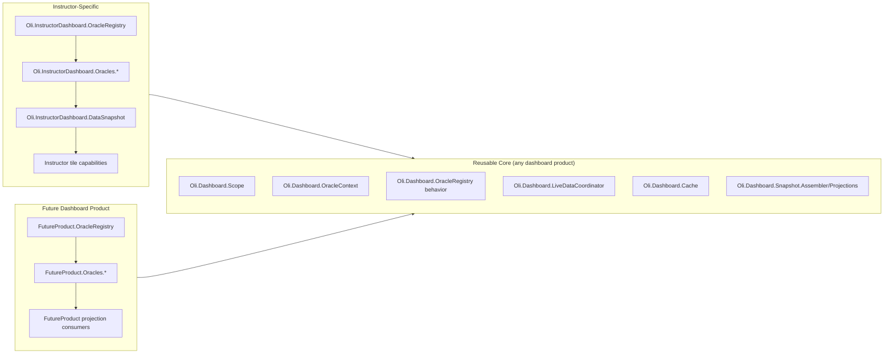
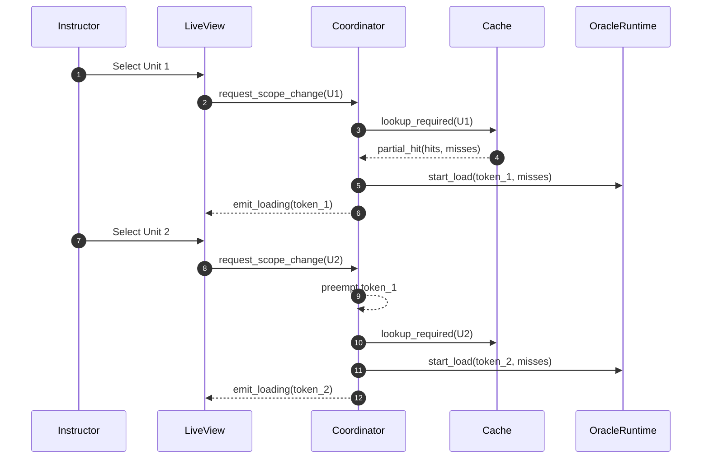
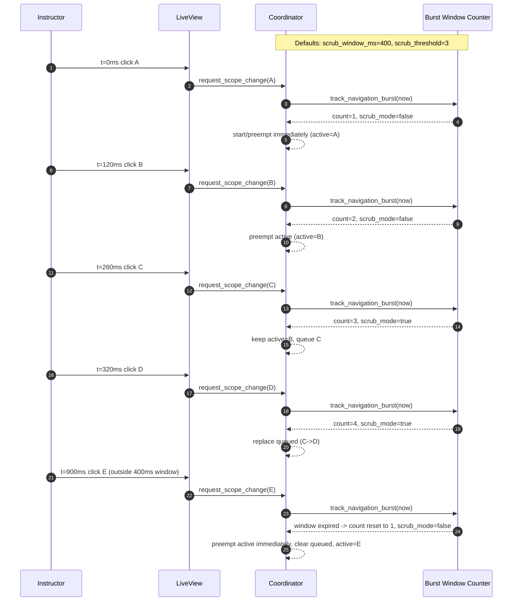
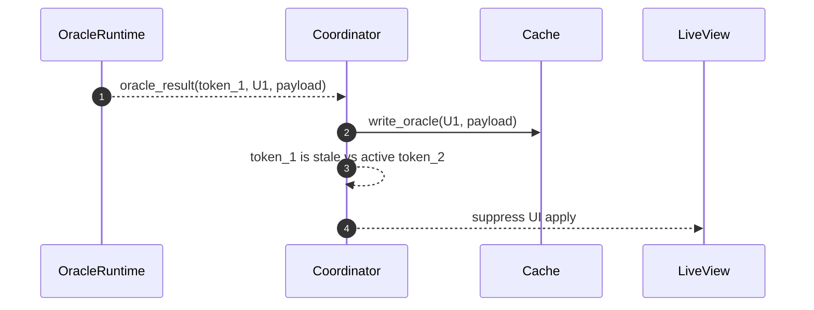
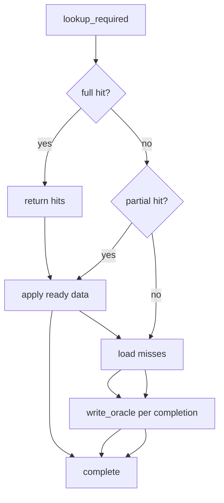
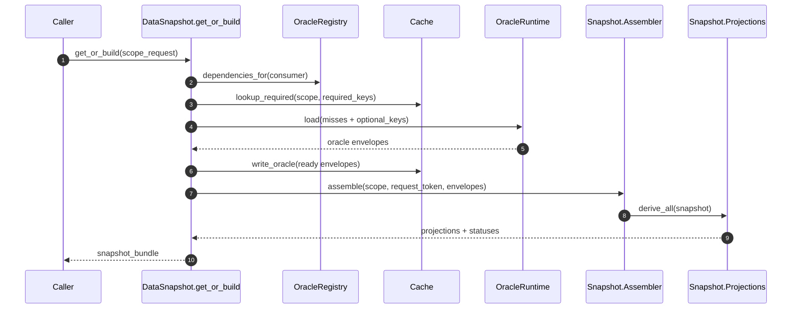
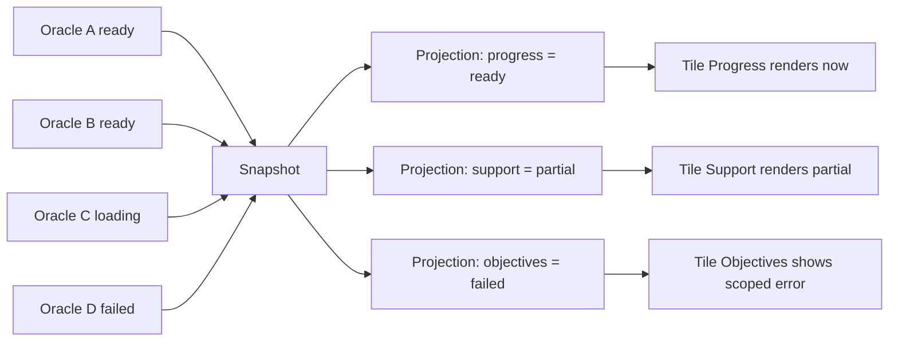
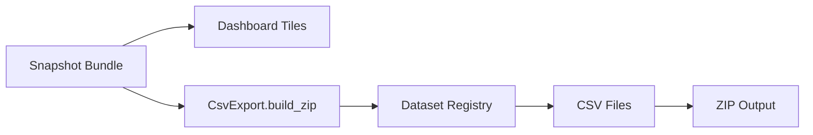
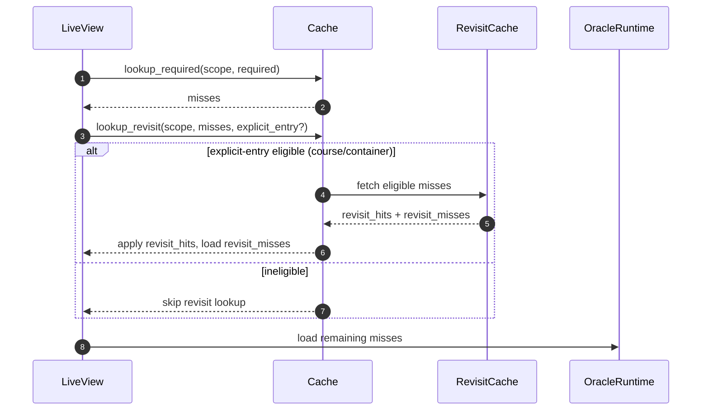

# Lane 1 Visual Guide

### Incremental Tile Rendering with Async Oracle Loading
Motivation: instructors should start seeing useful dashboard content quickly, not wait for every backend query to finish. Diagram: shows async oracle loading and capability-by-capability tile rendering as results arrive.

### Reusable Core vs Instructor-Specific Components
Motivation: today’s Instructor Dashboard investment should be reusable for future dashboard products instead of forcing a rewrite. Diagram: shows the separation between reusable core `Oli.Dashboard.*` modules and instructor-specific `Oli.InstructorDashboard.*` modules.

### Worked Example: Normal Clicks (Unit 1 -> Unit 2)
Motivation: normal navigation should feel immediate and always follow the instructor’s latest click. Diagram: shows `Unit 1 -> Unit 2` where the active request is preempted and the newest scope starts right away.

### Worked Example: Scrub Mode for Rapid Clicking
Motivation: rapid scrubbing (traversing multiple scopes) should not overwhelm DB/runtime work or cause UI thrash while still feeling responsive. Diagram: shows the timer-window mechanism (`scrub_window_ms`, default `400ms`) and threshold (`scrub_threshold`, default `3`) that switch behavior from immediate preempt to one-active/one-queued replacement, then reset after window expiry.

### Worked Example: Stale Results Still Help Future Loads
Motivation: stale responses must never corrupt current UI state, but completed work should still provide future performance benefit. A response is considered stale when it arrives after the user has already navigated to a different scope (so that token is no longer active). Diagram: shows stale-token UI suppression with safe late cache write for the original scope.

### Cache Read-Through Decision Path
Motivation: avoid recomputing data we already have and load only what is missing. Diagram: shows the full-hit / partial-hit / miss path and where runtime loading plus cache write-back happen.

### `DataSnapshot.get_or_build/2` Flow (Current Design)
Motivation: keep snapshot orchestration deterministic and simpler for this call mode. Diagram: shows current `get_or_build/2` synchronous read-through flow (dependency resolution, cache lookup, runtime for misses/optional, cache write-back, assemble, project).

### Incremental Rendering Without Global Blocking
Motivation: instructors should see ready information now instead of waiting for slow or failing capabilities. Diagram: shows ready/partial/failed projection states rendering independently without global blocking.

### One Data Source for UI and CSV
Motivation: dashboard numbers and exported CSV numbers must stay semantically consistent. Diagram: shows both UI tiles and CSV export consuming the same snapshot bundle and dataset registry so they derive from the same scoped data contract.

### Revisit Cache Eligibility
Motivation: revisit acceleration should be fast but controlled, not applied to every flow. Diagram: shows explicit-entry eligibility gating (`course`/`container`) before revisit hits are used and remaining misses go to runtime.

