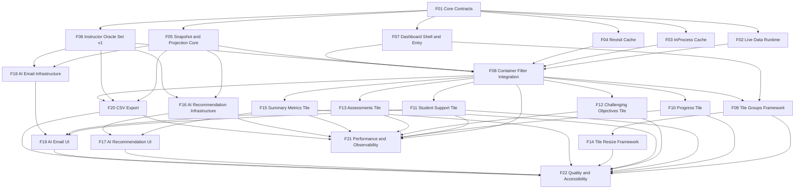

# Instructor Intelligent Dashboard - Development Plan

Last updated: 2026-02-10

This plan decomposes epic `MER-5198` into engineering features (implementation chunks), independent of the current Jira story boundaries. The goal is to make dependencies explicit so teams can start work in parallel where possible.

## Planning Principles

- Build from reusable infrastructure upward, then compose product-specific UI features.
- Keep data/runtime contracts stable before scaling tile and AI implementation.
- Treat dependencies as first-class so teams can identify immediate start points.
- Use Jira stories for traceability, not as engineering decomposition constraints.

## Feature Decomposition

| ID | Feature | Scope | Jira Trace (primary) | Depends On |
|---|---|---|---|---|
| F01 | Dashboard Core Contracts | `Oli.Dashboard` scope model, `OracleContext`, oracle behavior/interface, registry contracts | `MER-5248`, `MER-5266` | None |
| F02 | Live Data Runtime | `LiveDataCoordinator` semantics: one in-flight + one queued + stale token suppression | `MER-5248` | F01 |
| F03 | InProcess Cache | LiveView-local oracle cache, enrollment-tiered container limits, TTL, LRU | `MER-5248` | F01 |
| F04 | Revisit Cache | Node-wide per-user revisit cache, parameterized revisit-only use, short TTL | `MER-5248` | F01 |
| F05 | Snapshot Assembly and Projection Core | Assemble normalized snapshot from independent oracles; projection contracts | `MER-5248`, `MER-5266` | F01 |
| F06 | Instructor Oracle Set v1 | Instructor-specific oracle implementations: students, progress, proficiency, assessments, content structure, AI context projection | `MER-5251`-`MER-5254`, `MER-5249` | F01 |
| F07 | Dashboard Shell and Entry | Default dashboard entry behavior, base shell, mount lifecycle hooks | `MER-5246` | F01 |
| F08 | Container Filter Integration | Global container filter + params flow + runtime/cache wiring into LiveView | `MER-5248` | F02, F03, F04, F05, F06, F07 |
| F09 | Tile Groups Framework | Tile group layout (`Engagement`, `Content`), collapse/reorder, conditional rendering | `MER-5258` | F07, F08 |
| F10 | Progress Tile | Tile UX + dependencies + drill-through for progress domain | `MER-5251` | F08 |
| F11 | Student Support Tile | Student support list, filters, selection, activity states, drill-through hooks | `MER-5252`, `MER-5255`, `MER-5256` | F08 |
| F12 | Challenging Objectives Tile | Low-proficiency objective views + navigation behaviors | `MER-5253` | F08 |
| F13 | Assessments Tile | Completion/status/metrics/distribution + actions | `MER-5254` | F08 |
| F14 | Tile Resize Framework | Resizable tile interactions and non-overlap reflow | `MER-5259` | F09 |
| F15 | Summary Metrics Tile | Summary metric strip (non-AI behavior) and scoped updates | `MER-5249` | F08 |
| F16 | AI Recommendation Infrastructure | AI generation pipeline, regen, feedback ingestion pipeline, prompt/context contracts | `MER-5218`, `MER-5249`, `MER-5250` | F05, F06 |
| F17 | AI Recommendation UI | Summary tile AI presentation + feedback + regen interactions | `MER-5249`, `MER-5250` | F15, F16 |
| F18 | AI Email Infrastructure | Context-aware draft generation, tone/regeneration contract, send integration | `MER-5257` | F05, F06 |
| F19 | AI Email UI | Modal UX, recipient handling, tone controls, draft/send interactions | `MER-5257` | F11, F13, F18 |
| F20 | CSV Export | ZIP/CSV transform from snapshot, scoped export endpoint/flow | `MER-5266` | F05, F06, F08 |
| F21 | Performance and Observability Hardening | Perf budgets, telemetry, benchmark harness, query/runtime profiling | `MER-5248`, `MER-5266` | F08, F10, F11, F12, F13, F15, F16, F20 |
| F22 | Quality and Accessibility Hardening | Automated test review (unit/liveview/e2e), a11y pass, docs update | all | F09, F10, F11, F12, F13, F14, F15, F17, F19, F20 |

## Dependency Graph

## Suggested Execution Waves

1. Wave 0 - Start immediately (no dependencies)
- F01 Core Contracts

2. Wave 1 - Core runtime primitives
- F02 Live Data Runtime
- F03 InProcess Cache
- F04 Revisit Cache
- F05 Snapshot and Projection Core
- F06 Instructor Oracle Set v1
- F07 Dashboard Shell and Entry

3. Wave 2 - Integration backbone
- F08 Container Filter Integration
- F09 Tile Groups Framework

4. Wave 3 - Core product value
- F10 Progress Tile
- F11 Student Support Tile
- F12 Challenging Objectives Tile
- F13 Assessments Tile
- F15 Summary Metrics Tile
- F14 Tile Resize Framework

5. Wave 4 - AI and export surfaces
- F16 AI Recommendation Infrastructure
- F17 AI Recommendation UI
- F18 AI Email Infrastructure
- F19 AI Email UI
- F20 CSV Export

6. Wave 5 - Stabilization
- F21 Performance and Observability Hardening
- F22 Quality and Accessibility Hardening

## Parallel Start Guidance

After F01 is complete, separate teams can run in parallel on:
- Runtime: F02
- Caching: F03 and F04
- Snapshot/projections: F05
- Oracle implementations: F06
- Base shell: F07

After F08 is complete, tile teams can parallelize:
- F10, F11, F12, F13, F15

## Key Risks to Manage in Planning

- Overloading F06 (oracle set) if all domains are built serially.
- UI teams blocked if F08 integration contracts are unstable.
- AI UI churn if F16/F18 contracts are not frozen early.
- Perf regressions if F21 is deferred too long.

## Open Decisions for Refinement

- Final ownership split for F06 oracle domains across engineers.
- Whether F16 and F18 share a common internal AI service interface.
- Exact release slicing strategy (feature flags and staged rollouts) across Waves 3-5.
