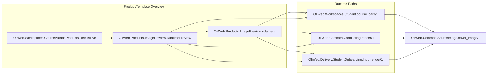

# Image Preview — Functional Design Document

## 1. Executive Summary
This design implements image preview by rendering the exact existing runtime UI components used by My Course, Course Picker, and Welcome, directly from Product/Template overview preview mode. Instead of creating new replacement component trees, Product preview delegates to `OliWeb.Workspaces.Student.course_card/1`, `OliWeb.Common.CardListing.render/1`, and `OliWeb.Delivery.StudentOnboarding.Intro.render/1` with preview adapters that provide valid assigns. This is the best approach because it maximizes parity, minimizes markup duplication, and avoids a second rendering system that can drift. Full route LiveViews are intentionally not embedded in Product preview because they require router/mount/session context and page-level behavior that is inappropriate for inline preview. The design introduces no schema changes, no migrations, and no background processes. The only code seam allowed is small preview-safe options on existing components where interactivity or runtime-only data access must be disabled/substituted. Cover image fallback remains canonical through `OliWeb.Common.SourceImage.cover_image/1`. Observability adds telemetry for preview context selection and render outcomes. Rollout is a standard deploy with strict regression tests proving runtime UI and Product preview UI are rendered through the same real component entry points.

## 2. Requirements & Assumptions
- Functional Requirements:
  - `FR-001`: Provide preview rendering for My Course, Course Picker, and Welcome contexts.
  - `FR-002`: Reuse canonical runtime templates/components across preview and runtime.
  - `FR-003`: Ensure destination runtime UIs and preview use the same rendering units.
  - `FR-004`: Preserve responsive behavior at supported breakpoints.
  - `FR-005`: Preserve fallback behavior for missing/invalid cover image data.
  - `FR-006`: Keep preview access restricted to authorized template-management users.
  - `FR-007`: Emit telemetry for preview context selection and preview render failures.
- Non-Functional Requirements:
  - Preview context switch p95 <= 400ms after initial page load.
  - Initial preview render p95 <= 700ms for standard template payloads.
  - No new N+1 query behavior during preview context switching.
  - No uncaught LiveView crashes when image data is missing/invalid.
  - WCAG 2.1 AA for preview selector controls and preview region semantics.
  - No PII in telemetry metadata.
- Explicit Assumptions:
  - Product/template record already contains sufficient image/title/description data for preview surfaces.
  - Product preview host remains `OliWeb.Workspaces.CourseAuthor.Products.DetailsLive`.
  - Existing author auth and product mount authorization remain unchanged.
  - Dynamic runtime fields not present in Product view (for example enrolled instructors, progress) can be represented using deterministic preview adapter values.

## 3. Torus Context Summary
- What we know:
  - `cover_image` fallback behavior is centralized in `OliWeb.Common.SourceImage.cover_image/1`.
  - Product preview host is `OliWeb.Workspaces.CourseAuthor.Products.DetailsLive.render/1`.
  - My Course, Course Picker, and Welcome all have reusable component boundaries already, so full LiveView embedding is not required.
- Inventory: My Course UI rendering
  - `OliWeb.Workspaces.Student.render/1` (`lib/oli_web/live/workspaces/student.ex`) loops sections and calls:
  - `OliWeb.Workspaces.Student.course_card/1` (same file), which renders the full card surface (image/background overlays, dates, title, instructors, progress, CTA arrow).
  - `OliWeb.Common.SourceImage.cover_image/1` for image URL/fallback.
  - `Oli.Delivery.Sections.get_instructors_for_section/1` currently called inside `course_card/1` for runtime instructor labels.
  - `OliWeb.Common.FormatDateTime.to_formatted_datetime/3` for date labels.
- Inventory: Course Picker UI rendering
  - `OliWeb.Delivery.NewCourse.render_step(:select_source, assigns)` (`lib/oli_web/live/new_course/new_course.ex`) mounts:
  - `OliWeb.Delivery.NewCourse.SelectSource.render/1` (`lib/oli_web/live/new_course/select_source.ex`) which renders:
  - `OliWeb.Common.Listing.render/1` (`lib/oli_web/live/common/listing.ex`) and, in card mode:
  - `OliWeb.Common.CardListing.render/1` (`lib/oli_web/live/common/card_listing.ex`) which renders the full picker card surface (image, title, description, payment badge, created date, selection styling).
  - `OliWeb.Delivery.NewCourse.TableModel.render_payment_column/3` for payment badge text.
- Inventory: Welcome UI rendering
  - Route `/sections/:section_slug/welcome` maps to `OliWeb.Delivery.StudentOnboarding.Wizard`.
  - `OliWeb.Delivery.StudentOnboarding.Wizard.render_step/1` with intro step calls:
  - `OliWeb.Delivery.StudentOnboarding.Intro.render/1` (`lib/oli_web/live/delivery/student_onboarding/intro.ex`), which renders full intro preview surface (hero image, heading, expectation bullets).
  - `OliWeb.Delivery.StudentOnboarding.Wizard.has_required_survey/1` and `has_explorations/1` drive conditional bullet rows.
- Unknowns to confirm:
  - Exact placeholder text/value policy for preview-only dynamic fields (instructors/progress/payment badge/date).
  - Whether preview should be strictly non-interactive (recommended) or partially interactive.
  - Final placement/layout of preview controls in Product overview.

## 4. Proposed Design
### 4.1 Component Roles & Interactions
Use existing real runtime components directly as the rendering source for Product preview.

- Product preview renderer (new helper component module): `OliWeb.Products.ImagePreview.RuntimePreview`
  - Responsibility: choose context and call existing runtime components with adapted assigns.
- Existing runtime components reused directly:
  - My Course: `OliWeb.Workspaces.Student.course_card/1`
  - Course Picker: `OliWeb.Common.CardListing.render/1`
  - Welcome: `OliWeb.Delivery.StudentOnboarding.Intro.render/1`
- Product preview adapters (new module): `OliWeb.Products.ImagePreview.Adapters`
  - `my_course_assigns/2`
  - `course_picker_assigns/2`
  - `welcome_assigns/2`
  - These map product/template data into the exact assign shape each real component expects.
- Minimal preview-safe seams on existing components (only where needed):
  - My Course `course_card/1`: support preview-provided instructors and disabled interaction to avoid runtime DB/event dependencies.
  - Course Picker `CardListing.render/1`: support non-interactive preview mode (no source selection click handling).
  - Welcome `Intro.render/1`: no seam required beyond adapter data shaping.

### 4.2 State & Message Flow
1. Product details page mounts with existing product/template assigns.
2. Page initializes `preview_context` (`:my_course | :course_picker | :welcome`).
3. User changes preview context via selector event.
4. LiveView updates `preview_context` assign.
5. `RuntimePreview` calls the corresponding adapter function for that context.
6. Adapter returns assigns tailored for the real runtime component.
7. Product preview renders the real runtime component with preview-safe options.
8. Telemetry emits context selection and render outcome.

No PubSub, no background job, and no new stateful process is required.

### 4.3 Supervision & Lifecycle
- No new OTP supervision tree entries.
- Lifecycle remains within existing Product details LiveView render cycle.
- Failure isolation:
  - Unknown context falls back to `:my_course`.
  - Missing/invalid image still resolves to default via `SourceImage.cover_image/1`.
  - Preview adapter validation errors return an explicit fallback preview card rather than crashing.

### 4.4 Alternatives Considered
- Build brand-new replacement components for preview:
  - Rejected: introduces duplicate render paths and long-term drift risk.
- Embed full route LiveViews in Product preview:
  - Rejected: requires route/mount/session behavior, has heavy side effects, and is not suitable for inline preview.
- Screenshot/composite approach:
  - Rejected: brittle and does not guarantee parity.
- Decision rationale (why selected approach is best):
  - Calls real runtime component entry points directly.
  - Keeps markup single-sourced where parity matters.
  - Limits change to adapter and small preview seams rather than broad refactor.

## 5. Interfaces
### 5.1 HTTP/JSON APIs
- No new HTTP endpoints.
- No JSON contract changes.

### 5.2 LiveView
- Product details LiveView (`OliWeb.Workspaces.CourseAuthor.Products.DetailsLive`):
  - Add assign: `:preview_context`.
  - Add event: `"select_preview_context"`.
  - Add preview render block invoking `RuntimePreview`.
- `RuntimePreview` component contract:
  - Inputs: `product`, `ctx`, `preview_context`.
  - Behavior: delegate to adapters and then render one of existing runtime components.
- Adapter contracts:
  - `my_course_assigns(product, ctx)` returns map containing section-like data and preview options (`interactive?: false`, preview instructors/progress).
  - `course_picker_assigns(product, ctx)` returns one-row model and non-interactive selection handler.
  - `welcome_assigns(product, ctx)` returns section-like map with survey/exploration booleans and title/image.
- Existing component seams (minimal, backward-compatible):
  - `OliWeb.Workspaces.Student.course_card/1`: optional attrs for preview instructor list and interaction disable.
  - `OliWeb.Common.CardListing.render/1`: optional non-interactive mode.

### 5.3 Processes
- None.

## 6. Data Model & Storage
### 6.1 Ecto Schemas
- No schema changes.
- No migrations.

### 6.2 Query Performance
- Preview context switching must not trigger new per-switch DB queries.
- My Course preview must not call runtime instructor queries when preview instructors are provided.
- Course Picker preview should render from adapter-provided in-memory row model.

## 7. Consistency & Transactions
- No new transaction boundaries.
- Existing product image update flow remains unchanged.
- Preview render always uses same runtime components as real surfaces, with adapter-provided data where runtime-only data is unavailable.

## 8. Caching Strategy
- No new cache layers.
- Keep existing static fallback image behavior.
- Browser/CDN caching for image URLs remains unchanged.

## 9. Performance and Scalability Plan
### 9.1 Budgets
- Initial preview render p95 <= 700ms.
- Context switch p95 <= 400ms.
- No significant memory growth beyond preview context assign and adapter payloads.

### 9.2 Hotspots & Mitigations
- Hotspot: hidden runtime dependencies inside reused components.
  - Mitigation: add explicit preview seams for interactivity and runtime data access.
- Hotspot: adapter drift from runtime contracts.
  - Mitigation: contract tests for adapters against component-required assigns.
- Hotspot: preview mode accidentally triggering navigation/events.
  - Mitigation: non-interactive preview mode and explicit no-op click handling.

## 10. Failure Modes & Resilience
- Invalid preview context:
  - Fallback to `:my_course` and log warning metadata.
- Missing image:
  - Render default image via `SourceImage.cover_image/1`.
- Adapter returns invalid assign shape:
  - Render safe fallback preview block and emit error telemetry.
- Unauthorized access to Product details:
  - Existing auth/mount protections remain authoritative.

## 11. Observability
- Telemetry events:
  - `[:oli, :template, :image_preview, :context_selected]` with context metadata.
  - `[:oli, :template, :image_preview, :rendered]` with duration/result metadata.
- AppSignal tags:
  - `feature=image_preview`, `surface=product_overview`, `context=<context>`.
- Logging:
  - Structured warnings for invalid context and adapter-shape failures.

## 12. Security & Privacy
- AuthN/AuthZ:
  - Preview remains inside authenticated, authorized Product details surface.
- Tenant isolation:
  - Preview data comes from mounted product context; no cross-tenant lookup path added.
- PII:
  - Preview telemetry excludes user identifiers and freeform sensitive payloads.
- Auditability:
  - Existing request logs plus preview telemetry counters.

## 13. Testing Strategy
- Inventory/contract tests:
  - Verify Product preview renders through real runtime component entry points:
    - `OliWeb.Workspaces.Student.course_card/1`
    - `OliWeb.Common.CardListing.render/1`
    - `OliWeb.Delivery.StudentOnboarding.Intro.render/1`
- Component tests:
  - My Course preview mode: non-interactive rendering, no runtime instructor query path, correct image/title/date/progress shell.
  - Course Picker preview mode: non-interactive card list rendering with product data.
  - Welcome preview: full intro content and conditional bullet behavior.
- LiveView tests:
  - Product details context selector switches preview surfaces.
  - Missing cover image renders default image in each context.
  - Unauthorized users cannot access preview controls.
- Regression tests:
  - Existing runtime tests for student workspace, new course selection, and product details continue to pass.
- Observability tests:
  - Assert telemetry emitted for context selection and render outcome.
- Manual:
  - Visual parity checks (desktop/tablet/mobile) between runtime surfaces and Product preview.

## 14. Backwards Compatibility
- Existing runtime routes and page composition remain unchanged.
- Existing image upload/edit behavior in Product details remains unchanged.
- Runtime components keep default behavior when preview options are not provided.
- Preview uses runtime components directly, reducing future parity drift risk.

## 15. Risks & Mitigations
- Risk: Existing components are not preview-safe without small API seams.
  - Mitigation: add narrowly-scoped optional attrs with safe defaults.
- Risk: Adapter placeholder data may mislead users.
  - Mitigation: document deterministic placeholder policy and visually indicate preview context.
- Risk: Component changes for preview regress runtime interaction.
  - Mitigation: runtime regression test suite as hard gate.

## 16. Open Questions & Follow-ups
- Confirm exact placeholder policy for dynamic fields in preview (instructors/progress/date/payment badge).
- Confirm whether preview should show a subtle "Preview Data" hint for fields not sourced from live runtime enrollment state.
- Confirm final responsive breakpoint matrix for parity sign-off.

## 17. References
- `docs/epics/product_overhaul/image_preview/prd.md`
- `docs/epics/product_overhaul/prd.md`
- `docs/epics/product_overhaul/overview.md`
- `lib/oli_web/live/workspaces/student.ex`
- `lib/oli_web/live/common/card_listing.ex`
- `lib/oli_web/live/new_course/select_source.ex`
- `lib/oli_web/live/new_course/new_course.ex`
- `lib/oli_web/live/common/listing.ex`
- `lib/oli_web/live/delivery/student_onboarding/wizard.ex`
- `lib/oli_web/live/delivery/student_onboarding/intro.ex`
- `lib/oli_web/common/source_image.ex`
- `lib/oli_web/live/workspaces/course_author/products/details_live.ex`
- `lib/oli_web/live/new_course/table_model.ex`
