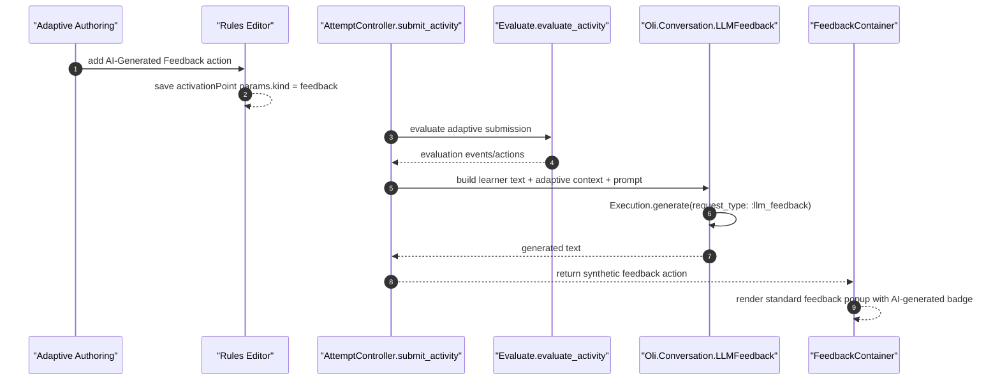

# LLM Feedback - Functional Design Document

## 1. Executive Summary
This design adds synchronous, inline LLM feedback to adaptive trap-state evaluation without introducing a new delivery endpoint or persistence model. Authors configure the experience as a trap-state activation-point variant stored as `type: "activationPoint"` with `params.kind: "feedback"`. In student delivery, `AttemptController.submit_activity/2` continues to call the existing evaluation pipeline, then performs a post-evaluation transform that looks for the first matching feedback-kind activation point, builds adaptive screen context with `AdaptivePageContextBuilder`, loads the section's `:student_dialogue` GenAI config, and calls `Execution.generate/5`. On success, the controller replaces that activation-point action with a synthetic standard `feedback` action whose feedback model carries `custom.aiGenerated`. The existing popup flow then renders the message with a visible `AI-generated` label. Existing DOT trap-state activation points remain unchanged because only `kind: "feedback"` is transformed. MVP is gated by a new scoped feature flag and supports only `janus-input-text` and `janus-multi-line-text` submissions.

## 2. Requirements & Assumptions
- Functional requirements summary:
  - FR-001: expose authoring only in supported trigger-enabled, rollout-enabled contexts.
  - FR-002: synchronously generate feedback from author prompt, learner text, and adaptive page context.
  - FR-003: render generated feedback in the standard popup with AI attribution.
  - FR-004: fail closed for unsupported input, disabled AI, or provider/config errors.
  - FR-005: preserve existing DOT trap-state activation for non-feedback activation points.
  - FR-006: use scoped rollout and dedicated telemetry tagging.
- FR / AC traceability map:

| Requirement | Acceptance criteria | Primary design sections | Verification anchors |
|---|---|---|---|
| FR-001 | AC-001, AC-002 | 4.1, 5.2 | 13 |
| FR-002 | AC-003, AC-004 | 4.1, 4.2, 5.1 | 13 |
| FR-003 | AC-005 | 4.1, 5.1 | 13 |
| FR-004 | AC-006, AC-007 | 4.1, 10 | 13 |
| FR-005 | AC-008 | 4.1, 14 | 13 |
| FR-006 | AC-009, AC-010 | 4.1, 11, 12 | 13 |
- Non-functional targets:
  - No new endpoint, database table, or background job.
  - At most one synchronous generation call per learner submission in MVP.
  - Do not trust client-authored prompts or emit raw learner text in telemetry.
- Explicit assumptions:
  - Preview mode is out of scope and must not accidentally invoke DOT for `kind: "feedback"` actions.
  - Existing `:student_dialogue` model routing is sufficient for MVP generated feedback.

## 3. Torus Context Summary
- What we know:
  - Trap-state Rules Editor already supports distinct `feedback` and `activationPoint` actions in `assets/src/apps/authoring/components/AdaptivityEditor`.
  - Adaptive student submit requests already flow through `lib/oli_web/controllers/api/attempt_controller.ex` and `lib/oli/delivery/attempts/activity_lifecycle/evaluate.ex`.
  - Adaptive trap-state DOT invocation is currently triggered client-side from `assets/src/apps/delivery/store/features/adaptivity/actions/triggerCheck.ts`.
  - `lib/oli/conversation/adaptive_page_context_builder.ex` already produces adaptive screen context from an activity attempt GUID.
  - `lib/oli/gen_ai/feature_config.ex` and `lib/oli/gen_ai/execution.ex` already provide section-scoped service config lookup and synchronous completion execution.
  - `assets/src/apps/delivery/layouts/deck/DeckLayoutFooter.tsx` strips actions down to `params.feedback`, so attribution metadata must live on the feedback model itself.
  - `lib/oli/scoped_feature_flags/defined_features.ex` is the centralized source of scoped rollout definitions.
- Unknowns to confirm:
  - Whether future work should support author preview or multiple generated-feedback actions in a single submission.

## 4. Proposed Design
### 4.1 Component Roles & Interactions
- Rollout and authoring bootstrap:
  - Add scoped feature `llm_feedback` in `Oli.ScopedFeatureFlags.DefinedFeatures` with authoring and delivery scope.
  - Extend adaptive authoring bootstrap state with a boolean such as `allowLlmFeedback`, distinct from the existing `allowTriggers`.
  - Rules Editor shows the action only when:
    - trigger capability is enabled,
    - `llm_feedback` authoring rollout is enabled for the project,
    - the current adaptive screen includes at least one supported text-entry part (`janus-input-text` or `janus-multi-line-text`).
- Authoring data model:
  - Extend `ActivationPointActionParams` in `assets/src/apps/authoring/types.ts` with `kind?: "dot" | "feedback"`.
  - Add `ActionLLMFeedbackEditor.tsx` as a sibling to `ActionActivationPointEditor.tsx`.
  - `AdaptivityEditor.tsx` adds a dedicated `AI-Generated Feedback` action that persists:
    - `type: "activationPoint"`
    - `params.prompt: string`
    - `params.kind: "feedback"`
  - Preserve the current activation-point UI and persistence path for DOT (`kind: "dot"` or `nil`).
  - Limit authored rules to one feedback-kind activation point per rule.
- Server-side orchestration:
  - Add `lib/oli/conversation/llm_feedback.ex` as the synchronous orchestration module.
  - Add a helper that normalizes supported submitted text responses from the current `part_inputs` by resolving the submitted part attempts back to their part definitions and keeping only supported text-entry parts.
  - In `AttemptController.submit_activity/2`, after `evaluate_activity/4` returns successfully and before `json/2`, call a transformer such as `maybe_generate_llm_feedback/6`.
  - The transformer:
    - loads the current section and learner id,
    - verifies section rollout plus existing `assistant_enabled` and `triggers_enabled`,
    - finds the first evaluation action where `type == "activationPoint"` and `params.kind == "feedback"`,
    - builds adaptive context with `AdaptivePageContextBuilder.build(activity_attempt_guid, section.id, user_id)`,
    - loads the `:student_dialogue` service config,
    - calls `Execution.generate/5` with `request_type: :llm_feedback`,
    - replaces that action with a synthetic `feedback` action built from the returned text.
  - If no supported learner text can be normalized, or any gate fails, the transform drops the feedback-kind activation-point action and leaves the rest of the evaluation response intact.
- Synthetic feedback model:
  - Build the server-generated popup payload in the same shape used by authored feedback actions:
    - `type: "feedback"`
    - `params.feedback.custom.aiGenerated = true`
    - `params.feedback.custom.aiLabel = "AI-generated"`
    - `params.feedback.partsLayout` containing a minimal text-flow part with the generated message
  - Reuse the standard feedback defaults for width, height, and button labels so popup styling remains consistent.
- Delivery compatibility:
  - Because the controller returns a normal feedback action, existing popup state handling in `DeckLayoutFooter` remains the main display path.
  - Update `triggerCheck.ts` so client-side trap-state DOT invocation ignores activation points where `params.kind == "feedback"`. This prevents preview mode and any untransformed client-side paths from accidentally opening DOT for LLM-feedback rules.
  - Update `FeedbackRenderer.tsx` to render a small attribution badge when `feedback.custom.aiGenerated` is true.

### 4.2 State & Message Flow

### 4.3 Supervision & Lifecycle
- No new OTP supervisors or background workers are needed.
- Generation is request-scoped and synchronous inside the submit request after evaluation is already complete.
- The feature does not alter persistence timing for attempts, scores, or rule evaluation.

### 4.4 Alternatives Considered
- Add a top-level `llm_feedback` field to the response:
  - Rejected because it would fork the popup pipeline and duplicate feedback state handling already present in delivery.
- Generate feedback client-side:
  - Rejected because the server should own prompt trust, screen context assembly, and provider access.
- Fold the feature into the existing static `Show Feedback` editor:
  - Rejected for MVP because the existing trigger seam already uses `activationPoint`, and preserving that seam keeps legacy DOT behavior isolated.

## 5. Interfaces
### 5.1 HTTP / JSON APIs
- No new route is introduced.
- `submit_activity` response contract changes for this feature:
  - feedback-kind activation points are not returned to delivery,
  - instead the response includes a standard `feedback` action whose feedback model carries AI attribution metadata.
- Activation points with `kind: "dot"` or no `kind` remain unchanged.

### 5.2 LiveView / Bootstrap Contracts
- Extend authoring bootstrap data to carry rollout state for `llm_feedback` in addition to the existing trigger capability boolean.
- No new student LiveView event contract is required.

### 5.3 Processes
- No GenServer contract changes.
- Provider routing, breakers, and telemetry continue through existing `Execution.generate/5`.

## 6. Data Model & Storage
### 6.1 Stored Authoring JSON
- Extend trap-state activation-point JSON:
  - `params.prompt: string`
  - `params.kind?: "dot" | "feedback"`
- No Ecto schema or migration changes are required.

### 6.2 Response-Only Feedback Metadata
- Generated popup payload adds response-only feedback metadata in `feedback.custom`:
  - `aiGenerated: true`
  - `aiLabel: "AI-generated"`
- This metadata is not treated as a persisted authored page model change.

## 7. Consistency & Transactions
- Activity attempt evaluation and persistence continue to happen in `Evaluate` / `ApplyClientEvaluation` before the controller-level transform runs.
- Generated feedback affects only the response actions delivered to the client; it does not change saved attempt scores or authored adaptive content.
- If generation fails after evaluation succeeds, the request still returns success with the remaining actions.

## 8. Caching Strategy
- No new feature-specific cache is required.
- Reuse existing `FeatureConfig.load_for/2` lookup and the adaptive-context builder's current query path.
- MVP intentionally avoids multiple LLM calls per submission to keep the hot path bounded.

## 9. Performance and Scalability Posture (Telemetry / AppSignal Only)
### 9.1 Budgets
- One synchronous completion request at most for the first matching feedback-kind action in a submission.
- No new N+1 query pattern should be introduced while normalizing supported part inputs.

### 9.2 Hotspots & Mitigations
- Hotspot: submit latency increases when provider responses are slow.
  - Mitigation: first-match-only MVP, existing routing / breaker infrastructure, fail-closed behavior.
- Hotspot: repeated context assembly overhead.
  - Mitigation: reuse `AdaptivePageContextBuilder` and keep context generation request-scoped.

## 10. Failure Modes & Resilience
- Unsupported learner input or no text response found:
  - Behavior: skip generation and do not emit generated feedback.
- Rollout disabled, section AI disabled, or trigger capability disabled:
  - Behavior: feature hidden in authoring and inactive in delivery.
- Missing `:student_dialogue` config or provider error:
  - Behavior: omit generated feedback, log/telemetry the failure, and preserve other evaluated actions.
- Preview mode:
  - Behavior: no synchronous generation; client-side trap-state invocation must ignore `kind: "feedback"` so DOT is not opened by mistake.

## 11. Observability
- Emit `request_type: :llm_feedback` for provider telemetry.
- Tag rollout stage using the existing feature-gate helpers where applicable.
- Count success / failure / latency separately from DOT chat activity.

## 12. Security & Privacy
- Prompt text must come from server-resolved authored rules, not the client payload.
- Learner text is used for generation but must not be logged or copied into telemetry fields.
- The feature reuses existing section + learner scoping and does not create new cross-section lookup behavior.

## 13. Testing Strategy
- Frontend:
  - Rules Editor tests for action visibility, persistence, and duplicate prevention.
  - Delivery popup rendering test for `AI-generated` attribution.
  - `triggerCheck` regression test confirming `kind: "feedback"` does not invoke DOT.
- Backend:
  - Unit tests for learner-response normalization and prompt message construction in `Oli.Conversation.LLMFeedback`.
  - Controller tests for response transformation, rollout gating, failure handling, and first-match-only behavior.
  - Regression tests confirming legacy trap-state DOT activation still behaves as before.

## 14. Backwards Compatibility
- Existing authored feedback actions remain unchanged.
- Existing trap-state activation points continue to drive DOT unless explicitly marked with `kind: "feedback"`.
- Adaptive authoring projects or delivery sections without rollout enabled see no behavior change.
- Preview mode remains effectively unchanged in MVP.

## 15. Risks & Mitigations
- Risk: action transformation could accidentally remove other rule actions.
  - Mitigation: transform only the specific matching feedback-kind activation point and preserve event shape otherwise.
- Risk: authoring and delivery rollout gates could drift.
  - Mitigation: use the same named feature flag with explicit project and section checks.
- Risk: synthetic feedback model diverges from authored feedback expectations.
  - Mitigation: mirror the existing feedback JSON shape and keep popup rendering on the normal path.

## 16. Open Questions & Follow-ups
- Should a future iteration support author preview using a mock provider or a real section-scoped call?
- Should future work allow more than one generated-feedback rule per submission?
- Should authoring eventually let authors tune generation style beyond a single prompt field?

## 17. References
- `docs/exec-plans/current/epics/adaptive_page_improvements/llm_feedback/prd.md`
- `docs/exec-plans/current/epics/adaptive_page_improvements/llm_feedback/requirements.yml`
- `docs/exec-plans/current/epics/adaptive_page_improvements/llm_feedback/informal.md`
- `MER-4961.md`
- `docs/exec-plans/current/epics/adaptive_page_improvements/plan.md`

## Decision Log

### 2026-03-31 - Initial design capture for MER-4961
- Change: Added the missing FDD describing rollout gating, authoring data-model changes, controller-side response transformation, synchronous GenAI orchestration, and popup attribution handling.
- Reason: `MER-4961` had only informal notes and a local implementation sketch, but no durable technical design artifact.
- Evidence: `docs/exec-plans/current/epics/adaptive_page_improvements/llm_feedback/informal.md`, `MER-4961.md`, `assets/src/apps/delivery/store/features/adaptivity/actions/triggerCheck.ts`, `assets/src/apps/delivery/layouts/deck/components/FeedbackRenderer.tsx`, `lib/oli_web/controllers/api/attempt_controller.ex`
- Impact: Provides the architecture and boundary decisions needed for implementation planning and requirements traceability.
