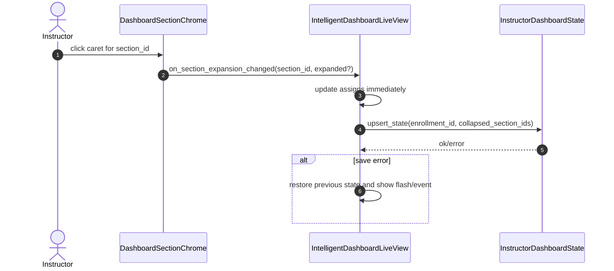
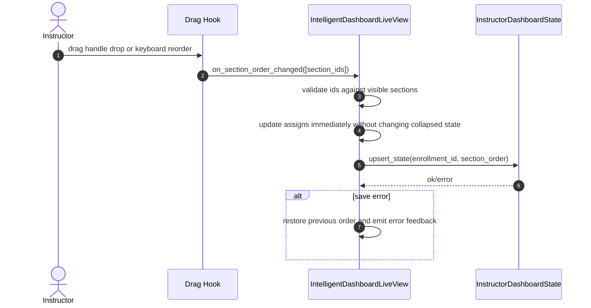

# Dashboard Tile Chrome (Instructor-Section Layout Chrome) — Functional Design Document

## 1. Executive Summary
This feature delivers reusable section chrome for instructor dashboard surfaces so dashboards can group tiles into titled, collapsible, reorderable sections without coupling that behavior to specific tiles. The immediate consumer is the Intelligent Dashboard `Engagement` and `Content` grouping in `Insights > Dashboard`, but the chrome itself should live at the broader `instructor_dashboard` component layer rather than inside `intelligent_dashboard`. The design keeps section eligibility and tile selection in dashboard-specific composition modules, while the shared chrome owns header rendering, collapse state UI, reorder affordances, and accessibility semantics. Persistence follows Darren's Jira guidance and the resolved product decision for this feature: layout state is stored per instructor enrollment (`instructor-section`), not section-shared, so each instructor's dashboard layout is restored independently within a section. The simplest safe implementation extends the existing `instructor_dashboard_states` record keyed by `enrollment_id` instead of introducing a new table or process. Reorder and toggle actions are handled in LiveView with a thin client hook for pointer drag interactions and explicit keyboard-triggerable reorder behavior, keeping state transitions server-authoritative and easy to test. Performance risk is low because persistence is a single-row enrollment update and no analytics reload is required for layout-only changes. The main risks are a11y drift in drag behavior, overfitting the chrome to Intelligent Dashboard, and spec drift around persistence scope; this design addresses those through clearer module boundaries, explicit event contracts, and deterministic enrollment-scoped storage. Telemetry focuses on toggle/reorder/save success and failure, not load testing.

## 2. Requirements & Assumptions
- Functional Requirements:
  - `FR-001` / `AC-001`: provide reusable tile-agnostic section chrome that renders arbitrary section children without importing instructor-specific tile modules.
  - `FR-002` / `AC-002`: sections default expanded and emit deterministic expansion callbacks when toggled.
  - `FR-003` / `AC-003`: sections support drag reorder with immediate visual update and callback emission on drop.
  - `FR-004` / `AC-004`: order and collapse state persist at `instructor-section` scope and restore for the same instructor enrollment across refreshes and scope changes.
  - `FR-006` / `AC-005`: Intelligent Dashboard computes tile eligibility before chrome render, including omitting `Content` when both content tiles are ineligible.
  - `FR-007` / `AC-006`: zero-tile sections are omitted and single-tile sections render full-width while retaining section controls.
  - `FR-008` / `AC-007`: reorder remains section-level only and rejects nested/cross-section invalid positions.
  - `FR-009` / `AC-008`: reordering preserves expansion state and must not auto-collapse a section.
- Non-Functional Requirements:
  - Writes are authorized only for instructors/admins with an instructor enrollment in the target section.
  - Layout-only interactions should acknowledge within the dashboard interaction posture already established for the epic; persistence is a single-row update with no oracle reload requirement.
  - Accessibility must satisfy WCAG 2.1 AA for focus order, semantic controls, and absence of hidden focusable artifacts for omitted sections.
  - Observability is limited to the minimal instrumentation already called for in the PRD: layout-save failure count and restore failure count.
- Explicit Assumptions:
  - Darren's Jira comment is authoritative for persistence scope and overrides the earlier section-shared wording in the current PRD.
  - The current reusable need is at the `instructor_dashboard` layer, not globally across unrelated dashboard families.
  - Figma hover/drop visuals will be implemented within existing design tokens/CSS patterns and do not require a separate rendering runtime.
  - Section ids remain stable string keys such as `engagement` and `content`.
- Assumption Risks:
  - If product later wants section-shared layout instead of instructor-section, storage semantics will need a migration and merge policy.
  - If future dashboards outside instructor delivery need the same chrome, the component may later move higher than `instructor_dashboard`.

## 3. Torus Context Summary
- What we know:
  - `docs/exec-plans/current/epics/intelligent_dashboard/dashboard_ui_composition.md` currently places the reusable chrome under `intelligent_dashboard`, but its own responsibility statement describes a dashboard-generic wrapper; that boundary is too narrow for actual reuse.
  - `lib/oli_web/components/delivery/instructor_dashboard/intelligent_dashboard/dashboard_section_chrome.ex` is a placeholder HEEx component with only `id`, `title`, and `expanded`.
  - `lib/oli_web/components/delivery/instructor_dashboard/intelligent_dashboard/tile_groups/engagement_section.ex` and `lib/oli_web/components/delivery/instructor_dashboard/intelligent_dashboard/tile_groups/content_section.ex` already model section-specific composition, which is the right place for eligibility filtering and tile ordering.
  - `lib/oli_web/live/delivery/instructor_dashboard/intelligent_dashboard_tab.ex` already persists `last_viewed_scope` by instructor enrollment through `Oli.InstructorDashboard.upsert_state/2`.
  - `lib/oli/instructor_dashboard/instructor_dashboard_state.ex` provides an existing `instructor_dashboard_states` table keyed by `enrollment_id`, which is the natural persistence anchor for additional instructor-section dashboard preferences.
  - The frontend already includes reorder prior art and keyboard reorder handling in `assets/src/components/common/DraggableColumn.tsx`, but the current Intelligent Dashboard surface is HEEx/LiveView-based, so a thin hook is preferable to moving chrome composition into React.
- Unknowns to confirm:
  - Final screen-reader announcement copy for drag lifecycle if the team chooses aria-live messaging beyond baseline button labeling and reorder-result feedback.

## 4. Proposed Design
### 4.1 Component Roles & Interactions
Shared instructor-dashboard chrome:

| Module | Responsibility |
| --- | --- |
| `OliWeb.Components.Delivery.InstructorDashboard.DashboardSectionChrome` | Reusable section wrapper for title, caret, drag handle, DOM ids/data attrs, collapsed state rendering, and accessibility semantics. |
| `assets/src/hooks/dashboard_section_chrome.ts` + `assets/src/hooks/index.ts` registration | Thin client hook for pointer drag/drop ordering and client-side drop feedback; emits ordered section ids back to LiveView. |

Intelligent Dashboard composition:

| Module | Responsibility |
| --- | --- |
| `...IntelligentDashboard.Shell` | Orders visible sections, passes persisted expansion/order state into section components, receives layout events, and reassigns rendered state. |
| `...TileGroups.EngagementSection` | Produces the `engagement` section definition with eligible engagement tiles only. |
| `...TileGroups.ContentSection` | Produces the `content` section definition after content eligibility checks; omits the section entirely when no eligible tiles remain. |
| `Oli.InstructorDashboard` / `InstructorDashboardState` | Persists and restores instructor-section layout preferences by `enrollment_id`. |

Recommended file placement:
- Move the reusable chrome module from `lib/oli_web/components/delivery/instructor_dashboard/intelligent_dashboard/dashboard_section_chrome.ex` to `lib/oli_web/components/delivery/instructor_dashboard/dashboard_section_chrome.ex`.
- Keep `shell.ex`, `tile_groups/*`, and `tiles/*` under `intelligent_dashboard` because those are product-specific composition units.
- Add the browser hook as a standalone file under `assets/src/hooks/` and register it in `assets/src/hooks/index.ts`, following the existing hook organization pattern used by the rest of the app.
- Follow the existing Remix drag/drop approach already used by LiveView surfaces in Torus (`assets/src/hooks/dragdrop.ts` + `remix_section.ex`) rather than introducing a new JS drag-and-drop library in this iteration.

Recommended runtime contract:
- Section definitions passed from dashboard composition into shell contain:
  - `id`
  - `title`
  - `expanded`
  - `tiles`
- Chrome callbacks emitted upward:
  - `on_section_expansion_changed(section_id, expanded?)`
  - `on_section_order_changed(new_order)`

Layout derivation rule:
- `full-width single tile` is derived, not stored: if `length(tiles) == 1`, the section renders that tile full-width.
- `tile_count` may be computed locally by the view when convenient, but it is not a separate source-of-truth field in the section contract.

Design-backed interaction details from Jira-linked Figma:
- The section chrome has four explicit visual variants for each section: `Open Default`, `Open Move`, `Closed/Closed Default`, and `Closed Move`.
- Hover/focus on the drag affordance shows a small tooltip labeled `Move`.
- The drag affordance in the design is the three-dot handle only; the current design does not include separate up/down arrow controls.
- Drag/drop mocks show a visible insertion/drop surface and a dragged-card state, so implementation should preserve a clear placeholder target plus dragged-section emphasis rather than only reordering silently.
- Collapsed sections keep the same header chrome and remain reorderable.

### 4.2 State & Message Flow
State ownership:
- Source of truth for persisted layout: `instructor_dashboard_states` row for the current `enrollment_id`.
- Source of truth for immediate rendered layout during a session: LiveView assigns in Intelligent Dashboard shell.
- Source of truth for in-progress drag visuals: client-side hook state only while the drag gesture is active.
- Eligibility state remains dashboard-specific and is recomputed before section definitions are handed to the chrome layer.

Recommended persistence fields on `InstructorDashboardState`:
- `section_order` as ordered array of canonical section ids.
- `collapsed_section_ids` as array of canonical section ids currently collapsed.

Example persisted payload:

```elixir
%{
  section_order: ["engagement", "content"],
  collapsed_section_ids: ["content"]
}
```

Default resolution behavior when no persisted layout exists yet:
- `section_order` defaults from dashboard composition order, not from the chrome component itself. For `MER-5258`, the default is `["engagement", "content"]`.
- `collapsed_section_ids` defaults to `[]`.
- `expanded` is derived by the caller as `section.id not in collapsed_section_ids`; the component-level `expanded` attribute is a render input, not the source of truth for default policy.

Load and render flow:

```mermaid
sequenceDiagram
    autonumber
    participant LV as IntelligentDashboardLiveView
    participant TAB as IntelligentDashboardTab
    participant IDS as InstructorDashboardState
    participant COMP as TileGroup Composition
    participant CH as DashboardSectionChrome

    LV->>TAB: load dashboard for section + enrollment
    TAB->>IDS: get_state_by_enrollment_id(enrollment_id)
    IDS-->>TAB: last_viewed_scope + section_order + collapsed_section_ids
    TAB-->>LV: assign persisted layout
    LV->>COMP: compute eligible sections for current scope
    COMP-->>LV: visible section definitions
    LV->>LV: apply persisted order to visible sections; drop unknown ids; append new ids
    LV->>CH: render ordered visible sections
```

Toggle flow:



Reorder flow:



Guardrails:
- Reorder is only among top-level visible section ids.
- Hook payloads containing unknown, duplicate, or missing ids are rejected and logged.
- Persisted order is applied only to currently visible sections; hidden sections never produce reorder surfaces or tab stops.
- During drag, the client hook owns transient placeholder/hover/preview state for smooth interaction and does not stream intermediate reorder events to the server.
- On drop, the hook sends only the final ordered section ids; after that point, LiveView becomes the authoritative state for the stable post-drop order and persistence flow.
- The server must still hold the current stable section order in assigns so subsequent LiveView re-renders do not snap the UI back to an earlier order.

### 4.3 Supervision & Lifecycle
- No new supervisor or long-lived process is required.
- Drag behavior uses a browser hook bound to the chrome container; LiveView remains the authoritative state owner.
- Persistence continues through the existing `Oli.InstructorDashboard` context and `Repo.insert(... on_conflict ...)` upsert pattern.
- Session teardown drops only ephemeral assigns; persisted layout is restored on the next dashboard load for the same enrollment.

### 4.4 Alternatives Considered
- Introduce a dedicated drag-and-drop JS library for section reorder.
  - Rejected for this iteration because the interaction surface is small, Torus already has a working native-hook + LiveView pattern in Remix, and adding a library would increase complexity without a requirement that demands it.
- Keep chrome under `intelligent_dashboard`.
  - Rejected because file placement would contradict the stated reuse boundary and make reuse across instructor dashboard surfaces awkward.
- Persist layout section-shared for all instructors in the section.
  - Rejected because Darren's ticket guidance and the resolved product decision for this feature require `instructor-section`, and the existing persistence model already centers on enrollment-scoped dashboard state.
- Add a new dedicated table for layout preferences.
  - Rejected because extending `instructor_dashboard_states` is simpler, keeps one-row-per-enrollment semantics, and avoids unnecessary joins/process boundaries.
- Move chrome rendering into a React bridge component.
  - Rejected for this iteration because the current dashboard shell is LiveView/HEEx, and crossing rendering runtimes just for section chrome would add complexity with little benefit.

## 5. Interfaces
### 5.1 HTTP/JSON APIs
No new external HTTP or JSON APIs are required.

### 5.2 LiveView
Recommended events:
- `"dashboard_section_toggled"` with `%{"section_id" => id, "expanded" => boolean}`
- `"dashboard_sections_reordered"` with `%{"section_ids" => [id, ...]}`

Assigns touched:
- `:dashboard_section_order`
- `:dashboard_collapsed_section_ids`
- `:dashboard_visible_sections`

Hook contract:
- Container element exposes canonical section ids via `data-section-id`.
- Hook emits only top-level order; no nested payloads.
- Keyboard interaction should follow the same pattern already used by Remix: `Shift + ArrowUp` / `Shift + ArrowDown`, routed through the same LiveView reorder event path so behavior is testable without browser drag automation.

### 5.3 Processes
No new GenServer/Task boundary is required.

Persistence contract:

```elixir
Oli.InstructorDashboard.upsert_state(enrollment_id, %{
  last_viewed_scope: current_scope,
  section_order: ["engagement", "content"],
  collapsed_section_ids: ["content"]
})
```

Validation contract:
- unknown section ids are ignored on restore
- duplicate ids fail the update path and revert to previous rendered order
- missing ids are appended in default dashboard order after known persisted ids

## 6. Data Model & Storage
### 6.1 Ecto Schemas
Extend `instructor_dashboard_states`:
- add `section_order`, `{:array, :string}`, default `[]`
- add `collapsed_section_ids`, `{:array, :string}`, default `[]`

Schema rationale:
- explicit arrays are simpler than a generic JSON blob for the exact data required by `MER-5258`
- they preserve readable DB state and straightforward changesets
- they keep later `MER-5259` decisions independent rather than prematurely designing a generic preference envelope

Migration notes:
- existing rows backfill to empty arrays
- no destructive migration required
- rollback simply drops the added columns

### 6.2 Query Performance
- Read path is a single `Repo.get_by(InstructorDashboardState, enrollment_id: enrollment_id)`.
- Write path is the existing upsert on unique `enrollment_id`.
- No new indexes are required beyond the current unique constraint on `enrollment_id`.

## 7. Consistency & Transactions
- Toggle and reorder are single-row preference updates and do not require multi-row transactions.
- UI uses optimistic local assignment, then persists.
- On persistence failure, the dashboard restores the previous rendered layout state and emits user-visible failure feedback.
- Restore logic is deterministic:
  - start from default dashboard section order
  - keep only currently visible sections
  - apply persisted known ids in order
  - append any newly visible ids not present in persisted order
  - mark collapsed sections only when the id is currently visible

## 8. Caching Strategy
- No new cache layer is introduced.
- Layout preferences are cheap enough to read directly with existing enrollment-scoped dashboard state access.
- Existing dashboard data caches and coordinator caches remain untouched because layout changes do not require oracle invalidation.

## 9. Performance and Scalability Posture (Telemetry/AppSignal Only)
### 9.1 Budgets
- Toggle and reorder UI acknowledgement should remain within the dashboard interaction budget already established by the epic because assign updates are local and persistence is asynchronous but lightweight.
- Persistence operations should be observable with:
  - success count
  - failure count
  - duration histogram
- No dedicated load/performance test plan is introduced for this feature.

### 9.2 Hotspots & Mitigations
- Hotspot: repeated saves during rapid reorder movement.
  - Mitigation: save only on drop completion, not on hover reorder previews.
- Hotspot: invalid payloads from hook/client drift.
  - Mitigation: server-side id validation before updating assigns or persistence.
- Hotspot: hidden-section focus artifacts.
  - Mitigation: never render omitted sections at all; do not CSS-hide them.

## 10. Failure Modes & Resilience
- Persistence write fails:
  - revert optimistic state
  - emit flash/telemetry
  - keep prior persisted state authoritative
- Hook sends malformed or incomplete section id list:
  - reject update
  - log warning with enrollment/section metadata
  - keep current order unchanged
- Persisted data references removed section ids:
  - ignore unknown ids at restore time
  - do not fail dashboard render
- Eligibility changes remove a previously collapsed/reordered section:
  - section silently disappears from visible layout
  - persisted ids remain harmless until that section becomes visible again

## 11. Observability
Minimal instrumentation only:
- record save-layout failures
- record restore-layout failures
- include enough context in logs/telemetry to identify the affected section/enrollment/scope when debugging

No broader interaction telemetry taxonomy is required for this feature iteration.

## 12. Security & Privacy
- Only instructor/admin users with a valid instructor enrollment for the section may read or mutate layout preferences.
- Persistence is enrollment-scoped, so one instructor cannot overwrite another instructor's layout state unless they share the same enrollment record, which they do not.
- No PII is stored in the new fields.
- Structured logs should avoid dumping full payloads beyond canonical section ids.

## 13. Testing Strategy
- Unit/integration coverage:
  - state restore ordering rules
  - malformed reorder payload rejection
  - persistence upsert/readback for `section_order` and `collapsed_section_ids`
  - single-tile and zero-tile composition behavior
- LiveView/component coverage:
  - toggle events update visible state and persistence payload
  - reorder event preserves collapse state
  - omitted sections render no controls/tab stops
  - single-tile sections render full-width with chrome controls intact
- Manual coverage:
  - pointer drag/drop against Figma visual expectations
  - keyboard-only focus traversal and reorder interaction
  - screen-reader naming for caret and drag handle

### 13.1 Scenario Coverage Plan
- PRD Scenario Status: Not applicable
- AC/Workflow Mapping: `N/A`
- Planned Scenario Artifacts: `N/A`
- Validation Loop: `N/A`

Rationale: this feature is LiveView/UI composition plus enrollment-scoped preference persistence; YAML-driven `Oli.Scenarios` does not fit the interaction surface well here.

### 13.2 LiveView Coverage Plan
- PRD LiveView Status: Required (architectural default because the PRD does not yet declare the contract explicitly, and this feature's primary risk surface is LiveView/UI behavior)
- UI Mapping:
  - `AC-002`: caret toggle event, expanded/collapsed render state
  - `AC-003`: reorder event updates section order
  - `AC-004`: persisted instructor-section restore across refresh and scope change
  - `AC-005`: hidden `Content` section when both content tiles are ineligible
  - `AC-006`: single-tile full-width render with controls
  - `AC-007`: invalid reorder payload rejected
  - `AC-008`: reorder preserves collapsed state
- Planned LiveView Test Artifacts:
  - `test/oli_web/live/delivery/instructor_dashboard/instructor_dashboard_live_test.exs`
  - `test/oli_web/components/delivery/instructor_dashboard/dashboard_section_chrome_test.exs`
  - optional hook-focused browser automation later if drag pointer behavior proves hard to cover in LiveView alone
- Validation Commands:
  - `mix test test/oli_web/live/delivery/instructor_dashboard/instructor_dashboard_live_test.exs`
  - `mix test test/oli_web/live/delivery/instructor_dashboard/intelligent_dashboard_tab_test.exs`
  - `mix test test/oli_web/components/delivery/instructor_dashboard/dashboard_section_chrome_test.exs`

## 14. Backwards Compatibility
- Existing `last_viewed_scope` behavior remains unchanged.
- Empty-array defaults preserve backward compatibility for existing dashboard state rows.
- Future dashboards can adopt the chrome without importing Intelligent Dashboard tile modules.

## 15. Risks & Mitigations
- Risk: file placement remains under `intelligent_dashboard`, encouraging accidental coupling.
  - Mitigation: move the chrome module to `instructor_dashboard` root and keep only composition modules below `intelligent_dashboard`.
- Risk: drag behavior is not keyboard-usable enough.
  - Mitigation: support explicit keyboard reorder through the same LiveView event path, not pointer drag only.
- Risk: layout persistence semantics drift again between spec docs and Jira.
  - Mitigation: align PRD, requirements, and FDD now on `instructor-section`.
- Risk: future section ids change and break persisted preferences.
  - Mitigation: treat ids as stable contracts and ignore unknown ids safely on restore.

## 16. Open Questions & Follow-ups
- Confirm final accessible drag announcement copy for the chosen reorder interaction pattern.
- Confirm whether the same chrome should be adopted by non-Intelligent instructor dashboard surfaces in follow-on work.

## 17. References
- MER-5258 Jira ticket and Darren Siegel comment | https://eliterate.atlassian.net/browse/MER-5258 | Accessed 2026-03-09
- Collapsable Sections design node (`895:8345`) | https://www.figma.com/design/2DZreln3n2lJMNiL6av5PP/Instructor-Intelligent-Dashboard?node-id=895-8345 | Accessed 2026-03-09
- Drag & Drop Sections design node (`919:31352`) | https://www.figma.com/design/2DZreln3n2lJMNiL6av5PP/Instructor-Intelligent-Dashboard?node-id=919-31352 | Accessed 2026-03-09
