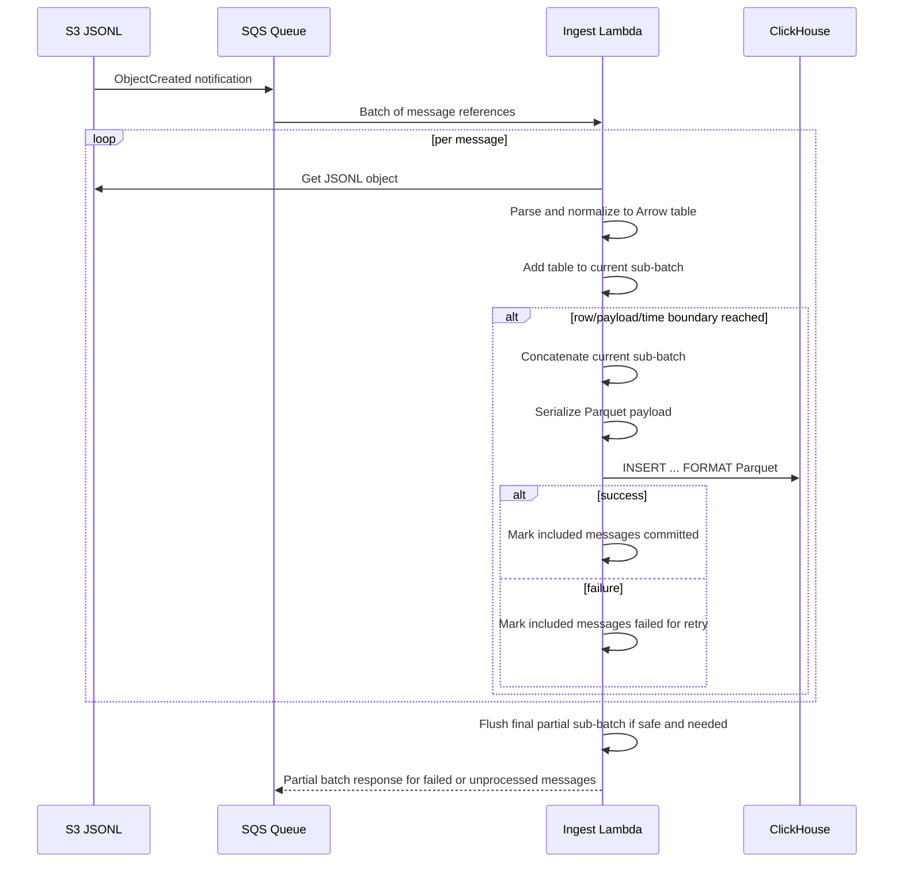

# xAPI ETL Processor Reliability - Functional Design Document

## 1. Executive Summary

This design keeps a single ingestion pipeline centered on `S3 JSONL -> SQS -> Lambda -> ClickHouse`, but replaces the current whole-invocation batch behavior with incremental, row-targeted sub-batching inside the Lambda. SQS remains the durable upstream buffer for normal operation and planned ClickHouse maintenance. The Lambda processes SQS records sequentially, converts referenced JSONL objects into Arrow tables, accumulates rows into a current insert sub-batch, and flushes to ClickHouse when one of the configured boundaries is reached: preferred row target, hard row ceiling, payload-size ceiling, end-of-invocation, or remaining-time safety margin. Successful sub-batches acknowledge only the messages included in that committed unit; failed or unprocessed messages are returned via partial batch response for retry.

The selected design intentionally does not introduce staged Parquet artifacts in S3 as the default architecture. That alternative was considered and remains permitted by the PRD, but it adds a second durable state boundary, manifesting or cleanup work, and a second loader stage. Given the current requirements, SQS already satisfies the durable buffering requirement for planned ClickHouse downtime, and a refactored direct-ingest Lambda is the simpler adequate design. The chosen architecture therefore uses SQS as the control-plane buffer, keeps ClickHouse ingestion synchronous per committed sub-batch, and adds stronger operational controls: explicit pause and resume of the Lambda event source mapping during maintenance, queue retention sized for maintenance windows, bounded in-memory sub-batching, and stage-level observability that makes time and memory pressure diagnosable.

## 2. Requirements & Assumptions

- Functional requirements:
  - FR-001 / AC-001: The processor ingests valid SQS-delivered S3 references and transforms successful records into the ClickHouse raw events shape.
  - FR-002 / AC-002: Mixed per-message preparation outcomes return only failed message identifiers in `batchItemFailures`.
  - FR-002 / AC-003: Batch-level insert failure marks all prepared-but-uncommitted messages for retry.
  - FR-003 / AC-004: Non-empty batches emit stage-level logs or telemetry for message count, row count, object count, Arrow concat duration, Parquet serialization duration, ClickHouse request duration, and final outcome.
  - FR-003 / AC-005: Remaining Lambda time is observable around major stages.
  - FR-004 / AC-006: The processor targets 10,000 to 30,000 row inserts when enough work exists unless time, memory, or freshness constraints require smaller inserts.
  - FR-004 / AC-007: ClickHouse request timeout stays below remaining Lambda budget by a safety margin.
  - FR-004 / AC-008: The processor uses bounded work rather than starting insert work unlikely to finish before timeout.
  - FR-004 / AC-009: Low-volume traffic still flushes within the freshness boundary.
  - FR-004 / AC-022: If prepared work cannot safely commit even the minimum viable sub-batch, the processor emits a distinct no-progress signal and returns the affected messages for retry.
  - FR-005 / AC-010: Low-volume rollout traffic in the tens to hundreds of rows remains timely without depending on large-batch assumptions.
  - FR-005 / AC-011: Higher sustained throughput can aggregate toward preferred ClickHouse row targets.
  - FR-005 / AC-012: Excess Lambda invocations, retries, and idle compute are optimization targets.
  - FR-006 / AC-013: During planned ClickHouse maintenance, upstream events accumulate durably in a managed buffer without source replay.
  - FR-006 / AC-014: After maintenance, buffered events drain without losing messages that arrived during downtime.
  - FR-006 / AC-015: Operators can observe backlog size, buffering age, and paused or resumed state.
  - FR-007 / AC-016: Logs make the dominant slow or failing stage explicit.
  - FR-008 / AC-017: INFO-level logs stay triage-useful without logging full xAPI bodies.
  - FR-008 / AC-018: DLQ forwarding remains summarized and bounded.
  - FR-009 / AC-019: Successful non-dry-run Torus backfills trigger a one-time post-backfill `OPTIMIZE TABLE ... FINAL` before the run is fully complete.
  - FR-009 / AC-020: The admin UI shows optimization as the last in-progress step while it is executing.
  - FR-009 / AC-021: Optimization failure is recorded explicitly and does not silently present as a successful completed backfill.
  - FR-010 / AC-023: Every supported ingested event stores the exact xAPI `verb.id` in `raw_events.verb_id`.
  - FR-010 / AC-024: Retained video-specific columns map only to actual producer-backed statement fields across `played`, `paused`, `seeked`, and `completed`.
  - FR-010 / AC-025: Constants, derivable fields, and never-populated columns are removed or explicitly documented as out of scope.
  - FR-010 / AC-026: Lambda ETL and Torus bulk backfill apply the same `verb_id` and video-field mappings.
  - FR-010 / AC-027: Schema-defined event families or fields that are not represented in `raw_events` are explicitly implemented or documented as deferred gaps.
- Non-functional requirements:
  - Reliability: at-least-once delivery semantics, explicit retry boundaries, and no silent timeout path.
  - Performance: preferred insert size is 10,000 to 30,000 rows when throughput allows, but freshness and Lambda safety limits override that preference.
  - Cost efficiency: avoid repeated full-batch retries, oversized in-memory accumulation, and excessive small Lambda invocations where batching window and row-targeting can help.
  - Availability and recovery: planned ClickHouse downtime is handled by pausing consumption and letting SQS retain backlog until recovery.
  - Observability: stage timings, flush reasons, row counts, payload sizes, backlog posture, and terminal outcomes must be visible.
  - Security and privacy: no raw statement payload logging at INFO; diagnostics remain metadata-oriented.
- Assumptions:
  - S3 object-created events continue to be the source trigger for the ETL path.
  - The current ClickHouse target table and raw-events schema remain the sink contract for this work item.
  - SQS retention can be configured long enough to cover the expected maintenance window plus recovery buffer.
  - At-least-once semantics are acceptable for this phase; eventual storage-level deduplication is sufficient for the raw-events table.
  - Operators can modify Lambda event source mapping settings and pause or resume the mapping during maintenance.
  - Most meaningful duplicate pressure is expected during one-time bulk backfill overlap with live ETL rather than during steady-state live ingestion.

## 3. Repository Context Summary

- What we know:
  - The current implementation lives in `cloud/xapi-etl-processor/lambda_function.py` and processes an invocation-wide list of `tables_to_insert`, concatenates them, writes one in-memory Parquet payload, and posts it to ClickHouse.
  - The Lambda already consumes SQS, uses partial batch response semantics, optionally forwards permanent failures to a DLQ, and supports `DRY_RUN`.
  - `priv/schemas/xapi/v0-1-0/statement.schema.json` is the canonical xAPI statement contract and currently defines `activityAttemptEvaluated`, `pageAttemptEvaluated`, `partAttemptEvaluated`, `pageViewed`, `tutorMessage`, `videoPlayed`, `videoPaused`, `videoSeeked`, and `videoCompleted`.
  - The current raw-events schema and ETL include stale video shape assumptions: `video_play_time` has no canonical producer-backed xAPI field, while `video_seek_from` and `video_seek_to` are real but sparse because only `seeked` statements populate them.
  - The current raw-events schema omits `verb_id`, so video subtypes and other exact xAPI verb semantics are lost once rows are inserted.
  - The Torus bulk backfill SQL builder in `lib/oli/analytics/backfill/query_builder.ex` has drifted from the Lambda mapping around raw-events column names and video field extraction, so this boundary must be realigned with the runtime ETL.
  - The repository already treats Python Lambda-style ETL work as a valid analytics-adjacent boundary, and operations guidance emphasizes observability over guesswork.
  - The current implementation has no durable intermediate store beyond S3 source JSONL and SQS delivery metadata.
  - Torus already owns bulk backfill orchestration through `Oli.Analytics.Backfill`, `Oli.Analytics.Backfill.Worker`, and the admin LiveView in `lib/oli_web/live/admin/clickhouse_backfill_live.ex`.
- Unknowns to confirm:
  - Production IaC for Lambda event source mapping, SQS retention, visibility timeout, and maximum concurrency is not represented in this repository and must be confirmed before rollout.
  - The target ClickHouse table engine and duplicate-tolerance posture need confirmation if stronger idempotency is later required.
  - Operational ownership for pause and resume procedures, alarms, and recovery runbooks must be defined outside this document.

## 4. Proposed Design

### 4.1 Component Roles & Interactions

- S3 source bucket:
  - Continues to store raw JSONL xAPI event files.
  - Remains the durable source-of-truth artifact store for emitted events.
- SQS intake queue:
  - Receives one message per S3 object-created notification or equivalent SNS-wrapped notification.
  - Serves as the durable upstream buffer during normal flow and planned ClickHouse maintenance.
  - Retains raw work references, not transformed batches.
- Ingest Lambda:
  - Reads an SQS batch.
  - Parses and normalizes each referenced JSONL object.
  - Accumulates only the current insert sub-batch in memory.
  - Flushes committed sub-batches synchronously to ClickHouse.
  - Returns partial batch failures for failed or unprocessed messages.
- ClickHouse:
  - Remains the only analytical sink in the selected design.
  - Receives Parquet payloads over HTTP in bounded synchronous sub-batches.
- Operator workflow:
  - For planned maintenance, operators disable the Lambda event source mapping and allow SQS backlog to grow.
  - CloudWatch alarms make queue depth, oldest message age, repeated insert failure, and post-resume drain behavior visible, but a human controls pause and resume.
  - After ClickHouse recovery, operators re-enable the event source mapping and may temporarily raise mapping concurrency to drain backlog faster.
- Torus backfill workflow:
  - A successful non-dry-run backfill does not move directly from `running` to `completed`.
  - The Torus backfill context launches a one-time post-backfill optimization step for `raw_events`.
  - While optimization is running, the run remains in a distinct terminal-pending state visible in the admin UI.
  - Only after optimization succeeds does the run become fully `completed`.

### 4.2 State & Data Flow

- Sub-batch ownership:
  - `current_tables`: Arrow tables for the current insert unit only.
  - `current_message_ids`: message ids represented by the current insert unit only.
  - `committed_message_ids`: message ids whose rows were inserted successfully in this invocation.
  - `failed_message_ids`: preparation failures, insert failures, or records intentionally left unprocessed because the invocation ran out of safe budget.
- Flush boundaries:
  - Preferred row target reached.
  - Hard row ceiling reached.
  - Payload-size ceiling reached.
  - Remaining time falls below the safe continuation budget.
  - End of available records with non-empty current sub-batch.
- No-progress handling:
  - If the invocation has prepared work but cannot safely concatenate, serialize, and insert even the minimum viable sub-batch within the remaining budget, it must not keep cycling silently.
  - The handler emits a distinct no-progress outcome with the flush blocker and remaining-time context, then returns the affected messages for retry through partial batch response handling.
  - Repeated no-progress outcomes are expected to be alarmable and eventually bounded by source-queue redrive policy rather than retried indefinitely without operator visibility.

### 4.3 Lifecycle & Ownership

- Configuration owned outside code:
  - SQS batch size.
  - SQS maximum batching window.
  - SQS visibility timeout.
  - SQS retention period.
  - Event source mapping maximum concurrency.
  - Lambda timeout and memory size.
- Runtime ownership inside Lambda:
  - Message parsing and normalization.
  - Current sub-batch accumulation.
  - Flush decision evaluation.
  - ClickHouse request timeout derived from remaining Lambda time.
  - Per-sub-batch success and failure accounting.
- Operational lifecycle:
  - Normal mode: event source mapping enabled.
  - Maintenance mode: event source mapping disabled; queue backlog and age monitored.
  - Recovery mode: event source mapping re-enabled, optionally with elevated concurrency until backlog returns to steady state.

### 4.4 Alternatives Considered

- Alternative A: Keep the current whole-invocation combined insert design and only raise memory and timeout.
  - Rejected because it leaves the core failure mode intact: large in-memory duplication, poor control over safe flush boundaries, and repeated all-or-nothing retry scope.
- Alternative B: Stage normalized Parquet files in S3 and add a second loader stage into ClickHouse.
  - Considered seriously because it improves decoupling and could simplify ClickHouse downtime handling.
  - Rejected for now because SQS already satisfies the explicit durable-buffer requirement, while staged Parquet adds a second storage boundary, cleanup or manifest management, and a second moving part.
  - Remains in scope for future revision if direct synchronous sub-batching proves insufficient under real load or operational evidence.
- Alternative C: Introduce Kinesis, Firehose, or another managed streaming buffer as the primary path.
  - Rejected for now because the current source event shape is S3 object notifications, not a native event stream, and the added infrastructure is not required to satisfy the current requirements.
- Selected approach:
  - Retain one pipeline and one sink.
  - Use SQS as the durable buffer.
  - Refactor the Lambda into incremental sub-batching with strong operational controls.

## 5. Interfaces

- SQS message contract:
  - Unchanged from current implementation: S3 event notification JSON, SNS-wrapped S3 notification JSON, or minimal `{bucket, key}` fallback.
- Lambda handler contract:
  - Input remains the standard SQS event structure.
  - Output remains `{ "batchItemFailures": [...] }` with per-message identifiers.
- Environment variables:
  - Existing ClickHouse, S3, Parquet, and DLQ settings remain.
  - Add bounded-processing controls:
    - `TARGET_ROWS_PER_INSERT`
    - `MAX_ROWS_PER_INSERT`
    - `MAX_PARQUET_BYTES_PER_INSERT`
    - `MIN_REMAINING_TIME_TO_START_INSERT_MS`
    - `LAMBDA_TIMEOUT_SAFETY_MARGIN_MS`
    - `MAX_MESSAGES_PER_INVOCATION_TO_PROCESS` if a code-level cap is needed in addition to event source mapping settings
  - `CLICKHOUSE_TIMEOUT_SECONDS` becomes a ceiling, not the only timeout source; actual request timeout is `min(configured_ceiling, derived_remaining_budget)`.
- ClickHouse interface:
  - Continues to use HTTP `INSERT ... FORMAT Parquet`.
  - Each sub-batch uses a deterministic `insert_token` derived from message ids and row counts for logging and request correlation.
- Operational interface:
  - Pause and resume occurs through the AWS Lambda event source mapping, not through new application code endpoints.
  - The recommended maintenance model is alarm-driven manual operation rather than fully automatic pause and resume.
- Torus admin backfill interface:
  - Backfill runs gain an explicit optimization phase in the Torus-owned lifecycle.
  - The admin LiveView surfaces that phase as the final step for a run instead of collapsing directly to `completed`.

## 6. Data Model & Storage

- Database schema:
  - No Torus database schema changes.
  - ClickHouse `raw_events` schema changes are required to preserve canonical verb identity and remove stale video columns.
- Object storage:
  - Source JSONL remains in S3.
  - The selected design does not add staged Parquet objects in S3.
- Queue storage:
  - SQS remains the sole durable in-flight buffer for not-yet-committed work.
  - DLQ remains optional for permanently malformed, non-retryable, or exhausted-retry failures, not for ordinary retryable ClickHouse insert failures.
- In-memory structures:
  - Replace invocation-wide `tables_to_insert` with sub-batch-scoped accumulation objects.
  - Track committed, failed, and skipped message ids separately so partial batch response stays accurate.
- Backfill run state:
  - Extend `Oli.Analytics.Backfill.BackfillRun` with an optimization-aware lifecycle, using either:
    - a new `status` value such as `:optimizing`, or
    - a dedicated metadata-backed phase field plus existing `:running` or `:completed`
  - The preferred design is a first-class status so the admin UI, notifier, and tests can reason about optimization distinctly.

### 6.1 Raw Event Schema Fidelity Analysis

- Canonical design inputs:
  - The producer implementations under `lib/oli/analytics/xapi/events/**`.
  - The runtime payload emitters in `assets/src/components/video_player/VideoPlayer.tsx` and `assets/src/components/youtube_player/YoutubePlayer.tsx`.
  - The schema contract in `priv/schemas/xapi/v0-1-0/statement.schema.json`.
- Proposed raw-events core event identity changes:
  - Add `verb_id LowCardinality(String)` and populate it directly from `statement.verb.id` for every ingested row.
  - Keep `event_type` as the coarse normalized family (`video`, `activity_attempt`, `page_attempt`, `page_viewed`, `part_attempt`, and any future supported families), but do not rely on it to preserve subtype semantics.
  - Do not add a separate `event_subtype` in this phase because `verb_id` provides the exact subtype discriminator without introducing another derived field contract.
- Proposed retained video columns and mappings:
  - `video_url`: `object.id` for all video statements.
  - `video_time`: `result.extensions["https://w3id.org/xapi/video/extensions/time"]`, populated by `played`, `paused`, and `completed`.
  - `video_length`: `context.extensions["https://w3id.org/xapi/video/extensions/length"]`, populated by `played`, `paused`, and `completed`.
  - `video_progress`: `result.extensions["https://w3id.org/xapi/video/extensions/progress"]`, populated by `paused` and `completed`.
  - `video_played_segments`: `result.extensions["https://w3id.org/xapi/video/extensions/played-segments"]`, populated by `paused` and `completed`.
  - `video_seek_from`: `result.extensions["https://w3id.org/xapi/video/extensions/time-from"]`, populated by `seeked`.
  - `video_seek_to`: `result.extensions["https://w3id.org/xapi/video/extensions/time-to"]`, populated by `seeked`.
- Proposed removed video columns:
  - Remove `video_play_time`.
  - Rationale: the Torus producers turn frontend `video_play_time` into the canonical xAPI field `.../extensions/time` for `played` events, and the schema does not define a `result.extensions.video_play_time` field. Keeping a dedicated `video_play_time` column would preserve a fictitious pre-xAPI transport detail rather than the actual stored statement shape.
- Explicitly omitted fields and rationale:
  - Do not add a `video_completion_threshold` column. The schema requires `https://w3id.org/xapi/video/extensions/completion-threshold` only for `completed`, but the producer hardcodes it to `"1.0"`, so it is constant and not analytically useful.
  - Do not add columns for generic `object.definition.name` display strings for attempt and page events. Those are static labels such as `"Page Attempt"` or `"Part Attempt"` and do not add event semantics.
  - Do not add a dedicated `registration` column for video in this phase because the current producer registration value is derivable from existing identifiers and is not required for current analytics use cases.
- Identified data gaps:
  - `tutorMessage` exists in the schema but is not currently represented in the raw-events event family list, runtime Lambda transform, or backfill SQL builder.
  - The development-only direct uploader in `lib/oli/analytics/xapi/clickhouse_uploader.ex` has drifted from the canonical Lambda/backfill mappings and should either be updated alongside the schema revision or explicitly documented as a non-production debug path with lower fidelity guarantees.
  - The backfill SQL builder currently extracts some video fields from the wrong xAPI locations and does not preserve `verb_id`, so it cannot remain unchanged once the raw-events schema is revised.
- Phase 3 implementation decision:
  - `tutorMessage` remains deferred follow-up work for this epic. Current repository-owned ingestion continues to classify unsupported families as out of scope for `raw_events` rather than inventing partial sink columns for message payloads. The deferral is explicit so `verb_id` and video-fidelity changes can land without expanding the sink contract beyond producer-backed fields already covered by current analytics consumers.

## 7. Consistency & Transactions

- Commit unit:
  - A single ClickHouse insert sub-batch is the atomic commit unit for acknowledged SQS messages.
- Acknowledgement rule:
  - A message is acknowledged only after every row derived from that message has been included in a successful ClickHouse insert sub-batch.
- Retry rule:
  - If preparation fails before commit, the message is failed immediately.
  - If an insert sub-batch fails, every message represented in that sub-batch is failed for retry.
  - If the invocation reaches its safe processing budget before touching a message, that message is returned as failed or unprocessed so SQS can redeliver it.
  - Retryable insert failures remain in the source SQS queue through partial batch response handling and are not proactively copied to a custom DLQ.
- Delivery semantics:
  - The system remains at-least-once until stronger ClickHouse idempotency guarantees are defined.
  - The design reduces ambiguous retries by ensuring request timeout is below the Lambda timeout and by making flush boundaries explicit, but it does not claim exactly-once behavior.
  - Duplicate tolerance relies on `event_hash` plus `ReplacingMergeTree(event_version)` for eventual convergence of stored raw events, not immediate query-time deduplication.
  - No-progress outcomes are treated as explicit bounded failures, not as a reason to keep reprocessing the same prepared work silently.
- Backfill completion semantics:
  - For eligible Torus-managed backfills, `completed` means both the data load and the one-time post-backfill optimization step have finished successfully.
  - If optimization fails, the run must surface that failure distinctly rather than presenting as a successful completed load.

## 8. Caching Strategy

- No cross-invocation cache is introduced.
- Within an invocation:
  - The current sub-batch is the only retained transform cache.
  - Derived schema and ClickHouse type metadata may continue to use the existing module-level cached map.
- Cross-request caching is intentionally omitted because it would complicate pause, resume, and retry behavior without solving the primary bottlenecks.

## 9. Performance & Scalability Posture

- Normal low-volume posture:
  - Use SQS maximum batching window to allow short accumulation.
  - Flush smaller sub-batches at end-of-window or end-of-records so freshness remains acceptable.
- Higher-throughput posture:
  - Increase SQS batch size and permit larger invocation input sets.
  - Let the Lambda emit one or more 10,000 to 30,000 row inserts per invocation when backlog and remaining time allow.
- Memory posture:
  - Memory use is bounded by one current sub-batch, not the entire invocation workload.
  - Hard ceilings on row count and payload size prevent unbounded growth.
- Cost posture:
  - Batching window absorbs some low-volume chatter.
  - Row-targeted sub-batching reduces the number of undersized ClickHouse inserts when traffic is available.
  - Maintenance-mode pausing avoids wasteful retry storms during planned downtime.
  - One-time post-backfill optimization is accepted as an expensive maintenance-grade operation because it is tied to bulk-ingest completion, not steady-state ETL.
- Recommended initial operational defaults:
  - `SQS batch size`: `50`
  - `SQS maximum batching window`: `60s`
  - `Lambda memory`: `1024 MB`
  - `Lambda timeout`: `60s`
  - `Event source mapping maximum concurrency`: `2`
  - `SQS visibility timeout`: at least `300s`
  - `SQS retention period`: sized to exceed the longest expected maintenance window plus backlog drain time
  - Rationale:
    - current traffic is expected to produce only tens to hundreds of rows per effective batch, so the batching window is the main cost and aggregation lever during early rollout
    - `1024 MB` gives PyArrow and Parquet serialization enough memory and CPU headroom to avoid the current timeout-prone posture
    - `60s` timeout gives room for accumulation, transformation, and one or more bounded inserts without operating on the deadline
    - concurrency `2` allows controlled backlog drain without immediately stampeding ClickHouse
  - Tuning posture:
    - reduce batching window first if freshness is unacceptable
    - increase batch size or concurrency only after observing stable memory use, insert latency, and backlog behavior
    - consider reducing memory only after production measurements show comfortable headroom

## 10. Failure Modes & Resilience

- Planned ClickHouse maintenance:
  - Mitigation: disable event source mapping, monitor queue depth and oldest message age, re-enable after maintenance, and drain backlog.
- Unplanned ClickHouse slowdown or outage while consumer is active:
  - Mitigation: explicit request timeout below Lambda budget, repeated failures visible in metrics, operator alarm triggers a manual pause decision.
- Post-backfill optimization failure:
  - Mitigation: record the optimize query id and failure details on the backfill run, show optimization as failed in the admin UI, and require explicit operator acknowledgement or rerun rather than silently treating the backfill as completed.
- Lambda timeout risk:
  - Mitigation: remaining-time checks before starting a new insert, bounded sub-batch size, and early return of untouched messages.
- Repeated no-progress retries:
  - Mitigation: emit a distinct no-progress signal, include the blocker in logs and metrics, tune batch-size or runtime settings so normal sub-batches have headroom, and rely on SQS redrive policy to prevent indefinite invisible looping for pathological workloads.
- Poison source message:
  - Mitigation: per-message preparation failure handling and optional DLQ forwarding only for clearly non-retryable payload defects or exhausted source-queue retries.
- Large skewed source object:
  - Mitigation: object-size cap, row-target ceiling, payload-size ceiling, and targeted logs identifying the offending source object.
- Retry duplication:
  - Mitigation: explicit acknowledgment boundaries, insert correlation token, and follow-up decision on ClickHouse-side dedupe if required by analytics correctness.

## 11. Observability

- Per invocation:
  - message count received
  - messages processed
  - messages committed
  - messages failed
  - messages skipped due to budget exhaustion
  - total rows and objects handled
- Per sub-batch:
  - `insert_token`
  - flush reason
  - no-progress outcome reason when a safe flush cannot start
  - row count
  - source message count
  - Arrow concat duration
  - Parquet serialization duration
  - Parquet payload bytes
  - ClickHouse request duration
  - remaining Lambda time before and after insert
- Queue and maintenance posture:
  - queue depth
  - approximate oldest message age
  - event source mapping enabled or disabled state
  - optional recovery-mode concurrency override in runbook or dashboards
  - repeated insert failure alarm state
- Backfill optimization posture:
  - optimize query id
  - optimize started_at / finished_at
  - optimize status
  - optimize failure reason if any
- Log hygiene:
  - INFO logs contain identifiers, counts, timings, and stage names.
  - DEBUG logs may include record-shape diagnostics but not full xAPI bodies.
- Query-time dedupe posture:
  - standard analytics queries may read the raw table without `FINAL` when eventual dedupe is acceptable
  - queries that require strict dedupe correctness may use `FINAL` selectively until materialized-view-based serving layers are introduced
  - after a one-time bulk backfill completes, the Torus application may run `OPTIMIZE TABLE ... FINAL` on `raw_events` as an operational cleanup step to collapse overlap duplicates created during the backfill window

## 12. Security & Privacy

- No user-facing access-control changes are introduced.
- xAPI statements and raw payloads are not logged at INFO.
- DLQ forwarding continues to carry bounded failure reason metadata only.
- Retryable downstream insert failures must not be mirrored into a custom DLQ because that duplicates work items while the source queue is already retaining them for retry.
- S3 and SQS IAM permissions remain least-privilege:
  - `s3:GetObject` for relevant prefixes
  - `sqs:ReceiveMessage`, `DeleteMessage`, `GetQueueAttributes` for intake queue
  - `sqs:SendMessage` for failure DLQ if enabled
- ClickHouse credentials remain configuration-driven and outside source control.

## 13. Testing Strategy

- Unit tests in `cloud/xapi-etl-processor/tests/lambda_function_test.py`:
  - sub-batch flush when `TARGET_ROWS_PER_INSERT` is reached
  - flush when remaining-time budget is low
  - end-of-invocation flush of undersized batch
  - partial batch response for mixed preparation outcomes
  - partial batch response when later records are intentionally left untouched due to safety budget
  - distinct no-progress outcome when prepared work cannot safely commit even the minimum viable sub-batch
  - derived ClickHouse timeout never exceeds remaining Lambda budget
  - maintenance-mode operational assumptions documented and validated via integration or runbook exercises
- Focused integration-style tests:
  - multiple insert sub-batches in one invocation
  - insert failure only retries messages in the affected sub-batch
  - low-volume traffic still produces timely small flushes
  - higher-throughput simulated input can produce larger insert units
- Backfill orchestration tests:
  - successful non-dry-run backfill transitions into optimization before final completion
  - optimization success marks the run completed and exposes optimize metadata in the UI model
  - optimization failure leaves the run explicitly failed or optimization-failed, not silently completed
  - dry-run backfills do not trigger optimization
- Manual validation:
  - pause event source mapping, publish source files, confirm backlog grows in SQS
  - resume mapping, confirm backlog drains and data reaches ClickHouse
  - simulate slow ClickHouse endpoint and confirm stage-level logs reveal where time is spent
  - simulate retryable ClickHouse insert failure and confirm messages remain only in the source queue for retry rather than being copied immediately to a custom DLQ
  - execute a backfill overlap scenario and confirm the Torus-operated post-backfill `OPTIMIZE TABLE ... FINAL` step is documented and available for one-time raw-table cleanup
  - complete a Torus backfill from the admin UI and confirm the UI shows optimization as the final running step until the optimize query finishes
  - verify INFO logs do not emit raw xAPI statement bodies

## 14. Backwards Compatibility

- Source message format remains backward compatible with the current SQS payload parser.
- ClickHouse sink contract remains the same HTTP Parquet insert path.
- Existing deployment shape remains recognizable: same Lambda package, same queue, same source bucket, same sink.
- The main change is behavioral and operational:
  - invocation-wide all-at-once batching becomes incremental sub-batching
  - event source mapping settings become first-class tuning controls
  - planned maintenance uses alarm-driven manual pause and resume rather than repeated failing consumption
  - Torus backfills gain an explicit post-load optimization phase before completion

## 15. Risks & Mitigations

- Direct synchronous inserts may still prove insufficient at much higher scale:
  - Mitigation: keep staged Parquet in S3 as an explicit future alternative if operational evidence justifies the added complexity.
- Large SQS batches combined with low concurrency may slow backlog drain after maintenance:
  - Mitigation: make maximum concurrency an operator-controlled knob and document a recovery-mode posture.
- At-least-once semantics may allow duplicates after ambiguous network failures:
  - Mitigation: use explicit insert tokens, preserve event hashes, accept eventual raw-table dedupe, and use `FINAL` or future materialized views when stricter query-time dedupe is required.
- Bulk backfill overlap may leave transient duplicate rows until ClickHouse merges complete:
  - Mitigation: treat duplicate cleanup as a one-time Torus-operated post-backfill step using `OPTIMIZE TABLE raw_events FINAL`, not as a steady-state ingestion requirement.
- Adding an optimization phase changes the existing backfill status lifecycle and UI expectations:
  - Mitigation: model optimization as a first-class run phase and update the admin LiveView to present it explicitly as the last step.
- Missing or misconfigured AWS queue settings can undermine the maintenance buffer:
  - Mitigation: treat SQS retention, visibility timeout, and batching settings as required rollout checks.
- Mirroring retryable insert failures into a custom DLQ would create duplicate operational artifacts:
  - Mitigation: reserve DLQ usage for non-retryable or exhausted-retry failures and keep ordinary insert retries in the source queue only.

## 16. Open Questions & Follow-ups

- If direct synchronous ingestion remains too expensive or operationally noisy after tuning, revisit the deferred alternative of staged Parquet in S3 with explicit evidence.
- Introduce materialized-view-based serving layers later if query-time dedupe or query-cost posture requires stronger guarantees than the raw-events table provides directly.

## 17. References

- `docs/exec-plans/current/epics/xapi_etl_processor_reliability/prd.md`
- `docs/exec-plans/current/epics/xapi_etl_processor_reliability/requirements.yml`
- `cloud/xapi-etl-processor/lambda_function.py`
- `cloud/xapi-etl-processor/README.md`
- `ARCHITECTURE.md`
- `docs/OPERATIONS.md`
- `docs/TESTING.md`
