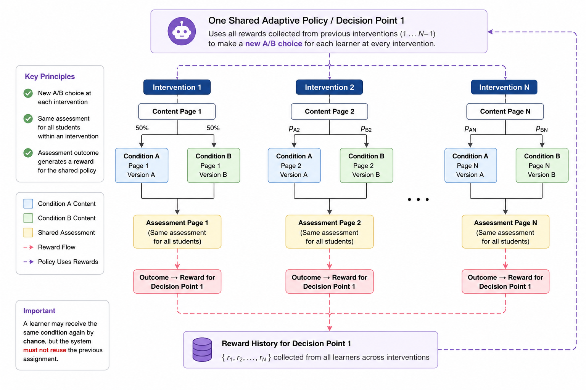

# Intervention-Scoped Assignment And Assessment-Driven Thompson Sampling

## Primary Product Goal

Enhance native Torus experiments so one adaptive policy can be applied repeatedly across a sequence
of course interventions. Each learner receives a new, sticky condition assignment at every
intervention instance. For Thompson Sampling, a separate shared assessment measures the outcome of
each intervention and updates one posterior shared by all instances governed by the same decision
point.

This must support a course in which:

- an experiment defines `N` stable conditions, most commonly two;
- one decision point binds those conditions and one adaptive policy to a reusable Alternatives Group;
- the Alternatives Group is instantiated on multiple pages;
- each instance defines different condition-specific page content;
- every instance is a separate intervention and assignment opportunity;
- every intervention has a distinct assessment shared by learners in all conditions; and
- assessment rewards accumulate into the decision point posterior used by subsequent intervention assignments.

The essential outcome is cross-page learning without course-wide sticky assignment. A learner may
receive `Control: Text only` at one intervention and `Treatment: Text and video` at another, while
revisiting either intervention continues to show its originally assigned content.

## Conceptual Workflow Diagram



Source: `docs/exec-plans/current/epics/ab_testing/references/image-1.png`

The diagram accurately illustrates the intended behavior:

- one shared adaptive policy and decision point governs all depicted interventions;
- every intervention makes a new assignment rather than reusing a learner's earlier assignment;
- each intervention renders condition-specific local content;
- all learners at an intervention receive the same condition-neutral assessment;
- each assessment outcome rewards the condition assigned at its corresponding intervention; and
- accepted rewards feed the shared decision-point posterior used by later first-time assignments.

The following notation in the diagram is illustrative rather than additional product behavior:

- `Condition A` and `Condition B` correspond to author-defined condition labels such as
  `Control: Text only` and `Treatment: Text and video`.
- The initial `50%` labels illustrate symmetric priors. Later values such as `p_A2` and `p_B2`
  represent the assignment probabilities induced by sampling the current condition posteriors; they
  are not fixed weights directly rewritten by Thompson Sampling.
- "Rewards collected from previous interventions" means all accepted rewards committed before the
  new assignment is sampled. A delayed assessment result cannot affect an assignment that has
  already been made.
- The reward-history notation `{r₁, r₂, ..., rN}` is shorthand for all accepted learner-by-
  intervention observations. It does not mean that an intervention contributes only one aggregate
  reward across all learners.
- The diagram shows two conditions for readability, while the decision point supports `N` conditions
  and maintains one Beta posterior for each.

## Current Native Model And Limitation

The current native model supports a 1:1 relationship between an experiment and what it currently
calls a decision point:

- learner assignment is sticky for that decision point;
- the decision point selects an alternative from one Alternatives Group;
- evaluated activities inside the selected alternative can generate Thompson Sampling rewards; and
- those rewards update the posterior used by the experiment's only decision point.

Because there is only one decision point, the current model does not need to distinguish among:

- a reusable Alternatives Group;
- multiple placed content-element instances of that group;
- separate assignments at those instances; and
- separate downstream assessments rewarding those assignments.

The target workflow requires those distinctions. Simply allowing more placements without changing
assignment identity would reuse one condition across every page. Giving every placement an
independent posterior would prevent early assessment outcomes from improving later assignments.
Continuing to discover rewards only from activities inside the alternatives would prevent a common,
later assessment from measuring the intervention.

## Canonical Terminology And Ownership

### Experiment

An experiment is the lifecycle, participation, and reporting container. It owns:

- its name, description, status, and participating sections;
- `N` stable condition identities with author-defined labels, such as `Control: Text only` and
  `Treatment: Text and video`;
- one or more decision points; and
- experiment-level analytics that aggregate its decision points.

An experiment may contain one or more decision points when it needs to study independently optimized
questions using the same experiment conditions. Each decision point binds its own Alternatives Group,
has independent weights or per-condition posteriors, and does not share rewards with another decision point.

Condition labels are chosen by the author and have no special algorithmic meaning. For a common
two-condition experiment, the example uses:

- `Control: Text only`; and
- `Treatment: Text and video`.

A three-condition experiment might instead use:

- `Control: Text only`;
- `Treatment A: Text and images`; and
- `Treatment B: Text and video`.

Control and treatment terminology is optional. Conditions are backed by stable identities so draft
label edits do not change assignment, policy, reward, or analytics identity.

### Alternatives Group

An Alternatives Group is a generic, reusable, versioned definition of `N` alternative identities:

```text
Alternatives Group A
├── Alternative 1
├── Alternative 2
└── ... Alternative N
```

The group does not own the page-specific content rendered for those alternatives. It provides stable
alternative identities that can be referenced by a decision point and by multiple placed content elements.

The same generic construct supports the existing selection strategies:

- `user_section_preference`; and
- `upgrade_decision_point` for experiment-controlled selection.

### Alternatives Content-Element Instance

An Alternatives content-element instance is a placement of an Alternatives Group on a page. The
instance owns the actual local content for every alternative at that location:

```text
Content Page 1 instance of Alternatives Group A
├── Alternative 1 content → Page 1, Version A
└── Alternative 2 content → Page 1, Version B

Content Page 2 instance of Alternatives Group A
├── Alternative 1 content → Page 2, Version A
└── Alternative 2 content → Page 2, Version B
```

The group supplies stable alternative identities; each instance supplies different authored content.
This separation allows one decision point and posterior to govern many pages without requiring a
different Alternatives Group for every page.

### Decision Point

A decision point is the binding of one experiment-controlled Alternatives Group and one assignment
policy within an experiment. It owns:

- the referenced Alternatives Group;
- a one-to-one mapping between every experiment condition and every alternative identity in that group;
- weighted-random configuration or Thompson Sampling priors, posterior accumulations, and guardrails;
- aggregate assignment counts by condition across all governed intervention instances;
- per-intervention assignment counts by condition;
- aggregate reward state and Thompson Sampling parameters per condition;
- all intervention instances created from placed content elements of the bound group; and
- for Thompson Sampling, assessment bindings that connect outcomes to those interventions.

The bound group must contain the same number of alternatives as the experiment has conditions. The
mapping is a bijection: every condition maps to exactly one distinct alternative, and every
alternative is mapped by exactly one condition. Duplicate mappings and unused alternatives are not supported.

Policy state is scoped to the decision point and condition:

```text
decision point + condition
```

All intervention instances governed by the decision point sample from and contribute to this shared policy state.

For the Thompson Sampling MVP, the policy is a non-contextual Beta-Bernoulli multi-armed bandit. The
decision point maintains one Beta posterior for every experiment condition:

```text
Decision Point
├── Control: Text only → Beta(α_control, β_control)
├── Treatment: Text and video → Beta(α_treatment, β_treatment)
└── ... Condition N → Beta(αₙ, βₙ)
```

Unless explicitly configured otherwise, each condition starts with the uniform `Beta(1, 1)` prior
used by the reference notebook. The decision point's "posterior" is shorthand for this complete
collection of per-condition posterior distributions, not one distribution shared by all conditions.

### Intervention Point

An intervention point is one placed Alternatives content-element instance governed by a decision
point. It is one learner assignment opportunity with:

- a stable logical identity composed of the containing page's resource ID and the Alternatives
  content element's existing `id`;
- local authored content for every alternative;
- one sticky assignment per participating learner enrollment; and
- for Thompson Sampling MVP, exactly one assessment binding that measures the outcome of that assignment.

The content-element instance is the assignment scope. Re-rendering the same instance reuses its
assignment. Encountering another instance of the same Alternatives Group invokes the decision point
policy again and may produce a different condition.

### Assessment Binding And Reward Source

An assessment binding connects one ordinary, condition-neutral scored page to one intervention
instance and its parent decision point. The scored page may appear later in the course and is
delivered identically to learners in every condition. The binding consumes the page's overall score,
normalized to the range `[0.0, 1.0]`; it does not bind to or independently aggregate an individual
activity within that page.

For MVP, every Thompson Sampling intervention has exactly one assessment binding, each binding
references a distinct scored page, and one scored page cannot reward multiple intervention instances.

Any scored page that produces an identifiable finalized attempt and normalized overall score is
eligible, including a page containing manually graded activities. The experiment subsystem does not
inspect, allowlist, or restrict the page's internal activity types or scoring models. Existing scored-page
behavior owns activity weighting, partial credit, manual grading, and overall-score calculation. The
experiment author is responsible for choosing a page and scoring model appropriate to the experiment.
Completion-only or other unscored pages are ineligible.

The binding provides the explicit reward path:

```text
Finalized scored-page attempt and overall score
→ Assessment binding
→ Intervention content-element instance
→ Learner assignment at that instance
→ Assigned experiment condition
→ Parent decision-point posterior
```

The assessment count is independent of the number of conditions. Use `M assessments`, not `N
assessments`, when describing cardinality.

## Domain Cardinality

```text
Project                         1 → many Experiments
Experiment                      1 → N Conditions
Experiment                      1 → many Decision Points
Decision Point                  1 → 1 Alternatives Group
Decision Point                  1 → N condition-to-alternative mappings
Decision Point + Condition      1 → 1 policy state/posterior
Decision Point                  1 → many Intervention Points
Intervention Point              1 → 1 Alternatives content-element instance
Intervention Point              1 → many Learner Assignments
Intervention Point              1 → 1 Assessment Binding for Thompson Sampling MVP
Assessment Binding              1 → 1 Assessment/Activity
```

Across a decision point, the number of assessments is independent of the number of conditions. In the
initial ten-intervention use case, ten intervention instances produce ten distinct assessment bindings
to ten distinct assessments.

## Detailed Ten-Intervention Use Case

### Course Composition

One experiment contains two conditions and one Thompson Sampling decision point. The decision point
binds one Alternatives Group with two alternative identities. That group is instantiated on ten
content pages, and every instance defines different local content:

| Intervention | Alternatives Group | Control: Text only | Treatment: Text and video | Shared assessment |
| --- | --- | --- | --- | --- |
| 1 | Group A | Page 1 text-only content | Page 1 text-and-video content | Assessment 1 |
| 2 | Group A | Page 2 text-only content | Page 2 text-and-video content | Assessment 2 |
| 3 | Group A | Page 3 text-only content | Page 3 text-and-video content | Assessment 3 |
| 4 | Group A | Page 4 text-only content | Page 4 text-and-video content | Assessment 4 |
| 5 | Group A | Page 5 text-only content | Page 5 text-and-video content | Assessment 5 |
| 6 | Group A | Page 6 text-only content | Page 6 text-and-video content | Assessment 6 |
| 7 | Group A | Page 7 text-only content | Page 7 text-and-video content | Assessment 7 |
| 8 | Group A | Page 8 text-only content | Page 8 text-and-video content | Assessment 8 |
| 9 | Group A | Page 9 text-only content | Page 9 text-and-video content | Assessment 9 |
| 10 | Group A | Page 10 text-only content | Page 10 text-and-video content | Assessment 10 |

In total, the course contains:

- one experiment;
- two shared condition identities;
- one decision point and adaptive policy;
- one reusable Alternatives Group with two alternative identities;
- ten Alternatives content-element instances acting as intervention points;
- twenty instance-specific instructional materials;
- ten distinct, condition-neutral assessments;
- ten assessment bindings; and
- one shared decision-point posterior per condition.

Assessment 1 is shared across both conditions at Intervention 1. Assessment 2 is a different shared
assessment for Intervention 2. The assessment itself is not reused across interventions, but every
accepted reward updates the same decision-point posterior.

### Author Workflow

1. Create or insert one experiment-controlled Alternatives Group with two stable alternative
   identities using the current `Alt` or `A/B Test` workflow.
2. Use the page content editor to author the Page 1 content for both alternatives on the first placed instance.
3. Create one experiment with `Control: Text only` and `Treatment: Text and video`.
4. Create one decision point that binds the Alternatives Group to the experiment.
5. Map `Control: Text only` to Alternative 1 and `Treatment: Text and video` to Alternative 2.
6. Configure weighted random or Thompson Sampling on the decision point.
7. Insert or reuse instances of the group on Content Pages 2 through 10 and use the page content
   editor to author the local content for both alternatives at each targeted instance.
8. Review the ten instances and confirm that each contains the intended local alternative content.
9. Author Assessment Pages 1 through 10 as ordinary shared assessment content.
10. Bind each assessment to its corresponding intervention instance and, for Thompson Sampling,
    configure reward conversion before starting the experiment.

The exact UI for creating a reusable group versus inserting another instance remains an authoring
design detail, but it must preserve the distinction between group-owned alternative identities and
instance-owned option content.

### Learner And Adaptive Workflow

1. A learner reaches the Page 1 instance of Group A.
2. The system draws one sample from every condition's Beta posterior, assigns the condition with the
   highest sampled value, and persists that assignment for the learner enrollment and Page 1 instance.
3. The instance renders Page 1 Version A or Version B according to the condition-to-alternative mapping.
4. Every learner completes the same Assessment 1.
5. When Assessment 1 is evaluated, reward processing resolves the learner's assignment at the Page 1
   instance and updates Decision Point 1's posterior for the assigned condition exactly once.
6. The learner reaches the Page 2 instance. The policy samples again using all rewards committed so
   far and persists a separate Page 2 assignment.
7. The cycle repeats through Page 10 and Assessment 10.
8. Revisiting any page instance always returns its original assigned condition and local content.
9. A delayed reward affects only first-time assignments made after it is committed; it never changes
   assignments already persisted at any instance.

With 30 learners, a policy beginning near 50/50 might assign approximately 15 learners to each
condition at the first instance. As outcomes from Assessments 1 through 9 accumulate, Thompson
Sampling may increasingly favor a consistently better-performing condition. An observed allocation
of 95% or greater by the Page 10 instance is possible but not guaranteed. It depends on priors,
evidence, reward timing, cohort progression, guardrails, and probabilistic exploration.

## Assignment Semantics

The assignment unit remains the learner's section enrollment, but assignment identity must include
the intervention content-element instance:

```text
section enrollment + decision point + intervention content-element instance
```

The decision point may be derivable through the bound group, but retaining it explicitly is useful
for constraints, analytics, and historical evidence.

Individual assignments and aggregate state are separate concepts:

- Assignment identity is one enrollment, decision point, and intervention instance.
- Per-intervention aggregates count assignments by condition at one instance.
- Decision-point aggregates count assignments by condition across all governed instances.
- Thompson Sampling state stores `α` and `β` per decision point and condition.

Aggregate counts never determine assignment uniqueness and cannot substitute for persisted learner assignments.

Required behavior:

- Each first encounter with an intervention instance is one Thompson Sampling bandit round.
- The policy draws once from every condition posterior and assigns the condition with the highest draw.
- Revisiting the same instance reuses the persisted assignment.
- First encounter with another instance of the same group samples again.
- One learner may receive different conditions at different intervention instances.
- Concurrent first encounters with the same instance converge on one assignment.
- Encounters with different instances remain independently assignable.
- Sampling reads a consistent committed snapshot of every condition posterior at the decision point.
- Weighted random samples the decision point's fixed weights at every new instance.
- Thompson Sampling samples the latest committed decision-point posterior at every new instance.
- Policy changes never alter existing intervention assignments.
- Assignment and rendering remain bounded delivery-path operations and do not scan reward history.

## Thompson Sampling Reward Semantics

- Each assessment binding identifies both the scored assessment page and the intervention instance it measures.
- The scored page is shared across conditions and is not selected by the Alternatives content element.
- Reward conversion consumes the overall normalized page score produced by the existing assessment
  scoring model; the experiment subsystem neither recalculates the score nor examines internal activity types.
- Reward processing resolves the same learner enrollment's assignment at the bound instance.
- The assigned condition, not a label, displayed content identifier, or most-recent experiment
  assignment, receives the reward.
- Rewards from every intervention instance governed by a decision point update the same posterior for
  that decision point and condition.
- The MVP accepts exactly one binary reward for each learner assignment at an intervention instance.
- Reward conversion happens before the Thompson Sampling update. Each assessment binding owns a
  threshold from `0.0` through `1.0`, defaulting to `1.0`; an overall normalized page score at or
  above that binding's threshold becomes reward `1` (success), and a score below it becomes reward
  `0` (failure).
- Binding-specific thresholds may differ to express a comparable author-defined meaning of success
  across pages with different difficulty, partial-credit behavior, or scoring models. The policy does
  not compare raw scores across assessments and gives every accepted binary reward equal weight.
- Thresholds are editable only while the experiment is in `draft` and become immutable when it
  leaves `draft`. Historical rewards are never recalculated from later scoring or threshold changes.
- For the assigned condition only, reward `1` increments its `α` parameter and reward `0` increments
  its `β` parameter. Unassigned condition posteriors are unchanged by that observation.
- Reward handling is asynchronous, retryable, idempotent, and observable.
- Updating a condition's `α` or `β` parameter is atomic. Concurrent distinct rewards are all
  preserved, while repeated processing of the same reward cannot increment either parameter twice.
- The first eligible scored-page attempt in persisted attempt order that reaches a final, successfully
  evaluated state supplies the assignment's only reward. Evaluation completion order does not change
  which attempt is first.
- Abandoned, cancelled, invalid, and unevaluated attempts are ineligible. An earlier pending,
  potentially eligible attempt cannot be bypassed merely because a later attempt finishes evaluation first.
- Once accepted, the reward is immutable. Later attempts and re-evaluations may affect ordinary
  grading but cannot replace the accepted reward or produce another posterior update. Explicit
  correction of accepted experiment rewards is a separate, unsupported capability.
- Reward identity includes scored-page attempt, assessment binding, intervention instance, decision point, and assignment.
- If no corresponding assignment exists, processing does not infer a condition, create a retroactive
  assignment, or update the posterior; it records a bounded diagnostic reason.
- Assessment submission does not wait for posterior processing.
- Only rewards committed before a new intervention assignment can influence that assignment.
- Assignment sampling does not hold a lock while waiting for assessment evaluation or reward processing.

PostgreSQL atomically claims the accepted reward and updates the assigned condition's reduced
posterior state in one transaction. A uniqueness constraint on the intervention assignment and
assessment binding prevents retries, duplicate messages, and concurrent evaluation from applying a
second update.

## Statistical Assumptions And Limitations

The reference algorithm is non-contextual. Pooling rewards across intervention instances assumes that:

- each condition represents the same meaningful instructional treatment across all instances;
- the binary reward has a sufficiently comparable interpretation across the bound assessments; and
- observations can be treated as evidence about one stable success probability per condition.

For example, `Control: Text only` consistently represents one instructional strategy and
`Treatment: Text and video` a different strategy, while each page supplies topic-specific material
implementing those strategies.
If the alternatives represent unrelated treatments on different pages, their rewards should not be
pooled into one decision point posterior. They require separate decision points or a future contextual model.

The MVP also treats each accepted intervention reward as one observation even though the same learner
may contribute rewards at several interventions. These repeated observations may be correlated, and
learners who progress farther or faster may contribute more evidence. Assessment difficulty, course
position, prior interventions, and learner characteristics are not included as contexts in the basic
model. Evidence and analytics must retain learner, intervention, assessment, and sequence context so
researchers can evaluate these limitations. Contextual Thompson Sampling is not part of this MVP.

Binding-specific thresholds improve the semantic comparability of success but do not statistically
calibrate assessments. The experiment system does not estimate assessment difficulty, rescale
scores, weight rewards, or adjust for differences in topic, scoring model, or baseline success rate.
The experiment author is responsible for selecting thresholds that give reward `1` a reasonably
consistent instructional meaning across every assessment pooled by a decision point. Assessments
that cannot support that interpretation should be redesigned or assigned to separate decision points
with independent posteriors. Automatic difficulty calibration requires a contextual or hierarchical
model and is outside MVP.

## Weighted Random And Thompson Sampling

Both algorithms share:

- experiment conditions;
- a decision point bound to one Alternatives Group;
- condition-to-alternative mappings;
- multiple intervention instances of the group;
- a fresh sticky assignment per learner and instance;
- local instance-owned alternative content;
- revisit, exposure, preview, completion, lifecycle, and analytics behavior; and
- the generic Alternatives authoring model.

Weighted random:

- stores fixed condition weights at the decision point;
- samples those weights independently at every new intervention instance; and
- does not require assessment bindings or consume rewards.

Thompson Sampling:

- stores a Beta prior/posterior and guardrails per decision point and condition;
- accepts rewards from assessments bound to intervention instances;
- accumulates those rewards across all instances of the group; and
- uses the updated posterior for subsequent first-time assignments.

## Alternatives Authoring As Enabling Infrastructure

### Strategy And Insert Workflow

The existing page-editor Insert menu retains its current `Alt` or `A/B Test` terminology. The selected
insert path sets the Alternatives Group's strategy at creation. Changing strategy after insertion is
not supported.

The authoring interface does not support editing an Alternatives Group's stable alternative
identities. Those identities are established when the group is created and may be affected only by
creating or deleting the Alternatives Group instance itself. There is no authoring operation for
renaming, reordering, adding, removing, or otherwise mutating the group's alternative identities in place.

The page content editor is the only mechanism for editing alternative content. A content edit applies
only to the targeted placed Alternatives content-element instance and does not change the group,
alternative identities, mappings, or content at any other instance.

### Consolidated Page Content Authoring

Alternatives content authoring belongs in the standard page content editor. Experiment configuration
references existing experiment-controlled groups and owns decision-point bindings, condition
mappings, policy configuration, and assessment bindings. It does not edit alternative identities or
page content inline.

The current experiment Decision Points editor does not provide content-authoring capability, and no
such capability should be added. Experiment and decision-point surfaces remain configuration-only;
all local alternative content editing stays in the standard page content editor. Removing the
experiment-specific editor and route therefore requires no content-authoring UX migration.

## Structural Integrity And Lifecycle

Configuration validity must be enforced by supported writes and referential constraints rather than
rediscovered through a just-in-time scan at experiment activation or learner delivery.

Required constraints include:

- A decision point binds one existing project-compatible `upgrade_decision_point` Alternatives Group.
- An Alternatives Group may have at most one current binding to a decision point whose experiment is
  `draft`, active, or paused. This exclusivity applies across experiments in the project so that one
  intervention instance can never be governed by competing policies.
- After the previously bound experiment is completed or archived, the same Alternatives Group may be
  bound to a decision point in a new draft experiment.
- Reusing a group starts an independent policy: the new decision point has its own configuration,
  assignments, exposures, assessment bindings, rewards, and weighted-random state or Thompson
  Sampling posterior. No statistical state carries forward from the earlier decision point.
- A completed or archived experiment retains an immutable historical snapshot of its group binding,
  condition mapping, applicable publication, policy state, assignments, and evidence. Reuse must not
  rewrite or reinterpret that history.
- The group has the same number of alternatives as the experiment has conditions.
- Every condition maps to exactly one distinct alternative, and every alternative is mapped exactly once.
- No supported write can rename, reorder, add, remove, or delete an individual alternative identity in place.
- The bound group cannot be deleted while a decision point depends on it.
- Deleting a group referenced by a draft decision point requires explicitly removing or reconciling
  that draft binding first; the system does not silently cascade the deletion.
- Group strategy is immutable.
- Every intervention's logical identity is the tuple `(page_resource_id, content_element_id)`.
  `alternatives_id` identifies the reusable Alternatives Group and cannot identify a particular placement.
- The page resource ID and content-element ID remain stable through ordinary local-content edits,
  page revisions, publication, and deployment. Page revision and publication IDs record the delivered
  snapshot but do not create a new logical intervention.
- Content paths, array indexes, page order, and proximity are not intervention identities.
- Removing an Alternatives element retires its intervention identity. Reinserting or recreating the
  element receives a new content-element ID and therefore creates a new intervention.
- An assessment binding remains attached only when an authoring operation preserves both components
  of the intervention identity. Bindings and experiment state are never copied, inferred, or
  automatically retargeted to another intervention.
- Reordering an element within its page or moving the entire page within the course hierarchy
  preserves the page resource ID and content-element ID, so the intervention and binding remain unchanged.
- Copying an Alternatives element creates a new content-element ID and intervention. Local content
  and the Alternatives Group reference may be copied, but its assessment binding, assignments,
  exposures, rewards, posterior contributions, idempotency records, and historical evidence are not.
- Duplicating a page creates a new page resource ID, so every Alternatives placement on the duplicate
  is a new intervention. Assessment bindings and experiment state are not duplicated.
- The current editor does not support moving an individual content element between pages. If that
  capability is added later, a cross-page move must behave as retiring the source intervention and
  creating a destination intervention with a new content-element ID; it must not transfer a binding
  or experiment state.
- An assessment binding references one existing compatible scored page and one intervention instance.
- Removing a draft intervention instance requires explicitly removing or reconciling its assessment binding first.
- Removing a draft assessment requires explicitly removing every draft assessment binding that references it first.
- An intervention instance cannot be removed while learner assignments or an active experiment depend on it.
- A bound assessment cannot be deleted while an active assessment binding depends on it.
- Active decision-point policy, mappings, assessment bindings, and relevant experiment conditions are immutable.
- Operations that would add, remove, copy, duplicate, or structurally relocate interventions governed
  by an active or paused experiment are prohibited. A draft may contain a newly created unbound
  intervention while it is being configured, but it is not runnable until its required distinct
  scored-page binding exists.
- Supported operations cannot produce active policy state with missing groups, alternatives,
  instances, mappings, or assessments.
- Published content continues to follow normal publication immutability rules.

Experiment configuration is editable only while the experiment is in `draft`. Leaving `draft`
permanently freezes structural fields. Paused, completed, and archived experiments remain read-only
and cannot return to `draft`. Structural changes require a new or duplicated draft experiment.

Completion freezes the final decision-point policy state and rejects further experiment reward
acceptance. Compact reward-idempotency records may be purged after completion or archival only after
pending evaluations have been resolved or rejected and durable event export has been confirmed.
Persisted learner assignments needed for rendering, revisits, or completion calculations are not
purged merely because an experiment ends.

## Fallback And Preview

- An experiment-controlled Alternatives content-element instance with no applicable active decision
  point renders the first alternative's local content.
- This deterministic fallback creates no experiment assignment, exposure, reward, or policy update.
- Authoring Preview and Instructor Preview show every instance alternative in a basic,
  keyboard-accessible tab UI.
- Preview selection is manual and never invokes learner preference, weighted random, Thompson
  Sampling, or other smart selection behavior.
- Preview creates no assignment, experiment exposure, reward, or posterior update.

## Evidence, Analytics, And Completion

PostgreSQL is the transactional source of truth for the bounded operational data required to power
assignment and learner delivery. For Thompson Sampling it stores the sufficient statistics `α` and
`β` for each decision-point condition rather than reconstructing a posterior by scanning reward
history. It also stores a compact accepted-reward/idempotency record containing the decision point,
intervention assignment, assessment binding, source attempt, binary reward, and acceptance time.
Existing assessment-attempt data determines attempt ordering; the experiment subsystem does not
duplicate complete attempt histories.

Large append-only research and audit evidence is emitted as xAPI or written directly to ClickHouse,
according to system configuration. Assignment, exposure, assessment evaluation, reward acceptance,
duplicate or skipped reward, and posterior-update events include the identities and before/after
policy values needed for analysis. ClickHouse and external xAPI stores are not queried in the learner
assignment or reward-update path. If reliable asynchronous export uses a transactional outbox,
PostgreSQL retains only pending delivery records and purges them after confirmed export.

The compact final posterior and experiment configuration remain available for operational status.
Detailed historical reporting uses the configured xAPI or ClickHouse evidence store.

Assignment and exposure evidence must retain:

- experiment;
- decision point;
- Alternatives Group;
- alternative identity;
- intervention identity, including page resource ID and content-element ID;
- page revision and publication context for the delivered snapshot;
- learner assignment and condition; and
- displayed local content identity where available.

Reward evidence must additionally retain:

- assessment binding;
- scored assessment page and page attempt;
- normalized overall page score, configured threshold, and reward-conversion result;
- posterior update identity; and
- accepted, duplicate, or skipped disposition with a bounded reason.

Allocation reporting describes observed counts and probabilities rather than guaranteed percentages.

Learner completion percentage must be calculated from the content actually selected and displayed
for that learner at every intervention instance:

- Include only the local content and activities contained in the alternative selected by the
  learner's persisted assignment at that instance.
- Exclude every hidden alternative, including its content, activities, and completion requirements,
  from both the completion numerator and denominator.
- Include the condition-neutral shared assessment under the ordinary completion rules that apply to
  its page and activity type.
- Resolve completion from the persisted intervention assignment, not from the decision point's
  current weights or posterior, so later policy updates cannot change historical completion scope.
- If a learner receives different conditions at different intervention instances, calculate each
  instance using the alternative selected at that specific instance.
- Authoring and Instructor Preview do not create learner assignments and do not contribute experiment
  preview state to a learner's completion calculation.

## Operational Signals

Emit bounded telemetry for:

- new intervention assignment creation;
- persisted assignment reuse;
- condition sampling and selected condition;
- deterministic first-option fallback;
- assignment conflicts and concurrency resolution;
- assessment-binding resolution;
- accepted rewards;
- duplicate rewards ignored by idempotency;
- rewards skipped because the corresponding assignment is missing;
- posterior update success or failure;
- assessment-evaluation-to-posterior-update latency; and
- migration anomalies.

Telemetry dimensions may include stable experiment, decision point, intervention instance,
condition, algorithm, assessment-binding, and bounded reason identifiers. Telemetry and logs must not
include raw learner responses or unnecessary learner identity. AppSignal is the operational
inspection surface for error rates, latency, fallback use, duplicates, skipped rewards, and migration anomalies.

## Existing Content Compatibility And Schema Migrations

No migration, backfill, or compatibility conversion is required for existing native experiment
definitions or related runtime data, including assignments, rewards, counts, posteriors, or analytics records.

Existing page content must remain untouched and supported:

- Alternatives Groups with strategy/type `upgrade_decision_point` require no data migration,
  content rewrite, schema conversion, or author re-save.
- Existing group identities, alternative identities, placed content-element instances, local
  per-alternative content, revisions, placements, and publication behavior remain as authored.
- The enhanced experiment configuration and delivery model must continue recognizing and using these
  existing page content items without requiring a one-time transformation.

The native A/B-testing feature is already deployed to QA environments, so schema changes still require
ordinary production-quality system migrations:

- Generate PostgreSQL/Ecto migrations with the standard Mix generator.
- Every Ecto migration defines explicit `up/0` and `down/0` behavior.
- Add ordinary ClickHouse schema migrations for every affected analytics table or projection.
- PostgreSQL and ClickHouse migrations must be safe to apply to already-running QA databases through
  the normal deployment process.
- Verify forward migration and rollback behavior in dependency-safe order when changes are non-trivial.
- Do not introduce a special experiment-data conversion job or page-content backfill for this work.

## Resolved Questions

### May One Alternatives Group Bind To More Than One Decision Point?

An Alternatives Group may not be controlled by multiple current decision points at the same time,
whether those decision points are in the same experiment or different experiments. It may be reused
sequentially: after its prior experiment is completed or archived, an author may bind it to a decision
point in a new experiment. The new decision point begins with independent policy state and evidence,
while the prior experiment's binding and published history remain immutable and reportable.

### Which Attempt Supplies The Accepted Reward?

The first eligible scored-page attempt in persisted attempt order that reaches a final, successfully
evaluated state supplies the intervention assignment's single immutable reward. Later attempts and
re-evaluations do not update the adaptive policy. PostgreSQL atomically claims the reward and updates
the reduced posterior state; detailed event history is retained through the configured xAPI or
ClickHouse analytics path rather than accumulated in the operational experiment model.

### Which Assessment Or Activity Types Are Eligible Reward Sources?

The reward source is a condition-neutral scored page, not an individual activity. Any scored page
that produces an identifiable finalized attempt and normalized overall score is eligible, including
pages containing manually graded activities. The experiment subsystem does not inspect or restrict
internal activity types or scoring models; the experiment author determines whether the page's
activities and ordinary overall-score calculation are appropriate for the experiment. Unscored pages
are ineligible.

### What Identifies An Intervention Across Revisions And Publications?

The stable logical identity of an intervention is `(page_resource_id, content_element_id)`, using the
containing page resource and the existing `id` of its placed Alternatives content element. The
Alternatives Group's `alternatives_id` identifies the reusable group, not a placement. Page revision
and publication IDs are retained as historical delivery context but do not change the logical
intervention identity. Existing content remains unchanged and requires no feature-specific migration.

### What Happens To Bindings When An Instance Is Moved, Copied, Duplicated, Or Removed?

An assessment binding remains attached only while `(page_resource_id, content_element_id)` remains
unchanged. Same-page reorder and moving the whole page within the course hierarchy preserve the
binding. Copying an element, duplicating a page, deleting and recreating an element, or any future
cross-page element move creates a new intervention and never copies or retargets bindings or
experiment state. A draft binding must be explicitly removed before its instance is removed; changes
to the intervention set of an active or paused experiment are prohibited. Completed and archived
experiments retain immutable historical publications, bindings, assignments, and evidence.

### How Do Reward Thresholds Compare Outcomes Across Different Assessments?

Each assessment binding defines its own normalized reward threshold, defaulting to `1.0`. The scored
page's overall normalized score is converted through that threshold into one equally weighted binary
reward; raw scores are not compared across assessments. Authors may use different thresholds to give
success a reasonably consistent instructional meaning across the assessments pooled by a decision
point. The system performs no automatic difficulty calibration, score rescaling, or reward weighting.

## Open Questions

None.

## Out Of Scope

- Course-wide sticky assignment as a configurable mode.
- Sharing a posterior across separate decision points or experiments.
- Contextual Thompson Sampling or adjustment for page, assessment, learner, or sequence characteristics.
- Retroactively changing an assignment after a reward.
- Inferring reward attribution from page order, proximity, content ancestry, or most-recent assignment.
- Renaming the current `Alt` or `A/B Test` Insert-menu commands.
- Allowing Alternatives Group strategy changes after creation.
- Just-in-time referential integrity scans at activation or learner delivery.
- Reusing one assessment as the reward source for multiple intervention instances.
- Guaranteeing a target allocation percentage.
- Factorial experiment design or assignment units beyond section enrollment.
- Changing section participation rules or project Overview toggles.
- Adding cross-page content-element movement to the page editor; its required experiment semantics
  are defined for forward compatibility.
