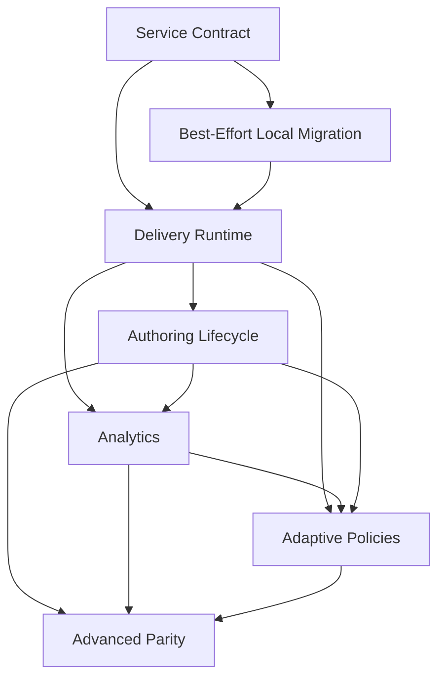

# Built-in A/B Testing Roadmap

Last updated: 2026-06-11

Context reference:

- `docs/exec-plans/current/epics/ab_testing/informal.md`

## Purpose

This roadmap coordinates replacing Torus's external UpGrade dependency with native A/B testing support. It is a parent roadmap for multiple child work items, not a phase-by-phase implementation plan for the whole epic.

The work should first preserve the simple A/B/N alternatives behavior Torus uses today, then expand into native lifecycle, analytics, adaptive assignment, and selected UpGrade-like capabilities where they are product requirements.

## Core Direction

- Build A/B testing as a separate service within the Torus monolith, with strict domain boundaries, Torus-owned persistence, and a separate API instead of runtime HTTP calls to UpGrade.
- Keep delivery, authoring, analytics, and migration code behind the A/B testing service API; they must not query or mutate experiment tables directly.
- Preserve current learner behavior for alternatives decision points, including sticky assignment and first-option fallback when no active experiment applies.
- Treat assignment algorithms as a first-class internal boundary inside the A/B testing service, with weighted deterministic random assignment as the baseline policy.
- Include the assignment, exposure, outcome, reward, and policy-state paths needed for adaptive assignment without forcing delivery code to know which algorithm is active.
- Make a reasonable best effort to preserve active learner assignments from Torus-local data, and treat learners without recoverable local assignment data as unassigned.
- Remove UpGrade-specific authoring copy, JSON export workflow, configuration, and runtime dependencies only after native assignment is proven and active migrations are complete.

## Current Foundation

Torus currently uses UpGrade narrowly:

- `lib/oli/delivery/experiments.ex` initializes users, assigns conditions, marks applied decision points, and logs metrics through UpGrade HTTP endpoints.
- `lib/oli/resources/alternatives/decision_point_strategy.ex` asks the experiment provider for a condition and caches the selected condition in section extrinsic state.
- `lib/oli/delivery/experiments/log_worker.ex` posts correctness metrics after evaluated activity attempts.
- `lib/oli/delivery/experiments/experiment_builder.ex` and `lib/oli/delivery/experiments/segment_builder.ex` generate UpGrade import JSON.
- `lib/oli_web/live/workspaces/course_author/experiments_live.ex` and `lib/oli_web/live/experiments/experiments_live.ex` expose the current authoring and JSON-download workflow.
- `priv/repo/migrations/20230302142539_has_experiments.exs` stores the current project and section experiment-enabled flag.

The current product surface is effectively simple alternatives experimentation: a project or section is experiment-enabled, an alternatives decision point contains condition options, delivery assigns an enrollment to one condition, that condition controls visible alternative content, and correctness is logged asynchronously.

Important constraint: active assignment truth may currently be split between UpGrade and Torus extrinsic state. Native cutover should use Torus-local state as the practical preservation source, keep recoverable assignments stable, and treat missing or ambiguous local assignment data as unassigned.

## Sequencing Principles

- Establish the A/B testing service boundary, public API, data ownership rules, and anti-corruption layer before replacing runtime delivery calls.
- Require all cross-domain interactions to go through service request/response shapes, commands, queries, or events instead of shared schemas or direct repository access.
- Preserve existing learner assignments from Torus-local data before enabling native assignment for active experiments, while accepting native assignment for learners without recoverable local assignment data.
- Put assignment, exposure, outcome, reward, and algorithm boundaries in place before implementing adaptive policies.
- Keep authoring UI changes behind stable runtime and migration behavior.
- Build analytics only after assignment and exposure records have a reliable source of truth.
- Treat advanced UpGrade parity as follow-on product scope, not as a blocker for removing the dependency.
- Respect published content immutability; experiments choose delivery alternatives without mutating published revisions.

## Feature Sequence

### 1. A/B Testing Service Boundary And API Contract

Likely directory: `docs/exec-plans/current/epics/ab_testing/service_contract/`

Deliver:

- A monolith-internal A/B testing service boundary with explicit ownership of experiment definitions, decision points, conditions, assignments, exposures, events or outcome associations, rewards, and algorithm state.
- Separate service APIs for delivery-time assignment/exposure, authoring/lifecycle, Torus-local migration/backfill, analytics reads, and reward/outcome feedback.
- API request and response types that use domain language and stable IDs instead of leaking Ecto schemas or implementation tables across boundaries.
- An anti-corruption layer from the current UpGrade-shaped provider interface into native service commands and queries.
- Rules that prevent delivery, authoring, analytics, and migration code from directly querying or mutating A/B testing persistence.
- Assignment algorithm behavior contracts such as `assign_condition` and `record_reward` inside the service.
- Baseline support for individual assignment by enrollment and weighted deterministic random assignment.
- Multi-tenant scoping rules for project, section, user, and enrollment data at the service API boundary.

Defer:

- Authoring UI redesign.
- Full lifecycle controls beyond what is needed to validate active versus inactive experiments.
- Analytics dashboards.
- Cross-service extraction outside the monolith.
- Advanced UpGrade parity such as factorial experiments, stratified sampling, feature flags, and within-subject assignment.

Dependencies:

- Existing alternatives resources and section extrinsic state behavior.
- Existing `has_experiments` project and section flags.

Why this comes here:

- Runtime replacement, migration, analytics, and adaptive policies all need a durable native source of truth and a stable service API before they can be implemented safely. Making the boundary explicit first prevents later slices from coupling directly to tables or implementation modules.

Expected child artifacts:

- `docs/exec-plans/current/epics/ab_testing/service_contract/prd.md`
- `docs/exec-plans/current/epics/ab_testing/service_contract/fdd.md`
- `docs/exec-plans/current/epics/ab_testing/service_contract/requirements.yml`
- `docs/exec-plans/current/epics/ab_testing/service_contract/plan.md`

### 2. Best-Effort Local Assignment Migration And Cutover Readiness

Likely directory: `docs/exec-plans/current/epics/ab_testing/migration_cutover/`

Deliver:

- Inventory and mapping strategy for active UpGrade-backed experiments, Torus alternatives resources, conditions, decision points, sections, projects, enrollments, and available Torus-local assignment state.
- Backfill path for recoverable assignments from section extrinsic state or other Torus-local data into native assignment records.
- Classification rules for missing, ambiguous, fallback, or otherwise untrustworthy local assignment data.
- Cutover controls such as a feature flag, pilot scope, or observation mode where feasible.
- Clear handling for historical UpGrade logs that are not imported for MVP cutover.
- Guardrails that reuse backfilled assignments and treat learners without recoverable assignments as unassigned.

Defer:

- Removing UpGrade runtime code.
- Removing authoring JSON export workflow.
- Building new analytics beyond migration validation reports.

Dependencies:

- Native service API, persistence, and assignment records from `service_contract`.

Why this comes here:

- Native delivery cannot become authoritative until Torus has made a best-effort pass over available local assignment data. This comes before runtime cutover because recoverable learner assignments should remain stable, while learners without recoverable assignments should enter the native assignment path as unassigned.

Expected child artifacts:

- `docs/exec-plans/current/epics/ab_testing/migration_cutover/prd.md`
- `docs/exec-plans/current/epics/ab_testing/migration_cutover/fdd.md`
- `docs/exec-plans/current/epics/ab_testing/migration_cutover/requirements.yml`
- `docs/exec-plans/current/epics/ab_testing/migration_cutover/plan.md`

### 3. Native Delivery Runtime Replacement

Likely directory: `docs/exec-plans/current/epics/ab_testing/delivery_runtime/`

Deliver:

- Replacement of UpGrade assignment, mark, and log runtime calls with A/B testing service API calls.
- Sticky assignment reuse from service-owned assignment records.
- Native assignment for learners who do not have a recoverable backfilled assignment.
- Exposure recording when decision point content is applied.
- Correct fallback behavior when no active experiment applies.
- Correctness or outcome association after evaluated activity attempts.
- Runtime tests for stickiness, weights, fallback, exposure logging, project/section gating, and attempt outcome association.

Defer:

- Rich authoring lifecycle controls.
- Research dashboards.
- Adaptive policy tuning UI.
- Removing all UpGrade-related files before migration completion is proven.

Dependencies:

- Native A/B testing service API and persistence.
- Best-effort local assignment migration and cutover readiness for active experiments.

Why this comes here:

- This is the dependency-removal center of the epic. It follows migration readiness because delivery is where learner-facing behavior can be disrupted.

Expected child artifacts:

- `docs/exec-plans/current/epics/ab_testing/delivery_runtime/prd.md`
- `docs/exec-plans/current/epics/ab_testing/delivery_runtime/fdd.md`
- `docs/exec-plans/current/epics/ab_testing/delivery_runtime/requirements.yml`
- `docs/exec-plans/current/epics/ab_testing/delivery_runtime/plan.md`

### 4. Native Authoring And Experiment Lifecycle

Likely directory: `docs/exec-plans/current/epics/ab_testing/authoring_lifecycle/`

Deliver:

- Authoring updates that remove UpGrade-specific copy and JSON download workflows.
- Native create, edit, start, pause, complete, and archive behavior where required.
- Configurable condition weights for simple A/B/N experiments.
- Validation rules for condition changes after assignments exist.
- Start and end date support if required for native lifecycle parity.
- Permission rules for who can create, start, pause, complete, or archive experiments.

Defer:

- Full UpGrade admin UI parity.
- Preview users and preview assignments unless required for the initial native authoring release.
- Advanced segments, factorial designs, and feature flags.

Dependencies:

- Service-owned persistence and lifecycle state validation.
- Delivery runtime replacement semantics for active experiment states.
- Authoring-facing A/B testing service APIs rather than direct table access.

Why this comes here:

- Authors should not manage native lifecycle controls until the runtime model is stable enough for those controls to have predictable delivery effects.

Expected child artifacts:

- `docs/exec-plans/current/epics/ab_testing/authoring_lifecycle/prd.md`
- `docs/exec-plans/current/epics/ab_testing/authoring_lifecycle/fdd.md`
- `docs/exec-plans/current/epics/ab_testing/authoring_lifecycle/requirements.yml`
- `docs/exec-plans/current/epics/ab_testing/authoring_lifecycle/plan.md`

### 5. Outcome Analytics And Research Visibility

Likely directory: `docs/exec-plans/current/epics/ab_testing/analytics/`

Deliver:

- Assignment and exposure analytics by experiment, decision point, and condition.
- Outcome reporting based on existing attempt data and/or explicit experiment events.
- Clear timestamp and scope semantics for joining assignments, exposures, and activity attempts.
- Basic monitoring for missing exposures, missing outcomes, failed reward updates, and unexpected assignment imbalance.
- Export or reporting surfaces needed before UpGrade can be fully retired.

Defer:

- Complex metric-query language parity with UpGrade.
- Long-term warehouse or research-data product decisions unless required for dependency removal.
- Adaptive algorithm monitoring beyond the fields needed to validate reward flow.

Dependencies:

- Service-owned assignment, exposure, and outcome records from delivery runtime.
- Lifecycle states that define which experiments should appear in reporting.
- Analytics-facing A/B testing service queries or read models rather than direct table access.

Why this comes here:

- Analytics should be built on service-owned assignment and exposure data after those records are authoritative. Building dashboards earlier risks reporting against a transitional or split source of truth.

Expected child artifacts:

- `docs/exec-plans/current/epics/ab_testing/analytics/prd.md`
- `docs/exec-plans/current/epics/ab_testing/analytics/fdd.md`
- `docs/exec-plans/current/epics/ab_testing/analytics/requirements.yml`
- `docs/exec-plans/current/epics/ab_testing/analytics/plan.md`

### 6. Adaptive Assignment Policies

Likely directory: `docs/exec-plans/current/epics/ab_testing/adaptive_policies/`

Deliver:

- Initial adaptive assignment policy or policy adapter selected from product and research requirements.
- Reward-feedback handling for delayed, sparse, biased, or missing outcomes.
- Policy state persistence and auditability.
- Guardrails such as minimum sample sizes, traffic caps, fixed control allocation, and manual pause thresholds where required.
- Monitoring that helps researchers and administrators understand adaptive behavior.

Defer:

- Every UpGrade or Mooclet algorithm variant unless explicitly required.
- Contextual bandit support unless the initial reward and context model justifies it.
- Advanced group assignment, segments, and factorial policies that belong to later parity work.

Dependencies:

- Stable assignment algorithm boundary from `service_contract`.
- Reliable outcome and reward plumbing from delivery runtime and analytics work.
- Lifecycle controls that can pause or stop risky adaptive behavior.

Why this comes here:

- Adaptive assignment depends on trustworthy assignment, exposure, outcome, reward, and monitoring loops. It should not be the first native runtime policy even though the architecture must support it from the beginning.

Expected child artifacts:

- `docs/exec-plans/current/epics/ab_testing/adaptive_policies/prd.md`
- `docs/exec-plans/current/epics/ab_testing/adaptive_policies/fdd.md`
- `docs/exec-plans/current/epics/ab_testing/adaptive_policies/requirements.yml`
- `docs/exec-plans/current/epics/ab_testing/adaptive_policies/plan.md`

### 7. Advanced Experiment Parity

Likely directory: `docs/exec-plans/current/epics/ab_testing/advanced_parity/`

Deliver:

- Product-selected UpGrade parity features after the native replacement is stable.
- Candidate capabilities include group assignment, inclusion and exclusion segments, multiple decision points per experiment, post-experiment behavior, factorial conditions, stratified sampling, within-subject assignment, feature flags, audit logs, preview users, and import/export interoperability.
- A prioritization model that distinguishes required native product features from compatibility conveniences.

Defer:

- Any advanced capability that does not have a clear Torus product use case or active migration need.

Dependencies:

- Native runtime replacement.
- Authoring lifecycle and analytics foundations.
- Adaptive policy work where advanced parity affects algorithm selection or reward modeling.

Why this comes here:

- Full UpGrade parity is a substantially larger platform effort. It should not block removing the external dependency for the simple alternatives workflow Torus uses today.

Expected child artifacts:

- `docs/exec-plans/current/epics/ab_testing/advanced_parity/prd.md`
- `docs/exec-plans/current/epics/ab_testing/advanced_parity/fdd.md`
- `docs/exec-plans/current/epics/ab_testing/advanced_parity/requirements.yml`
- `docs/exec-plans/current/epics/ab_testing/advanced_parity/plan.md`

## Slice Dependency Graph

## Cross-Cutting Concerns

- Migration and cutover: active assignments should be preserved from Torus-local data where feasible before runtime cutover; missing or ambiguous local state should result in native assignment on next exposure.
- Service boundary and API discipline: A/B testing is a separate service inside the monolith; all other Torus domains should depend on its API contracts, not its schemas, queries, or tables.
- Data ownership and persistence: native tables should be the source of truth for experiment definitions, assignments, exposures, rewards, and auditable policy state, and those tables should be owned by the A/B testing service.
- Security and privacy: all reads and writes must be scoped by institution, project, section, user, and enrollment as appropriate; research exports must avoid exposing unnecessary learner data.
- Published content immutability: experiment choices can select alternatives at delivery time but must not mutate published revisions.
- Reliability and performance: assignment should be local and transactional, avoid repeated remote calls, and preserve fallback behavior when no active experiment applies.
- Observability and auditability: assignment decisions, exposures, failed outcome joins, reward updates, lifecycle changes, and adaptive policy updates should be inspectable enough for operations and research review.
- Testing and verification: coverage should include assignment stickiness, weighted distribution behavior, fallback behavior, exposure recording, project and section gating, best-effort migration preservation, unassigned-after-missing-local-state behavior, attempt outcome association, permission checks, and lifecycle transitions.
- Product scope control: advanced UpGrade capabilities should be accepted only when tied to a current Torus need, migration requirement, or explicit roadmap commitment.

## Initial Effort Estimate

These rough ranges assume existing Torus authoring and delivery patterns are reused through a new A/B testing service API. Treating A/B testing as a separate monolith-internal service adds contract design, API adapters, boundary tests, and review overhead, but it also reduces long-term coupling and leaves a clearer path to future extraction if that ever becomes necessary.

Rough implementation shape:

- A/B testing service boundary, native service-owned persistence, delivery assignment API, baseline weighted assignment, and anti-corruption around the current UpGrade-shaped runtime interface: 7-10 weeks.
- Best-effort local assignment migration, delivery runtime cutover, and UpGrade dependency removal through the service API: 5-7 weeks.
- Authoring lifecycle, basic analytics, and reward/outcome plumbing through service APIs/read models: 6-8 weeks.
- Adaptive assignment policy implementation and monitoring plus richer UpGrade-like group assignment, segments, import/export, and audit logs: 9-13 weeks.
- Advanced parity such as factorial, stratified sampling, within-subjects, or feature flags: 2-4+ months depending on selected scope.

## Open Questions

- Which UpGrade features are actually used in production beyond simple alternatives experiments?
- Are any active experiments using group assignment, segments, factorial designs, stratified sampling, feature flags, or Mooclet-style adaptive assignment?
- What Torus-local assignment data is available for each active experiment, and how reliably can it be mapped to native assignments?
- How should missing, ambiguous, or fallback cached assignments be classified during best-effort local migration?
- How many active experiments need best-effort local migration, and can any be paused or completed before cutover?
- What exact API surfaces should the A/B testing service expose for delivery, authoring, migration, analytics, and reward feedback?
- What repository or module boundaries should prevent other Torus contexts from directly accessing A/B testing schemas and tables?
- Should native experiments be authored at project level, section level, or both?
- Should assignment occur at first page render, first decision point render, or first attempt creation?
- Should outcome analytics join existing Torus attempt data or store explicit experiment event metrics?
- Which adaptive assignment algorithm is required first, and should it run fully inside Torus or behind an external policy-service adapter?
- What reward signal should drive adaptive assignment: correctness, score delta, completion, time on task, later mastery, or configurable metrics?
- What guardrails are required before adaptive assignment can run in production?
- What minimum analytics do researchers, authors, instructors, and administrators need before UpGrade can be removed?
- What should happen when authors edit condition options after learners already have assignments?

## Recommended Next Slice

Start with `docs/exec-plans/current/epics/ab_testing/service_contract/` because every later slice depends on the A/B testing service API, domain boundary, native data model, and ownership rules. Use `harness-analyze` next to create `docs/exec-plans/current/epics/ab_testing/service_contract/prd.md`.
