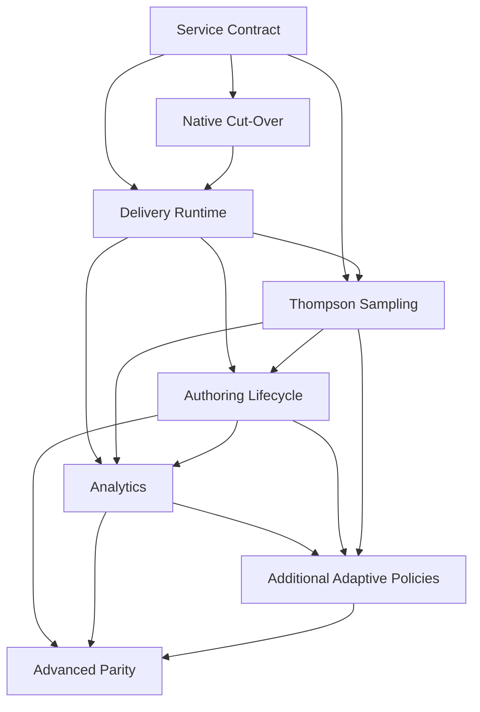

# Built-in A/B Testing Roadmap

Last updated: 2026-06-22

Context reference:

- `docs/exec-plans/current/epics/ab_testing/informal.md`
- `docs/exec-plans/current/epics/ab_testing/references/EASI_ThompsonSampling.ipynb`

## Purpose

This roadmap coordinates replacing Torus's external UpGrade dependency with native A/B testing support through a hard cut-over. It is a parent roadmap for multiple child work items, not a phase-by-phase implementation plan for the whole epic.

The work should first maintain the simple A/B/N alternatives behavior Torus uses today while adding MVP-native adaptive assignment through Thompson Sampling, then expand into native lifecycle, analytics, and selected advanced capabilities where they are product requirements.

## Core Direction

- Build A/B testing as a separate service within the Torus monolith, with strict domain boundaries, Torus-owned persistence, and a separate API instead of runtime HTTP calls to UpGrade.
- Keep delivery, authoring, and analytics code behind the A/B testing service API; they must not query or mutate experiment tables directly.
- Maintain current learner-facing alternatives behavior, including sticky native assignment and first-option fallback when no active native experiment applies.
- Treat assignment algorithms as a first-class internal boundary inside the A/B testing service, with weighted deterministic random assignment as the baseline non-adaptive policy and Thompson Sampling as the required MVP adaptive policy.
- Implement Thompson Sampling initially as a non-contextual Beta-Bernoulli policy for binary rewards, following `docs/exec-plans/current/epics/ab_testing/references/EASI_ThompsonSampling.ipynb`.
- Include the assignment, exposure, outcome, reward, and policy-state paths needed for Thompson Sampling without forcing delivery code to know which algorithm is active.
- Make a hard cut-over to native A/B testing; legacy UpGrade runtime assignment, mark, and log support does not continue with the new feature.
- Do not migrate existing or in-progress UpGrade-based experiments; native A/B testing is a new feature and all learners are new participants in native experiments.
- Remove UpGrade-specific authoring copy, JSON export workflow, configuration, and runtime dependencies as part of the native cut-over.

## Current Foundation

Torus currently uses UpGrade narrowly:

- `lib/oli/delivery/experiments.ex` initializes users, assigns conditions, marks applied decision points, and logs metrics through UpGrade HTTP endpoints.
- `lib/oli/resources/alternatives/decision_point_strategy.ex` asks the experiment provider for a condition and caches the selected condition in section extrinsic state.
- `lib/oli/delivery/experiments/log_worker.ex` posts correctness metrics after evaluated activity attempts.
- `lib/oli/delivery/experiments/experiment_builder.ex` and `lib/oli/delivery/experiments/segment_builder.ex` generate UpGrade import JSON.
- `lib/oli_web/live/workspaces/course_author/experiments_live.ex` and `lib/oli_web/live/experiments/experiments_live.ex` expose the current authoring and JSON-download workflow.
- `priv/repo/migrations/20230302142539_has_experiments.exs` stores the current project and section experiment-enabled flag.

The current product surface is effectively simple alternatives experimentation: a project or section is experiment-enabled, an alternatives decision point contains condition options, delivery assigns an enrollment to one condition, that condition controls visible alternative content, and correctness is logged asynchronously.

Important constraint: existing and in-progress UpGrade-backed experiments are not migrated into native experiment records. Native A/B testing starts fresh: new native experiments are authored in Torus, native assignments start from the native service, and all learners are considered new participants for native experiments.

## Sequencing Principles

- Establish the A/B testing service boundary, public API, data ownership rules, and anti-corruption layer before replacing runtime delivery calls.
- Require all cross-domain interactions to go through service request/response shapes, commands, queries, or events instead of shared schemas or direct repository access.
- Treat native A/B testing as a new feature: route all new experiments to native authoring and native assignment, and do not import existing UpGrade experiments or learner assignments.
- Put assignment, exposure, outcome, reward, and algorithm boundaries in place before enabling Thompson Sampling in production.
- Keep authoring UI changes behind stable native runtime behavior.
- Build analytics only after assignment, exposure, reward, and policy-state records have a reliable source of truth.
- Treat advanced UpGrade parity as follow-on product scope, not as a blocker for removing the dependency.
- Respect published content immutability; experiments choose delivery alternatives without mutating published revisions.

## Feature Sequence

### 1. A/B Testing Service Boundary And API Contract

Likely directory: `docs/exec-plans/current/epics/ab_testing/service_contract/`

Deliver:

- A monolith-internal A/B testing service boundary with explicit ownership of experiment definitions, decision points, conditions, assignments, exposures, events or outcome associations, rewards, and algorithm state.
- Separate service APIs for delivery-time assignment/exposure, authoring/lifecycle, analytics reads, and reward/outcome feedback.
- API request and response types that use domain language and stable IDs instead of leaking Ecto schemas or implementation tables across boundaries.
- An anti-corruption layer from current UpGrade-shaped provider behavior into native service commands and queries during replacement.
- Rules that prevent delivery, authoring, and analytics code from directly querying or mutating A/B testing persistence.
- Assignment algorithm behavior contracts such as `assign_condition` and `record_reward` inside the service.
- Baseline support for individual assignment by enrollment, weighted deterministic random assignment, and Thompson Sampling policy state contracts.
- Thompson Sampling state shape for per-condition Beta posterior parameters, prior configuration, algorithm name/version, and reproducible update metadata.
- Multi-tenant scoping rules for project, section, user, and enrollment data at the service API boundary.

Defer:

- Authoring UI redesign.
- Full lifecycle controls beyond what is needed to validate active versus inactive experiments.
- Analytics dashboards.
- Cross-service extraction outside the monolith.
- Advanced UpGrade parity such as factorial experiments, stratified sampling, feature flags, and within-subject assignment.

Dependencies:

- Existing alternatives resources and section extrinsic state behavior.
- Existing `has_experiments` project and section flags.

Why this comes here:

- Runtime replacement, analytics, and Thompson Sampling all need a durable native source of truth and a stable service API before they can be implemented safely. Making the boundary explicit first prevents later slices from coupling directly to tables or implementation modules.

Expected child artifacts:

- `docs/exec-plans/current/epics/ab_testing/service_contract/prd.md`
- `docs/exec-plans/current/epics/ab_testing/service_contract/fdd.md`
- `docs/exec-plans/current/epics/ab_testing/service_contract/requirements.yml`
- `docs/exec-plans/current/epics/ab_testing/service_contract/plan.md`

### 2. Native Cut-Over And UpGrade Removal

Likely directory: `docs/exec-plans/current/epics/ab_testing/native_cutover/`

Deliver:

- Native-only authoring gate for all new experiments.
- Explicit non-migration rule for existing or in-progress UpGrade-backed experiments.
- Native participant rule: every learner is treated as a new participant for native experiments.
- Authoring rules that prevent new UpGrade-backed experiment creation and route all new experiment authoring to native definitions.
- Removal or disabling of the UpGrade JSON export/import workflow.
- Hard cut-over controls that remove runtime dependence on UpGrade assignment, mark, and log calls.
- Removal of UpGrade configuration and obsolete runtime integration paths once native delivery is active.

Explicitly exclude:

- Migration of existing or in-progress UpGrade-backed experiments.
- Preservation or import of UpGrade learner assignments.
- Historical UpGrade analytics import.
- Continuing UpGrade runtime assignment, mark, or log support after cut-over.

Dependencies:

- Native service API, persistence, experiment identity rules, and assignment records from `service_contract`.
- Existing UpGrade authoring and runtime entry points that must be disabled or removed.

Why this comes here:

- Native delivery can become authoritative only after new authoring is routed to native definitions and the UpGrade runtime path is no longer used for new feature behavior. This comes before runtime replacement because delivery must only call the native service for native experiments.

Expected child artifacts:

- `docs/exec-plans/current/epics/ab_testing/native_cutover/prd.md`
- `docs/exec-plans/current/epics/ab_testing/native_cutover/fdd.md`
- `docs/exec-plans/current/epics/ab_testing/native_cutover/requirements.yml`
- `docs/exec-plans/current/epics/ab_testing/native_cutover/plan.md`

### 3. Native Delivery Runtime Replacement

Likely directory: `docs/exec-plans/current/epics/ab_testing/delivery_runtime/`

Deliver:

- Native assignment, exposure, and reward runtime calls through the A/B testing service API for native experiments.
- Sticky assignment reuse from service-owned assignment records.
- Native first assignment for all learners entering native experiments.
- Exposure recording when decision point content is applied.
- Correct fallback behavior when no active experiment applies.
- Correctness or outcome association after evaluated activity attempts.
- Reward event recording that can later update Thompson Sampling posterior state without duplicating reward counts.
- Runtime tests for stickiness, weights, fallback, exposure logging, project/section gating, attempt outcome association, and idempotent reward handoff.

Defer:

- Rich authoring lifecycle controls.
- Research dashboards.
- Rich adaptive policy tuning UI beyond the MVP controls required to enable Thompson Sampling safely.
- Continuing UpGrade runtime assignment, mark, or log support after cut-over.

Dependencies:

- Native A/B testing service API and persistence.
- Native cut-over and UpGrade removal readiness.

Why this comes here:

- This is the dependency-removal center of the epic. It follows native cut-over readiness because delivery is where learner-facing behavior can be disrupted if assignment, exposure, fallback, and reward behavior are not fully native.

Expected child artifacts:

- `docs/exec-plans/current/epics/ab_testing/delivery_runtime/prd.md`
- `docs/exec-plans/current/epics/ab_testing/delivery_runtime/fdd.md`
- `docs/exec-plans/current/epics/ab_testing/delivery_runtime/requirements.yml`
- `docs/exec-plans/current/epics/ab_testing/delivery_runtime/plan.md`

### 4. Thompson Sampling MVP Adaptive Policy

Likely directory: `docs/exec-plans/current/epics/ab_testing/thompson_sampling/`

Deliver:

- Native non-contextual Thompson Sampling for A/B/N alternatives experiments.
- Beta-Bernoulli binary reward model with configurable or default Beta(1,1) priors.
- Assignment-time posterior sampling across active conditions and selection of the condition with the highest sampled value.
- Reward-time posterior updates for the assigned condition only, incrementing success or failure counts from an idempotent binary reward event.
- Persisted policy state, algorithm version, prior configuration, update provenance, and enough audit metadata for research review.
- Guardrails such as warm-up or minimum sample thresholds, optional fixed control allocation, traffic caps, manual pause, and monitoring for missing rewards or extreme assignment imbalance where required for MVP operation.
- Tests for posterior sampling behavior, posterior updates, idempotent reward processing, delayed reward handling, sticky assignment despite changing policy state, and fallback to weighted random when Thompson Sampling is disabled.

Defer:

- Contextual Thompson Sampling using participant or course features.
- Continuous reward models, score-delta optimization, delayed mastery optimization, or multi-objective rewards.
- Batch or parallel Thompson Sampling updates beyond what is needed for reliable Oban-backed reward processing.
- Every UpGrade or Mooclet adaptive variant other than the required MVP Thompson Sampling policy.

Dependencies:

- Stable assignment algorithm boundary and Thompson Sampling state contracts from `service_contract`.
- Delivery runtime reward handoff and exposure/outcome records from `delivery_runtime`.

Why this comes here:

- Thompson Sampling is now required MVP scope, but it depends on native assignment, exposure, and reward plumbing. It should be implemented immediately after delivery runtime replacement so adaptive behavior can be validated before authoring and analytics surfaces make it broadly available.

Expected child artifacts:

- `docs/exec-plans/current/epics/ab_testing/thompson_sampling/prd.md`
- `docs/exec-plans/current/epics/ab_testing/thompson_sampling/fdd.md`
- `docs/exec-plans/current/epics/ab_testing/thompson_sampling/requirements.yml`
- `docs/exec-plans/current/epics/ab_testing/thompson_sampling/plan.md`

### 5. Native Authoring And Experiment Lifecycle

Likely directory: `docs/exec-plans/current/epics/ab_testing/authoring_lifecycle/`

Deliver:

- Authoring updates that remove UpGrade-specific copy and JSON download workflows.
- Native create, edit, start, pause, complete, and archive behavior where required.
- Configurable condition weights for simple A/B/N experiments.
- MVP controls for selecting weighted random versus Thompson Sampling where product requirements allow author choice.
- Required Thompson Sampling guardrail controls or admin-only defaults needed before adaptive experiments can run.
- Validation rules for condition changes after assignments exist.
- Start and end date support if required for native lifecycle parity.
- Permission rules for who can create, start, pause, complete, or archive experiments.

Defer:

- Full UpGrade admin UI parity.
- Preview users and preview assignments unless required for the initial native authoring release.
- Advanced segments, factorial designs, and feature flags.

Dependencies:

- Service-owned persistence and lifecycle state validation.
- Delivery runtime replacement semantics for active experiment states.
- Thompson Sampling policy state and guardrail semantics where adaptive experiments are authorable.
- Authoring-facing A/B testing service APIs rather than direct table access.

Why this comes here:

- Authors should not manage native lifecycle controls until the runtime model is stable enough for those controls to have predictable delivery effects.

Expected child artifacts:

- `docs/exec-plans/current/epics/ab_testing/authoring_lifecycle/prd.md`
- `docs/exec-plans/current/epics/ab_testing/authoring_lifecycle/fdd.md`
- `docs/exec-plans/current/epics/ab_testing/authoring_lifecycle/requirements.yml`
- `docs/exec-plans/current/epics/ab_testing/authoring_lifecycle/plan.md`

### 6. Outcome Analytics And Research Visibility

Likely directory: `docs/exec-plans/current/epics/ab_testing/analytics/`

Deliver:

- Assignment and exposure analytics by experiment, decision point, and condition.
- Outcome reporting based on existing attempt data and/or explicit experiment events.
- Clear timestamp and scope semantics for joining assignments, exposures, and activity attempts.
- Basic monitoring for missing exposures, missing outcomes, failed reward updates, and unexpected assignment imbalance.
- Thompson Sampling monitoring for posterior state by condition, reward counts, assignment share over time, missing/delayed rewards, and guardrail-triggered pauses.
- Reporting surfaces needed before native A/B testing is broadly available.

Defer:

- Complex metric-query language parity with UpGrade.
- Long-term warehouse or research-data product decisions unless required for dependency removal.
- Advanced adaptive algorithm monitoring beyond the fields needed to validate Thompson Sampling reward flow and posterior state.

Dependencies:

- Service-owned assignment, exposure, and outcome records from delivery runtime.
- Thompson Sampling policy state and reward records for adaptive experiments.
- Lifecycle states that define which experiments should appear in reporting.
- Analytics-facing A/B testing service queries or read models rather than direct table access.

Why this comes here:

- Analytics should be built on service-owned assignment and exposure data after those records are authoritative. Building dashboards earlier risks reporting against a transitional or split source of truth.

Expected child artifacts:

- `docs/exec-plans/current/epics/ab_testing/analytics/prd.md`
- `docs/exec-plans/current/epics/ab_testing/analytics/fdd.md`
- `docs/exec-plans/current/epics/ab_testing/analytics/requirements.yml`
- `docs/exec-plans/current/epics/ab_testing/analytics/plan.md`

### 7. Additional Adaptive Assignment Policies

Likely directory: `docs/exec-plans/current/epics/ab_testing/adaptive_policies/`

Deliver:

- Additional adaptive assignment policies or policy adapters selected from product and research requirements after MVP Thompson Sampling.
- Reward-feedback handling for delayed, sparse, biased, or missing outcomes.
- Policy state persistence and auditability.
- Guardrails such as minimum sample sizes, traffic caps, fixed control allocation, and manual pause thresholds where required.
- Monitoring that helps researchers and administrators understand adaptive behavior.

Defer:

- Every UpGrade or Mooclet algorithm variant unless explicitly required.
- Contextual bandit support unless the reward and context model justifies it.
- Advanced group assignment, segments, and factorial policies that belong to later parity work.

Dependencies:

- Stable assignment algorithm boundary from `service_contract`.
- Reliable outcome and reward plumbing from delivery runtime and analytics work.
- MVP Thompson Sampling implementation and operational learnings.
- Lifecycle controls that can pause or stop risky adaptive behavior.

Why this comes here:

- Additional adaptive policies depend on trustworthy assignment, exposure, outcome, reward, and monitoring loops. Thompson Sampling handles the MVP adaptive requirement; this slice is for later variants or external policy adapters.

Expected child artifacts:

- `docs/exec-plans/current/epics/ab_testing/adaptive_policies/prd.md`
- `docs/exec-plans/current/epics/ab_testing/adaptive_policies/fdd.md`
- `docs/exec-plans/current/epics/ab_testing/adaptive_policies/requirements.yml`
- `docs/exec-plans/current/epics/ab_testing/adaptive_policies/plan.md`

### 8. Advanced Experiment Parity

Likely directory: `docs/exec-plans/current/epics/ab_testing/advanced_parity/`

Deliver:

- Product-selected UpGrade parity features after the native replacement is stable.
- Candidate capabilities include group assignment, inclusion and exclusion segments, multiple decision points per experiment, post-experiment behavior, factorial conditions, stratified sampling, within-subject assignment, feature flags, audit logs, and preview users.
- A prioritization model that distinguishes required native product features from compatibility conveniences.

Defer:

- Any advanced capability that does not have a clear Torus product use case or native feature need.

Dependencies:

- Native runtime replacement.
- Authoring lifecycle and analytics foundations.
- Thompson Sampling and additional adaptive policy work where advanced parity affects algorithm selection or reward modeling.

Why this comes here:

- Full UpGrade parity is a substantially larger platform effort. It should not block removing the external dependency for the simple alternatives workflow Torus uses today.

Expected child artifacts:

- `docs/exec-plans/current/epics/ab_testing/advanced_parity/prd.md`
- `docs/exec-plans/current/epics/ab_testing/advanced_parity/fdd.md`
- `docs/exec-plans/current/epics/ab_testing/advanced_parity/requirements.yml`
- `docs/exec-plans/current/epics/ab_testing/advanced_parity/plan.md`

## Slice Dependency Graph

## Cross-Cutting Concerns

- Cutover: existing and in-progress UpGrade experiments are not migrated; native A/B testing starts as a new feature, all learners are new participants in native experiments, and UpGrade runtime assignment/mark/log calls are removed.
- Service boundary and API discipline: A/B testing is a separate service inside the monolith; all other Torus domains should depend on its API contracts, not its schemas, queries, or tables.
- Data ownership and persistence: native tables should be the source of truth for experiment definitions, assignments, exposures, rewards, and auditable policy state, and those tables should be owned by the A/B testing service.
- Security and privacy: all reads and writes must be scoped by institution, project, section, user, and enrollment as appropriate; research exports must avoid exposing unnecessary learner data.
- Published content immutability: experiment choices can select alternatives at delivery time but must not mutate published revisions.
- Reliability and performance: assignment should be local and transactional, avoid repeated remote calls, and preserve fallback behavior when no active experiment applies.
- Observability and auditability: assignment decisions, exposures, failed outcome joins, reward updates, Thompson Sampling posterior updates, lifecycle changes, and adaptive policy updates should be inspectable enough for operations and research review.
- Testing and verification: coverage should include assignment stickiness, weighted distribution behavior, Thompson Sampling posterior sampling and updates, fallback behavior, exposure recording, project and section gating, native-only authoring gates, first-assignment behavior for all learners, attempt outcome association, permission checks, and lifecycle transitions.
- Product scope control: advanced UpGrade capabilities should be accepted only when tied to a current Torus need, native feature requirement, or explicit roadmap commitment.

## Initial Effort Estimate

These rough ranges assume existing Torus authoring and delivery patterns are reused through a new A/B testing service API. Treating A/B testing as a separate monolith-internal service adds contract design, API adapters, boundary tests, and review overhead, but it also reduces long-term coupling and leaves a clearer path to future extraction if that ever becomes necessary.

Rough implementation shape:

- A/B testing service boundary, native service-owned persistence, delivery assignment API, baseline weighted assignment, Thompson Sampling policy contracts/state shape, and anti-corruption around the current UpGrade-shaped runtime interface: 8-11 weeks.
- Native-only authoring gate, UpGrade removal, and hard cut-over to native delivery through the service API: 3-5 weeks.
- Authoring lifecycle, basic analytics, and reward/outcome plumbing through service APIs/read models: 6-8 weeks.
- Thompson Sampling implementation, adaptive guardrails, posterior-state auditability, and monitoring plus richer native group assignment, segments, and audit logs: 10-14 weeks.
- Advanced parity such as factorial, stratified sampling, within-subjects, or feature flags: 2-4+ months depending on selected scope.

## Open Questions

- What exact API surfaces should the A/B testing service expose for delivery, authoring, analytics, and reward feedback?
- What repository or module boundaries should prevent other Torus contexts from directly accessing A/B testing schemas and tables?
- Should native experiments be authored at project level, section level, or both?
- Should assignment occur at first page render, first decision point render, or first attempt creation?
- Should outcome analytics join existing Torus attempt data or store explicit experiment event metrics?
- Should MVP Thompson Sampling run fully inside Torus, behind an external policy-service adapter, or inside Torus first with a future adapter boundary?
- What binary reward signal should drive MVP Thompson Sampling: correctness, completion, configured attempt success, or another success/failure metric?
- What guardrails are required before Thompson Sampling can run in production?
- What minimum analytics do researchers, authors, instructors, and administrators need before native A/B testing is broadly available?
- What should happen when authors edit condition options after learners already have assignments?

## Recommended Next Slice

Start with `docs/exec-plans/current/epics/ab_testing/service_contract/` because every later slice depends on the A/B testing service API, domain boundary, native data model, and ownership rules. Use `harness-analyze` next to create `docs/exec-plans/current/epics/ab_testing/service_contract/prd.md`.
