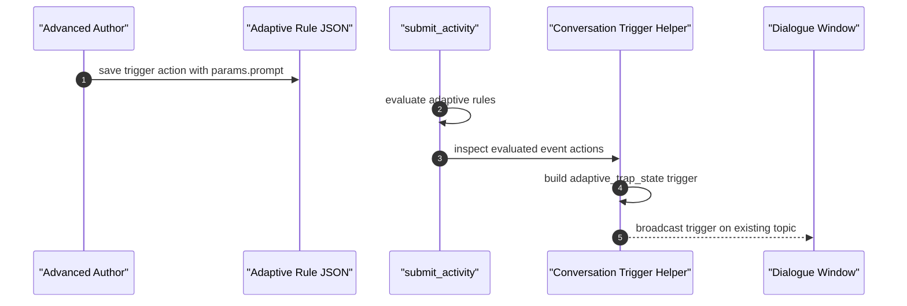

# Trap State Triggers - Functional Design Document

## 1. Executive Summary
This design extends Advanced Author adaptive rules with a new `Activation Point` action that stores a DOT prompt directly in the rule action list. The adaptive rules engine remains unchanged in how it evaluates conditions, but its returned event actions are now inspected server-side after `submit_activity` so the backend can emit a trap-state trigger without trusting the browser to send the authored prompt back. Authoring stays in the existing `AdaptivityEditor`, using an inline action card that reuses the current prompt-help treatment from basic-page activation points. Project trigger capability continues to gate both authoring visibility and save validation. No database schema, route, or new runtime service is introduced.

## 2. Requirements & Assumptions
- Functional requirements summary:
  - FR-001: Rules Editor exposes `Activation Point` only when project trigger capability is enabled.
  - FR-002: trap-state activation point prompt is authored and persisted in adaptive rule JSON.
  - FR-003: adaptive `submit_activity` fires a server-side trigger when evaluated rules include an activation point.
  - FR-004: adaptive delivery does not regress when unknown action types are returned from rules evaluation.
  - FR-005: clients cannot directly invoke the new trap-state trigger type.
- Non-functional targets:
  - No new endpoint or migration.
  - Fail closed on blank prompt or missing page context.
  - Preserve current adaptive evaluation response shape for the browser.
- Explicit assumptions:
  - The first trap-state activation point found in the evaluated result set is the only one that should fire per submit.
  - Only Advanced Author rules, not flowchart-generated rules, are in scope for this feature.

## 3. Torus Context Summary
- What we know:
  - Adaptive rules are persisted under `content.authoring.rules[*].event.params.actions`.
  - `AdaptivityEditor` already manages action lists for `feedback`, `navigation`, and `mutateState`.
  - `DeckLayoutFooter.processResults` currently assumes every adaptive action is one of those three types.
  - Adaptive `submit_activity` returns a map of rules-engine results; unlike basic part evaluation it does not currently expose a trigger object that `AttemptController` can fire.
  - Existing server-side trigger firing already exists for basic-page response/hint/explanation triggers in `AttemptController`.
- Unknowns to confirm:
  - None blocking implementation.

## 4. Proposed Design
### 4.1 Component Roles & Interactions
- Authoring:
  - Add a new adaptive action type `trigger`.
  - Add `ActionTriggerEditor` in `assets/src/apps/authoring/components/AdaptivityEditor/`.
  - Reuse `TriggerPromptEditor` from the basic-page trigger UI so prompt help, labeling, and textarea behavior stay aligned.
  - Gate the dropdown item behind `selectAllowTriggers`.
  - Show a best-practice warning near the conditions/activation area when a trap-state trigger action is present.
- Rules JSON:
  - Existing action list remains ordered and heterogeneous.
  - `trigger` action stores only authored prompt text in `params.prompt`.
- Delivery/frontend:
  - Extend adaptive action typings so `processResults` handles `trigger` without throwing.
  - The browser does not invoke trap-state triggers directly; it simply ignores `trigger` after grouping.
- Backend:
  - Add a new server-only trigger type `:adaptive_trap_state`.
  - Add trigger extraction helper(s) in `Oli.Conversation.Triggers` that scan adaptive rule-result events for the first `trigger` action and build `%Oli.Conversation.Trigger{}` using the page resource id and activity attempt guid.
  - Update `AttemptController.submit_activity/3` to run the adaptive trap-state extraction path after evaluation.
  - Reject client-submitted `adaptive_trap_state` payloads in `resolve_client_trigger/4`.
  - Extend adaptive content validation in `ActivityEditor` so trap-state trigger actions are rejected when project trigger capability is disabled.

### 4.2 State & Message Flow


### 4.3 JSON Shape
Current action list excerpt:
```json
{
  "event": {
    "params": {
      "actions": [
        { "type": "feedback", "params": { "id": "a_f_1", "feedback": {} } },
        { "type": "navigation", "params": { "target": "next" } }
      ]
    }
  }
}
```

Proposed extension:
```json
{
  "event": {
    "params": {
      "actions": [
        {
          "type": "trigger",
          "params": {
            "prompt": "The learner just hit this incorrect trap state. Ask a short reflective question before helping."
          }
        }
      ]
    }
  }
}
```

### 4.4 Alternatives Considered
- Fire the trap-state trigger from the browser after receiving rule results.
  - Rejected because the authored prompt would have to be returned to or trusted by the client.
- Reuse `adaptive_component` for trap-state broadcasts.
  - Rejected because trap-state activations are not user-clicked component triggers and deserve a distinct backend description and client-blocking rule.
- Add a new endpoint for trap-state triggers.
  - Rejected because existing trigger broadcast plumbing is sufficient.

## 5. Interfaces
### 5.1 HTTP/JSON APIs
- No new route.
- `submit_activity` request/response stays structurally the same for the browser.
- Trap-state trigger emission is a server-side side effect after adaptive evaluation.

### 5.2 Frontend Contracts
- `ActionType` / `IAction` unions gain `trigger`.
- `processResults` must include a `trigger` bucket or otherwise tolerate `trigger` actions.

### 5.3 Backend Contracts
- `Oli.Conversation.Triggers.trigger_types/0` gains `:adaptive_trap_state`.
- `resolve_client_trigger/4` explicitly rejects `:adaptive_trap_state`.

## 6. Data Model & Storage
### 6.1 Ecto Schemas
- No Ecto changes.

### 6.2 Stored Content
- Adaptive activity revisions may now contain `trigger` actions inside `content.authoring.rules[*].event.params.actions[*]`.

## 7. Consistency & Transactions
- Authoring persistence remains within existing adaptive activity save flows.
- Trigger broadcast remains side-effect only and does not mutate attempt state.

## 8. Caching Strategy
- No new cache is introduced.
- Trap-state broadcasts do not use the adaptive component cooldown cache; they are emitted once per evaluation response by controller-side selection of the first trigger.

## 9. Performance and Scalability Posture
- The new work is a linear scan over evaluated events/actions in a single submit response.
- No additional database writes are introduced.
- Controller-side page lookup is bounded to the current activity attempt/resource attempt path.

## 10. Failure Modes & Resilience
- Blank prompt:
  - Behavior: no trigger is built or fired.
- Trigger action present but page context lookup fails:
  - Behavior: fail closed, no trigger broadcast.
- Client tries to invoke `adaptive_trap_state` directly:
  - Behavior: request is rejected as `invalid_trigger`.
- Adaptive result includes trigger action plus feedback/navigation:
  - Behavior: existing actions still flow to the browser, while the server separately fires the trap-state trigger.

## 11. Observability
- `Triggers.description/2` will describe `:adaptive_trap_state` distinctly for conversation prompt assembly and debugging.
- Existing trigger broadcast logs continue to provide operational visibility.

## 12. Security & Privacy
- Project trigger capability still governs whether authors can save this content.
- The browser cannot submit the new trigger type directly.
- Authored trap-state prompts stay server-authored and are not trusted from client payloads.

## 13. Testing Strategy
- Frontend:
  - Add a focused unit test for `ActionTriggerEditor`.
  - Add or adjust a unit test proving `processResults` accepts `trigger`.
- Backend:
  - Add `Triggers` unit tests for trap-state extraction and description.
  - Add controller coverage proving `submit_activity` fires the trap-state trigger when rules contain it.
  - Extend adaptive activity-editor validation tests for trigger-disabled projects.

## 14. Backwards Compatibility
- Existing adaptive rule JSON without `trigger` actions is unchanged.
- Existing submit/evaluation browser behavior continues, now with safe tolerance for `trigger` actions.
- Client-triggered adaptive screen/component activation points are unaffected.

## 15. Risks & Mitigations
- Risk: action grouping crashes on new action type.
  - Mitigation: update `processResults`.
- Risk: save validation misses trigger actions hidden in rules JSON.
  - Mitigation: inspect `content.authoring.rules[*].event.params.actions`.
- Risk: trap-state broadcasts could be spoofed from the client.
  - Mitigation: reject client payloads for the new type.

## 16. Open Questions & Follow-ups
- Should future work include richer automatic rule context in the trigger prompt body?
- Should flowchart-generated rules ever expose this action, or remain Advanced Author only?

## 17. References
- [Trap State Triggers PRD](prd.md)
- [Trap State Triggers Requirements](requirements.yml)
- [Trap State Triggers Informal Notes](informal.md)
- [Adaptive Triggers PRD](../adaptive_triggers/prd.md)

## Decision Log

### 2026-03-17 - Initial design for MER-4946
- Change: Defined the authoring action shape, controller-side adaptive trigger extraction path, and client-blocking rule for the new trap-state trigger type.
- Reason: Darren Siegel’s guidance explicitly called for a documented JSON extension and a server-side emission path from adaptive evaluation.
- Evidence: `assets/src/apps/authoring/components/AdaptivityEditor/AdaptivityEditor.tsx`, `assets/src/apps/delivery/layouts/deck/DeckLayoutFooter.tsx`, `lib/oli_web/controllers/api/attempt_controller.ex`, `lib/oli/conversation/triggers.ex`
- Impact: Establishes a minimal, non-endpoint-expanding implementation path with explicit safety boundaries.
