## ⇥ HANDOFF — session boundary 2026-08-03 (read this first)

> NAMING NOTE (2026-08-09): "Option C" below is this decision doc's label for the
> winning alternative in §4. Everywhere else that work is called the **strict adaptive
> verification framework** — spec: `mer-5865-strict-framework-spec.md` (MER-5865).

**Where we are → what's next:** MER-5674 is SHIPPED as a commit on its feature branch (pushed,
PR not yet opened). Next phase: **Option C on the SAME branch** — the refactor (journal + pure
oracle + family registry) plus strict migration of greenhouse and d-orbitals. First step is a
spec, not code.

Confidence flags: ✅ verified this session · ⚠️ carried forward, may have drifted · ❓ inferred.

**Vocabulary:** [`adaptive-lesson-terminology.md`](./adaptive-lesson-terminology.md) ·
**Mental model:** [`testing-model-four-pieces.md`](./testing-model-four-pieces.md) ·
**Discoveries + derive data:** [`SESSION-FINDINGS-2026-07-31.md`](./SESSION-FINDINGS-2026-07-31.md) ·
**Durable how-to:** `~/.claude/skills/torus-adaptive-playwright/SKILL.md`

### SHIPPED ✅

- **`b8042f0cf8`** `[ENHANCEMENT] [MER-5674] Add LotE Plate Tectonics adaptive lesson strict
  Playwright coverage` — 9 files, +3,783/−102, on branch
  `MER-5674-adaptive-lesson-lot-e-plate-tectonics-playwright` (base `e38f0d5731`), pushed to origin.
- **9 Codex review rounds total.** Rounds 5–9 live in `reviews/mer-5674-round-{5..9}.md`, each with
  a writer-response section. Final verdict APPROVED WITH NOTES (rounds 8 & 9); every should-fix
  applied and re-verified before commit.
- The navigation contradiction fix evolved across rounds 5–7 into the **mint-chain licence**: a
  nav screen's two evaluations are licensed only as the measured rotation — incorrect
  non-navigating check → observed `POST /activity_attempt/<target>` minting the fresh attempt →
  correct navigating check under the minted guid. Causality by server-minted-guid unforgeability +
  a monotonic per-observer seq counter (never `Date.now()` ordering).
- Ship verification: stubs **64/64** (~17 s) · eslint/prettier clean on diff files · tsc only the
  2 pre-existing `liveSocket` errors · live strict runs green ×4 this session (4.5–4.8 min,
  22/22 screens, all graded `verdict=true payloadMatch=true`).

### NEXT — Option C, same branch (agreed 2026-08-03)

Sequence agreed with the human: **draft C spec → Codex design pass → human gate → implement →
Claude/Codex review loop.** All commits stack on this branch; PR split possible at the commit-1
boundary if review wants it.

Spec inputs, all ready:
1. Codex's target architecture: SESSION-FINDINGS §5 (journal, registry keyed family+version, pure
   `auditRun`, screen permits, redacted reporter).
2. **Derive column is CLOSED for all three lessons** — SESSION-FINDINGS **§3g** (2026-08-03, read
   from dev DB projects 359/360/361, all 43+34 screens). Every answer source known except the
   `etx-scripts` self-grading sims.
3. Census correction: the old 18-row table missed graded families — `drag-and-drop-component`
   (3rd DnD flavor, d-orb, answer in rule), etx sims (greenhouse, **2 graded, drive unknown —
   HIGHEST RISK, spike first**), gates climate sim (constraint), plus cross-screen grading and
   multi-select's 6 operators (§3g).
4. Drive work list = the `unverified`/`unimplemented` families in the skill's support matrix; each
   needs the write-drive-verify-on-the-wire loop FITB v2 got.

Open human items: **#1 Slack message to the epic** (Spanish draft delivered 2026-08-03, sending is
the human's move; `lesson-completion-is-not-an-oracle.md` is the shareable evidence, still
uncommitted). **#2 open the PR** for this branch (ship-as-local agreed; MER-5857 tracks CI).

### HARD CONSTRAINTS

- **Human authorises every commit.** Propose message + files; execute only on explicit "commit"/"do it".
- Commit format `[TYPE] [MER-XXXX] one line` — single line, **no body, no Co-Authored-By**.
  (Option C work likely needs its own ticket number — ask before first C commit.)
- Review loop: Claude writes, Codex reviews, **no round cap**.
- Zero comments by default; no port in localhost URLs.
- **DO NOT TOUCH:** `AutomationSetupTask.ts` ⚠️ (PRs #6750/#6752 modified it, open as of
  2026-08-03 — re-check before assuming). The merged specs' *behaviour* may now change under C,
  but that migration is the deliverable, not a side effect — coordinate socially (Santi owns 5672).
- Round-4 findings still unapplied by decision — the C refactor deletes their seams; do not patch
  piecemeal.

### DEBT / OWED

- ⚠️ Bucket `mer-5674/answers.json` still stores the 246-char invented string on 2 free-text
  screens (rules want ≥50/≥30) — fix when C migrates map schemas (store constraints).
- ⚠️ `combineFeedback` fidelity: transitions derived from `results[0]`; 157/557 LotE activities
  set it, 4 of our 22 screens. Known gap, C's oracle should address.
- ⚠️ Carousel driver clicks blindly; rules want `Viewed Images Count >= N`.
- ⚠️ **Drive unverified** for everything greenhouse/d-orbitals depend on (their specs assert only
  completion text). Derive is done (§3g); Drive is exactly Option C's work.
- ❓ `etx-scripts` sims: 2 graded greenhouse screens, self-grading black box, drive method unknown
  — no archive data says what interaction produces `Correct: true`. Spike before speccing around it.
- TRIAGE-2419: each live run leaks a project (several more added 2026-08-03). FU-2 rules-worker
  500. MER-5857 CI provisioning ❓.

### GOTCHAS (each cost real time — the tell matters)

- **CAPI widgets ignore DOM events they didn't originate.** Tell: read `partInputs` on the wire,
  never trust the UI.
- **Attempt GUIDs rotate only on incorrect + no-navigation + attempts-remaining**
  (`triggerCheck.ts:424`); the rotation is an observable `POST /activity_attempt/<oldGuid>` whose
  response carries the minted guid — that artifact, not clocks, anchors causality.
- **Stale-stash landmine (new 2026-08-03):** a failed `cd` in a chained command let `git stash pop`
  pop an OLD stash (MER-5642) onto the branch. Tell: check `git stash list` BEFORE any pop; recover
  with `git reset` + `git checkout HEAD -- <files>`; the stash stack has 5+ old entries — never pop
  blind.
- **tsc has 2 pre-existing errors** (`CourseManagePO.ts:130`, `ProductsPO.ts:93`, `liveSocket`) —
  proven on clean base; filter them out, don't chase. **prettier repo-wide is dirty** — scope
  `--check` to the diff files. **`[...map.keys()]` fails the tsc target** — use `Array.from`.
- **The dev server needs BOTH env vars** (`PLAYWRIGHT_ASSETS_BUCKET` + `PLAYWRIGHT_SCENARIO_TOKEN`);
  missing token = 401 on `/test/assets/...` (`playwright_auth.ex:15`), looks like a bad API key but
  isn't.
- **A course ingested into local Torus needs no zip** — query
  `published_resources → revisions` (working publication: `p.published is null`); content JSON is
  identical to archive files. This closed the whole derive column in one afternoon.
- **A family can have several versions AND grading modes** — check `/prod/N` in the widget URL.
  **`isVisible({timeout})` doesn't poll**; scope `[model][context]`; `allTextContents()` for
  options. **`PLAYWRIGHT_BASE_URL` must be `http://127.0.0.1`**, never `localhost`.
  **`test-results/` is overwritten by the next run.** **Piping a run through `tail` buffers all
  output until exit** — write to a file instead.

### DECISIONS + RATIONALE (compaction loses these)

- **Ship-then-C sequence (2026-08-03):** commit 1 = the proven MER-5674 unit; C stacks on the same
  branch. Rationale: finished value ships, C reuses the strict contract/observer/walker, review
  history stays attached to the diff it validated.
- **Mint-chain over clock ordering (rounds 5–7):** timestamps have header-vs-body windows and
  millisecond ties; the server-minted guid is unforgeable. Negative stubs isolate every guard
  (round 8–9 mutation-coverage work).
- **Round-5 scope choice, Codex-accepted:** shape validation lives in the walker at the settle
  boundary; per-evaluation ledger evidence is C's journal/pure-oracle restructuring.
- **Compat path preserved verbatim** (5 failed attempts to run merged specs on one-click
  navigation) — C replaces it deliberately, not incrementally.
- **Abandoned, don't retry:** feedback-class grading; `score == outOf`; completion text as oracle;
  keying FITB by control count; clock-based causality.

### BASELINES ✅

| Run | Time |
|---|---|
| LotE strict @ `b8042f0cf8` (this session, ×4) | 4.5 / 4.6 / 4.7 / 4.8 min |
| greenhouse compat baseline ⚠️ @ `b05f5a5545` | 5.6 min |
| d-orbitals compat baseline ⚠️ @ `b05f5a5545` | 4.8 min |
| Stub suites | 64/64 in ~17 s, no server |

### ENVIRONMENT ✅

Server: `PLAYWRIGHT_ASSETS_BUCKET=torus-playwright-assets-dev
PLAYWRIGHT_SCENARIO_TOKEN=lote-mer5674-token mix phx.server` (dev binds port 80; up in ~25 s).
Test env: `PLAYWRIGHT_BASE_URL=http://127.0.0.1` + same scenario token +
`PLAYWRIGHT_AUTOMATION_API_KEY` — **ask the human, deliberately not recorded here** (dev DB
`api_keys` row id 2, hint `abcde`, works ✅).
Bucket holds `mer-5672/`, `mer-5673/`, `mer-5674/` (zip + answers.json each) — nothing else.
MinIO at `127.0.0.1:9000`. Dev DB has LotE (project 361), RC I (359), RC II (360), HabWorlds (362).

---

### CODEX REVIEW ROUND 1 (2026-07-31) — 5 blockers, 5 should-fix; all verified against source

Accepted and fixed: B1 exact licensed evaluation count per graded/content screen (`expectedEvaluations`
in the ledger — a stray duplicate can no longer hide in the 1–2 range); B2 navigation re-click removed
(one click, 90 s wait, loud failure — no finite silence window proves a click reached nothing); B3 the
first graded evaluation must use the attempt guid the screen rendered (rotation only affects the
licensed second); B4 mixed submissions keep their other sequenceId prefixes and the walk fails on
contamination by another MANIFEST screen (layer parents tolerated); B5 `linkMatchingPairs` throws when
its widget is absent; SF1 the legal re-check's payload is matched against the receipt (was folded to
false); SF3 a directive deriving zero expected parts throws (no vacuous correlation); SF4 matching
failure messages redacted to pair indices.

Pushed back: SF2 — directive text matchers are case-insensitive regex sources BY KEY CONVENTION
(merged keys escape their own metacharacters, e.g. `more dense\\.`); changing to literals breaks the
existing private keys; documented on `AnswerDirective`. SF5 — the "advanced by the interaction itself"
branch is NOT in merged master (correct) but comes from the validated diagnostic work and is
protective: greenhouse's self-navigating text widget was observed advancing itself in every passing
run; removing the branch would make the walk click the just-arrived screen and skip it. Kept,
documented here as a deliberate deviation from verbatim-merged.

### CODEX REVIEW ROUND 2 (2026-07-31) — 3 blockers, 2 should-fix; all verified, all accepted

Codex withdrew both round-1 push-backs (regex-source convention and the self-navigation branch hold).
Fixed: B1 the observer is now held through the NEXT screen's readiness and the settled count must
still equal the licensed count — a delayed duplicate can no longer land in the dispose gap; B2 the
attempt-guid correlation applies to EVERY role's first evaluation, so pathless traffic from a stale
attempt cannot satisfy a content screen; B3 `ExpectedPart` gained `{path_prefix, value_matches}` —
native dropdowns are now positional `selectedItem` value matches with a part-count guard, and every
declared FITB label must appear under its owning part (prefix presence alone no longer passes);
SF1 `assertLedger` FAILS CLOSED — a graded/content entry without a licensed count is a violation
(only navigation keeps range semantics); SF2 both MCQ directives accept an optional `part_id` that
scopes the click and the receipt, and a screen with several janus-mcq parts now throws unless the
manifest names one.

Verification: stubbed suite 40/40 (new negatives: unlicensed entry, stray duplicate, prefix+value
rejecting a wrong value, mixed-prefix preservation). Live after the fixes: LotE 4.8 min, greenhouse
5.3 min, d-orbitals 4.3 min — all pass. Round-1 fixes were separately revalidated live (4.8/5.4/4.0).

### CODEX REVIEW ROUND 3 (2026-07-31) — 3 blockers, 4 should-fix; all accepted

Fixed: B1 navigation evaluations are now correlated (see the correction below); B2 EVERY audit —
foreign traffic, cross-screen contamination, evaluation count — moved AFTER the held-observer
boundary, so late traffic can no longer be captured and then ignored; B3 only graded screens may
license a second evaluation, a content re-check now bails by name; SF1 new `observer.settle()`
waits for every in-flight response to parse before counting, so an unparsed finalize can no longer
inflate the count; SF2 `llm_feedback` is captured on the record and fed to `deriveTransition`
(feedback-only responses were previously read as `none`); SF3 `needOwningPart` requires `part_id`
when a screen renders several parts of a family (FITB, dropdowns, MCQ) and duplicate FITB labels
become `min_count` cardinality expectations; SF4 — the meta-finding — orchestration had no direct
tests, which is why the other six escaped.

**New suite `adaptive-strict-walk.spec.ts`** (9 tests): drives `completeAdaptiveHappyPathStrict`
against a scripted fake deck that fires real PUTs, covering per-role attempt correlation, graded
re-check licensing, content re-check refusal, post-boundary duplicates, post-boundary cross-screen
traffic, and out-of-order screens. Each test fails without its corresponding fix.

**Correction to B1 (found by live run, not by review).** Anchoring a navigation screen to the
RENDERED attempt guid is unsound: LotE's Cover widget checks on its own schedule and can submit
during init, rotating the attempt before the walk clicks. Measured this session —
rendered `e6fd16a7`, submitted `5c3a94ec`, one consistent attempt. The rendered-guid anchor is kept
for graded and content (21 of 22 screens, measured to hold across every run); navigation instead
requires that all its evaluations belong to a SINGLE attempt, which closes the same hole without
the false assumption.

Verification: stubbed suites 50/50; live LotE 4.9 min, greenhouse 7.6 min, d-orbitals 5.5 min —
all pass.

### WHY "REACHED THE END" IS NOT THE ORACLE (asked 2026-07-31, verified in the archive)

Written up standalone and shareable in `lesson-completion-is-not-an-oracle.md` (includes the
reproduction script); summary below.

Counted per screen in the LotE archive, the wrong-answer rules that still navigate away: Earth's
Layers (matching) 1, Heat and Pressure in Earth's Asthenosphere (drag-drop) 1, Earth's Convection
(drag-drop) 1, all other 19 screens 0. So three screens are AUTHORED to advance after an incorrect
answer, and separately the recon runs reached the lesson end with 4 screens never answered while
every FITB submission carried `Selected Index: -1`. Completion is therefore compatible with
"answered wrongly" and with "never answered"; it is also authoring-dependent, so a future content
change could weaken the test with no signal. The strict ledger asserts what the ticket actually
asks: every declared screen visited in order, answer registered, payload correlated, server verdict
`correct: true`, and the exact number of submissions the walk licensed (one, or two when the
deck's own feedback acknowledgement legally re-checks; navigation screens are range-checked, not
licensed click-by-click).

### KNOWN FIDELITY GAP — combineFeedback (found 2026-07-31)

`deriveTransition` reads `actions.results[0]` only. The product's footer conditionally processes
MULTIPLE results when the activity sets `custom.combineFeedback`
(`DeckLayoutFooter.tsx:420-444`). Measured in Living on the Edge: **157 of 557 activities set it,
including 4 of Plate Tectonics' 22 screens.** Our runs pass because the derivations agree on those
screens in practice — not because they are equivalent. Must be reconciled before claiming general
coverage across courses; acceptable for this lesson, recorded as a limit.

### COMPAT RESOLUTION (2026-07-30, supersedes part of the §10 amendments)

Attempting to run the merged specs over one-click navigation surfaced, one at a time, how deeply
they depend on the old `advance()` dynamics (popup-swallowing multi-click, tolerant labels,
re-answer-per-iteration). Four fixes in, a gated screen's wrong-feedback loop still diverged.
Decision: **the compatibility path keeps the merged MER-5672/5673 walk verbatim** — multi-click
`advance()`, swallow-and-label answering, content re-poll — which also matches the original
handoff constraint ("do not touch the two merged specs' behaviour"). What still flows to them
through the shared helpers: verified fills with readback, the frame-selects quiescence fix, no
first-option guessing in FITB option-sets, drag drop verification (baseline evidence shows none
of these tolerances ever fired in their green runs). **The "no double-submission" and
"answer-failure aborts" guarantees are therefore STRICT-PATH ONLY** — §4's Option B claim is
narrowed accordingly; full migration of the merged specs to the strict manifest remains the
Option C follow-up. Kept from the compat hardening: probe-mode quick-skip in fillFrameSelects
(two agreeing reads decide), restored plain-select programmatic fallback (S3 table apps), MCQ
first-option fallback stays deleted.

### WHAT THE STRICT ORACLE CAUGHT (step-13 smoke loop, 2026-07-30)

Each item was invisible to the old driver, which passed anyway:

1. **Course import remaps activity ids** — manifest `resource_id` is the archive id, only valid
   offline; live identity is sequenceId, with run-internal resourceId consistency enforced.
2. **Attempt guids rotate per evaluation** (`triggerCheck` dispatches `createActivityAttempt`
   after every check) — evaluation traffic is attributed by the `<sequenceId>|` prefix of the
   submitted part paths, not by guid; pathless submissions (pure-content screens submit
   `partInputs: []`) belong to the current screen.
3. **FITB frame fills never actually registered** — the SPR widget wraps each select in a
   jQuery-UI selectmenu (v1.11); programmatic `selectedIndex` + dispatched events change the DOM
   but never the widget model, so every submission carried `Selected Index: -1` (this is also
   what the 34× `PATCH …/active` 403s were: values arriving after finalization). Fix: drive the
   widget's own `#<id>-button` + menu item, then gate the check on the deck's deferred PATCH save
   carrying non-negative `Selected Index` per blank (receipt `awaitSaved`).
4. **PATCH saves inline the part map under `response`** (no `.input` nesting) — extractor handles
   both body shapes; finalize PUTs share the evaluation URL and are told apart by response shape.
5. **Drag-and-drop false positives and misses** — the widget re-parents accepted items
   (`setParentOnDrop`), so geometric containment lies when the bank overlaps a zone; acceptance
   is DOM descendance of the zone (aim at its `.items` sortable strip). A zone under the deck's
   fixed footer gets no mouse events on a non-scrollable page (`elementFromPoint` probe); the
   driver temporarily grows the viewport — what a real user would do — and restores it.
6. **The answer key itself was wrong on the two never-answered screens** — Check In's drop ids
   are rotated vs sentence order and Put it all Together had two swapped: rebuilt all five FITB
   screens' values from the archive's own `Config JSON` (`options[correctIndex]`), which is the
   authoritative source (three unchanged screens confirmed the method).
7. **Cover's button-triggered first check can evaluate before widget state lands** — wrong
   verdict, deck spawns a fresh attempt and re-checks correct; navigation role tolerates 0–2
   evaluations, verdict unasserted.
8. **The lesson ends by navigating off the last screen** (target `next`), not via an
   `endOfLesson` action — last-screen invariant accepts terminal or auto-navigate, and the walk
   independently asserts the deck actually ended. Completion signal is the score-recording modal,
   not the last screen's title.
9. **Product bug (FU-2)**: transient NodeJS rules-worker errors become 500s via
   `Logger.error("… #{err}")` with a tuple (`evaluate.ex:559,567`).

### PROGRESS 2026-07-30 (after the human's "proceed")

- **Baselines recorded at clean `b05f5a5545`** (shared files stashed during the runs):
  greenhouse **1 passed, 5.6 min**; d-orbitals **1 passed, 4.8 min** (both with the known
  TRIAGE-2419 teardown warning).
- **Steps 6–10 built**: FITB/native/frame-select count stability (two reads, 500 ms quiescence)
  with observed-vs-expected failures; every helper verifies by readback or geometric containment
  and throws (Math.min partial fills, FITB first-option, MCQ first-option fallbacks deleted);
  compat walk keeps its loop but answering errors now abort (screen id in the message) and the
  unsound `wrongAnswers` verdict probe is deleted; `advance()` is a one-click compatibility
  wrapper (a silent post-click interval is never a licence to re-click); strict walk implements
  the state machine + ledger; `assertLedger`/`formatLedger` (redacted) in the contract with
  stubbed negative tests. **35/35 driver tests green.**
- **Step 11 done**: strict per-screen manifest authored from the archive + measured recon key —
  22 screens in archive order (19 graded / 1 navigation / 2 content), every MCQ pick verified
  against the archive's option texts, offline-validated (order, id/resource pairing, roles,
  cardinality), uploaded to `mer-5674/answers.json` (old flat key preserved in the session
  scratchpad only).
- **Step 12 done**: `lote-plate-tectonics.spec.ts` on the strict entry point — manifest
  cardinality + lesson-title guards in `beforeAll`, bounded best-effort teardown, IPv4 note.
- Role classification rule (step 11): a screen with an answerable part (janus-mcq,
  janus-multi-line-text, or an answer-widget iframe: fill-in-the-blanks / matching /
  general-drag-drop) is graded; a screen whose only interactive part is spr-widget-buttonwidget
  is navigation (Cover); otherwise content (Introduction, Conclusion).
- Part-path facts verified in source: janus-mcq submits `stage.<id>.selectedChoiceText` /
  `.selectedChoicesText` (multi), janus-multi-line-text submits `stage.<id>.text`; CAPI iframes
  submit an opaque cluster ⇒ receipts assert `stage.<iframeId>.` presence only.

### HARD CONSTRAINTS

- **Commit gate:** human (Francisco) authorises every commit. Default: propose message + files;
  execute only on explicit "do it" / "commit".
- **Commit format:** `[ENHANCEMENT] [MER-5674] description` — single line, no body, **no
  Co-Authored-By trailer**. Playwright test PRs use `[ENHANCEMENT]`, never `[TEST]`.
- **Review loop:** Claude writes, Codex reviews, human approves. **No round cap** — loop until
  nothing material or the human stops it.
- **Zero comments by default**; one line only where the *why* is non-obvious.
- **No port in localhost URLs.**
- **Do not touch:** the two merged specs' behaviour (they stay on the compatibility path), and
  their private answer keys (migration explicitly deferred — see §4 Option C).

### ENVIRONMENT (✅ all verified this session)

- `PLAYWRIGHT_BASE_URL=http://127.0.0.1` — **must be IPv4**; `localhost` resolves to `::1` and
  `fetchTestArchiveToTempFile`'s plain `fetch` dies with `ECONNREFUSED`.
- `PLAYWRIGHT_SCENARIO_TOKEN=lote-mer5674-token`, and the server must be booted with
  `PLAYWRIGHT_ASSETS_BUCKET=torus-playwright-assets-dev` (a typo'd value silently 404s every asset;
  `bucket_name()` reads app env per call, so `Application.put_env/3` fixes it live without restart).
- API key: `api_keys` row id 2, hint `abcde`, `automation_setup_enabled=t`. Value is in the human's
  possession — **not recorded here**; ask for it.
- Bucket seeded: `mer-5674/living-on-the-edge-course.zip` (6,652,941 B) and `mer-5674/answers.json`.
  `mer-5672/` and `mer-5673/` are also seeded, so both merged specs can be run for regression.

### TEST BASELINES (✅ measured, recon spec, 22 screens)

| Config | Time | Steps |
|---|---|---|
| baseline | 15.4 min | 28 |
| + identity/readiness/feedback signal, delays removed | 11.2 min | 27 |
| + click budget 3→6 | 7.7 min | 21 |

The 7.7 min partly depends on blind repeat-clicking that step 9 removes — **expect it to move**.
Codex's earlier cost model predicted ~97s of savings against ~460s measured; prefer measurement
over its estimates.

### DEBT / OWED

- ⚠️ **FITB race unfixed** — the widget's `<select>` count is still growing while we count it
  (observed 4 → 2 → 6 on successive reads). Screens 15 and 21 are consequently never answered.
- ⚠️ **Both drag-and-drops unanswered** in every run so far; placements are now in the key
  (from `correctParent`) but unverified end-to-end.
- ⚠️ **`wrongAnswers` assertion is unsound and still in the working tree** — it over-reports
  (flagged "Well done!" as wrong). Must be removed or replaced by the `actions.correct` oracle.
- ⚠️ **Dead/degraded code in the tree:** the wrong-answer probe logs on every verdict.
- ❓ **403 `already_submitted` traffic** — 34 of 42 `PATCH …/active` calls. Unexplained; no
  pre-change baseline exists (earlier runs had no network logging).
- ⚠️ **CI configuration unconfirmed** — the suite skips without `PLAYWRIGHT_AUTOMATION_API_KEY`;
  whether shared CI has it and a seeded bucket is unknown.
- ⚠️ **Teardown leaks** — this archive contains a product, so it hits TRIAGE-2419 Mode B; every run
  leaks a project. ~8 leaked `living_on_the_edge_*` projects in the local dev DB from this session.

### GOTCHAS (each cost real time — the tell is what matters)

- **`isVisible({timeout})` does not poll.** It's a snapshot; the timeout is ignored. Several
  helpers read as waits but aren't.
- **`allInnerTexts()` on `<option>` returns empty** — options in a collapsed `<select>` aren't
  rendered. Use `allTextContents()`.
- **`[model]` also matches janus *parts*** — they receive a `model` attribute too. Scope to
  `[model][context]`; only the activity delivery element gets both. Symptom: screen ids read as
  part names like `flvVideo`.
- **`.closeFeedbackBtn` DOES exist** — it only appears while feedback is open, so a dump taken
  before answering "proves" its absence. I concluded wrongly from exactly that.
- **Feedback class is not a verdict.** `DeckLayoutFooter.tsx:420,545` recomputes it and only sets
  "good" while feedback is processing, so a correct answer with no authored feedback never shows
  `correctFeedback`.
- **Dismissing good feedback can re-submit** — with no queued next activity the footer dispatches
  another `triggerCheck` (`DeckLayoutFooter.tsx:679-681`).
- **The FITB widget's native selects are unreachable via `selectOption`** — set `selectedIndex`
  and dispatch `input`+`change`.
- **Ungated screens advance unanswered**, so "lesson ended" proves nothing about answers.
- **Piping a background run through `tail`** buffers all output until exit — you lose live progress.

### ABANDONED (don't retry)

- Feedback-class / feedback-text grading — unsound, see §7.
- `[class*="feedback"]` as a popup signal — matches persistent chrome (`theme-feedback-header`).
- Keying FITB answers by control count alone — screens 15 and 21 both have 6 blanks.
- `score == outOf` as correctness — adaptive rules can legitimately produce 0/0.

### POINTERS

- Jira: https://eliterate.atlassian.net/browse/MER-5674 · epic MER-5367
- Reference PRs: #6738 (MER-5673), #6731 (MER-5672)
- Teardown bug: https://eliterate.atlassian.net/browse/TRIAGE-2419
- Follow-ups: `mer-5674-followups.md` (FU-1 bucket path — satisfied locally)

---

# MER-5674 — Decision: fix the shared adaptive driver, or ship on it as-is

**Status:** proposed, awaiting approval
**Date:** 2026-07-30
**Author:** Claude (writer) with two cross-model design reviews by Codex
**Ticket:** [MER-5674](https://eliterate.atlassian.net/browse/MER-5674) — Adaptive Lesson: LotE: Plate Tectonics (Playwright)

## 1. What the ticket asked for

Add a Playwright happy-path test for the adaptive lesson **Living on the Edge → Unit 1: Geologic
Risk → Plate Tectonics** (22 screens), reusing the shared adaptive-lesson driver built by
MER-5672 (PR #6731) and MER-5673 (PR #6738).

Expected shape of the work: a ~150-line spec plus a private answer key, near-copy of
`real-chem-dazzling-d-orbitals.spec.ts`.

## 2. What we found instead

The shared driver cannot tell whether it answered a screen. Evidence, all from live runs against
a real local server with the real course archive:

| Finding | Evidence |
|---|---|
| 4 of 22 screens (2 drag-and-drop, 2 fill-in-the-blank) were never answered, yet the lesson reached its end state and the test **passed** | run logs; no `filled frame selects` for screens 15/21, no drag placements for 13/14 |
| Answering errors are swallowed and become a log label; the walk continues | `AdaptiveHappyPathTask.ts:60` |
| When no answer rule matches an MCQ, the driver selects the **first option** — silently answering wrong | `AdaptiveHappyPathTask.ts:185` |
| Fill-in-the-blank and native dropdown helpers fill only `Math.min(controls, answers)` and fall back to the first option, returning normally | `AdaptiveDeckPO.ts:369, 385, 407` |
| Drag/grouping/ordering helpers report success after performing the gesture, without verifying the drop registered | `AdaptiveDeckPO.ts:504, 594, 641` |
| Screen identity was a 300-char digest of rendered text, which collides between sibling screens and changes in place when feedback renders | `AdaptiveDeckPO.ts` (`screenSignature`, since replaced) |
| The feedback popup's `correctFeedback`/`wrongFeedback` class is **not** a verdict: the footer recomputes it and only sets "good" while feedback is being processed, so a correct answer with no authored feedback never shows `correctFeedback` | `DeckLayoutFooter.tsx:420, 545` |
| Dismissing *good* feedback with no queued next activity dispatches **another** `triggerCheck` — a dismissal click can be a second submission | `DeckLayoutFooter.tsx:679-681` |
| 34 of 42 `PATCH …/active` calls returned 403 `already_submitted` — late saves being discarded | `attempt_controller.ex:698-705` |

Net effect: **a green run proves the lesson did not crash, not that a student can complete it
correctly.** The test cannot fail for the reason it exists.

### Why this was not visible before

Both merged specs assert only that a completion string is visible after the driver returns. That
assertion is satisfiable without answering the lesson. Nothing in the suite distinguished
"answered everything correctly" from "walked past four screens".

## 3. What a trustworthy check requires

Established during review (see §7 for the sources considered and rejected):

- **The verdict exists in exactly one place**: the adaptive evaluation response carries
  `actions.correct`, which the client itself reads (`triggerCheck.ts:331,338`). It is not
  persisted server-side — activity and part attempts store response, score, lifecycle and
  feedback, but no `correct` column. If the response is not captured as it happens, the verdict
  is unrecoverable.
- **"Answered" and "correct" are separate guarantees.** A verified widget proves the UI looks
  answered; it does not prove the submitted payload contained that answer, because ordinary part
  saves are deferred 2–5s while `partInputs` is built from live state at submit time
  (`DeferredPersistenceStrategy.ts:20`, `triggerCheck.ts:201`). The submitted request body must be
  correlated against the intended answer.
- **Screen identity is available and stable**: the deck sets `model.id = sequenceEntry.custom.sequenceId`
  and `model.resourceId = sequenceEntry.activity_id` (`deck.ts:522-524`), serialised onto the
  delivery element. Both are present in the course archive, so a manifest can be validated
  statically against it.

Out of scope by agreement: whether the answer key is *scientifically* correct. The key is the
specification.

### The change in one picture

```mermaid
graph TD
    subgraph Current
        C1[See screen and guess what is on it] --> C2{Answer rule matches?}
        C2 -->|no| C3[Pick the FIRST option - silently wrong]
        C2 -->|yes| C4[Answer - result not verified]
        C3 --> C5{Answering threw?}
        C4 --> C5
        C5 -->|yes| C6[Log a label and continue anyway]
        C5 -->|no| C7[Click the control up to 6 times]
        C6 --> C7
        C7 --> C8{Screen changed?}
        C8 -->|no| C7
        C8 -->|yes| C9[Next screen]
        C9 --> C10[END - completion text visible - PASS]
    end

    subgraph Proposed
        N1[Manifest declares this screen: id, role, expected answer] --> N2[Wait until expected controls are present and stable]
        N2 --> N3{Every control answered and verified?}
        N3 -->|no| NF[FAIL]
        N3 -->|yes| N4[Arm listener for the evaluation response]
        N4 --> N5[ONE click]
        N5 --> N6{Submitted payload contains our answer?}
        N6 -->|no| NF
        N6 -->|yes| N7{Response actions.correct is true?}
        N7 -->|no| NF
        N7 -->|yes| N8[Handle transition explicitly: auto-navigated, feedback-ack, terminal]
        N8 --> N9[Next screen]
        N9 --> N10[END - all screens visited and all graded ones correct - PASS]
    end

    style C3 fill:#ffd9d9,stroke:#cc0000
    style C6 fill:#ffd9d9,stroke:#cc0000
    style C7 fill:#ffd9d9,stroke:#cc0000
    style C10 fill:#ffe9b3,stroke:#c58a00
    style NF fill:#ffd9d9,stroke:#cc0000
    style N6 fill:#d9f2d9,stroke:#008800
    style N7 fill:#d9f2d9,stroke:#008800
    style N10 fill:#d9f2d9,stroke:#008800
```

The three red boxes on the left are the defect: an unmatched answer becomes a guess, a failed
answer becomes a log line, and "did it work?" is inferred from the page moving. The two green
diamonds on the right are what replaces that inference — the submitted request body, and the
server's own verdict.

## 4. Options

Three options, assessed on the same criteria.

### Option A — Ship the LotE spec on the driver as-is

- **Work:** the spec plus the answer key. Effectively done today.
- **Guarantee:** the lesson renders and reaches its end state. Skipped or wrong answers pass.
- **Effect on merged specs:** none.
- **Risk:** ships a test that cannot detect the defect class it was commissioned to detect. Future
  regressions in these lessons go unnoticed, and the suite's green status becomes misleading —
  arguably worse than no test, because it displaces manual QA.
- **Cost:** lowest.

### Option B — Fix the shared driver, wire only the LotE spec to the strict path (recommended)

- **Work:** correctness fixes to `AdaptiveDeckPO` and `AdaptiveHappyPathTask` (§5), a strict
  entry point plus per-screen manifest for LotE only, then the spec.
- **Guarantee:** for LotE — every declared screen visited, every graded screen submitted exactly
  once, submitted payload matches the intended answer, server verdict `correct: true`. For
  greenhouse and d-orbitals — they inherit the shared bug fixes but keep their current
  compatibility path and their existing (weaker) assertion.
- **Effect on merged specs:** they get real screen identity, no double-submission, no silent
  partial fills, and the fill-in-the-blank race fixed. Removing the silent fallbacks may expose
  gaps in their private answer keys, i.e. they may start failing. That is a correct signal, not a
  regression, but it is someone else's merged work and must be checked before we commit.
- **Risk:** medium. Shared-code blast radius, mitigated by running both merged specs — their
  archives and answer keys are already seeded in the assets bucket, so this is two runs.
- **Cost:** medium.

### Option C — Full strict migration, all three lessons

- **Work:** Option B plus authoring complete manifests for the two merged lessons and migrating
  their private answer keys atomically with the schema change.
- **Guarantee:** the strongest available, uniformly across the suite.
- **Effect on merged specs:** both must be rewritten and re-validated.
- **Risk:** high. The two keys are private assets outside the repo, owned by earlier tickets;
  coordinated rewrite before anything can ship, and MER-5674 becomes gated on unrelated work.
- **Cost:** highest.

### Dominance arguments

- **B dominates A** because A's only advantage is speed, and what it delivers fast is a test whose
  pass carries no information about the behaviour under test. The ticket exists to gain automated
  confidence in this lesson; A does not provide it at any price.
- **B dominates C for this ticket** because C's extra guarantee applies only to two lessons that
  are already merged and green, while its cost is coordinated rewrites of private assets owned by
  other tickets. C's benefit is real but does not need to be bought now, and buying it now blocks
  MER-5674 on work outside its scope.
- **C is not rejected on merit** — it is the correct end state. It is deferred, with the
  manifest schema designed so the two keys can migrate later without another shared-code change.

## 5. Work required for Option B

Build order (from Codex's plan review, which found the first cut of this plan not ready):

1. Define the strict contract: identity, manifest validation, receipt shape, transition
   expectations, ledger invariants.
2. Validate the LotE manifest against the imported archive — every live `model.id` must exist as a
   `custom.sequenceId` in the archive; any that does not is a hard failure.
3. Build the evaluation request/response observer, with negative tests: empty inputs, wrong
   verdict, duplicate request, failed request, unknown id.
4. Fix the fill-in-the-blank readiness race — the widget's `<select>` count is still growing while
   we count it (observed 4, then 2, then 6 on successive reads). Wait for the expected controls to
   be present and stable; a changing count must wait or fail, never silently become a content
   screen.
5. Make every answer helper return a verified receipt or throw. Remove all silent catches and
   every heuristic fallback answer.
6. Replace the blind click loop with an explicit transition state machine:
   `ready → answer-receipted → evaluating → {auto-navigated | feedback-awaiting-ack | terminal | failed}`.
   Retry only while no evaluation request and no navigation has been observed.
7. Add the ordered visit/evaluation ledger assertion.
8. Run the LotE spec, then both merged specs through the compatibility path.

### Acceptance evidence

Per Codex, one green run is insufficient given the measured timing race: negative tests plus
**three consecutive fresh-seed runs** of each affected spec, retaining traces and a per-screen
ledger showing exact visits, request bodies, evaluation counts, verdicts and transitions.

## 6. Runtime note

Speed work already landed and is measured, not estimated:

| Run | Change | Time |
|---|---|---|
| baseline | — | 15.4 min |
| +identity, readiness via `initPhaseComplete`, feedback signal, removed fixed delays | | 11.2 min |
| +click budget 3 → 6 | | **7.7 min** |

Caveat: part of the final gain comes from blind repeat-clicking, which Option B removes. The
number will move, and correctness takes precedence. Codex predicted ~97s of savings against the
~460s actually measured, so its cost model understated the dominant term — worth remembering
before trusting any further estimate over measurement.

## 7. Verification sources considered and rejected

For the record, so this is not revisited: feedback class and feedback text (presentation state,
not verdicts); `score == outOf` (adaptive rules can legitimately produce 0/0); `dateEvaluated`
(proves evaluation happened, not its outcome); completion text and lesson-end state (satisfiable
without answering); persisted attempt records (no `correct` field); progress metrics, snapshots
and telemetry (asynchronous or derived from score).

## 8. Open items

- Do greenhouse and d-orbitals pass once the silent fallbacks are removed? **Decide after running
  them, not before.** If they fail, choose then between fixing their keys here or a follow-up.
- The 403 `already_submitted` traffic is unexplained. Not known to affect verdicts; no baseline
  comparison exists because earlier runs had no network logging.
- FU-1 in `mer-5674-followups.md` (bucket-seeded archive) is already satisfied for local runs; CI
  configuration remains unconfirmed.

## 9. Recommendation

**Option B.** Fix the shared driver, wire LotE to the strict oracle, leave the merged specs on the
compatibility path, run all three, and decide about their answer keys with evidence in hand.
Ticket Option C as the end state.

## 10. Build plan (Option B)

Codex's plan review folded in 2026-07-30. Accepted: discriminated multi-answer manifest with
runtime validation, payload correlation as a first-class receipt/ledger guarantee, multi-event
evaluation collector (`waitForResponse` resolves a single response and cannot see duplicates),
no click retry after an unanswered click (delivery does awaited server work *before* the PUT —
`triggerCheck.ts:176-182,332` — so a request-free window is normal and a re-click is a second
`triggerCheck`), `advance()` demoted to a compatibility wrapper over one-click primitives,
quiescence interval for stability reads, redacted ledger output, pre-step-6 baselines, "ship" →
"present for approval". Rejected: versioned answer-key upload (`mer-5674/answers.json` has no
consumer besides the throwaway recon spec). Reassigned: ledger-level negatives belong to step 10's
tests, not the observer's. Verified addition: in delivery mode **every** footer check PUTs an
evaluation regardless of screen role (`triggerCheck.ts:234` branches only on preview), so ledger
invariants are per-role expected-evaluation semantics, not "content screens have zero evaluations".

1. **Define the strict contract** — identity (`model.id` = archive `custom.sequenceId`, cross-checked
   by `model.resourceId`, correlated by `attemptGuid`); receipt = discriminated union per answer
   family carrying the canonical expected submission (part paths/values, dynamic GUIDs excluded);
   transition expectation derived from the evaluation response's own actions (feedback ⇒ ack legal,
   navigation target expected, terminal); ledger invariants: ordered full coverage, exact
   cardinality, per-role evaluation counts, attempt-GUID match, submitted-payload match, true
   verdict per graded screen, no undeclared screens, no unexpected evaluations, terminal position.
2. **Add the manifest type** — optional `screens: Array<{ id, resource_id, role, answers?, action? }>`
   on `LessonAnswers`; `role: graded | content | navigation`; `answers` is a non-empty array of
   discriminated `AnswerDirective`s (a screen can hold several families at once —
   `AdaptiveHappyPathTask.ts:175-221`), required iff graded; `action` for screens advanced by an
   in-widget control; runtime-validate the parsed JSON (existing specs only cast); strict entry
   point throws without `screens`; existing entry point kept as compatibility path.
3. **Validate identity against the archive** — unique manifest ids; look up `model.id`,
   `model.resourceId` and `attemptGuid` per live screen; fail hard on unknown ids; no text
   fallback in strict mode.
4. **Build the evaluation observer** — per-screen `page.on('request'/'response')` collector armed
   before the click and detached only after the transition completes; match method PUT + exact
   `activity_attempt/<attemptGuid>` + body shape; capture `partInputs`, response status, parsed
   `actions` (validated: `correct` must be boolean), request/response timestamps; compute
   payload-match against the receipt's canonical expected submission; count every match — a second
   request after the first response is recorded, not lost.
5. **Negative tests for the observer** — stubbed, no server: `correct: false`; empty/missing
   `partInputs`; mismatched-but-nonempty payload; duplicate evaluation emitted *after* the first
   response; non-2xx; malformed response JSON; missing/non-boolean `correct`; wrong attempt GUID
   (no cross-screen attribution); timeout; observer detach leaves no listeners. Each must fail (or,
   for detach, prove cleanup).
   → **REVIEW GATE**
   Before step 6 (first shared-behaviour change): stash the diagnostic working-tree changes and
   record one baseline run of each merged spec at `b05df5545` under the same environment, for
   step 14 attribution. Requires the API key from the human.
6. **Fix the FITB race** — expected control count from the manifest; poll until it equals expected
   and is stable across two reads separated by a 500 ms quiescence interval, within a deadline;
   fail with observed-vs-expected; delete the `Math.min` partial fills and the first-option
   fallback.
7. **Verified receipts from every helper** — receipt or throw; drag/drop asserts the item is in its
   zone; grouping/ordering read back the arrangement; selects/FITB read back the label; text reads
   back the value with a justified debounce wait.
8. **Remove swallow-and-continue** — delete the answering try/catch, the three content retries, and
   the first-option MCQ fallback; an unanswerable screen throws with its id.
9. **Explicit transition state machine** — `ready → answer-receipted → evaluating →
   {auto-navigated | feedback-awaiting-ack | terminal | failed}`; split into `submitAnswer` /
   `acknowledgeFeedback` / `advanceContent`, exactly one click each; after the click await
   evaluation request, navigation, or terminal state — absence of a request is never permission to
   click again; timeout fails with the ledger. Feedback acknowledgement is legal only when the
   response actions carry feedback, and the expected outcome of the ack (navigate vs re-check,
   `DeckLayoutFooter.tsx:670-681`) is asserted. Public `advance()` becomes a compatibility wrapper
   over these primitives.
10. **Ledger assertion** — per-screen id, resource id, attempt GUID, role, receipt, evaluation
    count, payload-match, verdict, transition, expected target; assert the step-1 invariants;
    stubbed negative tests for skipped/out-of-order/repeated screens, premature terminal,
    resource-ID mismatch, missing receipt, unexpected evaluation, wrong cardinality; on failure
    print the ledger redacted — part paths and match booleans, never answer values (traces are
    always on and the key is private).
11. **Author the LotE manifest** — 22 screens from the archive; roles derived from the part
    inventory by a stated classification rule, then hand-checked; move answers under their owning
    screen entries; offline validation: runtime schema, id uniqueness, archive membership,
    id/resource pairing, order, role/answers/action legality, exact 22-cardinality; overwrite
    `mer-5674/answers.json` (sole consumer is the recon spec, deleted in step 16).
12. **Write the LotE spec** — d-orbitals structure on the strict entry point, lesson-title guard,
    bounded best-effort `afterAll`, IPv4 note (reproduced this session: plain fetch resolves
    `localhost` to `::1`, ECONNREFUSED).
13. **Acceptance runs for LotE** — one deliberate-failure canary first (altered intended answer must
    fail the strict entry), then 3 fresh-seeded runs with traces kept as local acceptance evidence;
    all 22 screens in the ledger; per-role evaluation counts with payload and GUID match; record
    runtime pinned to commit, environment and archive.
14. **Run the merged specs** — greenhouse ×3, d-orbitals ×3 on the compatibility path; attribute any
    failure to a key gap vs a regression introduced here, diffing against the step-5 baselines.
15. **Decide on their keys** — pass → present evidence for human commit approval; key gap → present
    evidence, human chooses fix-here vs follow-up; caused by this change → fix first.
16. **Clean up** — delete `lote-recon.spec.ts`, update the CHANGELOG skip notice (names only
    MER-5672/5673), record outcome and final runtime here, reconcile `mer-5674-followups.md` FU-1
    status, move remaining items to the follow-ups doc.

Known debt in this plan: step 11 rewrites rather than extends the LotE answer key, and step 9 keeps
`advance()` as a wrapper so the shared file carries one navigation implementation with two entry
points.
