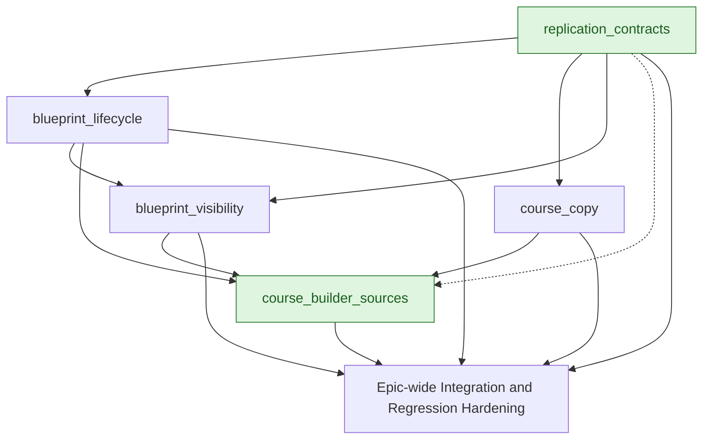

# Course Replication - High-Level Development Plan

Last updated: 2026-07-27

Context references:

- Epic informal source: `docs/exec-plans/current/epics/course_replication/informal.md`
- Roadmap Jira: `RMAP-127`
- Delivery epic: `MER-5824`
- Child Jira stories: `MER-5825` through `MER-5833`, plus `MER-5841`

Feature tracks:

- `replication_contracts/` - shared relationship, authorization, synchronization, and learner-data safety contracts
- `blueprint_lifecycle/` - Blueprint enablement, child creation, propagation, locking, disable, and unlink behavior
- `blueprint_visibility/` - linked-child visibility and Blueprint indicators/filtering across instructor/admin surfaces
- `course_copy/` - independent full or selective Course Copy behavior
- `course_builder_sources/` - shared course-builder source selection, filtering, sorting, tags, and accessible initiation UI

## Why We Are Organizing By Features

The epic contains two different replication products and several shared presentation surfaces:

- Blueprint Courses maintain a source/child relationship and receive future source updates.
- Course Copy creates a point-in-time snapshot with no continuing relationship.
- Course-builder and admin surfaces expose both products but must not own their domain semantics.

Each feature folder is intended to become an independently plannable full-Harness work item with its own PRD, FDD, requirements, implementation plan, and execution records. The shared contracts feature comes first because both replication modes depend on its invariants.

## Jira Ownership Map

Each active child ticket has one primary feature owner. Shared UI work may integrate a ticket owned by another feature, but it does not redefine the ticket's domain behavior.

| Jira ticket | Primary feature | Ownership boundary |
| --- | --- | --- |
| `MER-5825` | `blueprint_lifecycle/` | Blueprint relationship, propagation, locked/editable settings, learner-data isolation |
| `MER-5826` | `blueprint_lifecycle/` | Blueprint enablement, access grants, disable, and unlink behavior |
| `MER-5827` | `blueprint_visibility/` | Linked-child counts, tables, authorization-filtered visibility, and role-specific links |
| `MER-5828` | `course_builder_sources/` | Shared course-builder layout, sources, filters, sorting, tags, and accessibility |
| `MER-5829` | `blueprint_lifecycle/` | Blueprint child creation, initial snapshot, relationship establishment, and source messaging |
| `MER-5830` | `blueprint_visibility/` | Admin Blueprint indicators, filtering, and consistent relationship classification |
| `MER-5831` | `course_copy/` | Independent snapshot rules, copy allowlist, learner-data exclusion, and isolation |
| `MER-5832` | `course_copy/` | My Course Sections eligibility, copy choices, and copy-flow behavior |
| `MER-5841` | `replication_contracts/` | Shared relationship, authorization, operation-status, and learner-data safety contracts |
| `MER-5833` | Not planned | `Closed Won't Do`; no implementation scope unless reopened or replaced |

`MER-5829`, `MER-5832`, and `MER-5830` have integration touchpoints in `course_builder_sources/`, but their primary domain ownership remains with `blueprint_lifecycle/`, `course_copy/`, and `blueprint_visibility/` respectively.

## Clarifications and Assumptions

- Scope is derived from `docs/exec-plans/current/epics/course_replication/informal.md`, which summarizes Jira as of 2026-07-27.
- `MER-5833` is explicitly excluded because it is `Closed Won't Do` and has no usable description or acceptance criteria.
- The Blueprint/Course Copy distinction is a hard domain boundary, not merely a UI distinction.
- No replication operation may copy rosters, enrollments, attempts, progress, grades, submissions, discussions, analytics, or other learner-generated data.
- Exact Blueprint-controlled attributes, synchronization trigger, publication behavior, access-management UX, and copy allowlists remain open decisions for the relevant feature PRDs.
- Accessibility requirements in the Jira stories apply to all UI features.
- Discovery and design can begin in parallel, but implementation dependencies are represented below.

## Lane 1: Replication Contracts and Safety

Feature: `replication_contracts/`

### Scope

- Shared Blueprint source/child, access, unlink, and synchronization states.
- Explicit separation between Blueprint relationships and independent copies.
- Blueprint-controlled versus child-editable attribute contract.
- Course Copy source allowlist and learner-data denylist.
- Authorization boundaries for discovery, creation, inspection, enablement, disablement, and unlinking.
- Idempotency, ordering, retry, audit, status, and partial-failure contracts.

### Proposed Serial Order

1. Audit existing project, resource/revision, publication, section, enrollment, attempt, authorization, and course-builder models.
2. Define relationship and database invariants for Blueprint children and independent copies.
3. Define Blueprint propagation and child-editable attribute boundaries.
4. Define full and selective copy allowlists and learner-data exclusions.
5. Define authorization-safe query and mutation boundaries.
6. Define operation status, retry, idempotency, and failure semantics.

### Dependencies and Handoff

- No inbound dependency; start immediately.
- `blueprint_lifecycle/` and `course_copy/` have hard dependencies on this feature.
- `blueprint_visibility/` and `course_builder_sources/` consume its source classifications and authorization-safe query contracts.

### Key Risks

- Existing publication and section models may not map cleanly to source/child synchronization.
- Attribute locks must be enforced at write and synchronization boundaries, not only in React.
- Long-running propagation or copy operations may require background jobs and resumable status.

## Lane 2: Blueprint Lifecycle and Synchronization

Feature: `blueprint_lifecycle/`

### Scope

- `MER-5825` Course Blueprints: Rules.
- `MER-5826` Enabling Course Blueprints.
- `MER-5829` Course Builder: Selecting a blueprint, limited to Blueprint child creation and relationship behavior.
- Initial snapshot, ongoing propagation, locked settings, child-editable settings, disable, and unlink behavior.

### Proposed Serial Order

1. Implement Blueprint enablement, ownership, access grants, and source eligibility.
2. Implement transactional linked-child creation and initial snapshot/synchronization.
3. Implement propagation of Blueprint-controlled changes while preserving child-owned settings and learner data.
4. Enforce locked attributes and source/child write directionality.
5. Implement disable, optional unlink, status messaging, retry/failure handling, and audit events.
6. Integrate the course-builder Blueprint action and child Manage source information.

### Dependencies and Handoff

- Hard dependency on `replication_contracts/`.
- `blueprint_visibility/` consumes source/child status, unlink state, counts, and authorization-safe queries.
- `course_builder_sources/` consumes Blueprint eligibility, metadata, and the child-creation action.

### Key Risks

- Initial child snapshot behavior must be defined for authoring, publication, and deployment state.
- Disable-without-unlink behavior and repeated enable/disable semantics require product decisions.
- Synchronization must handle stale, deleted, disabled, and partially failed children.

## Lane 3: Blueprint Visibility and Administration

Feature: `blueprint_visibility/`

### Scope

- `MER-5827` Blueprints: View linked sections.
- `MER-5830` Blueprints: Admin records.
- Linked-child counts and tables, instructor/admin visibility differences, Blueprint/Blueprint Child indicators, and admin filtering.

### Proposed Serial Order

1. Establish the authorization-filtered relationship query used by both counts and rows.
2. Implement linked-child count and table data, including inactive/unlinked/deleted filtering.
3. Add administrator Manage links and instructor view-only behavior.
4. Add shared Blueprint and Blueprint Child classification/presentation metadata.
5. Integrate indicators and filtering into Project Overview, Template Usage, and Browse All Course Sections.
6. Complete accessibility and cross-surface consistency hardening.

### Dependencies and Handoff

- Hard dependency on `replication_contracts/` and `blueprint_lifecycle/`.
- Provides relationship/status data and shared labels to `course_builder_sources/` where needed.
- Must not implement Blueprint mutations or duplicate authorization rules from the lifecycle feature.

### Key Risks

- Count and table queries can diverge or leak inaccessible metadata if they do not share predicates.
- Final linked-table columns and separate Blueprint Child filtering remain open decisions.
- Large child sets may require pagination or bounded loading.

## Lane 4: Independent Course Copy

Feature: `course_copy/`

### Scope

- `MER-5831` Course Copy: Rules.
- `MER-5832` Course Builder: Selecting a section to copy, limited to My Course Sections eligibility and copy behavior.
- Full and selective point-in-time snapshot behavior with no retained source relationship.

### Proposed Serial Order

1. Implement the copy operation around the source allowlist and learner-data denylist.
2. Add transactional full-course snapshot creation with no Blueprint metadata.
3. Add selective-settings copy behavior and server-side category validation.
4. Define My Course Sections eligibility and source filtering.
5. Integrate the copy-choice modal and independent-copy initiation action.
6. Add success/error messaging and source/copy isolation verification.

### Dependencies and Handoff

- Hard dependency on `replication_contracts/`.
- `course_builder_sources/` consumes the My Course Sections query and copy initiation contract.
- Must coordinate shared card primitives and terminology without sharing Blueprint relationship semantics.

### Key Risks

- “Created by the current instructor” needs a final ownership/eligibility definition.
- Identifiers, dates, integrations, external LMS/LTI settings, publication state, and section metadata need explicit copy rules.
- Large copies may require background operations, progress, retry, and cleanup behavior.

## Lane 5: Course Builder Source Selection

Feature: `course_builder_sources/`

### Scope

- `MER-5828` Course Builder UI Updates.
- Shared UI integration from `MER-5829` Blueprint child creation.
- Shared UI integration from `MER-5832` independent Course Copy.
- Source cards, filters, search, sorting, tags, actions, explanatory messaging, and accessibility.

### Proposed Serial Order

1. Establish the normalized source-card, filter, sort, and accessible action contract.
2. Add All Sources, My Course Sections, and Blueprint Courses using permission-filtered queries.
3. Integrate the distinct Blueprint child-creation and independent-copy actions.
4. Add relationship-specific messaging and Blueprint source information where required.
5. Preserve search/sort behavior and finalize tags, including any Blueprint Child treatment.
6. Complete keyboard, focus, semantic-state, dynamic-announcement, and terminology hardening.

### Dependencies and Handoff

- Design/component inventory can start immediately.
- Soft dependency on `replication_contracts/` for source classification and safe queries.
- Hard dependency on `blueprint_lifecycle/` for Blueprint eligibility and child-creation behavior.
- Hard dependency on `course_copy/` for My Course Sections and copy behavior.
- This feature owns shared presentation and integration only; it does not own replication domain rules.

### Key Risks

- Client-side filtering must not be used as an authorization boundary.
- Shared cards must not blur linked Blueprint creation and independent Course Copy semantics.
- Hover affordances require equivalent keyboard and screen-reader interactions.

## Suggested Global Execution Shape

1. Start `replication_contracts/` immediately with domain, authorization, attribute-boundary, and learner-data audits.
2. In parallel, begin design/component inventory for `course_builder_sources/` without finalizing production source behavior.
3. After the relevant contracts stabilize, implement `blueprint_lifecycle/` and `course_copy/` in parallel.
4. Implement `blueprint_visibility/` once lifecycle relationship state and authorization-safe queries are available.
5. Integrate lifecycle, copy, and visibility outputs into `course_builder_sources/`.
6. Finish with epic-wide integration and regression hardening across permissions, replication isolation, synchronization/copy failures, admin views, course creation, and accessibility.

## Feature Dependency Flow (Mermaid)

Solid arrows indicate hard implementation dependencies. The dashed contract-to-builder edge indicates that builder discovery/design can start immediately, but production queries must consume the shared authorization and source-classification contracts.

## Epic-Wide Verification

- Domain and context tests for Blueprint invariants, copy isolation, propagation boundaries, idempotency, and learner-data exclusion.
- Authorization tests for institution, direct-delivery, instructor, and admin boundaries.
- Integration tests for child creation, initial sync, later propagation, disable/unlink, full copy, selective copy, retries, and partial failures.
- Course-builder tests for filters, search, sorting, source cards, relationship messaging, and distinct initiation actions.
- Admin tests for indicators, filters, linked counts, semantic tables, role-specific links, and ordinary-course regressions.
- Accessibility tests for keyboard operation, focus management, selected states, accessible labels, semantic tables, and dynamic announcements.
- Scenario coverage for multiple sections from one source, independently customized copies, Blueprint updates, and learner-data isolation.

## Open Decisions

- Is the first release expected to include both Blueprint synchronization and independent Course Copy, or should the minor epic be phased?
- Which exact attributes are Blueprint-controlled versus child-editable?
- Are Blueprint updates automatic, manually triggered, or queued with visible synchronization status?
- How are unpublished revisions, publications, deployments, and source/child conflicts handled?
- Can a Blueprint be repeatedly enabled/disabled, and what happens to existing children?
- What does “created by the current instructor” mean for My Course Sections eligibility?
- Which settings are selectable in a partial copy?
- Should admins filter separately for Blueprint Courses and Blueprint Child Courses?
- What fields and synchronization status belong in the linked-child table?
- What operation scale requires background jobs, progress indicators, resumability, and retry controls?

## Recommended Next Work

Start with `replication_contracts/` using the full Harness sequence:

1. `harness-analyze`
2. `harness-architect`
3. `harness-requirements`
4. `harness-plan`
5. `harness-develop` per implementation phase

Then follow the same sequence for `blueprint_lifecycle/` and `course_copy/`. `course_builder_sources/` can begin design analysis in parallel, but its implementation plan should consume the finalized contracts and feature APIs.
