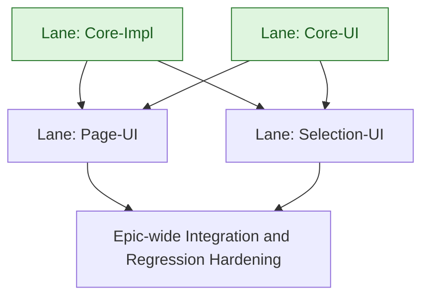

# Instructor Customization of Assessments - High-Level Development Plan

Last updated: 2026-05-29

Context references:

- Epic overview: `docs/exec-plans/current/epics/instructor_customizations/overview.md`
- Core informal design: `docs/exec-plans/current/epics/instructor_customizations/core/informal.md`
- Epic Jira: `MER-5613`
- Linked roadmap context: `RMAP-95`

## Lane Summary

- Core-Impl
  - Delivers section/page-specific instructor customization data, delivery-time application, guardrails, and scenario coverage.
- Core-UI
  - Updates Instructor View, supported question display, and entry/return workflows.
- Page-UI
  - Adds page-level remove/restore controls, learning objective and points summaries, and jump navigation.
- Selection-UI
  - Adds activity bank selection question management, bulk actions, and filtering.

## Clarifications and Assumptions

- This plan is intentionally high-level and lane-oriented.
- Jira scope and story descriptions were read from Jira on 2026-05-12 for epic `MER-5613` and children:
  - `MER-5639`, `MER-5617`, `MER-5618`, `MER-5619`, `MER-5620`, `MER-5625`, `MER-5626`, `MER-5622`, `MER-5623`, `MER-5624`.
- `core/informal.md` is treated as the source for the non-UI implementation shape.
- Figma is the source of truth for visual details and component states.
- `MER-5617` owns the reusable Instructor View shell/header primitive and the initial return-context contract; `MER-5619` expands entry-point producers and origin-specific return behavior on top of that contract.
- Preview mode and return context are separate concepts. Preview mode controls Instructor View shell rendering; return context controls the persistent header's exit label and destination.
- Secondary Instructor View workflows, including the bank-selection manager from `MER-5622`, should keep the same global return context while implementing their own local back-to-page behavior.
- Serial order inside each lane follows ticket dependencies and workflow layering.
- Lane dependencies are lane-level by default; ticket-level constraints are called out where useful.

## Lane: Core-Impl

### Scope

- `MER-5639` Instructor activity customization, core implementation and scenario testing

### Proposed Serial Order

1. `MER-5639` Instructor activity customization, core implementation and scenario testing

### Dependency Notes

- This lane has no inbound dependencies and can start immediately.
- It should establish the data model, context APIs, delivery-time filtering behavior, validation rules, and scenario directives needed by UI lanes.
- It must preserve authored content and historical attempts while affecting newly created attempts.
- It should prevent invalid activity bank states, including candidate exclusions that would leave fewer available questions than the selection count.

### Cross-Lane Dependencies

- No inbound lane dependency.
- Page-UI and Selection-UI depend on this lane.

## Lane: Core-UI

### Scope

- `MER-5617` Update Instructor View
- `MER-5618` Update Instructor View Question UI
- `MER-5619` New Entry Points to Instructor View

### Proposed Serial Order

1. `MER-5617` Update Instructor View
2. `MER-5618` Update Instructor View Question UI
3. `MER-5619` New Entry Points to Instructor View

### Dependency Notes

- This lane has no inbound dependencies and can start immediately.
- `MER-5617` establishes the updated Instructor View shell, header, return behavior, outline toolbar, template support, and removal of legacy page discussion UI.
- `MER-5617` should make the Instructor View header reusable so later preview surfaces can render the same persistent header without copying shell markup.
- `MER-5618` layers the simplified instructor-facing question UI on the updated Instructor View foundation.
- `MER-5619` adds additional entry points from Customize Content and Assessment Settings, including unsaved-change protection and correct return behavior.

### Cross-Lane Dependencies

- No inbound lane dependency.
- Page-UI and Selection-UI depend on this lane.

## Lane: Page-UI

### Scope

- `MER-5620` Activity Bank Selection & Embedded Question Remove/Restore
- `MER-5625` Learning Objective & Overall Points Available Counters
- `MER-5626` Jump to Section

### Proposed Serial Order

1. `MER-5620` Activity Bank Selection & Embedded Question Remove/Restore
2. `MER-5625` Learning Objective & Overall Points Available Counters
3. `MER-5626` Jump to Section

### Dependency Notes

- `MER-5620` consumes Core-Impl toggle behavior and Core-UI question/page presentation.
- `MER-5625` depends on stable remove/restore state so learning objective coverage and available points update correctly.
- `MER-5626` depends on the updated Instructor View structure and final page-level item model so navigation counts and destinations are accurate.
- Page-level customization must apply to both course sections and templates where required by the Jira scope.

### Cross-Lane Dependencies

- Hard dependency on Core-Impl.
- Hard dependency on Core-UI.

## Lane: Selection-UI

### Scope

- `MER-5622` Manage Questions in Activity Bank Selection
- `MER-5623` Multi-Select Questions within Activity Bank Selection
- `MER-5624` Filter Questions within Activity Bank Selection

### Proposed Serial Order

1. `MER-5622` Manage Questions in Activity Bank Selection
2. `MER-5623` Multi-Select Questions within Activity Bank Selection
3. `MER-5624` Filter Questions within Activity Bank Selection

### Dependency Notes

- `MER-5622` establishes the activity bank selection management view, candidate table, preview panel, remove/restore actions, minimum-count warning behavior, and return-to-page behavior.
- `MER-5622` should treat return-to-page as local workflow navigation and should not replace the persistent Instructor View header's global return-to-origin action.
- `MER-5623` extends the management view with same-state bulk selection and bulk remove/restore actions.
- `MER-5624` extends the management view with visibility filters, search, learning objective filters, question type filters, selected-filter states, and empty-state behavior.
- Candidate removal must remain selection-specific and must not alter bank behavior on other pages or other selections.

### Cross-Lane Dependencies

- Hard dependency on Core-Impl.
- Hard dependency on Core-UI.

## Suggested Global Execution Shape

1. Start Core-Impl and Core-UI immediately in parallel.
2. After Core-Impl and Core-UI are stable, start Page-UI and Selection-UI in parallel.
3. Use epic-level integration hardening after Page-UI and Selection-UI land to verify attempts, progress, points, learning objective coverage, accessibility, template behavior, and return/navigation behavior across the full Instructor View experience.

## Lane Dependency Flow (Mermaid)

Note: Light green lane nodes indicate lanes with no inbound dependencies and can be started immediately.

## Decision Log

### 2026-05-29 - Shared Instructor View Shell Contract
- Change: Added cross-lane assumptions for reusable Instructor View header, return context, and secondary workflow local back behavior.
- Reason: `MER-5619` and `MER-5622` depend on shell behavior introduced by `MER-5617`; documenting the contract at lane level prevents later tickets from redefining return behavior independently.
- Evidence: Jira `MER-5619` entry-point requirements and `MER-5622` bank-selection manager back-button requirements.
- Impact: Core-UI establishes the reusable shell contract before Page-UI and Selection-UI consume it.
