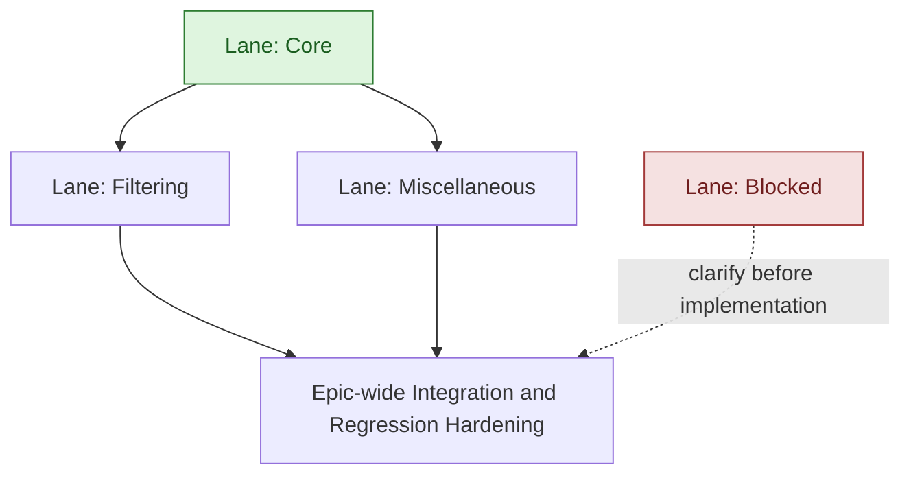

# Learning Objectives Editor Coverage - High-Level Development Plan

Last updated: 2026-07-30

Context references:

- Epic informal design: `docs/exec-plans/current/epics/objectives-editor/core_data/informal.md`
- Epic Jira: `MER-5784`
- Linked roadmap context: `RMAP-37`

## Lane Summary

- Core
  - Delivers the authoring coverage data source, then the primary Learning Objective/Sub-Objective summary and attachment UI.
- Filtering
  - Adds toolbar placement/search, coverage issue filtering/settings, and course-content filtering on top of the core coverage model.
- Miscellaneous
  - Handles adjacent page copy, hierarchy UI polish, and CSV export.
- Blocked
  - Tracks Analyzing tickets that are intentionally excluded from implementation until product/technical ambiguity is resolved.

## Clarifications and Assumptions

- This plan is intentionally high-level and lane-oriented.
- Jira scope and story descriptions were read from Jira on 2026-07-30 for epic `MER-5784`.
- Jira children in Analyzing state:
  - `MER-5855`, `MER-5821`, `MER-5801`, `MER-5800`, `MER-5799`, `MER-5797`, `MER-5794`, `MER-5793`, `MER-5792`, `MER-5786`.
- Jira children in Closed Won't Do state were read but excluded from lane planning:
  - `MER-5806`, `MER-5785`.
- The user-requested Filtering lane listed `MER-5797` twice. This plan includes `MER-5797` once and treats the duplicate as accidental.
- Core must be implemented first. Filtering and Miscellaneous can begin after Core is stable.
- The Blocked lane is not part of the active implementation dependency graph.
- `core_data/informal.md` is treated as the source for the core coverage data design.
- Initial activity coverage counts are static embedded activity counts only, using `activity_refs`. Activity bank selection coverage is follow-up work and should not be included in the initial counts.
- Figma is the source of truth for visual details and component states for UI tickets.
- Jira currently records `MER-5793` as blocking `MER-5794`. This plan preserves the requested lane grouping and sequencing with `MER-5794` in Core and `MER-5793` in Miscellaneous. Implementation should revisit this before starting Core UI work; if `MER-5794` truly cannot proceed without `MER-5793`, move the required hierarchy foundation into Core or split the prerequisite subset out of `MER-5793`.

## Lane: Core

### Scope

- `MER-5855` Implement LearningObjectiveCoverage data source
- `MER-5794` Learning Objective, Sub-Objective Summary & Attachments

### Proposed Serial Order

1. `MER-5855` Implement LearningObjectiveCoverage data source
2. `MER-5794` Learning Objective, Sub-Objective Summary & Attachments

### Dependency Notes

- `MER-5855` establishes the application-level data source needed by all coverage display and filtering work.
- `MER-5855` should build a compact authoring projection over current unpublished publication mappings, partitioned by `resource_type_id`, without loading full page or activity `content`.
- `MER-5855` should expose objective, page, embedded activity, parent/child objective, and curriculum scope structures needed by later UI and filters.
- `MER-5794` consumes the coverage data source to display parent Learning Objective and Sub-Objective page/activity summaries.
- `MER-5794` owns expansion behavior, Formative/Summative toggles, page-first detail rendering, embedded activity grouping, and navigation to pages/embedded activities.
- `MER-5794` must preserve objective, page, and activity associations; navigation from the coverage UI is read-only.

### Cross-Lane Dependencies

- No inbound lane dependency.
- Filtering depends on this lane.
- Miscellaneous depends on this lane per the requested execution shape.

## Lane: Filtering

### Scope

- `MER-5797` Authoring LO filter placement & search
- `MER-5799` LO Authoring Coverage Issues Filter
- `MER-5800` LO Authoring Course Content Filter

### Proposed Serial Order

1. `MER-5797` Authoring LO filter placement & search
2. `MER-5799` LO Authoring Coverage Issues Filter
3. `MER-5800` LO Authoring Course Content Filter

### Dependency Notes

- This lane starts after Core because search and filters need the normalized objective/page/activity coverage model.
- `MER-5797` reorganizes the toolbar so search, sort, and filters are grouped together while Download CSV and New Objective remain grouped as actions.
- `MER-5797` extends search beyond objective titles to include Sub-Objective titles, page titles, and activity titles, expanding matching hierarchy levels as needed.
- `MER-5799` adds the Coverage Issues filter, warning markers, issue count badge, inline warnings, and project-level persistence for custom formative/summative thresholds.
- `MER-5799` defaults coverage issue thresholds to fewer than 3 formative activities or fewer than 3 summative activities.
- `MER-5800` adds the Course Content hierarchical checklist filter, with OR semantics across selected curriculum items and descendant inclusion for selected parents.
- `MER-5800` should filter through page scope, including objectives attached directly to pages and objectives attached through embedded activities on pages in scope.
- Filtering work must compose with existing search and sort state without modifying content or objective/activity associations.

### Cross-Lane Dependencies

- Hard dependency on Core.
- No dependency on Miscellaneous.

## Lane: Miscellaneous

### Scope

- `MER-5793` Authoring LO page UI & hierarchy updates
- `MER-5792` New description for LO page in authoring
- `MER-5801` Authoring LO CSV Download

### Proposed Serial Order

1. `MER-5793` Authoring LO page UI & hierarchy updates
2. `MER-5792` New description for LO page in authoring
3. `MER-5801` Authoring LO CSV Download

### Dependency Notes

- This lane starts after Core per the requested execution shape.
- `MER-5793` updates the Learning Objective and Sub-Objective card hierarchy presentation, icons, New Objective button, Add button, and expand/collapse behavior.
- `MER-5793` explicitly excludes formative/summative summaries, warnings, red borders, and proficiency aggregation.
- `MER-5792` updates the top-of-page Learning Objectives description while preserving the existing CMU Eberly Center link behavior.
- `MER-5801` adds CSV export of the current Learning Objective map, respecting the current search, sort, and filter state.
- `MER-5801` must avoid fetching full activity revisions. It only needs compact activity details such as title and `activity_type_id`.
- `MER-5801` should reuse existing course-location/path map logic for page location in the curriculum.

### Cross-Lane Dependencies

- Hard dependency on Core per the requested execution shape.
- No dependency on Filtering, though CSV export should respect Filtering state once both lanes are present.

## Lane: Blocked

### Scope

- `MER-5786` Sub-objective deletion needs checks put in place
- `MER-5821` Aggregate Child Learning Objective Proficiency into Parent Learning Objectives

### Blocked Notes

- `MER-5786` is blocked because the expected deletion/removal model for Sub-Objectives needs product clarification. The ticket raises whether the current action should remove one parent association, delete the Sub-Objective only when it has one remaining association, or move Sub-Objectives into an unassociated pool before deletion.
- `MER-5821` is blocked because the ticket language introduces Knowledge Components as distinct from Sub-Objectives, which does not map cleanly to Torus, and appears to request persisted parent proficiency aggregation rather than the current runtime projection approach. That would have major compute and recomputation implications when LO hierarchy changes.
- Neither blocked ticket should be implemented as part of the active epic lanes until the ambiguity is resolved and the tickets are rewritten or clarified.

### Cross-Lane Dependencies

- No active implementation lane depends on Blocked.
- If either blocked ticket is clarified later, it should be planned as a separate lane or follow-up epic slice.

## Suggested Global Execution Shape

1. Implement Core in serial order: `MER-5855`, then `MER-5794`.
2. After Core is stable, start Filtering and Miscellaneous in parallel.
3. Use epic-wide integration hardening after Filtering and Miscellaneous land to verify coverage counts, hierarchy expansion, search/filter composition, CSV export, accessibility, navigation, and unchanged content associations.

## Lane Dependency Flow (Mermaid)

Note: Light green lane nodes indicate lanes with no inbound active implementation dependencies. Red lane nodes indicate blocked scope that should not be implemented until clarified.

## Decision Log

### 2026-07-30 - Embedded-Only Initial Coverage

- Change: Initial activity coverage counts are limited to static embedded activities.
- Reason: Activity bank selections can represent deterministic or possible objective coverage, and possible coverage should not inflate primary coverage counts.
- Evidence: `core_data/informal.md` bank-selection analysis and Jira `MER-5855` data-source scope.
- Impact: Deterministic activity bank selection indexing is reserved for follow-up work.

### 2026-07-30 - Core-First Lane Graph

- Change: Core is the only active implementation lane with no inbound dependency; Filtering and Miscellaneous start after Core.
- Reason: `MER-5855` supplies the coverage model needed by the coverage UI, filters, search expansion, and CSV export.
- Evidence: Jira comments on `MER-5855`, `MER-5794`, `MER-5799`, `MER-5800`, and `MER-5801`.
- Impact: Feature lanes avoid building separate coverage queries or content scans.
