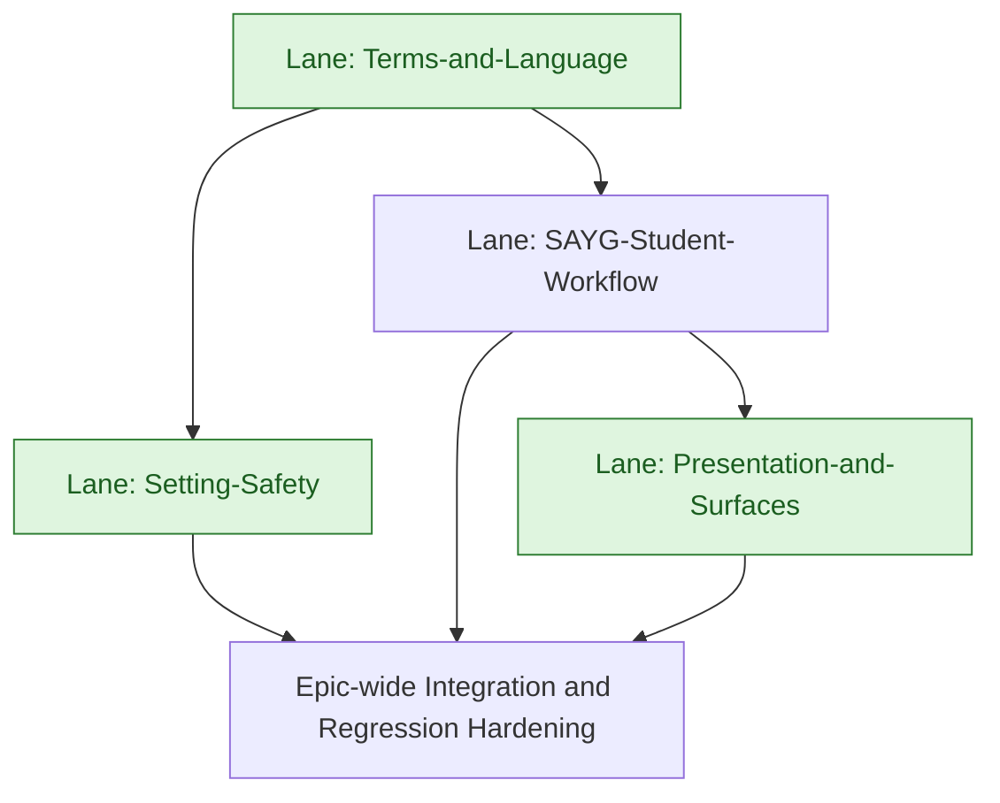

# Score-as-you-go Improvements - High-Level Development Plan

Last updated: 2026-05-29

Context references:

- Epic overview: `docs/exec-plans/current/epics/score_as_you_go_improvements/overview.md`
- Informal Jira context: `docs/exec-plans/current/epics/score_as_you_go_improvements/informal.md`
- Roadmap Jira: `RMAP-125`
- Delivery epic Jira: `MER-5616`
- Related triage epic: `TRIAGE-2168`

## Lane Summary

- Terms-and-Language
  - Redesigns the Assignment Terms experience and clarifies SATE/SAYG attempt, scoring, replacement, late policy, and review language.
- Setting-Safety
  - Adds instructor-facing scoring mode warnings, adaptive-page constraints, and Bulk Apply behavior for missing assessment settings.
- SAYG-Student-Workflow
  - Updates SAYG in-assignment score visibility, reset confirmation, and saved-work messaging.
- Presentation-and-Surfaces
  - Updates one-at-a-time presentation and SAYG indicators across student-facing navigation surfaces.

## Clarifications and Assumptions

- Jira scope and story descriptions were read from Jira on 2026-05-29 for `RMAP-125`, `MER-5616`, `TRIAGE-2168`, and current child/related tickets.
- `RMAP-125` describes this as a lightweight epic, but `MER-5616` currently includes eight stories with UI, copy, setting-safety, and bulk-apply work.
- `MER-5608` is already Done and may satisfy some adaptive-page setting restrictions; this plan treats remaining adaptive-page behavior as a discovery item inside Setting-Safety.
- Figma file `Score-as-you-go-designs` is the source of truth for visual states referenced in Jira.
- The Norman terms-page language spec is a required input for Terms-and-Language.
- Existing student scores and completed attempts must remain unchanged when scoring mode settings change.
- Accessibility requirements in the Jira stories apply to every UI lane.

## Lane: Terms-and-Language

### Scope

- `MER-5627` Assignment terms page updates
- Roadmap language review from `RMAP-125`
- Relevant confusion from `TRIAGE-2130` and `TRIAGE-1920`

### Proposed Serial Order

1. `MER-5627` Assignment terms page updates
2. Terms-page copy reconciliation with the Norman spec
3. Regression checks for SATE/SAYG attempt terminology after scoring mode changes

### Dependency Notes

- This lane can start immediately.
- It should define canonical language for page attempts, question attempts, scoring strategy, replacement behavior, late policy, read-by dates, and review actions.
- It should resolve current Jira copy questions around grace period, retake mode, and "Begin" versus "Start".

### Cross-Lane Dependencies

- Setting-Safety depends on canonical terms language for post-change UI updates.
- SAYG-Student-Workflow depends on canonical reset and saved-work terminology.

## Lane: Setting-Safety

### Scope

- `MER-5630` Instructor scoring mode change warning
- `MER-5634` Assessment settings bulk apply (missing settings)
- Remaining adaptive-page setting restrictions from `RMAP-125`, `TRIAGE-1861`, and `MER-5608`

### Proposed Serial Order

1. Audit current assessment settings behavior for started attempts, adaptive pages, and Bulk Apply.
2. `MER-5630` Instructor scoring mode change warning
3. Adaptive-page restriction gap closure, if `MER-5608` does not cover all roadmap scope
4. `MER-5634` Assessment settings bulk apply (missing settings)

### Dependency Notes

- This lane can start immediately, but it should coordinate with Terms-and-Language before finalizing user-facing warning copy.
- The core decision is whether scoring mode changes after started attempts are blocked or allowed with future-attempt-only confirmation.
- Bulk Apply must not bypass single-assessment safety constraints.

### Cross-Lane Dependencies

- Terms-and-Language provides copy and terms behavior.
- SAYG-Student-Workflow and Presentation-and-Surfaces may consume setting-state metadata for UI indicators.

## Lane: SAYG-Student-Workflow

### Scope

- `MER-5628` SAYG assignment updates
- `MER-5629` SAYG reset modal updates
- `MER-5632` Navigating away from SAYG assignment

### Proposed Serial Order

1. `MER-5628` SAYG assignment updates
2. `MER-5629` SAYG reset modal updates
3. `MER-5632` Navigating away from SAYG assignment

### Dependency Notes

- This lane can start after Terms-and-Language establishes canonical SAYG copy.
- Reset messaging must be backed by accurate attempt count, attempts remaining, scoring strategy, score, and replacement data.
- Saved-work messaging must distinguish saved progress from submitted work.

### Cross-Lane Dependencies

- Terms-and-Language provides canonical scoring and attempts language.
- Presentation-and-Surfaces may share score header, icon, and label components.

## Lane: Presentation-and-Surfaces

### Scope

- `MER-5631` Student interface SAYG icons
- `MER-5633` Presentation "one at a time" mode updates
- Related context from `TRIAGE-1691`

### Proposed Serial Order

1. `MER-5631` Student interface SAYG icons
2. `MER-5633` Presentation "one at a time" mode updates
3. Cross-surface consistency pass for Assignments, course home, schedule, and in-assignment presentation

### Dependency Notes

- This lane can start immediately for surface inventory and design mapping.
- Final one-at-a-time behavior should account for reset modal and score header behavior from SAYG-Student-Workflow.
- Activity-specific submit controls should be distinguished from generic presentation submit controls before removal.

### Cross-Lane Dependencies

- SAYG-Student-Workflow may provide shared score display components.
- Terms-and-Language provides consistent labels for Score as You Go.

## Suggested Global Execution Shape

1. Start Terms-and-Language and Setting-Safety discovery immediately.
2. Use Terms-and-Language decisions to lock user-facing copy for Setting-Safety and SAYG-Student-Workflow.
3. Implement SAYG-Student-Workflow and Presentation-and-Surfaces in parallel once shared display/copy dependencies are clear.
4. Finish with epic-level regression coverage across SATE/SAYG, started/not-started attempts, adaptive/basic pages, traditional/one-at-a-time presentation, and Bulk Apply.

## Lane Dependency Flow (Mermaid)

Note: Light green lane nodes indicate lanes with no blocking inbound implementation dependency and can begin with discovery or inventory work.
