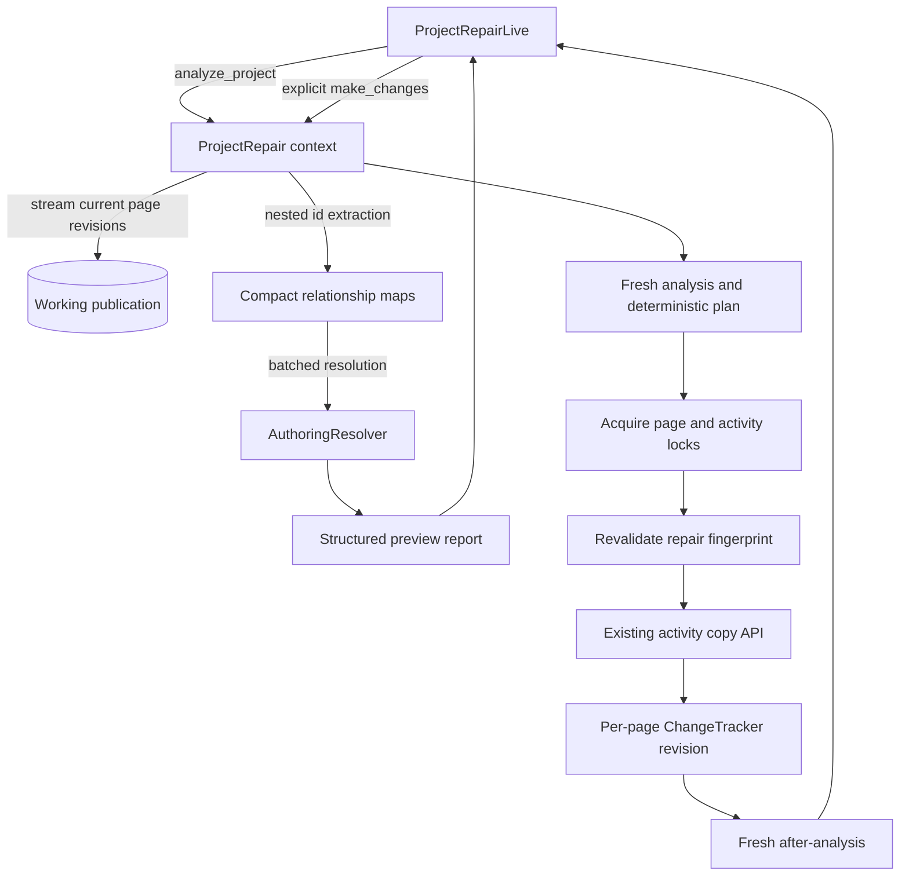

# Online Project Repair Tool - Functional Design Document

## 1. Executive Summary
Implement the feature as a small authoring-domain context, `Oli.Authoring.ProjectRepair`, plus a project-scoped LiveView. The context owns system-admin authorization, project resolution, streamed analysis of current unpublished page revisions, issue classification, lock-aware repair planning, activity cloning, page revision updates, structured results, and operational telemetry. The LiveView owns only route orchestration and presentation.

Analysis streams current page revisions from the project's working publication, discards each full content payload after extracting a compact `MapSet` of nested activity resource ids, and builds both page-to-activity and activity-to-page maps. Pages with top-level `%{"advancedDelivery" => true}` are counted as skipped and excluded from every issue map. Referenced activity ids are resolved in bounded batches through `Oli.Publishing.AuthoringResolver`; unresolved ids are reported as missing and are never mutated.

Repair always performs a fresh analysis, builds a deterministic plan in which the lowest page resource id keeps each original activity, acquires existing authoring locks for all affected page and source-activity resources, and revalidates the plan before writing. Each page to be changed is repaired in its own database transaction by cloning each applicable source activity through `Oli.Authoring.Editing.ContainerEditor.deep_copy_activity/3`, rewiring all matching references in that page, and recording one new unpublished page revision through `Oli.Publishing.ChangeTracker.track_revision/3`. Processing stops on the first page failure, preserves already committed pages, returns a structured partial result, and reruns analysis so the administrator sees the actual resulting state.

## 2. Requirements & Assumptions
- Functional requirements:
  - Enforce system-admin-only access at both the web route and context API boundaries (`FR-001`).
  - Provide non-mutating analysis of current unpublished Basic-page revisions (`FR-002`, `FR-003`).
  - Traverse all nested `activity-reference` elements while bounding retained content memory (`FR-004`).
  - Report unresolved activity ids without removing or modifying their references (`FR-005`, `FR-010`).
  - Group cross-page shared resources, distinguish resolvable from missing resources, and expose deterministic page metadata for preview (`FR-006`, `FR-007`).
  - Ignore browser-held preview data during repair, analyze fresh state, and require an explicit repair invocation (`FR-008`).
  - Reuse established activity-copy and authoring-revision mechanisms (`FR-009`).
  - Return typed reports and repair outcomes that can be rendered, tested, logged, and safely retried (`FR-011`).
- Non-functional requirements:
  - Keep full page JSON bounded to the Ecto stream/batch and the single page currently being repaired.
  - Avoid N+1 activity resolution by resolving unique ids in bounded batches.
  - Use existing durable authoring locks and deterministic ordering to avoid overwriting active edits and to prevent lock-order deadlocks.
  - Do not add schema migrations, background jobs, caches, feature flags, or delivery/publication mutations.
  - Keep the LiveView server-rendered, accessible, and intentionally thin; no React application is needed.
- Assumptions:
  - The current Adaptive-page discriminator is the top-level boolean key `advancedDelivery`; only the literal boolean `true` is excluded. Missing and boolean `false` are Basic.
  - Current authoring state is the unpublished `PublishedResource` mapping returned by the project's working publication and `AuthoringResolver`.
  - Existing `ContainerEditor.deep_copy_activity/3` defines the required complete copy semantics for duplicated Basic-page activities and must be reused rather than reimplemented.
  - Repeated references to one activity within a single page are one page/activity relationship. If that activity is cloned for the page, every matching reference in that page is rewired to the same new activity resource.
  - A system administrator's `%Author{}` is authorized by existing authoring APIs for every project, as implemented by `Oli.Accounts.can_access?/2`.
  - The tool is manually invoked and low-concurrency, but it must still respect active authoring locks and detect state changes between analysis and mutation.

## 3. Repository Context Summary
- What we know:
  - `Oli.Publishing.AuthoringResolver` resolves revisions from the unpublished working publication. Its `existing_activity_resource_ids/2` projection returns only ids backed by current project activity revisions, allowing analysis to validate existence/type without loading complete activity content.
  - `AuthoringResolver.all_pages/1` materializes all page revisions, so the repair context needs a focused Ecto stream query over `PublishedResource` and `Revision` to meet the content-memory requirement.
  - `Oli.Authoring.Editing.Utils.activity_references/1` returns a `MapSet` of nested activity ids using `Oli.Resources.PageContent.flat_filter/2`, the same traversal family used by Basic-page duplication.
  - `Oli.Resources.PageContent.map/2` and `map_reduce/4` traverse nested `model`, `children`, `caption`, `pronunciation`, `translations`, `content`, and `meanings` properties and can rewire references without rebuilding the page schema.
  - `Oli.Authoring.Editing.ContainerEditor.deep_copy_activity/3` resolves the source through `AuthoringResolver` and invokes `ActivityEditor.create/9`, which creates the activity resource, revision, project-resource association, and working-publication mapping transactionally.
  - `Oli.Publishing.ChangeTracker.track_revision/3` creates a revision from the current page revision and updates the working-publication mapping. It is the appropriate authoring mechanism for a server-owned content rewrite; `ContainerEditor.edit_page/3` intentionally strips content, and `PageEditor.edit/4` expects client-side `activitySlug` payloads and applies ordinary editor deletion semantics.
  - `Oli.Authoring.Locks` provides durable publication/resource locks and broadcasts lock acquisition/release. It can lock both affected pages and source activities by resource id.
  - The existing page editor path is `/workspaces/course_author/:project_slug/curriculum/:revision_slug/edit`.
  - Existing project LiveViews run under the `:protected_authoring_workspaces` session. The repair route additionally needs the `:require_authenticated_system_admin` pipeline because normal project authorization permits authors and lower admin roles.
  - The resource/revision and publication model isolates unpublished authoring changes from immutable published publications and delivery sections.
- Unknowns to confirm:
  - The Jira issue that will serve as the implementation system of record has not been supplied.
  - The final module/file name for the LiveView can follow local naming conventions discovered during implementation; this design uses `OliWeb.Workspaces.CourseAuthor.ProjectRepairLive`.
  - The exact telemetry event prefix should be reconciled with nearby authoring instrumentation during implementation; this design proposes `[:oli, :authoring, :project_repair]`.

## 4. Proposed Design
### 4.1 Component Roles & Interactions
- `Oli.Authoring.ProjectRepair`:
  - Public boundary for `analyze_project/3` and `repair_project/3`.
  - Validates `Oli.Accounts.is_system_admin?/1`, resolves the project and working publication, and normalizes errors.
  - Owns the stream query, compact relationship maps, activity resolution, report construction, deterministic repair plan, lock lifecycle, page-level transactions, and telemetry.
- `Oli.Authoring.ProjectRepair.Report` and related structs:
  - Define stable context-to-LiveView data contracts without web paths or rendered markup.
  - Carry page resource id, current revision id/slug, title, activity resource id, repairability, counts, and failures.
- `OliWeb.Workspaces.CourseAuthor.ProjectRepairLive`:
  - Receives `project_id` (the existing router parameter name, containing the project slug) and `current_author` from the authoring workspace setup.
  - Calls the context on mount and on `"make_changes"`.
  - Builds editor hyperlinks from report page revision slugs.
  - Renders loading, empty, issue, success, partial-failure, and fatal-error states.
- Existing dependencies:
  - `AuthoringResolver` for activity existence/current revision resolution.
  - `Utils.activity_references/1` for nested extraction.
  - `PageContent.map/2` for targeted rewiring.
  - `ContainerEditor.deep_copy_activity/3` for activity copying.
  - `ChangeTracker.track_revision/3` for page revision creation and working-publication mapping updates.
  - `Locks.acquire/4`, `Locks.update/4`, and `Locks.release/4` for concurrency control.
  - `Broadcaster.broadcast_revision/2` after successful page commits so authoring listeners observe changed revisions.



### 4.2 State & Data Flow
1. `analyze_project/3` authorizes the actor, resolves the project and unpublished working publication, and opens a read-only `Repo.transaction` for `Repo.stream/2`.
2. The stream query joins the working publication's `PublishedResource` rows to non-deleted project page `Revision` rows, orders by page `resource_id`, and selects only `revision_id`, `resource_id`, `slug`, `title`, and `content`.
3. For each streamed row:
   - If `content["advancedDelivery"] == true`, increment `skipped_adaptive_pages_count` and retain no page/content relationship data.
   - Otherwise, extract `MapSet<activity_resource_id>` through `Utils.activity_references/1`.
   - Store a compact page record with revision id, resource id, slug, title, and the activity-id set.
   - Update `activity_resource_id -> MapSet<page_resource_id>` as part of the same reduce.
   - Allow the row's full content map to become unreachable before reading the next row.
4. After the page cursor is exhausted, resolve the unique activity ids through `AuthoringResolver.existing_activity_resource_ids/2` in configurable bounded chunks (default 500). This resolver projection selects only ids for current project activity revisions, avoiding full activity JSON and preventing wrong-type resources from becoming repairable. Build a set from the returned ids.
5. Build missing-reference records for every Basic page/id pair not in the resolved-id set. Build shared groups for inverted-map entries with page-set cardinality greater than one and mark each group `repairable?: true` only when its activity id resolved.
6. Sort pages, missing records, and groups by numeric resource id before returning the report. Stable ordering controls display, keeper selection, lock acquisition, and tests.
7. The LiveView renders the report. It computes links with `~p"/workspaces/course_author/#{project.slug}/curriculum/#{page.revision_slug}/edit"`; URLs stay out of the domain context.
8. `repair_project/3` does not accept or trust the LiveView's prior report. It runs analysis again and creates a repair fingerprint from sorted `{activity_resource_id, [{page_resource_id, revision_id}]}` tuples for repairable groups.
9. For each repairable group, the lowest page resource id is the keeper. Invert the remaining group members into `page_resource_id -> MapSet<source_activity_resource_id>` so each changed page is written exactly once even when it participates in several groups.
10. Acquire durable locks in ascending `{resource_kind, resource_id}` order for all repairable source activities and all pages in their groups, including keeper pages. If any lock cannot be acquired, release every lock acquired by this invocation and return an unchanged failed result.
11. With locks held, run analysis again and compare the repair fingerprint with the pre-lock fingerprint. A mismatch returns `:stale_project_state`, releases locks, and performs no mutations.
12. Repair non-keeper pages in ascending page resource-id order. For each page, one `Repo.transaction`:
    - Resolve the locked current page revision and confirm it is the revision represented in the validated plan and is still Basic.
    - For every source activity assigned to the page, call `ContainerEditor.deep_copy_activity/3` once and retain the returned new activity id.
    - Use `PageContent.map/2` to replace the `activity_id` of every matching `activity-reference` while preserving all other reference fields.
    - Recompute the page's `activity_refs` array through `Utils.activity_references/1`.
    - Call `ChangeTracker.track_revision/3` with `content`, `activity_refs`, and `author_id`.
    - Commit all activity clones and the page revision together, then broadcast the new page revision.
13. Stop on the first page transaction failure. Previously committed pages remain valid and isolated; the failed page creates no clones because its transaction rolls back.
14. Release all held locks in an `after`-style cleanup path. Run a final analysis and return it in `RepairResult` for completed, partial, and failed mutation outcomes.

### 4.3 Lifecycle & Ownership
- Reports and repair plans are request/LiveView-process state only; they are not persisted.
- PostgreSQL remains the only source of truth. The working publication owns current authoring revision mappings, and each repair creates normal resource/revision history.
- The context owns lock acquisition and guarantees best-effort release for every resource it acquired. Lock-release failures are included as warnings and remain recoverable through the existing ten-minute lock expiration.
- The LiveView may assign the latest `Report` and `RepairResult`, but it never stores page content or derives repair operations.
- The LiveView disables the action while repair is executing to prevent duplicate events from the same socket. Context idempotency and locking remain the authoritative protection across sockets/nodes.
- No Oban job is introduced. The operation is synchronous so the administrator sees the result of the explicit action; the streaming design limits memory, while telemetry exposes duration for future reevaluation.

### 4.4 Alternatives Considered
- Use `AuthoringResolver.all_pages/1`: rejected because it loads every full page revision/content payload into memory and conflicts with the explicit streaming requirement.
- Detect sharing entirely with PostgreSQL JSON-path queries: rejected because it would duplicate Torus's established nested page traversal semantics, make Basic/Adaptive behavior harder to keep aligned, and add raw-SQL transformation risk.
- Use `PageEditor.edit/4` for repaired page content: rejected because that API is designed for client payloads containing `activitySlug`, manages normal editor reference deletion/resurrection, and would incorrectly mark the original shared activity deleted while a keeper page still uses it.
- Create a new activity-copy implementation: rejected because `ContainerEditor.deep_copy_activity/3` is the tested Basic-page duplication path explicitly required by the informal specification.
- One full-project transaction: rejected because it would keep a large transaction open across all cloning and page writes and make a single failure roll back potentially extensive work. Per-page transactions bound rollback scope and support safe retry.
- Continue after arbitrary page failures: rejected for the first iteration. Fail-fast page processing is simpler to reason about; the structured after-report clearly identifies remaining shared groups, and rerunning is safe.
- Trust the report rendered in the browser: rejected because authoring content may change between preview and repair. Repair derives all mutations from a fresh, lock-revalidated server-side plan.

## 5. Interfaces
- Public context API:

```elixir
@spec analyze_project(Project.t() | String.t(), Author.t(), keyword()) ::
        {:ok, Report.t()} | {:error, :not_authorized | :not_found | term()}
def analyze_project(project_or_slug, actor, opts \\ [])

@spec repair_project(Project.t() | String.t(), Author.t(), keyword()) ::
        {:ok, RepairResult.t()}
        | {:error, RepairResult.t() | :not_authorized | :not_found | term()}
def repair_project(project_or_slug, actor, opts \\ [])
```

  Supported options are internal/test-oriented, initially `:resolution_batch_size` and `:stream_max_rows`; defaults remain owned by the context and are not exposed in the UI.
- Report contracts:

```elixir
%Report{
  project_id: integer(),
  project_slug: String.t(),
  scanned_pages_count: non_neg_integer(),
  skipped_adaptive_pages_count: non_neg_integer(),
  missing_activity_references: [%MissingActivityReference{}],
  shared_activity_references: [%SharedActivityReference{}],
  summary: %Summary{}
}

%PageSummary{
  resource_id: integer(),
  revision_id: integer(),
  revision_slug: String.t(),
  title: String.t()
}

%MissingActivityReference{
  activity_resource_id: integer(),
  page: %PageSummary{}
}

%SharedActivityReference{
  activity_resource_id: integer(),
  pages: [%PageSummary{}],
  repairable?: boolean()
}

%Summary{
  scanned_pages_count: non_neg_integer(),
  skipped_adaptive_pages_count: non_neg_integer(),
  missing_activity_reference_count: non_neg_integer(),
  missing_activity_affected_page_count: non_neg_integer(),
  repairable_shared_activity_resource_count: non_neg_integer(),
  repairable_shared_activity_affected_page_count: non_neg_integer(),
  non_repairable_shared_missing_activity_resource_count: non_neg_integer()
}
```

- Repair result contract:

```elixir
%RepairResult{
  status: :completed | :partial | :failed,
  report_before_repair: %Report{},
  report_after_repair: %Report{},
  cloned_activity_count: non_neg_integer(),
  updated_page_count: non_neg_integer(),
  failures: [%RepairFailure{}],
  warnings: [:lock_release_failed | :lock_refresh_failed]
}
```

- Expected top-level errors include `:not_authorized`, `:project_not_found`, and `:working_publication_not_found`. Structured repair failures use a closed, content-free reason code (`:lock_not_acquired`, `:stale_project_state`, `:activity_copy_failed`, `:page_update_failed`, `:invalid_page_content`, `:lock_release_failed`, or `:unexpected_error`) plus optional page/activity resource ids. Raw exceptions, changesets, page content, and lock-holder account details must not cross the context boundary.
- LiveView route: add `live("/:project_id/repair_tool", ProjectRepairLive)` under a dedicated workspace scope/live session using `:browser`, `:authoring_protected`, and `:require_authenticated_system_admin`, while retaining the standard project assignment and `AuthorizeProject` on-mount hooks.
- LiveView events:
  - Mount: call `analyze_project/3` and assign the report or fatal error.
  - `"make_changes"`: call `repair_project/3`; replace the displayed report with `report_after_repair` for both success and structured partial/failure results.
  - No event accepts activity ids, page ids, or a serialized repair plan from the browser.

## 6. Data Model & Storage
- No database schema or migration changes.
- Reads are limited to `projects`, the unpublished `publications` row, `published_resources`, and current page/activity `revisions`.
- Successful repair writes use existing models:
  - one new activity `resources` row and initial activity `revisions` row per cloned page/activity relationship;
  - one `projects_resources` association and one working-publication `published_resources` mapping per cloned activity;
  - one new page `revisions` row per changed page;
  - an update to that page's existing working-publication mapping to point to the new revision;
  - transient lock fields on affected `published_resources` rows.
- Existing published publications, their `published_resources`, delivery sections, attempts, and learner data are never selected for mutation.
- Page revisions persist both rewritten `content` and recomputed `activity_refs` so denormalized reference metadata stays aligned with JSON content.
- Missing activity ids remain present only in the page JSON and the generated report; this feature creates no durable issue table.

## 7. Consistency & Transactions
- Analysis uses an Ecto stream inside a read-only transaction only long enough to enumerate current page mappings and extract compact relationships. Activity resolution occurs after the cursor is closed.
- Repair has three consistency gates:
  1. fresh server-side analysis rather than browser report reuse;
  2. deterministic acquisition of locks for every participant page and source activity;
  3. post-lock repair-fingerprint equality before the first write.
- Locks are acquired in deterministic order and released in reverse order. Failure to acquire the complete set causes zero mutations.
- The repair fingerprint contains source activity ids plus every participant page resource id and revision id. Any changed membership or page revision invalidates the plan.
- Each changed page is one transaction containing all of that page's activity clones and its new page revision. This guarantees no orphan clone from a failed page repair.
- Page transactions are processed sequentially. The first failure stops further writes and returns `:partial` if earlier pages committed or `:failed` if none committed.
- A retry is safe: fresh analysis omits relationships already isolated by earlier transactions and plans only those still shared. Missing references remain visible but non-repairable.
- Because all participant resources remain locked for the mutation loop, normal authoring editors cannot interleave source activity or page changes. Operations approaching the existing ten-minute lock TTL should refresh held locks with `Locks.update/4` between page transactions.

## 8. Caching Strategy
N/A. Reports reflect mutable authoring state and must be recomputed. Adding Cachex or LiveView-level reuse across repair invocations would undermine stale-state safety. The LiveView may retain its displayed report only as presentation state; `repair_project/3` never trusts it.

## 9. Performance & Scalability Posture
- Memory complexity is `O(P + A + E)`, where `P` is Basic pages, `A` is unique referenced activity ids, and `E` is unique page/activity relationships. Full JSON memory is bounded by the Ecto stream buffer plus one actively repaired page.
- `Repo.stream/2` uses a bounded `max_rows` (proposed default 100). The context does not call `AuthoringResolver.all_pages/1`.
- Activity resolution uses `AuthoringResolver.existing_activity_resource_ids/2` over unique ids in chunks (proposed default 500), preventing one query per reference, avoiding an unbounded `IN` parameter list, and selecting no activity JSON.
- Both maps use `MapSet` to deduplicate repeated references within a page and to make cardinality checks direct.
- Deterministic sorting is performed only on compact ids/report records, not page content.
- Repair performs two analysis passes before mutation and one after. This is an intentional safety cost for a manually invoked admin operation. Telemetry will expose project size and duration before any need for asynchronous execution is considered.
- Database review should confirm the working-publication/page stream query uses existing `published_resources.publication_id`, revision primary-key, and resource-type indexes and does not introduce N+1 page or activity queries.
- No all-project scan is supported; every query is scoped to one resolved project and its unpublished publication.

## 10. Failure Modes & Resilience
- Unauthorized actor: return `{:error, :not_authorized}` before project content access; route pipeline also redirects non-system-admin authors.
- Unknown/inactive project or absent working publication: return a fatal, non-mutating error rendered by the LiveView.
- Malformed page content that prevents established traversal: fail analysis with the page resource id; do not silently omit the page or expose a repair button for an incomplete report.
- Missing activity revision: include it in missing records, mark a multi-page group non-repairable, and never pass it to the copy API.
- Active author lock: abort before mutation, release locks acquired by this invocation, and display the conflicting resource/holder information already returned by `Locks`.
- Project changes while locks are being gathered: repair-fingerprint mismatch aborts with no mutations and a refreshed report.
- Activity-copy or page-revision error: roll back that page transaction, stop processing, release locks, rerun analysis, and return a structured partial/failed result.
- Process crash during repair: the active page transaction rolls back; earlier page transactions remain valid. Durable locks expire under the existing lock TTL, and a later rerun repairs only remaining relationships.
- Lock release error: record a warning, continue releasing other locks, and rely on lock expiration as a backstop. Do not report the content repair itself as rolled back when it committed.
- Telemetry/logging error: must never change repair behavior; instrumentation receives only bounded metadata and no page JSON.
- Duplicate button event or concurrent administrator invocation: LiveView disables its button locally, while resource locks ensure only one invocation can mutate a repair group.

## 11. Observability
- Wrap analysis and repair in telemetry spans using the proposed prefix `[:oli, :authoring, :project_repair]` with `:start`, `:stop`, and `:exception` events.
- Metadata is bounded and includes operation, project id/slug, actor id, scanned/skipped page counts, missing count, repairable/non-repairable shared counts, planned/updated page counts, clone count, status, failure category, and duration. Do not include page content, activity content, titles, author email, or full reports.
- Emit one structured `Logger.info` completion entry for successful analysis/repair and `Logger.warning` or `Logger.error` for lock conflicts, stale plans, partial failures, and fatal failures, using the same bounded metadata.
- Existing AppSignal integration receives exceptions and telemetry timing. No new dashboard, alert, or product analytics event is required for this manually invoked tool.
- `RepairResult` remains the operator-facing audit for the current LiveView session; this design does not add a persistent repair-history table.

## 12. Security & Privacy
- Place the route behind `:require_authenticated_system_admin`, not the broader `:require_authenticated_admin` or ordinary project-author pipeline.
- Require the actor in both public context functions and call `Accounts.is_system_admin?/1` before project resolution or page enumeration. This prevents accidental future use from a less-restricted web surface or console wrapper.
- Continue using standard `AuthorizeProject` on-mount behavior and scope all resolver/query/write operations to the resolved project's unpublished publication.
- Accept only the route project slug and the authenticated author from server assigns. The mutation event carries no resource identifiers or report payload, preventing client tampering with repair scope.
- Use parameterized Ecto queries. Do not construct raw SQL from project slugs or resource ids.
- Render titles through HEEx escaping and generate editor links with verified routes.
- Logs and telemetry exclude page/activity JSON and titles, which may contain authored or sensitive course material.
- CSRF, secure headers, authenticated author session, and LiveView event integrity are inherited from the existing browser/authoring pipelines.
- Run required security and performance reviews, plus Elixir, UI, and requirements reviews for the implementation change set.

## 13. Testing Strategy
- Context tests in `test/oli/authoring/project_repair_test.exs` are the primary automated suite. Use factories and real Repo/authoring APIs; no scenario DSL or browser automation is needed because this is one authoring context boundary.
- Authorization and route coverage:
  - System-admin context access and project-scoped analysis (`AC-001`).
  - Non-system-admin context denial plus one route/pipeline smoke test proving denial before LiveView use (`AC-002`). Detailed LiveView rendering/event tests remain outside the initial requirement.
- Read-only scope and classification:
  - Snapshot resource/revision/mapping counts before and after analysis (`AC-003`).
  - Adaptive true is counted/skipped and never reported or changed (`AC-004`); missing/false flags are Basic (`AC-005`).
  - Nested reference fixtures exercise the same traversal properties as page duplication (`AC-006`).
  - Instrumented small stream/batch settings and compact report assertions provide automated coverage, with a review/manual memory check for large fixtures (`AC-007`).
  - Pages without references and repeated same-page references behave correctly (`AC-008`, `AC-009`).
- Missing/shared report behavior:
  - Unresolved ids include page metadata and remain unchanged after analysis and repair (`AC-010`, `AC-011`).
  - Existing shared ids create repairable grouped reports; shared missing ids create non-repairable groups (`AC-012`, `AC-013`).
  - Summary counts cover scanned/skipped pages, missing references/pages, repairable groups/pages, and non-repairable missing groups (`AC-014`).
  - LiveView/manual checks verify `Make Changes` visibility and editor links/status presentation (`AC-015`, `AC-024`).
- Repair behavior:
  - Mutate project state between preview and repair and assert the context uses a fresh/revalidated plan (`AC-016`).
  - Assert deterministic lowest-id keeper selection (`AC-017`).
  - Assert each non-keeper page receives one distinct copy per source activity through existing duplication semantics (`AC-018`).
  - Assert all matching nested references and the persisted `activity_refs` array are updated in one new page revision (`AC-019`).
  - Assert a missing shared activity creates no resource/revision/mapping writes (`AC-020`).
  - Assert multiple independent groups, including several groups affecting one page, remain distinct (`AC-021`).
  - Assert post-repair analysis removes successful shared relationships while retaining missing reports (`AC-022`).
  - Force lock, copy, and page-update failures to verify structured result counts/failures, rollback of the active page, stop-on-first-failure, and safe rerun (`AC-023`).
- Observability:
  - Attach a telemetry test handler or capture logs to verify bounded operation/count/outcome metadata and absence of full content (`AC-025`). Intentional logs must use `capture_log` or `@tag capture_log: true` per repository rules.
- Verification gates:
  - `mix test test/oli/authoring/project_repair_test.exs`
  - the targeted route authorization test, if placed separately
  - `mix format` on changed Elixir/HEEx/test files
  - broader authoring editing/resolver tests if shared helper signatures are changed
  - manual prepared-project exercise covering links, empty state, missing-only state, successful repair, partial failure, and unchanged published delivery state

## 14. Backwards Compatibility
- No migration, existing route change, or existing UI navigation change.
- The new route is additive and direct-navigation-only.
- Existing page/activity resources and revision history remain valid; repairs add normal authoring revisions and resources to the unpublished working publication.
- Published publications and sections continue resolving their existing immutable revisions, so learner-facing content does not change until a later normal project publication.
- Existing Basic-page duplication behavior remains the source of copy semantics. If a small helper must be extracted to expose the created activity revision/id more directly, preserve `ContainerEditor.deep_copy_activity/3` behavior and tests.
- Missing references remain byte-for-byte unchanged by repair except when the same page also receives an unrelated shared-activity rewrite; in that case the missing reference node is preserved unchanged in the new page content.
- No feature flag is introduced. Access control and manual invocation provide rollout containment.

## 15. Risks & Mitigations
- Long-running synchronous scan or repair: stream content, batch resolver calls, expose duration telemetry, refresh locks between page transactions, and keep the scope to one project.
- Activity copy semantics drift: call `ContainerEditor.deep_copy_activity/3` directly or extract its body without behavioral change and retain its existing tests.
- Ordinary page-edit semantics delete the keeper's source activity: bypass `PageEditor.edit/4` for this system rewrite and use `ChangeTracker.track_revision/3` with an explicitly recomputed `activity_refs` array.
- Concurrent edits create stale or lost updates: lock participant pages and activities, compare revision-bearing repair fingerprints after locks, and abort before writing on mismatch.
- Partial completion confuses the administrator: stop at the first failed page, return committed counts plus a concrete failure, and render the fresh after-report as the next actionable state.
- Lock leakage: release in guaranteed cleanup, collect release warnings, refresh during long runs, and rely on existing TTL expiration after process failure.
- Adaptive content is accidentally transformed: centralize `content["advancedDelivery"] == true` exclusion in one predicate used by analysis and per-page repair validation.
- Full content leaks into logs: centralize telemetry metadata construction and test that content/title fields are absent.
- Context becomes a general repair framework: keep only the two defined detectors and the single shared-activity repair path; do not introduce pluggable repair rules.

## 16. Open Questions & Follow-ups
- Assign and link the Jira issue before implementation planning so execution and review remain traceable in the repository's system of record.
- Confirm the final telemetry prefix against nearby authoring events during implementation; changing the proposed prefix does not affect functional behavior.
- During implementation, verify whether `ContainerEditor.deep_copy_activity/3` should remain the direct dependency or be behavior-preservingly extracted to a narrower shared copy helper. The tool must not introduce alternate copy semantics.
- Product follow-up, outside this work item: determine whether missing activity references need a separate guided repair workflow after administrators gain visibility into their prevalence.

## 17. References
- `docs/exec-plans/current/features/online-project-fix/informal.md`
- `docs/exec-plans/current/features/online-project-fix/prd.md`
- `docs/exec-plans/current/features/online-project-fix/requirements.yml`
- `ARCHITECTURE.md`
- `docs/BACKEND.md`
- `docs/FRONTEND.md`
- `docs/TESTING.md`
- `docs/OPERATIONS.md`
- `docs/design-docs/high-level.md`
- `docs/design-docs/page-model.md`
- `docs/design-docs/publication-model.md`
- `docs/design-docs/locking.md`
- `lib/oli/publishing/authoring_resolver.ex`
- `lib/oli/publishing/tracker.ex`
- `lib/oli/authoring/locks.ex`
- `lib/oli/authoring/editing/util.ex`
- `lib/oli/authoring/editing/container_editor.ex`
- `lib/oli/authoring/editing/page_editor.ex`
- `lib/oli/resources/page_content.ex`
- `lib/oli_web/router.ex`
