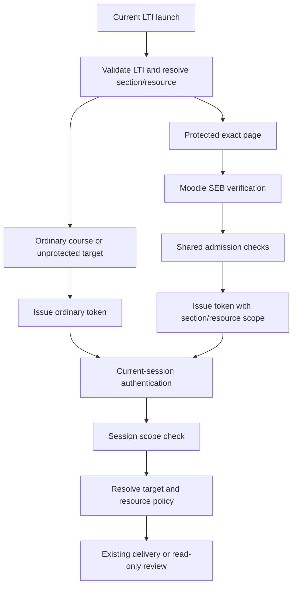

# Secure Assessment - Functional Design Document

## 1. Executive Summary

Implement the session-only direction in `docs/exec-plans/current/secure-assessment/constrain.md`: store the assessment policy on `SectionResource` and the admitted section/resource scope on the existing authentication token. No account lock, separate secure-session table, active-exam registry, heartbeat, browser-close detector or support-release process is introduced.

Two checks enforce different rules: a secure token cannot navigate outside its assessment; an ordinary token cannot deliver a protected assessment. Ordinary course launches and existing ordinary sessions never consult another token's scope. Submitted-attempt student review is a read-only exception to protected delivery and works independently in ordinary sessions.

Moodle/SEB is the first verified-entry adapter. Its LTI evidence stays outside shared token scope and authorization, leaving room for future Respondus/non-LTI entry without implementing that integration now. Both basic and adaptive delivery and REVIEW mode are release requirements.

This FDD specifies proposed changes, not completed application behavior. `requirements.yml` is canonical for detailed acceptance; section 13 maps every criterion to design and verification.

## 2. Requirements & Assumptions

- Functional scope: conditional instructor settings, verified exact-resource entry, current-token confinement, server-side target authorization, both renderers, ordinary read-only review, saved-attempt resume and current-token exit.
- Primary invariant: with ordinary identity/permissions fixed, adding or removing any other secure token cannot change ordinary access. Existing enrollment failures or infrastructure outages are not claims of confinement lockout.
- Runtime capability is `SUPPORTS_SECURE_DELIVERY`, default false. The resource boolean is `secure_delivery`, default false, without student exceptions.
- Other computers may access course material while the student is in SEB. This is an accepted consequence of session-only scope.
- Standard LTI validation and signed assertion freshness remain. Additional replay tracking, diagnostic-bypass exclusion and continuous browser attestation are excluded.
- Browser close may leave a token row or a restorable cookie. Neither can restrict a different token or prevent a new ordinary launch.
- Existing attempts, deadlines, accommodations, review/feedback settings and AGS remain authoritative. “Submitted review” includes finalized `:submitted` and `:evaluated` states, not an active attempt.
- No new numerical performance SLA, additional scoped feature flag, general provider registry or new platform service is proposed. Telemetry and implementation review follow `harness.yml`.

## 3. Repository Context Summary

| Existing boundary | Observation and consequence |
| --- | --- |
| `lib/oli/accounts/user_token.ex`, `lib/oli/accounts.ex` | Database session tokens already support individual revocation; current verification selects the user and applies a 60-day session validity. Extend the lookup projection, not session lifetime. |
| `lib/oli_web/user_auth.ex` | `create_session/2` renews cookies; HTTP and LiveView independently load a user; logout revokes only the current token and broadcasts its LiveView topic. Populate token scope on both paths. |
| `lib/oli_web/controllers/lti_controller.ex` | Spike validation precedes user/enrollment/session creation and target routing. Move secure classification after verified target resolution and before token issuance. |
| `lib/oli_web/lti_redirect.ex` | `torus_resource_id` currently means revision slug; missing selections fall back to course/manage routing. Share a structured target resolution so protected admission cannot fall back. |
| `lib/oli/lti/secure_launch.ex` | Optional deployment selectors return `:not_required`. Expose assertion verification independently of selectors; ordinary launch must bypass the former deployment-wide gate. |
| Settings context and table | `allow_hints` is a section-only boolean precedent; Combined keys feed `SectionResource.to_map/1`. Table decoding, bulk maps, supported keys and copy paths are explicit. |
| Router, `InitPage`, `RedirectByAttemptState` | Visit/context work can run before delivery protection. Place resource authorization before these side effects and repeat it for connected operations. |
| Attempt hierarchy | Part → activity attempt → resource attempt → resource access supplies canonical learner/section/page ownership. Graded attempts remain pinned to their original revision across publication updates. |
| `ReviewPolicy`, `ReviewLive`, legacy review | Existing review policy has staff branches and uses page context. Check learner ownership/finalization before context creation, then retain review and feedback policy. |
| Adaptive rendering | `PageDeliveryController.render_adaptive_fullscreen_content` exposes `reviewMode`, previous/next/overview URLs and state. `assets/src/apps/delivery/store/features/page/actions/loadInitialPageState.ts` already skips writes in review; extend and test that behavior. |
| `UserSocket`, `SetToken`, state channels | Current socket credential signs `user.sub` without token scope; state channels push global/section data. Secure connections require exact-session identity and scoped subscriptions. |
| `lib/oli/grading.ex` | AGS uses the section line-items URL and resource-access resource ID; do not assume latest-user LTI params select grades. Test concurrent launches that update shared section service metadata. |

LTI activities and superactivities are out of scope by the September 23 product decision. Their browser routes remain denied to secure sessions, without changing ordinary-course behavior. Native basic/adaptive dependencies and representative Moodle/SEB pilot configuration remain required.

## 4. Proposed Design

### 4.1 Component Roles & Interactions

Use existing contexts with a small shared domain module and thin web adapters. Names below are proposed, not claims that modules already exist.

| Owner | Responsibility |
| --- | --- |
| `Oli.Delivery.SecureAssessments` | Runtime capability, shared admission checks, current-scope policy and target-resource policy. No user-wide session queries or LTI parsing. |
| `SecureAssessments.Admission`, `Scope`, `Target` | Small typed values: verified identity/assessment input, token scope, and canonical operation target. They do not create a new persistence aggregate. |
| `Oli.Lti.SecureLaunch` | Initial entry adapter: validate authenticated launch's SEB evidence and bind it to the verified learner/section/page; return Admission. |
| `OliWeb.LtiRedirect` | Expose structured current-launch target resolution, then construct destinations from the same resolved target. |
| `Oli.Accounts` / `UserToken` | Atomically create a scoped or ordinary credential; load the exact credential and validity; revoke only that credential. |
| `OliWeb.UserAuth` | Put current auth context on conn/socket; renew cookies without inherited scope; clear remember-me for secure issuance. |
| `OliWeb.Plugs.SecureAssessmentScope` and LiveView adapter | Classify transport operations, invoke shared policy, render scoped errors, attach enforcement to connected operations. |
| Target resolver in the secure-assessment context | Resolve section/page and attempt ownership from authoritative records, including bulk inputs; never trust URL labels alone. |
| Settings context/table and copy paths | Persist/audit the flag, guard enabling server-side, conditionally render the column, preserve section overrides. |
| Existing delivery renderers/persistence clients | Apply secure shell and scoped dependencies; use true read-only REVIEW mode rather than another application. |

Generic session creation accepts Admission from trusted server code, not a request map. Only the initial adapter's successful verifier is wired to a production entry route. Struct construction is not a cryptographic boundary: the trusted call graph, normal authentication and server validation establish trust. Do not serialize an admission object into a client-submittable bypass.

### 4.2 State & Data Flow



No arrow depends on another token belonging to the learner.

Launch sequence:

1. Validate current LTI state/nonce/JWT through existing code.
2. Resolve current section and direct-resource selection. Ordinary course launches retain section setup/manage behavior; secure candidates require a configured section and exact graded page.
3. For protected student entry, verify capability and signed SEB assertion. A secure-marked launch with missing/invalid selection is an error, not a course fallback. Ordinary target launches do not run the old deployment-selector gate.
4. Complete existing authenticated user/enrollment handling; verify the resolved Admission belongs to that user and section, re-read page policy, and issue a scoped token in one insert. No prior unrestricted token is issued for this launch.
5. After commit, install that token in the renewed cookie and redirect using the same target. Ordinary entry explicitly installs an ordinary token, even when an old secure cookie is present.
6. Let existing page lifecycle select/start/resume attempts. Admission itself does not start an attempt, reset a timer or consume an attempt allowance.

Failure before scoped issuance leaves no usable new secure credential. User/enrollment metadata may follow existing transaction behavior; failure must not revoke independent credentials. Keep provider evidence on the current request rather than retrieving latest saved claims.

Request decision order:

1. Authenticate the exact credential. Invalid scope or expired credentials are authentication/admission errors, never ordinary scope.
2. Handle explicitly classified authentication/logout transport independently so an incoming stale secure cookie cannot block a fresh ordinary launch.
3. Apply current-session route scope: ordinary passes this check; secure permits only assessment/dependency routes.
4. Resolve the target and normal authorization. For student attempt APIs, join to ResourceAccess and verify current learner, section and page, then all submitted parent/child identifiers.
5. Apply protected-resource policy. An ordinary session can deliver unprotected pages or perform permitted finalized-attempt review; it cannot enter a protected prologue or write protected attempts.
6. Execute the operation or construct the permitted content projection.

Direct entry to a staff preview uses existing explicit staff authorization, not a student admission shortcut. A scoped student cookie takes precedence over mixed author cookies or preview flags and remains confined. Legitimate separate ordinary staff sessions remain unchanged.

### 4.3 Lifecycle & Ownership

The resource owns policy, the token owns navigation scope, and the attempt owns saved work and deadlines.

| Event | Current secure token | Other ordinary tokens |
| --- | --- | --- |
| Initial/second secure entry | Create independent scoped token | No changes |
| Reload/reconnect | Reload exact valid token and current target policy | No changes |
| Finalization/auto-submit | Remain scoped for completion/review | No changes |
| Logout/exit at any attempt state | Delete only this credential; disconnect only its connections | No changes |
| Browser close/network loss | No required server transition; leftover token may persist | No changes |
| Expiry | Exact credential stops authenticating | No changes |
| Ordinary launch with stale secure cookie | Install new ordinary credential; do not inherit scope | No changes |
| Resource flag disabled | Existing scoped token remains scoped | Resource delivery follows updated policy |
| Instance support disabled | No new secure admissions; existing scopes persist | Ordinary course/review access unchanged |

Use the existing token lifetime; no additional exam timeout. Clear the current browser's remember-me cookie on secure issuance without deleting independent ordinary tokens. No heartbeat, cleanup completion, other-token revocation or support intervention is a prerequisite for resuming through fresh secure entry.

Provide an assessment-only Exit action via the existing CSRF-protected logout path or a thin POST wrapper. It works before submission and never finalizes work implicitly. Default to a minimal signed-out page; an LMS return is allowed only after the existing integration validates its destination against configured origins/paths. Do not accept a raw return URL from the client or expose SEB quit secrets.

### 4.4 Alternatives Considered

| Alternative | Decision |
| --- | --- |
| Account-wide active-exam row and unique user lock | Rejected: dangling state could block ordinary coursework and contradicts the agreed guarantee. |
| Heartbeat lease or browser-unload cleanup | Rejected: adds a timer-driven failure mode to solve a problem removed by session isolation. |
| UI-only hiding or cookie-only scope flag | Rejected: does not provide one authoritative credential scope for HTTP, reconnect and token-authenticated channels. |
| Scope fields on existing session tokens | Selected: existing validity/revocation, no new lifecycle table or account lock. |
| Provider registry or Respondus implementation now | Rejected: a documented verified-entry boundary is sufficient; only Moodle/SEB is wired initially. |

## 5. Interfaces

Public domain functions receive explicit values, return tagged outcomes, and require docs/typespecs. Illustrative signatures:

```elixir
SecureAssessments.supported?() :: boolean()

# Invoked only after provider verification; rechecks common policy.
SecureAssessments.admit(user, %Admission{}) ::
  {:ok, %Scope{}} | {:error, reason}

Accounts.generate_user_session_token(user, scope: nil | %Scope{}) :: binary()
Accounts.get_user_session(raw_token) ::
  {:ok, %{user: user, token_id: id, scope: nil | %Scope{}}}
  | {:error, :unauthenticated}

SecureAssessments.resolve_target(actor, operation, transport_ids) ::
  {:ok, %Target{}} | {:error, reason}
SecureAssessments.authorize_session_scope(scope, operation, target_or_route) ::
  :ok | {:error, reason}
SecureAssessments.authorize_resource_policy(scope, actor, operation, target) ::
  {:ok, access_mode} | {:error, reason}
```

Keep `Accounts.get_user_by_session_token/1` compatible for unrelated callers; route secure-aware HTTP/LiveView authentication through the new projection. Do not expose token IDs as unsigned capabilities. Proposed fields:

- Admission: canonical `user_id`, `section_id`, `resource_id`; optional provider label for bounded diagnostics only.
- Scope: `section_id`, `resource_id`.
- Target: canonical `section_id`, page `resource_id`, optional `user_id`, resource/activity/part attempt IDs, pinned revision identity and lifecycle state.
- Access mode: `:ordinary_delivery`, `:secure_delivery`, `:review`; scope and review mode are separate, so secure review remains confined.

Operations are a closed server-selected vocabulary: `:prologue`, `:deliver`, `:start`, `:save`, `:submit`, `:review`, `:dependency_read`, `:dependency_write`, `:authentication`, `:exit`. API action maps select them; request parameters cannot claim that a write is review or that an ordinary route is an authentication exception.

HTTP and LiveView adapters:

- Base pipelines load current scope and coarse route classification after authentication. Ordinary scope returns immediately from the navigation check.
- Page/API guards resolve targets before `RedirectByAttemptState`, `InitPage`, `PageContext.create_for_visit` and review context construction. Retain existing normal enrollment/paywall/consent rules without allowing their redirects to open unrelated secure content.
- LiveView hooks run on disconnected/connected mounts and live navigation; protected event, component and async/data-push handlers use the shared check at execution. Do not assume parent hooks intercept every component callback.
- Revalidate current credential for secure connected operations and current resource policy for protected operations; mounted assigns alone are not lifetime authorization.
- HTTP 403 uses stable reason codes such as `secure_launch_required`, `secure_resource_mismatch`, `secure_delivery_unsupported` and `review_not_allowed`. Invalid IDs/ownership may use existing non-disclosing not-found semantics. API failure is JSON, never success or an HTML redirect. Expired authentication retains existing login/401 handling.

Route/dependency classification:

| Family | Resolver and rule |
| --- | --- |
| Prologue/lesson/adaptive and legacy page/fullscreen/pagination/start aliases | Resolve page in section; guard before content/context work. Index-navigation POST must resolve destination and reject another page for a scoped token. |
| Review aliases | Load minimal attempt/access ownership and finalized state first; then effective review/feedback policy and read-only projection of pinned content. |
| Attempt and part APIs, hints/evaluations, uploads | Join every GUID to ResourceAccess; match supplied parent GUIDs and actor; authorize operation/lifecycle. Ordinary review is not a hint/write entitlement. |
| Bulk retrieve/nested inputs | Bound batch size, resolve sets once, compare complete supplied/resolved ID sets and parent relations; authorize all members before any result or mutation. |
| Page lifecycle finalize/mark_completed | Reconcile body section/revision/attempt with canonical target and current actor. Use same policy for API and LiveView finalization. |
| Attempt state/model/media | Use actual attempt membership, pinned revisions and server-selected dynamic activities, not just current page `related_activities`. Prune model/feedback according to delivery or review permissions before serialization. |
| Global/section state and raw blobs | Secure token cannot access arbitrary keys. Prefer existing attempt-state API; adapt legacy page-attempt keys to the same owned attempt. No unfiltered global subscription or global blob exemption. |
| Discussion/AI/search and external tools | Unrelated surfaces denied in secure mode. Any activity-required dependency must carry server-resolved parent assessment/attempt and explicit operation; LTI activities and superactivities are explicitly excluded, not granted a broad exemption. |
| Static assets/service callbacks | Required public assets remain available. AGS/Oban paths keep independent service authorization; no learner-controlled bypass flag. |

For broad state dependencies, do not silently remap all global data into an empty namespace: that could change activity behavior. During renderer integration, enumerate actual keys/operations. Page-attempt state uses existing scoped storage; any genuine shared-state read requires a narrow server-owned key projection for the selected assessment. Required writes need assessment-owned storage and explicit mapping. Unmapped operations fail with a dependency error, and the adapter must be completed before rollout; neither renderer can be declared unsupported to avoid this work.

Channels:

- For secure sessions, `SetToken` signs a versioned payload such as `%{v: 2, session_id: token_record_id}` using a distinct secure-socket purpose/salt. No raw cookie token is sent.
- `UserSocket.connect/3` verifies that signature and loads the exact valid token record with `context: "session"` and its normal expiry. A deleted row fails connection. Derive the actor from that record, not topic arguments.
- Use a distinct token-record-specific socket ID and disconnect topic; current-token logout publishes to it and the existing current-token LiveView topic only.
- Secure channel join, delayed initial reads and outbound deltas recheck scope/target. Deny global/section subscriptions; add only an assessment/attempt-scoped subscription if a required activity actually needs one.
- Existing ordinary credentials remain ordinary and cannot authorize protected delivery. Ordinary connections are not disconnected by secure entry or logout; topic ownership and resource-policy checks still apply where they access protected data.

Rendering:

- Pass server-derived `secureDelivery` alongside existing `reviewMode` through adaptive app params and page store; these values configure UI, never authorize API calls.
- Share secure shell branches in `student_delivery_lesson.html.heex` and legacy/adaptive renderers. Remove navigation controls and URL payloads (`previousPageURL`, `nextPageURL`, `overviewURL`, unrelated debugger/profile links) while retaining internal screen/question navigation and accessible exit.
- Reuse `assets/src/apps/delivery/store/features/page/slice.ts`, `page/actions/loadInitialPageState.ts`, `groups/actions/deck.ts`, adaptivity actions and `layouts/deck/DeckLayoutView.tsx`. Review uses existing REVIEW context and suppresses persistence/evaluation effects, backed by server denial.
- Read-only review can perform in-memory navigation but not answer/state persistence, scoring or attempt creation. Both `:submitted` and `:evaluated` states must still satisfy normal ReviewPolicy and feedback visibility.

## 6. Data Model & Storage

Phase 3 implementation note: `SecureAssessments.resolve_page/2` and the set-based
`resolve_attempts/3` implement the target-resolution boundary; `authorize/4` and
`authorize_batch/5` combine scope/resource/owner checks. The HTTP adapter selects
operations from trusted router metadata and controller actions, never a client
`attempt_guid`/review flag. Connected adapters reload the exact signed session-row
reference. Unrelated ordinary LiveViews keep a no-policy-query callback fast path.
See `docs/exec-plans/current/secure-assessment/phase-3-execution.md` for concrete
transport coverage and the fail-closed dependencies that Phase 5 must complete.

Two generated Ecto migrations, both with explicit up/down:

1. `add_secure_delivery_to_section_resources`: boolean `secure_delivery`, `null: false`, `default: false`.
2. `add_secure_assessment_scope_to_users_tokens`: nullable `secure_section_id` and `secure_resource_id`, using existing referenced primary-key types.

Use foreign keys with `on_delete: :delete_all` for these token scope references: deleting a target revokes only tokens referring to it, never nulls their scope. Ordinary rows have null references and survive. Add indexes on these FK columns for bounded deletion checks. Existing token lookup indexes remain the authentication access path.

Add one check constraint equivalent to:

```sql
(secure_section_id IS NULL AND secure_resource_id IS NULL)
OR
(context = 'session'
 AND secure_section_id IS NOT NULL
 AND secure_resource_id IS NOT NULL)
```

Section membership is checked by shared admission against the unique section/resource projection. Removing only a SectionResource may leave the token row; subsequent target resolution fails for that token, without any user-wide effect. Token scope has no public mutation API. No secure-attempt FK, provider-required columns, session generation or per-user unique index.

Add the resource flag to schema casts, Combined type/struct and direct section-value combination. No Revision or StudentException field. Add the supported key and runtime capability checks to AssessmentSettings and any authorized bulk/copy boundary that can introduce true. Use normal role authorization; supplied assessment maps must not replace authoritative graded/type checks.

The table conditionally includes the column using a runtime server assign. Add boolean decoding, explicit bulk values, refresh and optional sorting keys; audit through existing SettingsChanges. Unsupported instances omit the key from normal bulk edits and reject explicit enabling; copies with incompatible true settings fail before partial copy rather than downgrade. Preservation of an already-stored true value during projection refresh is not a new user enablement.

`config/runtime.exs` uses the existing normalized boolean helper, default false, into `:oli, :supports_secure_delivery`. Capability is a function lookup at runtime, not a compiled module attribute. It gates new admissions/enabling and UI exposure; it is not a switch that erases persisted policy or token scope. After instance disablement, valid existing scoped sessions can continue subject to normal rules; no new admission is issued.

Settings copies preserve policy on supporting instances; publication refresh leaves section overrides intact. Attempt review/resume uses its pinned revision even if the current page revision changes; token identity stays at section/resource level.

## 7. Consistency & Transactions

- Scoped token creation is a single insert containing both IDs after successful verification and common policy checks. Recheck admission policy during the issuance transaction. For the narrow race with a settings edit, lock/read the selected SectionResource for issuance and use normal row updates for settings; do not lock the learner or other sessions.
- Normal LTI user/enrollment work keeps its existing transaction boundaries. Cookie installation follows successful token persistence. Failure never performs user-wide token deletion.
- For protected writes, resolve and authorize all requested targets before invoking the existing attempt mutation transaction; lifecycle rechecks/locking stay with existing attempt operations. Preserve existing attempt concurrency and idempotent finalization.
- Authorization observes policy at the operation's check point. A setting change affects subsequent operations; it cannot retroactively undo a completed read or retract bytes already delivered.
- A review request resolves finalized ownership before loading sensitive context. Reject write operations against finalized review paths before persistence even if a client toggles review flags.
- Settings persistence/audit remains transactional; refresh presentation caches after commit where changed. Auth reads use authoritative records, not a cache published before rollback.
- Logout deletes exactly the presented session token, publishes current-token disconnects after success, and is idempotent. It never reads an attempt to decide whether logout is allowed.
- Preserve `Oli.Grading` resource-based line-item selection. Interleave launches in tests because the controller updates shared section service metadata; any demonstrated mismatch must be fixed at the validated section/resource service binding, never with ordinary-launch denial.

## 8. Caching Strategy

No secure-session cache or user-wide active-session index. Read current scope with authentication; reuse it within the same request. Validate the exact token for secure connected operations. Scope is immutable, but token validity is not.

Read authoritative resource policy at protected boundaries, including ordinary attempt APIs. Cached page metadata may support rendering, but missing/stale policy cannot mean false. Batch repeated ownership/policy reads inside a request; do not retain authorization across unrelated events.

Existing browser/client state caches must be namespaced to the assessment/attempt for secure dependencies. Do not preload unrelated global data in a secure shell. Use no-store for protected sensitive responses; browser-restored content and previously downloaded material cannot be recalled and are not account-locking mechanisms.

## 9. Performance & Scalability Posture

Ordinary navigation adds current-token scope projection to existing authentication, not a search across the learner's sessions. Ordinary non-assessment routes take the scope guard's fast path. Protected APIs perform bounded indexed ownership joins; bulk inputs use set-based queries rather than one query per GUID.

Clusters share existing database token validity. There is no cross-node lease coordination, user lock or background liveness traffic. Token-specific disconnects improve responsiveness; authorization does not depend on message delivery.

Use existing body/batch limits and enforce a finite per-endpoint maximum before GUID resolution. Measure representative basic/adaptive save, review and reconnect paths with query counts and AppSignal. The plan should retain existing limits where present and choose explicit limits for previously unbounded batches; this FDD imposes no invented latency SLA.

## 10. Failure Modes & Resilience

| Failure | Response and recovery |
| --- | --- |
| Invalid/missing secure evidence | Reject only protected entry; ordinary launch remains available and other credentials unchanged. |
| Protected target unavailable or identifiers disagree | Non-disclosing error before content/work; no fallback secure admission and no user restriction. |
| Instance support false with stored true policy | No new admission; protected-entry explanation. Existing scope and read-only review policy remain; ordinary course access works. |
| Secure token expired, malformed or revoked | Reauthenticate through appropriate entry; no ordinary fallback for this credential and no effect on others. |
| Browser close/crash/lost network | Saved attempt persists; later secure entry resumes. A dangling row requires no cleanup for ordinary access. |
| Existing scoped cookie on ordinary LTI entry | Allow transport, validate the new launch and issue ordinary token. Never consult other tokens. |
| Review denied or feedback delayed | Confined completion/explanation for secure UI; ordinary review gets normal denial. No answer leakage. |
| Missed disconnect or live reconnect | Recheck exact token and operation policy; stale assigns are insufficient. |
| Dependency not yet safely scoped | Explicit dependency error; complete adapter/testing before rollout, not a global endpoint exemption. |
| Grade callback/retry fails | Existing retry/error path; accepted submission is not undone and no account/session lock is added. |
| Database/authentication failure | Existing request-local error; do not reinterpret failure as ordinary scope. General availability is outside the no-cross-session-lockout guarantee. |

## 11. Observability

Use existing Phoenix telemetry/AppSignal. Implemented events are `[:oli, :secure_assessment, :admission]`, `[:oli, :secure_assessment, :denied]`, and `[:oli, :secure_assessment, :exit]`, carrying counts and bounded outcome/classification/reason/transport labels. Admission distinguishes accepted ordinary/secure entry and typed secure rejection; exit counts actual explicit scoped-token revocations, not browser closure or repeated already-revoked requests.

Record accepted/rejected admission, protected access denial and explicit secure logout. Existing request traces correlate errors; do not add token values, raw claims, answers, arbitrary request params or learner/resource IDs as metric dimensions. Avoid warning-level logging for every expected denial; use bounded structured reasons and existing request error capture.

Observe launch/save/reconnect latency and error rates using normal APM. Browser closure is not an event Torus can reliably assert. No “active exam” counter is used for access control. Any confirmed cross-session lockout is a release-blocking correctness regression, not a condition to solve through cleanup.

## 12. Security & Privacy

Preserve LTI signature, state, nonce, deployment and assertion freshness validation. Only validated current claims enter the initial adapter. Common admission rechecks learner identity, section membership, graded policy and runtime support. Future providers must independently bind verified evidence to the same canonical identities.

Apply secure scope before any staff/preview rendering bypass in a mixed-cookie request. Ordinary staff authorization remains independent. A student cannot enable scope or review mode using headers, body flags or a provider string.

Defense is at server authorization boundaries: hiding links, client flags, opaque GUIDs and possession of enrollment do not confer protected delivery. Review serializers must apply feedback policy, not simply return normal attempt models because the page is finalized. External object-store URLs remain scoped/short-lived as supported by existing infrastructure; review and signed URL issuance must authorize the parent attempt.

Raw authentication tokens stay in existing signed-cookie/server handling. Secure socket capability payloads contain only signed record identity; protect them as credentials and never log them. Normal CSRF applies to mutations and logout; existing LTI transport retains its own protocol protections.

A copied credential can act as that credential; this work does not add hardware binding or ongoing browser attestation. Another ordinary session's course access is intentionally allowed. Additional replay infrastructure and Moodle diagnostic-bypass exclusion remain excluded.

## 13. Testing Strategy

Use ExUnit for settings/capability/admission/ownership/token rules; controller and LiveView/channel tests for transport enforcement and independent credentials; Jest for adaptive secure shell and review side-effect suppression. Real multi-step publish/copy/attempt workflows use `Oli.Scenarios` without fixture-based domain setup. Capture expected logs as required by `docs/TESTING.md`.

The mapping below is design traceability, not implementation proof. All criteria remain unimplemented until tests/evidence are recorded during development.

| Requirement | Acceptance criteria | Design sections | Verification |
| --- | --- | --- | --- |
| FR-001 | AC-001, AC-002 | 6 | Settings/Combined unit tests and graded-resource validation |
| FR-002 | AC-003, AC-004 | 6, 14 | Runtime boolean parsing and restart configuration checks |
| FR-003 | AC-005, AC-006 | 6 | LiveView enabled/disabled column tests |
| FR-004 | AC-007, AC-008, AC-009 | 6, 7 | Authorized/forged update, bulk/copy and publication scenario tests |
| FR-005 | AC-010, AC-011, AC-012, AC-013 | 4.2, 5, 12 | Signed launch matrix and ordinary protected-route/API denials |
| FR-006 | AC-014, AC-015, AC-016 | 4.1, 4.3, 6 | Atomic token scope, current-credential lookup and concurrent-token tests |
| FR-007 | AC-017, AC-018, AC-019 | 4.3, 7, 10 | Independent-cookie HTTP/LiveView/channel isolation and orphaned-token matrix |
| FR-008 | AC-020, AC-021, AC-022 | 4.2, 14 | Stale-cookie ordinary launch, current destination and broad-selector regression tests |
| FR-009 | AC-023, AC-024, AC-025 | 5 | Allowed dependency operations, other-page/section denials and service compatibility |
| FR-010 | AC-026, AC-027, AC-028, AC-029 | 5, 7, 12 | Route/event/channel coverage, batch parent/ownership checks and typed error tests |
| FR-011 | AC-030, AC-031, AC-032 | 5 | Secure shell payload/DOM assertions and keyboard/accessibility verification |
| FR-012 | AC-033, AC-034 | 3, 5 | Basic/one-at-a-time/adaptive delivery and true REVIEW-mode matrix |
| FR-013 | AC-035, AC-036, AC-037 | 5, 12 | Independent ordinary review, feedback policy and server/client mutation denials |
| FR-014 | AC-038, AC-039, AC-040 | 4.3, 5, 10 | Reload/reconnect/relaunch with saved answers, deadlines and expired credentials |
| FR-015 | AC-041, AC-042 | 4.3, 7 | Untimed abandonment and timed auto-submit with ordinary access preserved |
| FR-016 | AC-043, AC-044, AC-045 | 4.3, 5, 10 | Idempotent current-token exit at every attempt state and close-without-callback tests |
| FR-017 | AC-046, AC-047, AC-048 | 3, 7, 12 | Enrollment/timing/accommodation regression and interleaved-launch AGS integration |
| FR-018 | AC-049, AC-050, AC-051 | 6, 7, 14 | Capability/resource toggle tests and migration up/down token isolation |
| FR-019 | AC-052, AC-053 | 4.2, 12, 14 | Existing LTI/assertion verification matrix without deferred mechanisms |
| FR-020 | AC-054, AC-055 | 13 | Retained automated matrices and manual Moodle/SEB pilot evidence |
| FR-021 | AC-056, AC-057, AC-058 | 4.1, 4.4, 5 | Provider-neutral admission contract tests and separate real-adapter tests |
| FR-022 | AC-059, AC-060 | 11 | Telemetry outcome/label tests and credential/answer exclusion assertions |

Isolation acceptance uses independent cookie jars S and N for the same learner, same/different section and same deployment. Compare N's baseline with S absent against S live, submitted, abandoned, expired, revoked, target-missing and deliberately orphaned without close callbacks/cleanup. Keep N's HTTP, LiveView and channel access active; create fresh ordinary launches too. Repeat with a stale secure cookie on the new ordinary launch and with the former broad deployment selector configured.

Renderer acceptance covers basic traditional, basic one-at-a-time and adaptive delivery, secure review and ordinary review. Verify pinned state, internal navigation, read-only persistence and feedback timing. Include native media/uploads and dynamic activities; exclude LTI activities and superactivities.

Manual Moodle/SEB checks retain environment versions and sanitized evidence of entry, save, reconnect, submission, before-completion exit, browser close without logout, second-computer ordinary course access and correct AGS grade placement. No Figma source was supplied; use existing UI patterns and check WCAG 2.1 AA-oriented keyboard/focus/label/reflow behavior.

Repository implementation review follows `docs/CODEREVIEW.md` with security/performance and applicable Elixir/UI/TypeScript/requirements lenses. This architecture artifact does not claim that application tests or implementation review have passed.

## 14. Backwards Compatibility

Existing tokens have both scope fields null and retain current authentication. Existing resource rows default false. Existing ordinary routes, channel credentials and settings controls remain compatible except for deliberate resource-policy protection once an instructor enables it.

Retire `TORUS_SEB_REQUIRED_LAUNCHES` as an ordinary-launch gate: remove its use from the controller's unconditional launch validation and runtime parser path for enforcement. Leave no legacy deployment selector capable of blocking an ordinary target. Update `docs/secure-torus-lti-spike.md` and related tests. `SecureLaunch` retains current assertion validation as the initial provider adapter.

Rollout order: additive schema; deploy scope-aware authentication/authorization and renderer support on all serving nodes with instance capability false; then enable supporting instances and expose settings. Do not mint secure tokens while an old node can serve them without enforcing scope. Runtime capability is deployment-wide and requires restart, not recompilation.

Rollback order: stop new secure admissions, drain scoped connections/old application versions, revoke only scoped tokens and disconnect their sessions, then remove scope fields if reverting schema. The token migration's down path deletes scoped rows before dropping constraints/columns; ordinary rows survive. Removing the resource-policy column requires disabling feature use in a coordinated rollback, not running mixed policy-aware/unaware nodes.

Disabling instance capability alone is not a destructive rollback: it hides controls/blocks enabling and new admission, preserves existing policy/scopes, and leaves ordinary course and permitted review access intact.

## 15. Risks & Mitigations

- Scope accidentally derived from latest user/session history: make APIs accept current authenticated context; enforce no-cross-session queries in review and isolation tests.
- Entry and redirect select different pages: share structured target resolution and record canonical IDs, not a second path parse.
- Legacy endpoints or connected handlers missed: keep route/operation classification explicit and test unclassified secure routes fail closed while ordinary paths pass.
- Adaptive review or state dependency leaks writable/global behavior: use existing review mode plus server operation checks and complete dependency adapters before release.
- Broad settings copy introduces unsupported true policy: validate at copy/update boundaries before partial writes, while preserving existing policy on publication refresh.
- False security claims about browser close: document token persistence and test with orphaned rows, never require a cleanup signal for ordinary access.
- Mixed-version deployment ignores new token fields: capability stays off until every serving node enforces scope; revoke scoped tokens before downgrade.
- Shared LTI service metadata changes during concurrent launches: validate AGS results at resource/section boundary; no launch conflict lock.
- Overengineering future providers: isolate verification behind a small interface; keep Respondus, plugin registries and extra admission state out of this release.

## 16. Open Questions & Follow-ups

No unresolved product choice changes the selected design. Implementation planning must complete these bounded integration tasks:

- Inventory native activity-specific global/section state in representative basic/adaptive assessments; implement the narrow mapping described in section 5. Treat unknown required operations as work to finish, not permission to weaken authorization or omit a page type.
- Confirm batch limits and exact frontend action coverage using existing endpoint/client contracts before wiring guards.
- Record pilot Moodle/SEB versions, deployment configuration and content examples; no new institutional SEB policy work is included.
- Verify interleaved-launch AGS behavior using the observed resource-based grading path; change grade routing only if a reproducible mismatch requires it.
- Link the Jira work item when supplied. No external issue mutation is part of this design task.

## 17. References

- `docs/exec-plans/current/secure-assessment/constrain.md` — governing technical direction and agreed scope.
- `docs/exec-plans/current/secure-assessment/prd.md` and `docs/exec-plans/current/secure-assessment/requirements.yml` — product scope and canonical acceptance.
- `ARCHITECTURE.md`, `harness.yml`, `AGENTS.md` — architecture, capabilities and repository rules.
- `docs/STACK.md`, `docs/TOOLING.md`, `docs/TESTING.md`, `docs/PRODUCT_SENSE.md` — platform and verification expectations.
- `docs/FRONTEND.md`, `docs/BACKEND.md`, `docs/DESIGN.md`, `docs/OPERATIONS.md` — layering, UI and operations.
- `docs/CODEREVIEW.md`, `docs/ISSUE_TRACKING.md` — implementation review and tracking policy.
- `docs/design-docs/attempt.md`, `docs/design-docs/attempt-handling.md`, `docs/design-docs/publication-model.md`, `docs/design-docs/page-model.md` — state ownership and revision semantics.
- `docs/secure-torus-lti-spike.md` — initial spike behavior to adapt.

## Decision Log

### 2026-09-23 — Native assessment activity scope

- Change: LTI activities and superactivities embedded in assessments are excluded. Earlier provider-adapter inventory entries are historical, not remaining implementation or release requirements.
- Reason: Explicit user scope clarification; retain both basic/adaptive pages, read-only review guards and existing feedback filtering.
- Evidence: `docs/exec-plans/current/secure-assessment/phase-5-execution.md` and AC-024 in `docs/exec-plans/current/secure-assessment/requirements.yml`.
- Impact: Phase 5 covers native assessment rendering/state/models/media/uploads. Moodle LTI admission and LMS grade passback are unchanged; excluded activity routes gain no secure-session exemption.
