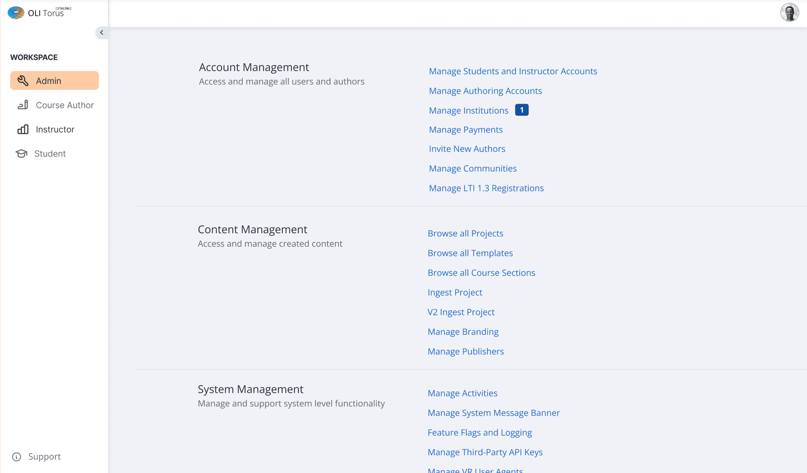
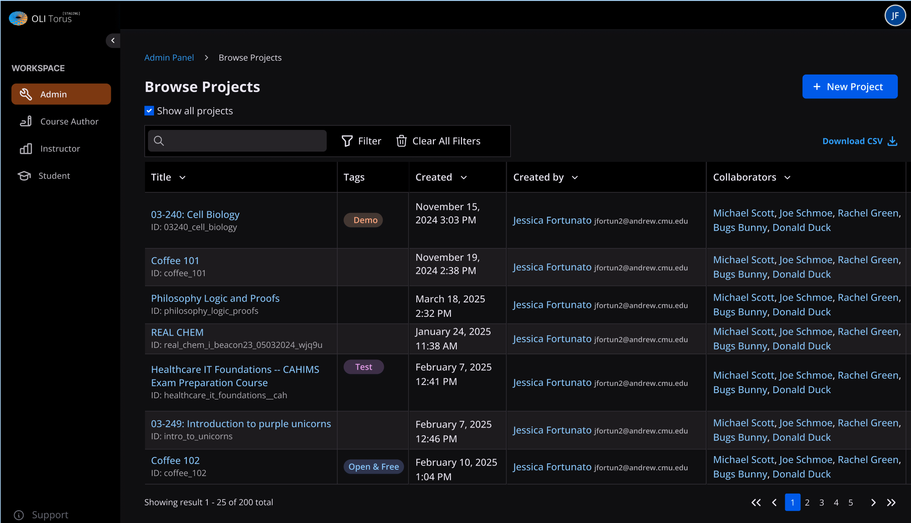

# Admin Panel Design Alignment — PRD

## 1. Overview

Feature Name: Admin Panel Design Alignment
Summary: Align the Torus admin workspace visuals and navigation with the modern authoring interface so admins experience consistent navigation patterns, theming, and component behavior. The refresh ensures the admin workspace nav highlights the active context and centralizes breadcrumbs back to the dashboard.
Links: Product ticket MER-4687.

## 2. Background & Problem Statement

Current admin panel views still rely on legacy styling and navigation components that diverge from the authoring workspace. The mismatch creates cognitive load and reduces trust in admin tools. Admins must relearn navigation cues when switching between authoring and admin responsibilities.
Admins (global administrators, Torus support staff) are impacted; instructors and authors may occasionally traverse admin-led views when on support calls.
The authoring workspace redesign shipped recently and admins are requesting parity to reduce context switching. Support volume cites confusion about where to return to the admin dashboard after deep links.

## 3. Goals & Non-Goals

Goals:

- Deliver an admin navigation experience visually and behaviorally consistent with the authoring workspace by reusing the shared design system components.
- Ensure the workspace nav exposes an `Admin` entry that is highlighted for all admin panel routes and routes back to the dashboard.
- Provide breadcrumb context on every admin view to reinforce location and enable backtracking.
- Maintain light and dark theme parity between authoring and admin flows.

Non-Goals:

- Introducing new admin features, data tables, or workflows.
- Changing admin permissions or access control rules.
- Reworking global workspace navigation for non-admin roles beyond adding the Admin entry.
- Modifying analytics dashboards or non-admin LiveView layouts.

## 4. Users & Use Cases

Primary Users / Roles: Admin (Torus administrator), Support (staff with admin role), Implementation Engineers (with admin role in customer tenants).
Use Cases / Scenarios:

- An admin switches from an authoring workflow into the admin workspace and expects familiar navigation tokens, theming, and breadcrumbs.
- Support staff deep link a project or section listing and need a reliable `Admin` nav control to return to the dashboard without using the browser back button.
- Implementation engineers onboarding a new institution confirm the look-and-feel conforms to Torus design guidelines during customer walkthroughs.

## 5. UX / UI Requirements

Key Screens/States:

- Admin Dashboard: uses shared content card layout with segmented categories.
- Entity Index Views (Projects, Users, Institutions, etc.): adopt the updated table styling, filter bar, sticky headers, and dark-mode support.
- Entity Detail / Form Views: reuse shared form components, inline validation patterns, and breadcrumb header.
  Navigation & Entry Points: `Admin` entry appears in the Workspace nav for authenticated admin users; selecting it routes to `/admin` dashboard; breadcrumbs appear below the top header on all admin LiveViews.
  Accessibility: All components must meet WCAG 2.1 AA; focus order mirrors authoring workspace; nav button and breadcrumb are accessible via keyboard and expose ARIA labels; ensure sufficient contrast in both themes.
  Internationalization: All text derives from gettext/localized strings; support RTL layout mirroring for nav and breadcrumbs; respect locale-specific date/time formats in tables.
  Screenshots/Mocks:
- 
- 

## 6. Functional Requirements

| ID     | Description                                                                                                                                                          | Priority | Owner          |
| ------ | -------------------------------------------------------------------------------------------------------------------------------------------------------------------- | -------- | -------------- |
| FR-001 | Add an `Admin` workspace nav button using the shared navigation component and display it only to authenticated admin-role users.                                     | P0       | Admin UI squad |
| FR-002 | Persist the active state styling on the `Admin` nav button for all `/admin/**` routes, including nested LiveViews and OBAN dashboards reachable from admin.          | P0       | Admin UI squad |
| FR-003 | Configure the `Admin` nav button action to route to the admin dashboard (`/admin`) regardless of current subview, maintaining redirect security checks.              | P0       | Admin UI squad |
| FR-004 | Refactor admin LiveView layouts to consume the shared authoring workspace layout (spacing, typography, buttons, form components, tables, modals). Remove legacy CSS. | P0       | Admin UI squad |
| FR-005 | Render breadcrumb navigation on every admin page using the shared breadcrumb component with accurate titles and hierarchy.                                           | P0       | Admin UI squad |
| FR-006 | Ensure light/dark theme parity on admin pages by wiring design tokens and theming context identical to authoring (including hover, focus, and error states).         | P1       | Admin UI squad |

## 7. Acceptance Criteria

- AC-001 (FR-001, FR-002) — Given an authenticated admin is viewing any route under `/admin`, When the page renders, Then the workspace nav displays the `Admin` button with active styling, keyboard focus support, and aria-current attributes.
- AC-002 (FR-003) — Given an admin is on any admin sub-view, When they click the `Admin` nav button, Then Torus routes to `/admin` dashboard without page reload artifacts and preserves tenant context.
- AC-003 (FR-004, FR-006) — Given an admin opens an admin view in light or dark theme, When the LiveView loads, Then all UI components match the authoring design system (typography, spacing, button styles), with no legacy CSS artifacts or inconsistent theming.
- AC-004 (FR-005) — Given an admin navigates to an admin subview (e.g., `/admin/projects`), When the page renders, Then a breadcrumb trail appears above the main content showing `Admin Panel > Browse Projects` with clickable ancestors leading back to `/admin`.

## 8. Non-Functional Requirements

Performance & Scale: Initial LiveView render for admin routes p50 ≤ 800 ms and p95 ≤ 1.5 s under 200 concurrent admin sessions; LiveView patch updates p95 ≤ 400 ms. Asset payload increases ≤ 50 KB gzipped.
Reliability: Ensure navigation state updates correctly after deployment across clustered nodes; include integration tests to prevent regressions.
Security & Permissions: Reuse existing authorization checks so only admin-role users see and interact with the `Admin` nav; enforce Phoenix LiveView mount checks.
Observability: Emit AppSignal breadcrumbs when admins enter/exit admin views; error rate for admin LiveView sessions must remain ≤ 0.5%.
Accessibility & Usability: Maintain keyboard and screen reader parity; nav button focus ring and skip links identical to authoring interface.

## 9. Data Model & APIs

Data Model: No new tables; continue using existing admin contexts (Accounts, Institutions, Projects). Deprecate any legacy layout flags stored in session assigns.
APIs & LiveViews:

- Update `OliWeb.WorkspaceNav` (or equivalent) to include role-aware `Admin` entry.
- Standardize admin LiveViews to use the shared layout module (e.g., `OliWeb.Layouts.Workspace`) and shared components (`OliWeb.Components.Breadcrumb`, table components, filter components).
- Ensure router pipeline for `/admin` sets assigns required for nav/breadcrumb components.
- Remove legacy CSS modules and replace with Tailwind utility classes or shared style partials.
  Caching & Assets: Bust cache for updated CSS bundles; verify CDN invalidation plan.

## 10. Integrations & Platform Considerations

Design System: Must rely on Torus design token library and component helpers; coordinate with design team for final tokens.
LTI & Multi-Tenancy: Maintain tenant scoping in nav/breadcrumb text and ensure redirects respect `section_slug` or institution context.
AppSignal: Extend instrumentation to log `admin_workspace_nav_clicked` events and LiveView timing.
Feature parity across hosted and on-prem deployments; ensure environment configuration supports new assets.

## 11. Feature Flagging, Rollout & Migration

Feature Flag: Introduce `:admin_panel_design_alignment` flag (boolean) defaulting to `false` in prod, `true` in dev/stage. Controlled via application config or Oban admin UI.
Environments: Enable on staging for design sign-off, then canary enablement for internal admin cohort before global roll-out.
Data Migrations: None required; remove any obsolete theme settings via config update.
Rollout Plan: Step 1 internal QA, Step 2 enable for CMU tenant admins, Step 3 global enablement. Monitor AppSignal metrics for navigation errors and LiveView latency.
Telemetry for Rollout: Track counts of `admin_workspace_nav_clicked`, route transitions, LiveView mount errors.

## 12. Analytics & Success Metrics

North Star / KPIs: Reduce admin navigation-related support tickets by 50% within one release; Increase admin task completion satisfaction score (survey) to ≥ 4/5.
Event Spec:

- `admin_workspace_nav_clicked`: properties `{user_id, institution_id, previous_route, theme, feature_flag_version}`; no PII beyond IDs.
- `admin_breadcrumb_navigation`: `{user_id, institution_id, target_route}`.
- Extend existing page view events with `context: "admin"` and `theme` property.

## 13. Risks & Mitigations

- Risk: Legacy CSS overrides may bleed into authoring workspace. Mitigation: Audit and delete unused CSS, add regression tests.
- Risk: Breadcrumb accuracy could drift if routes rely on dynamic segments. Mitigation: Centralize breadcrumb definitions in router helper map with tests.
- Risk: Feature flag misconfiguration could expose nav to non-admins. Mitigation: Add guard clauses and automated tests for role visibility.
- Risk: Increased asset size could slow first paint. Mitigation: Purge unused CSS and leverage existing asset pipeline optimization.

## 14. Open Questions & Assumptions

Assumptions:

- Existing design mocks (images provided) represent final approved visual direction for both light and dark themes.
- All admin experiences are built with Phoenix LiveView using the workspace layout inheritance, enabling component reuse.
- Admin dashboard route remains `/admin` and is accessible for all admin-role users.
- LiveDashboard and any other admin-support tools outside `/admin/**` display the Admin workspace nav and highlight it as active so admins can return to `/admin`.

Open Questions: _(none; all clarifications resolved)_

## 15. Timeline & Milestones

- Phase 0 (0.5 week): Audit existing admin views, catalog legacy styling, confirm design tokens; Owner: Admin UI squad.
- Phase 1 (1.5 weeks): Implement workspace nav updates and shared layout adoption on dashboard + high-traffic views; Owner: Admin UI squad.
- Phase 2 (1 week): Extend styling and breadcrumbs to remaining admin views, remove legacy CSS, dark-mode validation; Owner: Admin UI squad.
- Phase 3 (0.5 week): QA, accessibility verification, telemetry validation, staging review; Owner: QA + Product.
  Dependencies: Final design token handoff; coordination with DevOps for asset deploy.

## 16. QA Plan

Automated: LiveView navigation tests for `/admin/**`, component tests asserting active nav state, CSS snapshot tests for theme tokens, accessibility unit tests for breadcrumbs.
Manual: Cross-browser (Chrome, Firefox, Safari) and screen reader checks; verify keyboard navigation and dark-mode toggles; regression pass on authoring workspace to ensure no CSS bleed.
Load/Perf: K6 or LiveView benchmark to confirm latency targets; AppSignal dashboard monitoring during canary.

## 17. Definition of Done

- [ ] Docs updated (this PRD, design references, release notes)
- [ ] Feature flag wired & default configured
- [ ] Telemetry & alerts live
- [ ] Migrations & rollback tested (confirm no-op required)
- [ ] Accessibility checks passed
